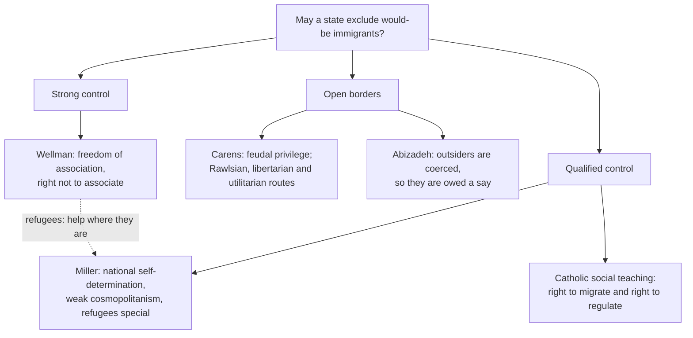

# Political Philosophy · Lesson 6.2: Immigration: may a state exclude?

> ⏱ ~15 min · Module 6: Hard cases: borders, conscience and provision · Builds on: [6.1 Global justice](06-01-global-justice-cosmopolitans-and-statists.md), [1.1 The problem of political authority](01-01-the-problem-of-political-authority.md), [1.4 Natural duty](01-04-natural-duty-and-philosophical-anarchism.md), [2.4 Nozick](02-04-nozick-entitlement-and-the-challenge-to-patterns.md) · Unlocks: [6.3 Conscience and exemptions](06-03-conscience-and-exemptions.md), [`catholic-social-teaching`](../../catholic-social-teaching/syllabus.md) 5.5

## Why this matters

Every state claims the right to decide who may enter and stay, and enforces it with fences, detention and deportation. That is coercion aimed mostly at people who are not citizens, have no vote, and never consented to anything. [6.1](06-01-global-justice-cosmopolitans-and-statists.md) asked whether duties of justice stop at the border. This lesson asks whether the border itself is just. The positions do not line up with left and right: there is a libertarian case for open borders and an egalitarian case for control.

## The idea

Begin with what everyone grants. A person has a strong moral interest in moving: to work, to join family, to escape danger. And a political community has some interest in deciding its own future. The dispute is about which interest wins when they collide, and on what ground.

Three families of answer:

- **Open borders.** Freedom of movement across borders is a basic liberty or close to one. A state may restrict it only for reasons like those that justify restricting movement *within* it: public order, security, immediate danger. Exclusion is not a prerogative of membership.
- **Qualified control.** States may set admissions policy, but within real limits: refugees must be taken, criteria must be non-racist, and long-term residents must be offered citizenship.
- **Strong control.** A legitimate state has a presumptive right to exclude anyone, for any reason that wrongs no one already inside, subject only to duties of rescue that need not be met by admission.

Keep three kinds of claim apart from the start. *What migration does* to wages, public finances or social trust is **empirical**, and disputed; nothing in this lesson assumes an answer. *What a right to exclude is* (a permission? a power over outsiders?) is **conceptual**. *Whether a state has it* is **normative**. Most popular arguments slide an empirical premise in as if it settled the normative question.

## The argument

**1. The case for open borders** (Joseph Carens, "Aliens and Citizens: The Case for Open Borders", *Review of Politics*, 1987).

1. **(Normative)** Persons are moral equals, and a just order may not distribute life chances on the basis of morally arbitrary facts about them.
2. **(Conceptual)** Place of birth, and so citizenship, is morally arbitrary: no one earns being born in a rich state.
3. **(Empirical)** Citizenship in a rich democracy greatly enhances one's life chances.
4. **(Normative)** Inherited status that fixes life chances and is enforced against outsiders is the structure of feudal privilege, which liberals reject.

∴ **C.** Restrictions on entry are justified only by the reasons that justify restricting any basic liberty (chiefly public order), not by the preferences of those already inside.

*In words:* being born a citizen of a rich state is like being born a noble; guarding it with borders is guarding an inheritance. This is the **[feudal-privilege analogy](../reference.md#feudal-privilege-analogy)**. Carens's paper runs three theories to the same verdict. Nozick's: the state may not block a voluntary deal between a citizen employer or landlord and a foreigner ([2.4](02-04-nozick-entitlement-and-the-challenge-to-patterns.md)). Rawls's: put everyone in a *global* original position, and no one who might be born in a poor country would accept closed borders ([2.2](02-02-rawls-the-original-position.md)). Utilitarianism's: count everyone's welfare equally and migrants' gains weigh heavily.

**2. The case for control from [freedom of association](../reference.md#freedom-of-association-argument)** (Christopher Heath Wellman, "Immigration and Freedom of Association", *Ethics*, 2008).

1. **(Normative)** Legitimate states, those that adequately protect human rights, are entitled to self-determination.
2. **(Conceptual)** Freedom of association is part of self-determination.
3. **(Conceptual)** Freedom of association includes the right *not* to associate. *In words:* you have a right to marry, but no right to marry anyone who refuses you.

∴ **C.** A legitimate state may refuse to associate with would-be immigrants, even those who would gain a great deal.

Wellman grants that refugees have urgent claims, but argues a state may sometimes discharge its duty to them by helping where they are rather than by admitting them.

**3. [National self-determination](../reference.md#national-self-determination)** (David Miller, *Strangers in Our Midst*, 2016). Miller's ground is collective, not associative. A nation has a legitimate interest in shaping its public culture and future, and control of size and composition is part of that. His **weak cosmopolitanism** grants every person equal moral worth but denies that equal worth requires equal treatment. Outsiders are owed their human rights, not membership. Is immigration a human right? No, Miller argues: free movement is protected as a human right only to the extent needed for an adequate range of options, which a decent state can supply within its territory. **Refugees** are the special category. A refugee, in the 1951 Refugee Convention's definition, is a person outside her country of nationality with a well-founded fear of persecution for reasons of race, religion, nationality, membership of a particular social group or political opinion. Her human rights cannot be secured at home, so her claim to be taken in is strong, shared among states.

**The democratic challenge.** Arash Abizadeh ("Democratic Theory and Border Coercion", *Political Theory*, 2008) turns a statist premise around. If coercion must be justified to those it coerces (6.1's statist trigger), then border control coerces outsiders, and a democratic state has no right to set it unilaterally. Outsiders are owed a say.

**[Catholic social teaching](../../catholic-social-teaching/syllabus.md)**, one position stated as its defenders state it. *Pacem in terris* (1963) teaches a natural right to emigrate and to settle elsewhere when there are just reasons. The Catechism of the Catholic Church pairs a duty of prosperous nations to welcome, as far as they are able, the foreigner seeking security and a livelihood with the public authority's right to set legal conditions on immigration for the sake of the common good, and with the immigrant's duty to respect the host country's heritage and laws. The tradition holds both rights at once: the right to migrate is strongest when a person cannot live decently at home, and how many to admit is a prudential judgment, not a principle.

**Where the argument is weakest.** For Carens, premise 2 against premise 4: the statist grants that birthplace is unchosen but denies that unchosen membership is thereby unjust, since family ties are unchosen too and still ground special duties. For Wellman, premise 3 as applied to states: marriage is voluntary on both sides, but citizens are born into the state, and the state's refusal also restricts insiders who want to hire, house or marry foreigners. The critic says the analogy borrows the moral weight of intimate consent for an institution that has none.

## Map of positions

Abizadeh's conclusion is about *who decides*, not about how open the border must be. He sits on the open side because unilateral control is what he denies. Wellman is "strong" only on the default: he still owes refugees rescue.

## Worked examples

**Example 1 (clean): a points system.** Invented case. The Republic of Varden admits 20,000 economic migrants a year by points: language, qualifications, a job offer. Applicants below the threshold are refused.

- *Carens:* the cap needs a public-order reason, and "we prefer skilled workers" is not one. The points also reward traits largely fixed by where one was born and schooled, the very arbitrariness of premise 2. Verdict: unjustified as a limit, whatever its merits as a ranking.
- *Wellman:* Varden is legitimate, so it may decline any applicant; choosing the skilled is within its associative freedom. Verdict: permitted.
- *Miller:* permitted, provided the criteria are relevant to the national project and not racist, and refugees are handled separately. Points for language fit his integration rationale. Verdict: permitted, with conditions.

All three agree on the *facts* about the policy. They disagree about whether the excluded applicant is owed a justification at all, and of what kind.

**Example 2 (hard): the exit/entry asymmetry.** The Universal Declaration of Human Rights (1948, Article 13) recognizes a right to leave any country, including one's own, but no right to enter any country but one's own. Is that coherent? Phillip Cole (*Philosophies of Exclusion*, 2000) argues not: a right to leave that no state need honour by letting you in is a right to stand at the border. The **[exit/entry asymmetry](../reference.md#exit-and-entry-asymmetry)** is the pressure point.

- *Wellman's reply:* the asymmetry is the marriage asymmetry. A right to marry is not a right to marry any particular unwilling person. The right to exit is a right against your own state's coercion (no Iron Curtain); it is satisfied if *some* state will take you.
- *Miller's reply:* the right to exit protects against being trapped by a persecuting state; the adequate-range test fixes how much entry the world owes.
- *Where it strains:* a stateless person whom *no* state will admit. Each state, taken alone, may refuse; together they leave her right to leave empty. This is the [particularity problem](../reference.md#particularity-problem) of [1.4](01-04-natural-duty-and-philosophical-anarchism.md) in reverse: a general duty with no particular bearer. The principle says someone must admit her; it stops giving a verdict on *who*. Burden-sharing schemes are an answer to that gap, not a derivation from the principle.

## Watch out

- **You might think a right to exclude settles whether outsiders must comply, but actually** "Varden may exclude" is a claim of [legitimacy](../reference.md#legitimacy), a permission to enforce without wronging; whether a would-be migrant has a *duty* to obey Varden's border law is a further claim of authority over her, and she is not Varden's citizen. Abizadeh's point is that the legitimacy claim itself has not been justified to the people it coerces. Keep [the four things](../reference.md#power-legitimacy-authority-obligation) apart.
- **You might think "immigration lowers wages" or "immigration raises growth" decides the question, but actually** both are empirical premises, disputed in the economics, and neither yields a verdict alone. Carens would allow restriction for a real public-order threat; Wellman would allow exclusion even if migration were all gain. The normative premise does the work.
- **You might think the Catholic position is simply "open borders" or simply "states decide", but actually** it affirms both rights together and treats admission numbers as prudential, so it can be cited by neither side as a blank cheque.

## One-liner

> Carens says citizenship is feudal privilege and borders need the reasons any restriction of liberty needs; Wellman says a legitimate state, like a person, may refuse to associate; Miller says a nation may shape its future but owes refugees a place; and the exit/entry asymmetry shows where every view must say who owes admission when no one wants to give it.

## Problems

**P1 (🟢) *(Exegetical (a)-(b).)*** Diagnose. An **invented** policy brief from Varden's interior ministry, not the words of any real person or agency, defends capping family-reunification visas at 5,000 a year:

> (i) "No one may be married without her consent; likewise our citizens may decline to take on new members."
> (ii) "A people that cannot decide its own future composition does not govern itself."
> (iii) "Applicants are not wronged by refusal, since their own states offer them a decent range of options."
> (iv) "And since this cap is legitimate, every foreigner who enters without a visa breaks a duty she owes to Varden."

(a) For (i)-(iii), name the thinker and argument each sentence uses. One line each. (b) In (iv), which two of the four things from 1.1 does the sentence run together, and which author in this lesson denies even the first? Two sentences.

**P2 (🟡) *(Evaluative.)*** Apply to a hard case. Invented case. Varden takes 3,000 refugees a year. Amira, from the invented state of Selm, arrives after her farm and town have been destroyed by years of drought; Selm's government does not persecute her but cannot feed its people. Run the 1951 Convention definition, Miller's view, and Catholic social teaching's pairing on whether Varden must admit her. Reach a verdict and say where your principle stops giving one. 150 words or fewer. Any verdict passes.

**P3 (🔴, optional) *(Evaluative.)*** Counterexample. Build a case in which Wellman's freedom-of-association argument, applied consistently, delivers a verdict against freedom of association itself, using the marriage analogy he relies on. Then give the best reply a defender of Wellman could make. 150 words or fewer.

Solutions

**P1** *(Exegetical (a)-(b) — strict)*

**Must hit, strict (a):**

- (i) **Wellman**, freedom of association: it includes the right not to associate, modelled on marriage.
- (ii) **Miller**, national self-determination: control over size and composition is part of a nation's shaping its future.
- (iii) **Miller**, weak cosmopolitanism and the adequate-range argument: outsiders are owed human rights, and free movement is a human right only so far as needed for an adequate range of options.

**Must hit, strict (b):**

- (iv) slides from legitimacy (Varden may enforce the cap without wronging anyone) to political obligation or authority over outsiders (a foreigner has a duty to obey Varden's law).
- Abizadeh denies even the legitimacy claim when set unilaterally: border coercion must be justified to the outsiders it coerces, who have had no say.

**Wrong turns:** filing (ii) under Wellman because it mentions self-government (Wellman's ground is association, Miller's is the nation's culture and future); answering (b) with "power vs legitimacy", when the sentence assumes legitimacy and infers a duty.

**Model answer (b):** Sentence (iv) infers a foreigner's duty to obey Varden's law, a claim of authority or obligation, from the cap's legitimacy, Varden's right to enforce it without wronging anyone; the second does not follow from the first, least of all for a non-citizen. Abizadeh denies the first claim as well, since a cap set unilaterally has not been justified to the outsiders it coerces.

---

**P2** *(Evaluative — graded on moves, not verdict)*

**Accept:** any verdict that runs all three views on Amira's case and names where the chosen principle stops.

**Must hit, any verdict:**

- The Convention definition: Amira is not a refugee in its sense, since she has no well-founded fear of *persecution* on one of the five grounds; drought and state incapacity are not persecution.
- Miller: the ground of the refugee category is that a person's human rights cannot be secured at home, which plausibly covers Amira even though the Convention does not; so she has a strong claim, but one shared among states.
- Catholic social teaching: she is the clear case for the right to migrate (she cannot live decently at home), so prosperous states have a duty to welcome as far as they are able, while the number admitted is a prudential judgment.
- Where it stops: whether *Varden in particular* must take her once its quota is used, and whether aid in place could meet the duty instead; no principle here fixes the bearer or the number.

**Wrong turns:** calling Amira a Convention refugee because she is desperate (the definition requires persecution); treating Miller's view as excluding her because she falls outside the Convention, when his rationale is about human rights, not the treaty's wording.

**Model answer, one of several:** Amira falls outside the Convention, which requires a well-founded fear of persecution on a listed ground, and drought is not persecution. But Miller grounds the refugee category in the fact that someone's human rights cannot be protected at home, and that is true of her. Catholic social teaching reaches the same place by another route: someone who cannot live decently at home is the clearest case of the right to migrate. I conclude Varden must either admit her or make sure another state does. That is where the principle stops. Both views say the duty is shared, and neither says which state bears it once Varden's quota is full, or whether help in Selm would discharge it.

---

**P3** *(Evaluative — graded on moves, not verdict)*

**Accept:** any case in which the state's right not to associate overrides a citizen's own associative choice with an outsider, followed by a reply that uses a premise Wellman could hold.

**Must hit, any verdict:**

- State the argument's key premise: freedom of association includes the right not to associate, as in marriage.
- The case: a Varden citizen wants to marry (or hire, or house) a foreigner, and Varden's exclusion stops her. The state's "freedom of association" overrides an individual's freedom of association, the very value the argument appeals to.
- Name the disanalogy exploited: marriage needs both parties' consent, while state exclusion lets a majority veto one citizen's association.
- A reply at full strength: collective self-determination is a group's right, and like any group right it can bind dissenting members; or the citizen can live with her spouse elsewhere, so her right to marry is not denied, only her right to do so in Varden.

**Wrong turns:** a counterexample that only shows exclusion is harsh to the migrant (that is not a case against the argument's own value); a reply that simply denies the citizen has any associative interest.

**Model answer, one of several:** Ines, a Varden citizen, wants to marry Tomas, a Norrlander; Varden refuses him residence. Wellman's argument says Varden's members may decline to associate, as a person may decline to marry. But here the state's refusal defeats Ines's own freedom to associate with the person she has chosen. The marriage analogy needs both parties' consent; the state lets a majority veto a match between two consenting people. The best reply is that self-determination belongs to the group: any group right binds members who disagree, as a club's admission vote binds the member who wanted her friend in. And Ines's right to marry Tomas is intact, since she may live with him in Norrland. The critic answers that exile is a heavy price for exercising a basic liberty.

## Flashback

**From Lesson [5.4](05-04-does-social-choice-wound-democracy.md) (Does social choice wound democracy?):** *(Formal (a)-(b) · Exegetical (c).)* Invented numbers. The 11-member school board of the invented town of Ostby chooses a start time: $A$ (8:00), $B$ (8:45) or $C$ (9:30), in that order on the clock.

| Members | Ranking |
|---|---|
| 5 | $A \succ B \succ C$ |
| 4 | $C \succ B \succ A$ |
| 2 | $B \succ C \succ A$ |

(a) Show that every ranking is single-peaked on the line $A$-$B$-$C$, and find the Condorcet winner with its pairwise counts. Which option would plurality pick? (b) The four $C$-first members learn that only the 8:00 start keeps the free school bus, which they now value just behind 9:30; they rank $C \succ A \succ B$. Nobody else changes. Recompute the three pairwise votes and say what the majority now does. (c) Which of 5.4's replies to Riker does the contrast between (a) and (b) bear on, and what does it show about that reply? Two sentences.

Solution

(a) Single-peaked: $A \succ B \succ C$ peaks at $A$ and falls moving right; $C \succ B \succ A$ peaks at $C$ and falls moving left; $B \succ C \succ A$ peaks in the middle, and both neighbours of $B$ rank below it. Pairwise:

- $B$ vs $A$: $B$ above $A$ for the 4 and the 2 ($4+2=6$); $A$ above $B$ for the 5. $B$ wins 6 to 5.
- $B$ vs $C$: $B$ above $C$ for the 5 and the 2 ($5+2=7$); $C$ above $B$ for the 4. $B$ wins 7 to 4.
- ($C$ vs $A$: $4+2=6$ to 5 for $C$.)

**$B$ is the Condorcet winner**, and it is the median peak: ordering the 11 peaks along the line gives five $A$s, two $B$s, four $C$s, and the 6th is $B$. Plurality picks **$A$** (5 first places, against 4 for $C$ and 2 for $B$).

(b) With the 4 now ranking $C \succ A \succ B$:

- $A$ vs $B$: $A$ above $B$ for the 5 and the 4 ($5+4=9$); $B$ above $A$ for the 2. $A$ wins 9 to 2.
- $B$ vs $C$: unchanged, $B$ wins 7 to 4.
- $C$ vs $A$: $C$ above $A$ for the 4 and the 2 ($4+2=6$); $A$ above $C$ for the 5. $C$ wins 6 to 5.

So $A \succ B$, $B \succ C$, $C \succ A$: a **Condorcet cycle**, and no Condorcet winner. The new ranking ranks both ends of the line above the middle, so it is not single-peaked.

**Must hit, strict:**

- (a) all three single-peaked; $B$ beats $A$ 6-5 and $C$ 7-4; $B$ is the Condorcet winner and the median peak; plurality picks $A$.
- (b) $A$ beats $B$ 9-2, $B$ beats $C$ 7-4, $C$ beats $A$ 6-5: a cycle.
- (c) The **domain-restriction** reply: while preferences are single-peaked on one dimension, majority rule cannot cycle and the median's favourite wins. The contrast shows that this is an empirical hypothesis about how preferences are structured. A second consideration (the bus) that cuts across the clock line breaks the structure, and the cycle comes back. (Creditable addition: on Dryzek and List's view, deliberation that brought the board to agree the issue is "time of day" could restore the structure.)

**Wrong turns:** calling the four members irrational in (b), when their ranking is perfectly transitive; it is the majority's that loops. Saying domain restriction works by excluding voters (no one is excluded). Inferring from the cycle that whatever the board decides is illegitimate, a normative conclusion the arithmetic does not supply.

## Connections

- **Backward:** [6.1](06-01-global-justice-cosmopolitans-and-statists.md) supplied the cosmopolitan and statist positions; Abizadeh turns the statist's coercion trigger against unilateral border control. Carens's three routes run Nozick's entitlement theory ([2.4](02-04-nozick-entitlement-and-the-challenge-to-patterns.md)) and a global version of the original position ([2.2](02-02-rawls-the-original-position.md)). The legitimacy/obligation distinction is [1.1](01-01-the-problem-of-political-authority.md)'s, and the stateless person is the particularity problem of [1.4](01-04-natural-duty-and-philosophical-anarchism.md) with a gap instead of a surplus.
- **Forward:** [6.3](06-03-conscience-and-exemptions.md) asks when a member may be excused from a general rule; here the question is who becomes a member at all. The Catholic position is taught from within the tradition in [`catholic-social-teaching`](../../catholic-social-teaching/syllabus.md) 5.5, which cites this lesson for the secular arguments.
- **Sideways:** Carens's moral-arbitrariness premise is the luck egalitarian's premise of [2.6](02-06-luck-relations-priority-and-sufficiency.md) applied to birthplace. The marriage analogy is a thought experiment in the sense of [`philosophical-method` 3.3](../../philosophical-method/lessons/03-03-thought-experiments.md): its force depends on whether the feature that drives the intuition (two-sided consent) is present in the target case.
