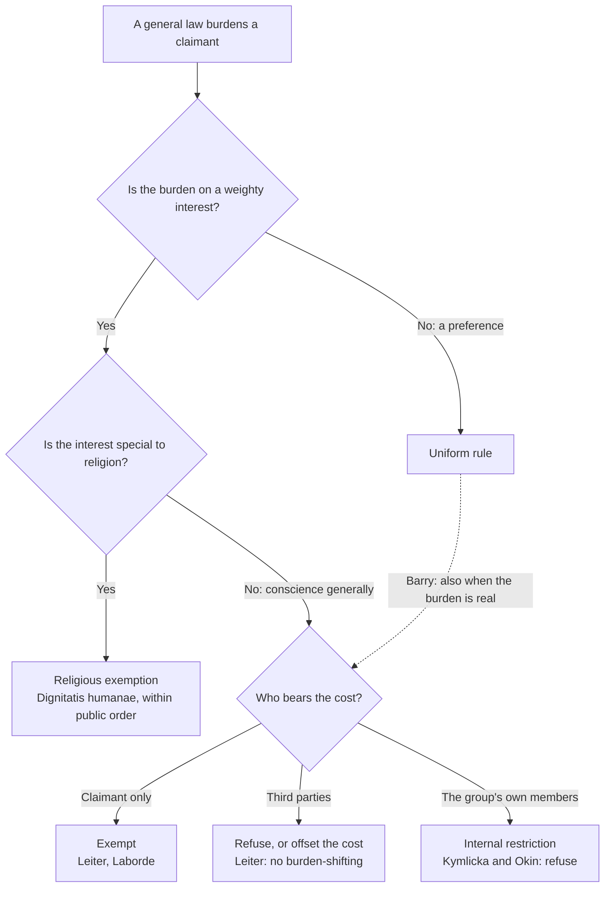

# Political Philosophy · Lesson 6.3: Conscience and exemptions

> ⏱ ~15 min · Module 6: Hard cases: borders, conscience and provision · Builds on: [4.2 Public reason and religious argument](04-02-public-reason-and-religious-argument.md), [4.4 Feminist political philosophy](04-04-feminist-political-philosophy.md), [1.4 Natural duty and philosophical anarchism](01-04-natural-duty-and-philosophical-anarchism.md) · Unlocks: [6.4 Who should provide?](06-04-welfare-property-and-subsidiarity.md)

## Why this matters

In [4.2](04-02-public-reason-and-religious-argument.md) Mara, a pacifist from a peace church, lost the vote: Varden passed its wartime draft. She does not ask the state to repeal the law. She asks it to leave her out. Every liberal state faces such requests, from slaughter rules, helmet laws, school curricula, dispensing duties and drafts. Two questions follow. Should a general law ever carry exemptions? And if it should, why for religion rather than for any deeply held conviction?

## The idea

Keep the four things from [1.1](01-01-the-problem-of-political-authority.md) apart ([power, legitimacy, authority, obligation](../reference.md#power-legitimacy-authority-obligation)). An exemption claim usually *concedes* that the law is legitimate and binds everyone else. It says only that the state's authority, or the claimant's obligation, stops at her. That separates it from [civil disobedience](../reference.md#civil-disobedience) ([1.4](01-04-natural-duty-and-philosophical-anarchism.md)), a public breach meant to change the law for everyone.

Two designs are on the table:

- **[Rule and exemption](../reference.md#rule-and-exemption):** a general law, with a carve-out for those whose religion or culture it burdens.
- **Uniform rule:** one law for all. If the law burdens some people heavily, change it for everyone or keep it for everyone.

Three questions sort every claim (the figure below). Is there a real burden on a weighty interest? Is that interest peculiar to religion, or shared by secular conscience? And who pays for the exemption: the claimant, third parties, or the group's own weaker members?

## The argument

**Barry's case for the uniform rule** (Brian Barry, *Culture and Equality*, 2001), reconstructed.

1. **(Normative)** Equal treatment means that the same rules apply to everyone. Fairness concerns the opportunities people have, not their willingness to take them up.
2. **(Conceptual)** A law that forbids an act to everyone leaves everyone with the same opportunity set. One's beliefs affect which opportunities one is *willing* to use, not which one *has*. *In words:* a ban on X burdens the person who wants X by restricting a choice, not by denying her an opportunity others have.
3. **(Normative)** People bear responsibility for the consequences of their own beliefs and practices.
4. Either the rule's justification outweighs the burden on objectors, or it does not.
5. If it does, the rule should bind everyone, and exempting some gives up the rule's aim for no reason of justice.
6. If it does not, the rule is too restrictive for everyone, since non-objectors also have a liberty interest in the forbidden act, so it should be dropped for all.

∴ **C.** Rule and exemption is never required by justice. An exemption may sometimes be defended on grounds of prudence or generosity, but not of fairness.

Barry's targets were real British exemptions: Sikhs from the motorcycle crash-helmet rule, and Jewish and Muslim slaughter from the rule requiring stunning. His point about slaughter is the dilemma in premises 4-6: if killing without stunning is cruel enough to ban, it is cruel when done for religious reasons; if it is not, the ban should go.

**The rival positions, each at full strength.**

- **Kymlicka: group-differentiated rights.** Will Kymlicka (*Multicultural Citizenship*, 1995) answers premise 2. The rules of a society are written around the majority's language, holidays and practices, so "the same rules" are not neutral between cultures. *Polyethnic rights*, including exemptions from generally applicable laws, offset that disadvantage. His test separates **[external protections](../reference.md#external-protections-and-internal-restrictions)** (a group's claims against the wider society, which reduce its vulnerability to outside decisions) from **internal restrictions** (a group's claims against its own members, which limit their liberty in the name of tradition). He endorses the first and rejects the second.
- **[Internal minorities](../reference.md#internal-minorities).** Susan Moller Okin (*Is Multiculturalism Bad for Women?*, 1999, a volume built around her essay and replies to it) argued that group rights tend to strengthen whoever controls a group's norms. Within many cultures those people are older men, and the costs of the group's practices fall on women and girls, the members least able to leave. Kymlicka's distinction helps only if one can tell which claims restrict members, and Okin thought defenders of group rights rarely looked.
- **Leiter: why religion specially?** Brian Leiter (*Why Tolerate Religion?*, 2013) asks what distinguishes religious conviction. His answer: at its centre are beliefs that issue *categorical* demands, that must be obeyed whatever else is at stake, and that are *insulated from evidence*, not revised in light of reasons as other beliefs are. Neither feature gives the state a reason to respect religion more than a secular conscience, which can also issue categorical demands. So toleration should attach to conscience in general. Since no state can exempt every conscientious objector from every law, Leiter's principled position permits exemptions, religious or secular alike, only where they **[shift no burdens](../reference.md#no-burden-shifting-principle)** onto other people.
- **Laborde: disaggregate religion.** Cécile Laborde (*Liberalism's Religion*, 2017) agrees that religion should not be privileged as such. Instead she breaks "religion" into the distinct interests that law protects. For exemptions the relevant interest is integrity: **[integrity-protecting commitments](../reference.md#integrity-protecting-commitments)**, religious or secular, are practices or refusals that let a person act in line with her deepest commitments. An exemption is owed when such a commitment and a vital life project are both at stake, and it is limited by costs to third parties and by the rights of vulnerable members. Her illustration is the Sikh turban: an exemption from hard-hat rules on construction sites, where a livelihood is at stake, but not from motorcycle helmets, since riding a motorcycle is not central to a Sikh life.
- **The Catholic account of [religious liberty](../reference.md#religious-liberty-as-immunity-from-coercion).** *Dignitatis humanae* (1965) teaches that every person has a right to immunity from coercion in religious matters. No one may be forced to act against his convictions, or prevented from acting on them, privately or publicly, alone or with others, within due limits. The right is grounded in the dignity of the person, known by reason and revelation, so it persists even in someone who does not seek the truth. It should be recognized in constitutional law as a civil right. Its limit is just public order, comprising the rights of all citizens, public peace and the guardianship of public morality. It is not a claim that all religions are equally true. It is one position here, taught from within the tradition in [`catholic-social-teaching`](../../catholic-social-teaching/syllabus.md). [`moral-theology` 2.5](../../moral-theology/lessons/02-05-the-primacy-of-conscience-rightly-understood.md) explains why conscience binds the person who holds it; the account here concerns what the state owes that person.

**Where the argument is weakest.** Premise 2. Kymlicka's side says the opportunity/willingness line is not neutral: when a law requires a helmet, the Sikh who keeps his turban loses the use of the road, while the majority loses nothing it values. Calling that a free choice treats a commitment one cannot simply drop as if it were a taste. Barry's side replies that every law frustrates someone's deep commitments, including secular ones. Once costs are measured by what people believe, there is no stable baseline for equality, and the same objection then supports Leiter's parity between religion and conscience.

## Map of positions

Barry stops at the second box: a real burden still yields no claim of justice. The Catholic account answers yes at the third box. That is a claim about religion's distinctive good, not a claim that secular conscience counts for nothing. Leiter and Laborde both answer no and proceed to the cost question.

## Worked examples

**Example 1 (clean): Mara after the vote.** Invented case. Varden's draft has passed. Mara asks for exemption on religious grounds. So does Tomas, a secular pacifist who holds that killing is always wrong.

- *Barry:* if the draft is justified, it binds both. Varden may still exempt them for prudence, since reluctant conscripts make poor soldiers, but neither Mara nor Tomas can claim the exemption as a matter of justice.
- *Kymlicka:* his framework concerns ethnocultural groups, so it fits this case loosely. Insofar as it applies, the claim is an external protection: it shields members from an outside decision and restricts no one inside the church.
- *Leiter:* Mara and Tomas must be treated alike. But each exemption puts another conscript into the field, which shifts the risk onto him. The exemption passes Leiter's test only if it comes with alternative service of comparable burden.
- *Laborde:* both refusals are integrity-protecting commitments, and taking life is as central to a life as anything can be. Both are exempt, with the cost to third parties offset in the same way.

Leiter and Laborde reach the same policy here: exempt both, with alternative service. Barry is the outlier. Where it strains: a draft takes a fixed number of soldiers, so *someone* replaces Mara. Alternative service equalizes the *burden*, not the *risk*, and nothing in the no-burden-shifting principle says whether that is enough.

**Example 2 (hard): an internal minority.** Invented case. Varden requires every school to teach its full science syllabus and a civics unit on citizens' legal rights, including the right to leave one's religion, until age 16. The Ostra Brethren, a small religious community, ask to end schooling at 14 for their children and to replace the last two years with apprenticeships in community trades.

- *Kymlicka:* the Brethren present the request as an external protection against assimilation. Its effect falls on members, though: children lose knowledge of the options open to them, including the option to exit. On that reading it is an internal restriction.
- *Okin:* the burden is not evenly shared. If the trades open to Brethren girls are domestic ones, the girls bear the cost.
- *Barry:* if the curriculum is justified by children's interests, it is justified for these children.
- *Leiter:* the burden shifts to third parties, the children, who did not choose the commitment.
- *Laborde:* the parents' integrity is real, but her limits explicitly protect vulnerable members, so the children's rights come first.
- *Catholic account:* the parents' religious liberty is real, and the public-order limit protects the rights of all citizens, children included. The principle names both and does not rank them in this case.

Where it stops: Kymlicka's test assumes we can classify the claim, but this one is both at once. The same rule protects the group from the outside and restricts members inside it. Rawls's reply to Okin in [4.4](04-04-feminist-political-philosophy.md), that principles of justice apply only indirectly to associations as long as members can exit, sharpens the problem: exit is what the civics unit teaches.

## Watch out

- **You might think an exemption claim attacks the law's [legitimacy](../reference.md#legitimacy), but actually** it usually concedes it. Mara accepts that Varden may conscript Tomas's neighbours. She denies only that the state's authority reaches her refusal to kill. Confusing the two makes every objector look like an anarchist.
- **You might think Barry denies that uniform laws burden minorities unequally, but actually** he grants the empirical point. His claim is normative and conceptual: unequal *impact* is not unequal *treatment*, and only the second is unfair.
- **You might think Leiter and Laborde are on opposite sides, but actually** both deny that religion as such deserves special treatment. They differ in what they protect (conscience vs integrity) and in how much room they leave for exemptions.

## One-liner

> Barry says a justified rule binds everyone and an unjustified one binds no one, so exemptions are never owed in justice; Kymlicka allows protections against outsiders but not restrictions on members; Leiter and Laborde extend protection beyond religion to conscience or integrity, limited by burdens on others; and *Dignitatis humanae* grounds a religious immunity in the dignity of the person, within just public order.

## Problems

**P1 (🟢) *(Exegetical (a)-(b).)*** Diagnose. An **invented** editorial from the *Halden Courier*, not the words of any real person, on a proposed exemption from Halden's new rule requiring stunning before slaughter:

> (i) "If the cruelty is bad enough to ban, it is bad enough to ban for everyone; if not, lift the ban."
> (ii) "Our vegan neighbour's conscience is as deep as the butcher's faith, so why should only one of them count?"
> (iii) "A community may defend its way of life against the town council; it may not use that defence to bind its own members."
> (iv) "Exemptions always end up costing other residents more than they cost the town."

(a) For (i)-(iii), name the thinker whose position each sentence states and the claim. One line each. (b) What kind of claim is (iv), and which position needs it to be true? Two sentences.

**P2 (🟡) *(Evaluative.)*** Apply to a hard case. Invented case. Halden requires every licensed pharmacy to fill every lawful prescription. Ilan, a pharmacist, refuses on grounds of conscience to dispense one drug and asks for an exemption. Halden has two pharmacies; the other is 40 km away and closed on Sundays. Run Leiter's no-burden-shifting principle and Laborde's account on Ilan's claim, reach a verdict, and say where your principle stops determining one. 150 words or fewer. Any verdict passes.

**P3 (🔴, optional) *(Exegetical.)*** Find the crux. Barry and Kymlicka disagree about whether Varden owes Sikh construction workers an exemption from its hard-hat rule. Name the single premise in Barry's argument that Kymlicka denies, state what each side holds about it, and say what kind of argument (empirical, conceptual or normative) would move the dispute. 100 words or fewer.

Solutions

**P1** *(Exegetical (a)-(b), strict)*

**Must hit, strict (a):**

- (i) **Barry:** the dilemma against rule and exemption. Either the rule's justification outweighs the burden and binds all, or it does not and should be lifted for all.
- (ii) **Leiter:** parity of religious and secular conscience. Nothing in religion's distinctive features earns it more protection than a secular conviction.
- (iii) **Kymlicka:** external protections are permitted, internal restrictions are not.

**Must hit, strict (b):**

- (iv) is an **empirical** claim about the costs of exemptions in practice.
- The position that needs it is Leiter's (or a Barry-style prudential case against exemptions). If exemptions always shifted burdens, Leiter's no-burden-shifting principle would rule them all out. Whether they do is a question for evidence, not for the principle.

**Wrong turns:** assigning (ii) to Laborde. She also denies that religion is special, but her protected interest is integrity tied to a life project, and the sentence argues only from equal depth of conviction. Treating (iv) as a normative claim because it appears in an argument about what the town should do.

**Model answer (b):** Sentence (iv) is empirical: it predicts what exemptions cost. It matters to Leiter, whose principle allows only exemptions that shift no burdens onto others, so if (iv) were true his view would bar every exemption; the editorial asserts it without evidence.

---

**P2** *(Evaluative, graded on moves, not verdict)*

**Accept:** any verdict that runs both views on the case, identifies who bears the cost, and names where the chosen principle stops.

**Must hit, any verdict:**

- State Leiter's principle: an exemption for conscience, religious or secular, is permissible only if it shifts no burden onto others.
- Run it on the case: patients bear the cost of an 80 km round trip, and on Sundays they cannot get the drug at all, so the exemption as requested shifts burdens.
- State Laborde's account: does the refusal protect Ilan's integrity, and is a vital life project (his livelihood as a pharmacist) at stake? Exemptions are limited by costs to third parties.
- Say where the principle stops. For example: whether a referral arrangement or a second pharmacist on shift removes the burden enough, how large a burden counts as shifting, or whether Ilan's choice of profession weakens the claim that his livelihood is at stake.

**Wrong turns:** treating the claim as an attack on the dispensing rule's legitimacy, when Ilan accepts the rule for everyone else; ignoring the Sunday closure, which turns inconvenience into denial of access.

**Model answer, one of several:** On Leiter's principle the exemption as requested fails. The other pharmacy is 40 km away and closed on Sundays, so some patients would go without the drug, which shifts the cost of Ilan's conscience onto them. On Laborde's account the refusal is an integrity-protecting commitment, and his livelihood is a vital project, but her limits include third-party costs, so she reaches the same verdict *unless* the cost is offset. My verdict: exempt Ilan only if Halden can ensure same-day access, for example through a second pharmacist on shift or a delivery arrangement. The principle stops at "burden". Neither view says how much delay or travel counts as shifting a burden rather than inconveniencing someone, and that threshold decides the case.

---

**P3** *(Exegetical, strict)*

**Must hit, strict:**

- The premise: Barry's premise 2 (with premise 1). A uniform law leaves everyone the same opportunities, and beliefs affect only willingness to use them, so equal rules are equal treatment.
- Barry holds that the Sikh worker has the same opportunity as anyone else and chooses not to take it on the rule's terms; unequal impact is not unfairness.
- Kymlicka denies that same rules are neutral: they are drawn up around the majority's culture, so the burden is a disadvantage the minority did not choose, and an exemption offsets it as an external protection.
- What would move the dispute: chiefly a **conceptual and normative** argument about what counts as an opportunity and what equal treatment requires. Empirical facts about how many workers are burdened do not settle it, since Barry grants the impact.

**Wrong turns:** locating the crux in whether the hard-hat rule is justified (both can grant that it is); making it empirical.

**Model answer:** The crux is Barry's premise that a uniform law gives everyone the same opportunities, with beliefs affecting only willingness to use them. Barry holds that the Sikh worker has the same options as anyone and that unequal impact is not unfairness. Kymlicka denies that the rules are culturally neutral: they track the majority's practices, so the burden is an unchosen disadvantage that an exemption may offset. Data on how many are burdened would not move it. What would is a conceptual and normative argument about whether a commitment one cannot drop limits one's opportunities or only one's choices.

## Flashback

**From Lesson [6.1](06-01-global-justice-cosmopolitans-and-statists.md) (Global justice: cosmopolitans and statists):** *(Exegetical (a)-(b).)* Apply to a new case. Invented case. Sela, a citizen of Kessa, has lived and worked in Arlen for twelve years on a renewable work permit. She owns a flat, signs employment and rental contracts and pays income tax, all under Arlen's law, which fines or jails her like anyone else if she breaks it. She cannot vote, and Arlen's constitution says its laws are enacted by and for "the citizens of Arlen". (a) As 6.1 states them, does Blake's version of the statist trigger put Sela inside the scope of Arlen's egalitarian justice? Does Nagel's? One sentence each, naming the feature of the case that decides. (b) Suppose Sela turns out to fall outside that scope. Does it follow, on either view, that Arlen owes her nothing as a matter of justice? Two sentences.

Solution

**Must hit, strict (a):**

- **Blake: inside.** His trigger is coercion that invades autonomy across the whole of a person's economic life (property, contract, tax), with no co-authorship requirement, and Arlen's legal system coerces Sela in exactly those respects.
- **Nagel: undetermined by the principle as stated.** Sela meets the coercion element, and Arlen claims [legitimacy](01-01-the-problem-of-political-authority.md) over her (it expects her to accept its law, and it fines and jails her), but she is not treated as a co-author: she has no vote, and the laws are enacted in the citizens' name. The verdict turns on which of those elements premise 2 needs. If being bound and expected to accept the law's authority is enough, she is inside; if co-authorship is required, she is outside.

**Must hit, strict (b):**

- No. On both views, those outside egalitarian scope are still owed a humanitarian minimum (Rawls's statist account likewise keeps a duty of assistance), so being outside scope does not license any treatment at all.
- What she loses is only the egalitarian standard: Arlen need not justify to her the *inequalities* its rules produce, as it must to those inside.

**Wrong turns:** reading Nagel's trigger as raw coercive power, so that "Arlen can jail her" settles it; it is coercion imposed in the name of those bound. Reading the statist as saying outsiders are owed nothing, the mistake 6.1's first Watch out bullet flags. Treating Blake and Nagel as interchangeable: Sela is exactly the person on whom co-authorship makes a difference.

**Model answer:** (a) On Blake's view Sela is inside, because Arlen's property, contract and tax law coerce her across her whole economic life, and that coercion is all his trigger requires. On Nagel's view the principle does not settle it: she is coerced under a claim of authority but not treated as a co-author, and the verdict turns on whether premise 2 requires co-authorship or only subjection to law made with a claim of legitimacy. (b) No: both views owe outsiders a humanitarian minimum, the duty statists accept alongside Singer. Falling outside scope removes only the demand that Arlen justify to her the inequalities its rules create.

## Connections

- **Backward:** Mara's vote was [4.2](04-02-public-reason-and-religious-argument.md); this lesson is what happens to her after it. The distinction between legitimacy and authority is from [1.1](01-01-the-problem-of-political-authority.md), and civil disobedience is from [1.4](01-04-natural-duty-and-philosophical-anarchism.md). Neutrality of effect from [4.1](04-01-political-liberalism.md) is the background complaint about uniform rules, and Rawls's indirect application of justice to associations from [4.4](04-04-feminist-political-philosophy.md) frames the internal-minority problem. Locke's toleration, a limit on the magistrate's jurisdiction rather than a theory of exemptions, is [`history-of-political-thought` 4.2](../../history-of-political-thought/lessons/04-02-locke-limited-government-and-toleration.md).
- **Forward:** [6.4](06-04-welfare-property-and-subsidiarity.md) asks who should provide against need, where subsidiarity again gives families and religious bodies a claim against the state, and [6.1](06-01-global-justice-cosmopolitans-and-statists.md) and [6.2](06-02-immigration-may-a-state-exclude.md) set the module's other hard cases. *Dignitatis humanae* as doctrine, and whether it develops earlier teaching, is [`catholic-social-teaching`](../../catholic-social-teaching/syllabus.md) 5.2. US free-exercise doctrine is [`constitutional-law`](../../constitutional-law/syllabus.md).
- **Sideways:** [`moral-theology` 2.5](../../moral-theology/lessons/02-05-the-primacy-of-conscience-rightly-understood.md) shows why a certain conscience binds the person who holds it; this lesson takes up the civil right of exemption that lesson leaves here. Laborde's "integrity" echoes Williams's integrity objection in [`ethics` 1.4](../../ethics/lessons/01-04-integrity-and-demandingness.md): the person's own deepest projects as a limit on what may be demanded of her.
