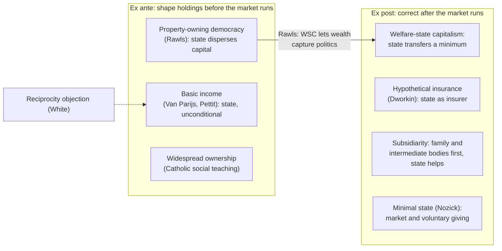

# Political Philosophy · Lesson 6.4: Who should provide? Welfare, property and subsidiarity

> ⏱ ~15 min · Module 6: Hard cases: borders, conscience and provision · Builds on: [2.4 Nozick](02-04-nozick-entitlement-and-the-challenge-to-patterns.md), [2.5 Equality of what?](02-05-equality-of-what.md), [3.1 Three concepts of liberty](03-01-three-concepts-of-liberty.md), [4.4 Feminist political philosophy](04-04-feminist-political-philosophy.md) · Unlocks: the course's end; see Closing the course

## Why this matters

Someone grows old and can no longer cook, wash or pay for help. Nearly every theory in this course agrees that something should happen. They disagree about *who* owes it (the state, the market, a parish, a daughter), *when* (before the market distributes, or after it has), and *on what terms* (unconditionally, or in return for contribution). Basic income is the sharpest test case, because it gives the answer "the state, before, unconditionally" and so draws fire from every other direction.

## The idea

**Two axes.** Ask of any scheme two questions. *Who provides?* The state, the market and voluntary giving, intermediate bodies (churches, unions, mutual societies, municipalities), or the family. *When?* **Ex post** schemes let the market distribute and then correct the result: taxes and transfers, insurance pay-outs, charity. **Ex ante** schemes shape what people hold *before* the market runs: dispersed capital, a universal grant, a stake at adulthood.

**The live positions, each at full strength.**

- **Welfare-state capitalism vs [property-owning democracy](../reference.md#property-owning-democracy) (Rawls).** In *Justice as Fairness: A Restatement* (2001), Rawls compares five regimes: laissez-faire capitalism, welfare-state capitalism, state socialism with a command economy, property-owning democracy and liberal (democratic) socialism. Only the last two, he argues, can realize his two principles ([2.3](02-03-rawls-the-two-principles-and-maximin.md)). Welfare-state capitalism guarantees a decent minimum after the fact but leaves ownership of productive capital concentrated, and concentrated wealth buys political influence and erodes the fair value of the political liberties. Property-owning democracy disperses capital and human capital at the start of each period, so citizens can manage their own affairs rather than be cared for. Rawls takes the idea and its name from the economist James Meade.
- **[Basic income](../reference.md#basic-income).** Philippe Van Parijs (*Real Freedom for All*, 1995) defends the highest sustainable unconditional grant, paid to every adult with no work test. Freedom, for him, is real freedom: the means to do whatever one might want to do, not just the right. Jobs are scarce assets that pay their holders rents, and taxing those rents to fund an equal grant shares a common asset fairly. Rawls had remarked in a footnote, repeated in *Political Liberalism* (1993), that those who surf all day off Malibu would have to support themselves and would have no claim on public funds. Van Parijs answered in "Why Surfers Should Be Fed" (*Philosophy & Public Affairs*, 1991): a liberal state neutral among ways of life may not favour those who prefer work over those who prefer the waves.
- **Republican basic income.** Pettit ("A Republican Right to Basic Income?", *Basic Income Studies*, 2007) argues from [freedom as non-domination](../reference.md#freedom-as-non-domination) ([3.1](03-01-three-concepts-of-liberty.md)). A worker who must accept any terms to eat is subject to her employer's arbitrary will, however kind he is. An unconditional income gives her the power to say no, which removes the domination, not just the interference.
- **The welfare state as insurance.** Dworkin's [hypothetical insurance](../reference.md#hypothetical-insurance) ([2.5](02-05-equality-of-what.md)) reads unemployment, disability and old-age provision as the cover people would have bought behind a veil of equal risk, funded by tax as the premium. It is ex post in its pay-outs and ambition-sensitive: it insures against brute luck, not against chosen idleness.
- **Subsidiarity and the universal destination of goods (Catholic social teaching).** [Subsidiarity](../reference.md#subsidiarity), stated in *Quadragesimo Anno* (1931), holds that what smaller and lower bodies can do should not be taken over by larger and higher ones, and that the higher body owes them help (*subsidium*). It restrains the state and obliges it at once. The [universal destination of goods](../reference.md#universal-destination-of-goods) holds that the earth's goods are meant for all, with private property as the ordinary, legitimate means to that end rather than its rival; when property fails to serve it, the claim of need comes first. The family and intermediate bodies are the first providers, the state the guarantor, and widely spread ownership the tradition's long-standing preference. Taught from within at [`catholic-social-teaching`](../../catholic-social-teaching/syllabus.md) 3.3 and 3.5; here it is one position.
- **The minimal state (Nozick).** The state may protect rights and nothing more. Taxing earnings to fund provision is on a par with [forced labor](../reference.md#taxation-as-forced-labor) ([2.4](02-04-nozick-entitlement-and-the-challenge-to-patterns.md)), since it conscripts some hours of one person's work for another's ends. Need is real and giving is admirable, but it must be voluntary; mutual aid, charity and insurance bought freely are the libertarian's providers, and their record before the welfare state is, on this view, underrated.

**The budget identity.** A flat tax at rate $t$ on every adult's income funds other public spending $g$ per adult and an equal grant $B$. With $\bar y$ the average income, the budget balances when

$$B = t\bar y - g.$$

A person with income $y$ gains on net $B - ty$, so she gains exactly when $y < B/t$. Invented numbers: $t=0.25$, $\bar y=48{,}000$, $g=4{,}000$ give $B=12{,}000-4{,}000=8{,}000$ dollars and a break-even income of $8{,}000/0.25=32{,}000$. This holds earnings fixed; how far earnings shrink as $t$ rises, and what rate a given welfare weighting picks, is owned by [`public-economics` 5.1](../../public-economics/lessons/05-01-the-linear-income-tax.md), which shows that a linear tax *is* a basic income with a demogrant. The identity settles what can be paid. It settles nothing about who deserves it.

## The argument

The case for an unconditional basic income, reconstructed from Van Parijs and Pettit:

1. **(Normative)** A just society secures for each person the real freedom to pursue her own conception of the good, including the freedom to refuse a job. *In words:* rights on paper are not enough; people need the means and the exit option.
2. **(Normative)** A liberal state must not favour one conception of the good over another.
3. **(Conceptual)** Any work test makes the grant depend on choosing paid (or approved) activity, which favours some conceptions of the good and leaves the worker's subsistence at the discretion of employers and officials.
4. **(Empirical)** A grant can be set at a sustainable level that funds subsistence without collapsing the tax base.

∴ **C.** Provision should include an unconditional basic income at the highest sustainable level.

**The [reciprocity objection](../reference.md#reciprocity-objection).** Stuart White (*The Civic Minimum*, 2003) accepts much of premise 1 but argues for "fair reciprocity": whoever willingly takes a share of the social product owes a matching contribution, if able, provided the background distribution is itself fair. On his account contribution includes care work, not just paid employment. An unconditional grant lets some live on others' labour. This is [2.6](02-06-luck-relations-priority-and-sufficiency.md)'s harshness debate turned around: there, critics charged luck egalitarians with abandoning the imprudent; here, critics charge the basic-income view with ignoring a duty the able owe.

**Where the argument is weakest.** Premise 2, applied to work. The critic says neutrality governs the state's *reasons*, and "contribute if you can" is not a view of the good life but a principle of fairness among cooperators, like fair play in [1.3](01-03-fair-play-gratitude-and-associative-obligation.md). The defender replies that the state already lets heirs and landowners live on unearned income, so singling out the surfer is not about reciprocity at all, and that exit power protects the worker whether or not she ever uses it.

## Map of positions

The map sorts by *who* and *when*. The dashed edge is the objection Example 2 tests.

## Worked examples

**Example 1 (clean): the care problem in Tellmere.** Invented case. The town of Tellmere has a growing number of frail elderly residents who cannot live alone without daily help. Run each view.

- *Welfare-state capitalism:* a tax-funded care service or care allowance, means-tested. Clear and reliable; ownership elsewhere untouched.
- *Property-owning democracy:* the same safety net, but the deeper aim is that most residents reached old age owning assets (homes, pension stakes) that pay for care, so fewer depend on a transfer.
- *Basic income:* each resident already receives the grant, which can pay for help or support a relative who stays home to give it. Unconditional, so no assessment of need; possibly too small for heavy care, so most defenders add needs-based supplements.
- *Subsidiarity:* families, neighbours and local associations provide first, and the state's duty is to *help them* do it: respite for carers, funding for a parish or municipal care cooperative. If they cannot, the higher body must step in; withdrawing help in the principle's name misreads it. [4.4](04-04-feminist-political-philosophy.md)'s Kittay presses the same point from another tradition: the carer needs support (doulia), not just the person cared for.
- *Minimal state:* no tax-funded scheme; care comes from families, charity, savings and insurance bought freely. The defender adds that a state crowding out these bodies weakens the very associations that used to provide.

Each view gives a determinate answer to *who*. They split on whether the family is the first provider or a site needing correction, and on whether care given at home is a contribution.

**Example 2 (hard): two grant recipients.** Invented case. Tellmere's grant goes to Odile, who left her job to care full-time for her mother, and to Rafe, who spends his days surfing and lives on the grant alone.

The reciprocity objection must say that Odile contributes and Rafe does not, and White does: care is civic labour. That moves the dispute to *what counts*. A participation income (a grant conditional on work, care, study or volunteering) tries to draw the line. Its critics say the line is either so wide that it excludes almost no one, which makes it an expensive work test that still requires monitoring, or narrow enough to bite, which brings back officials' discretion over private life, the domination the republican wanted to remove. The basic-income defender adds that Rafe's freedom to refuse paid work is what protects Odile's freedom to refuse a bad job.

Here the principle stops. Reciprocity tells you Rafe owes something; it does not tell you whether a scheme that can identify Rafe without burdening Odile exists, and that is partly an empirical question about administration.

## Watch out

- **You might think "taxation is forced labor" proves the citizen need not pay, but actually it is a claim about [legitimacy](../reference.md#power-legitimacy-authority-obligation), not obligation.** It says the redistributive state exceeds its right to rule; whether anyone may refuse to pay is a further question ([1.4](01-04-natural-duty-and-philosophical-anarchism.md)).
- **You might think subsidiarity is a presumption for small government, but actually it binds both ways.** The higher body must not absorb what lower bodies can do, and must help when they cannot. Tocqueville's fear of a "tutelary" administrative power ([`history-of-political-thought` 6.3](../../history-of-political-thought/lessons/06-03-tocqueville-tyranny-of-the-majority-and-soft-despotism.md)) is a family resemblance, not the same doctrine.
- **You might think the budget identity shows basic income is affordable, so justified, but actually it is arithmetic.** That a grant of $B$ is fundable is an empirical-accounting claim; that the able owe reciprocity, or that real freedom requires an exit option, is normative. Neither settles the other.

## One-liner

> Provision splits on who (state, market, intermediate bodies, family) and when (ex ante or ex post): Rawls wants capital dispersed before the market runs, Van Parijs and the republicans an unconditional exit option, Dworkin insurance against brute luck, Catholic social teaching help to the nearest body able to provide, Nozick voluntary giving only, and the reciprocity objection asks whether anyone may take without contributing.

## Problems

**P1 (🟢) *(Formal (a)-(b) · Exegetical (c).)*** Invented numbers. The Republic of Varden levies a flat 40 percent tax on all income. Average income is 30,000 dollars per adult, and other public spending costs 6,000 dollars per adult. The rest funds an equal basic income $B$. Hold earnings fixed. (a) Compute $B$, the break-even income, and the net gain or loss for adults earning 10,000 and 60,000 dollars. (b) What flat rate would fund $B=9{,}000$, and what is the new break-even income? (c) In two sentences: what does this arithmetic leave out that [`public-economics` 5.1](../../public-economics/lessons/05-01-the-linear-income-tax.md) supplies, and what does it leave out that no tax model supplies?

**P2 (🟡) *(Exegetical.)*** Diagnose. An **invented** council memo from the town of Brannock, not the words of any real person or body:

> (i) "Rather than run a central meals service, the council will fund the parish kitchens and tenants' associations already feeding people, and step in only where none exists."
> (ii) "Every resident turning 18 will receive a capital stake, so that people start adult life as owners, not claimants."
> (iii) "Councillor Reyes says the meals tax is forced labor, so residents are under no duty to pay it."
> (iv) "A no-questions-asked grant frees cleaners and carers to turn down abusive employers."

For each, name the position from this lesson it expresses (or the conflation it commits). One line each.

**P3 (🔴, optional) *(Evaluative.)*** Steelman and reply. Steelman the reciprocity objection against an unconditional basic income, then reply for a defender of basic income (Van Parijs's or the republican version). 150 words or fewer in total. Any verdict passes; do not reuse Odile and Rafe.

Solutions

**P1** *(Formal (a)-(b) · Exegetical (c) — strict)*

(a) $B=t\bar y-g=0.40\times30{,}000-6{,}000=12{,}000-6{,}000=6{,}000$ dollars. Break-even $y^*=B/t=6{,}000/0.40=15{,}000$. At 10,000: $6{,}000-0.40\times10{,}000=6{,}000-4{,}000=+2{,}000$. At 60,000: $6{,}000-24{,}000=-18{,}000$.

(b) $t=(B+g)/\bar y=(9{,}000+6{,}000)/30{,}000=0.50$. Break-even $9{,}000/0.50=18{,}000$. (Net: 10,000 earner $+4{,}000$; 60,000 earner $9{,}000-30{,}000=-21{,}000$.)

**Must hit, strict (c):**

- Public economics supplies the behavioural response: as $t$ rises, earnings and so $\bar y$ fall, so the static $B$ overstates what the rate funds, and which rate is best depends on the welfare weights and the elasticity.
- No tax model supplies the normative question: whether the able owe reciprocity, whether an exit option is a requirement of freedom, or who (state, family, intermediate body) should be the provider at all.

**Wrong turns:** forgetting $g$ and computing $B=12{,}000$; computing break-even as $\bar y$, which holds only when $g=0$.

**Model answer (c):** The calculation ignores that earnings shrink as the rate rises, which 5.1 models with the elasticity of taxable income and a choice of welfare weights. And no model says whether an unconditional grant is just: that turns on reciprocity, real freedom and who ought to provide, which are normative questions.

---

**P2** *(Exegetical — strict)*

**Must hit, strict:**

- (i) **Subsidiarity**, both halves: the higher body does not absorb what lower bodies do, and it helps them (funds them) and steps in where they fail.
- (ii) **Ex ante provision**: property-owning democracy's dispersal of capital, or a stakeholder grant in the same family; "owners, not claimants" is Rawls's contrast with welfare-state capitalism.
- (iii) **Conflation of legitimacy and obligation**: forced labor is Nozick's claim that redistributive taxation exceeds the state's right to rule; it does not by itself show residents have no duty to pay.
- (iv) **Republican basic income**: the grant as protection against domination, the power to refuse.

**Wrong turns:** filing (i) as Nozick's minimal state (the council funds and backstops provision, which Nozick forbids); filing (iv) as Van Parijs's neutrality argument (the reason given is exit from abusive power, Pettit's ground); filing (ii) as basic income (a one-off capital stake changes holdings, not a periodic income).

**Model answer:** (i) subsidiarity, restraining and helping at once; (ii) ex ante ownership, property-owning democracy's aim; (iii) slides from a legitimacy claim to an obligation claim; (iv) republican basic income as non-domination.

---

**P3** *(Evaluative — graded on moves, not verdict)*

**Must hit, any verdict:**

- The objection at strength: fair reciprocity, not a work ethic; whoever takes a share of what others produce owes a contribution if able, provided the background is fair; contribution includes care.
- The reply engages that premise, not a caricature: e.g. the background is not fair (heirs and rentiers already take without contributing), or the grant shares rents on scarce assets that belong to all, or the exit option protects others from domination.
- Say where the reply stops: e.g. it may concede reciprocity in a just society and defend the grant only under non-ideal conditions.

**Wrong turns:** steelmanning reciprocity as "people should work hard" (a conception of the good, which White does not rely on); replying only that monitoring is costly, which concedes the principle and argues feasibility.

**Model answer, one of several:** Steelman: social cooperation is a scheme of mutual benefit. Whoever willingly takes a share of what others produce, while able to contribute, free-rides on them, and paid work, care or study all count. An unconditional grant institutionalizes that free-riding, so a fair minimum must ask for contribution in return. Reply (Van Parijs): the objection applies only against a fair background, and ours is not; inheritance and land rents already give some people income without contribution. Jobs themselves are scarce assets yielding rents. Taxing those rents and dividing them equally returns to each a share of a common asset rather than a share of others' labour. Where it stops: in a society with no unearned income and no job rents, this reply loses its grip.

## Flashback

**From Lesson [6.2](06-02-immigration-may-a-state-exclude.md) (Immigration: may a state exclude?):** *(Exegetical (a) · Evaluative (b).)* Reconstruct, then apply. (a) Reconstruct David Miller's argument that immigration is not a human right, in at most four numbered premises and a conclusion, labelling each premise normative, conceptual or empirical. (b) Invented case. Kiri is a citizen of the invented landlocked state of Osk, a decent state with a wide range of careers. She has trained as a marine biologist, and every post in her field is abroad. The coastal state of Holm refuses her a work visa because it wants no more migrants this year. Does Holm wrong her on Miller's argument? Give Carens's reply, then say what the dispute turns on. 120 words or fewer for (b). Any verdict passes.

Solution

**Must hit, strict (a):**

- A premise fixing what the human right protects: freedom of movement is a human right only so far as a person needs it for an **adequate range of options** (work, family, worship, association). Normative.
- A premise that an adequate range is a range: having enough options does not require access to any particular one. Conceptual.
- A premise that a decent state can supply an adequate range within its own territory. Empirical.
- Conclusion: a citizen of a decent state has no human right to enter another state; outsiders are owed their human rights, not membership. The same ground yields the refugee exception: a person whose human rights cannot be secured at home has a strong claim to be taken in.

**Must hit, any verdict (b):**

- Miller: Osk is decent and offers a wide range of careers; one missing vocation leaves the range adequate, so no human right is violated and Holm does not wrong Kiri by refusing. She is no refugee: her rights are secure at home.
- Carens: inside a state, no one would let a coastal province bar an inland citizen on the ground that home offers enough careers; movement is a basic liberty, restrictable only for public-order-type reasons, and "no more migrants this year" is not one. That Kiri was born on the landlocked side of a border is the morally arbitrary fact of his premise 2.
- What it turns on: whether movement across borders is measured by **adequacy** (a human-rights threshold) or by the **presumption owed a basic liberty**, which is the dispute over whether internal and international movement are morally alike. And "adequate" has no sharp edge: whether the loss of a whole vocation counts is where Miller's test stops giving a verdict.

**Wrong turns:** grounding (a) in freedom of association (that is Wellman's argument, not Miller's); labelling the premise about what a decent state can supply as normative; treating Kiri as a refugee or as owed admission under the 1951 Convention; arguing about whether Holm's economy needs marine biologists, an empirical point neither view's verdict turns on.

**Model answer (a):** (1) Free movement is a human right only so far as needed for an adequate range of options. *(Normative.)* (2) An adequate range need not include any particular option. *(Conceptual.)* (3) A decent state can supply an adequate range within its borders. *(Empirical.)* ∴ A citizen of a decent state has no human right to enter another; only those whose rights cannot be secured at home, refugees, have a strong claim to entry.

**Model answer (b), one of several:** On Miller's argument Holm does not wrong Kiri: Osk offers an adequate range of careers, the right protects a range rather than every option, and she is no refugee. Carens replies that no one would let a coastal province turn away an inland citizen because her home region offers enough careers; movement is a liberty restricted only for public-order reasons, and "no more migrants" is not one. Kiri's landlocked birthplace is exactly the arbitrary fact he names. The dispute turns on whether crossing a border is judged by adequacy or by the presumption owed a basic liberty, and adequacy has no sharp edge when a whole vocation is missing.

## Connections

- **Backward:** [2.4](02-04-nozick-entitlement-and-the-challenge-to-patterns.md)'s taxation-as-forced-labor claim is the minimal state's case here; [2.5](02-05-equality-of-what.md)'s hypothetical insurance reads the welfare state as insurance; [2.6](02-06-luck-relations-priority-and-sufficiency.md)'s harshness debate returns reversed as reciprocity; [3.1](03-01-three-concepts-of-liberty.md) supplies non-domination; [4.3](04-03-perfectionism-and-the-common-good.md)'s common good grounds subsidiarity; [4.4](04-04-feminist-political-philosophy.md)'s doulia asks who supports the carer.
- **Forward:** the provision questions continue in [`catholic-social-teaching`](../../catholic-social-teaching/syllabus.md) 3.3, 3.5 and 6.3 (subsidiarity, the universal destination of goods, distributism's widened ownership) and in [`political-economy`](../../political-economy/syllabus.md), which models what welfare institutions actually do.
- **Sideways:** the linear tax as a basic income with a demogrant is [`public-economics` 5.1](../../public-economics/lessons/05-01-the-linear-income-tax.md); voluntary provision and crowding out, the minimal state's empirical bet, is [`public-economics` 1.2](../../public-economics/lessons/01-02-voluntary-provision-and-crowding-out.md); subsidiarity's economic cousin, assigning functions to levels of government, is [`public-economics` 8.2](../../public-economics/lessons/08-02-assignment-spillovers-and-grants.md). Paine's endowment at adulthood, an early ex ante scheme, appears in [`philosophy-of-debt` 5.4](../../philosophy-of-debt/lessons/05-04-jubilee-as-a-moral-principle.md).

## Closing the course

Six modules, one question each. **Module 1** asked why anyone owes the state obedience. **Module 2** asked who should get what. **Module 3** asked what the state may forbid. **Module 4** asked on what terms people who disagree about the good may coerce one another. **Module 5** asked why the majority should decide, and when a court may overrule it. **Module 6** ran all of it on borders, conscience and provision.

Throughout, keep four things apart: **power** (the ability to compel), **legitimacy** (the right to rule), **authority** (the power to bind by directive) and **political obligation** (the duty to obey). Justifying an arrangement is not yet showing it legitimate. Most bad arguments establish one of these and claim another.

The cruxes the course located, left open:

- Does anything short of real consent bind you to *your* state?
- Is a distribution judged by its shape or its history?
- Is freedom the absence of interference or the absence of a master?
- Must coercive law rest on reasons every reasonable citizen can share?
- Is democracy valuable for what it produces or for the equality it expresses?
- What triggers duties of distributive justice, and who owes provision against need?

Where next: legal obligation and punishment in [`philosophy-of-law`](../../philosophy-of-law/syllabus.md); the Church's social doctrine from within in [`catholic-social-teaching`](../../catholic-social-teaching/syllabus.md); what institutions actually do in [`political-economy`](../../political-economy/syllabus.md); and the formal theory of aggregation in [`social-choice`](../../social-choice/syllabus.md).
