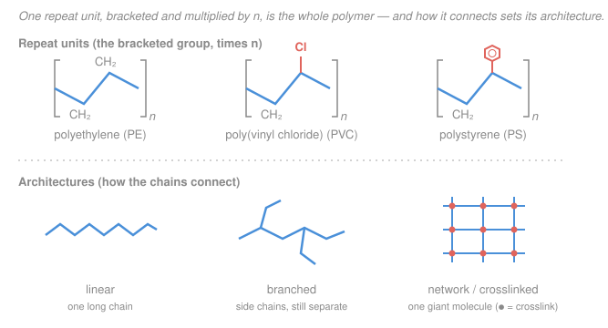

# Polymer & Materials Chemistry · Lesson 1.1: What is a polymer? Classification & nomenclature

> ⏱ ~15 min · Module 1: Polymerization Mechanisms · Builds on: [organic-chemistry](../../organic-chemistry/syllabus.md) · Unlocks: [1.2 Step-growth polymerization](01-02-step-growth-polymerization.md)

## Why this matters

Almost everything soft, tough, or squishy around you — the bottle, the tire, the phone case, the DNA in your cells — is a polymer, and its behavior is set at the level of a single small picture: *which group repeats, and how the copies are wired together.* Before we can compute molecular weights, glass transitions, or why rubber snaps back, we need a shared vocabulary: how to look at a repeat unit, name the material, and sort it into the few families that predict everything downstream. Get this classification reflex right and the rest of the course is filling in the physics.

## The idea

A **polymer** is a long molecule built by covalently linking many copies of a small building block. Think of a paper chain: you cut out one shape (the building block) and staple hundreds of identical copies end to end. The shape you cut is what chemists call the **repeat unit**; the number of staples is the **degree of polymerization**. Almost the entire identity of the material — its name, its stiffness, whether it melts — is encoded in two questions: *what is the repeat unit,* and *how are the chains connected to each other* (a single strand? a bush with side-branches? a fishing net where every strand is tied to its neighbors?).

Two distinctions do most of the sorting work. First, **melts-and-reflows vs. sets-forever**: if the chains are separate strands you can heat them until they slide past each other and flow (a *thermoplastic*, like a milk jug you could in principle remelt); if the chains are all tied together into one giant crosslinked net, heating can't unstick them, so the shape is permanent (a *thermoset*, like a cured epoxy or a car tire). Second, **one kind of building block vs. several**: a chain of one repeat unit is a *homopolymer*; stitch two or more different units into the same chain and it's a *copolymer*. That's the whole taxonomy — the formal version just makes each word precise and gives us the two naming systems.

## The formal version

**Monomer vs. repeat (structural) unit.** A **monomer** is the small reactive molecule you start with. The **repeat unit** (or **structural unit**) is the group that actually recurs along the finished chain. For addition (chain-growth) polymers these have the *same* atoms — ethylene becomes the ethylene repeat unit with nothing lost:

$$\ce{n CH2=CH2 -> [-CH2-CH2-]_n}$$

*In words: n molecules of the monomer link into a chain of n identical repeat units.* But for **condensation** polymers a small molecule (often water) is expelled at each link, so the repeat unit is *lighter* than the monomers that made it — a trap we return to in [1.2](01-02-step-growth-polymerization.md).

**Degree of polymerization.** The (number-average) **degree of polymerization** $X_n$ is the average number of repeat units per chain. If $M_0$ is the molar mass of one repeat unit and $M_n$ is the number-average molar mass of the chains,

$$X_n = \frac{M_n}{M_0}.$$

*In words: divide the mass of a typical whole chain by the mass of one link to count the links.* (We define $M_n$ precisely in [2.1](02-01-molecular-weight-averages-dispersity.md); for now it's just "the average chain's molar mass.")

**Homopolymer vs. copolymer.** A **homopolymer** has one repeat unit, $\ce{-A-A-A-A-}$. A **copolymer** has two or more; the *sequence* names the subtype — **random/statistical** ($\ce{-A-A-B-A-B-B-}$), **alternating** ($\ce{-A-B-A-B-}$), **block** ($\ce{-A-A-A-B-B-B-}$), or **graft** (a backbone of A with B side-chains). We quantify sequences in [1.6](01-06-copolymers-reactivity-ratios.md).

**Architecture.** How chains are shaped and connected:
- **Linear** — one continuous strand.
- **Branched** — side-chains hang off a main chain (star, comb, hyperbranched), but molecules are still separate and finite.
- **Network / crosslinked** — chains are covalently tied together into effectively *one* macroscopic molecule.

**Thermoplastic vs. thermoset.** This is the property payoff of architecture. A **thermoplastic** is linear or branched — separate chains held together only by weak physical forces, so heat lets them flow and you can remelt and reshape it (recyclable). A **thermoset** is a crosslinked network — one covalent solid — so it cannot melt or reflow; heating it enough just degrades it. *In words: no crosslinks → melts and recycles; crosslinks → set for good.*

**Naming — two systems.**
- **Source-based:** `poly` + the monomer name; parenthesize multi-word monomers. Ethylene → **polyethylene**; styrene → **polystyrene**; vinyl chloride → **poly(vinyl chloride)**. This is what industry uses.
- **Structure-based (IUPAC):** `poly(` + the **constitutional repeating unit (CRU)**, the smallest repeating unit, named as a bivalent group `)`. PVC's CRU $\ce{-CH2-CHCl-}$ → **poly(1-chloroethylene)** (equivalently poly(1-chloroethane-1,2-diyl)); PS → **poly(1-phenylethylene)**. Structure-based naming is unambiguous even when nobody remembers the monomer.

## Picture

The three vinyl polymers share the **same two-carbon backbone**; they differ only in what hangs off it — nothing (PE), a chlorine (PVC), or a benzene ring (PS). The bottom row is the architecture axis that decides thermoplastic (linear/branched, separate molecules) vs. thermoset (network, one molecule).

## Worked examples

**Example 1 (name it and count the links).** You're handed a repeat-unit drawing: a two-carbon backbone with one hydrogen replaced by chlorine, $\ce{[-CH2-CHCl-]_n}$. The sample has $M_n = 1.25\times10^{5}\ \mathrm{g/mol}$. Name the polymer both ways and find its degree of polymerization.

*Name.* The monomer is vinyl chloride ($\ce{CH2=CHCl}$), so source-based it is **poly(vinyl chloride)** — PVC. The CRU is $\ce{-CH2-CHCl-}$, so structure-based it is **poly(1-chloroethylene)**.

*Degree of polymerization.* First the repeat-unit mass $M_0$. The unit is $\ce{C2H3Cl}$:

$$M_0 = 2(12.01) + 3(1.008) + 35.45 = 62.5\ \mathrm{g/mol}.$$

Then

$$X_n = \frac{M_n}{M_0} = \frac{1.25\times10^{5}}{62.5} = 2000.$$

*In words: the average chain is about 2000 repeat units long.* (Since PVC is an addition polymer, the monomer and repeat unit have the same mass — 2000 repeat units came from 2000 monomers.)

**Example 2 (classify a mixed bag).** Sort each by thermoplastic/thermoset and architecture, and say *why*.

| Material | Thermo- | Architecture | Reasoning |
|---|---|---|---|
| **PET** (poly(ethylene terephthalate), a bottle) | thermoplastic | linear | Built from *difunctional* monomers (a diol + a diacid), so each monomer can only extend the chain in two directions — never crosslink. Separate linear strands melt and reflow (that's why PET is remelted and recycled). |
| **Phenol–formaldehyde** (Bakelite) | thermoset | network | Phenol offers *three* reactive ring positions, so formaldehyde bridges knit chains in all directions into one covalent net. It can't remelt — it chars. |
| **Natural rubber** (cis-polyisoprene) | *depends* | linear (raw) → network (vulcanized) | Raw rubber is long linear chains — a sticky thermoplastic that cold-flows. **Vulcanization** adds sulfur crosslinks between chains, converting it to a lightly crosslinked network: now a thermoset elastomer that springs back instead of flowing. |
| **Epoxy** (cured adhesive) | thermoset | network | The resin and hardener are *multifunctional*, so curing builds a dense 3-D crosslinked network. One giant molecule → sets permanently. |

The pattern: **functionality of the monomers decides architecture, and architecture decides thermo-behavior.** Only difunctional units (2 reactive sites) give linear thermoplastics; any monomer with 3+ reactive sites opens the door to a crosslinked thermoset. (We'll make "functionality → gelation" quantitative in [1.3](01-03-carothers-equation.md).)

## Watch out

- **You might think the repeat unit always weighs the same as the monomer.** True for addition polymers (PE, PVC, PS), but *false* for condensation polymers, where a small molecule leaves at each bond. Use $M_0$ = mass of the **repeat unit as it appears in the chain**, not the monomer you bought — otherwise $X_n = M_n/M_0$ is wrong. (Details in [1.2](01-02-step-growth-polymerization.md).)
- **You might conflate "degree of polymerization" counted in repeat units vs. in monomer residues.** For a copolymer like nylon-6,6 the repeat unit $\ce{-[NH(CH2)6NH-CO(CH2)4CO]-}$ contains *two* monomer residues (a diamine + a diacid). "1000 repeat units" then means 2000 structural residues. Always state which unit you're counting.
- **You might read "thermoset" off the chemistry instead of the crosslinks.** The *same* polyisoprene is a thermoplastic when linear and a thermoset once vulcanized. Thermoplastic vs. thermoset is a statement about **crosslinking**, not about the monomer.

## One-liner

> A polymer is $n$ copies of one repeat unit staple together — name it from that unit, count the staples with $X_n = M_n/M_0$, and let the crosslinks decide whether heat melts it (thermoplastic) or merely sets it (thermoset).

## Problems

**P1 (🟢)** A repeat-unit drawing shows a two-carbon backbone with one hydrogen replaced by a methyl group, $\ce{[-CH2-CH(CH3)-]_n}$. (a) Give its source-based and structure-based names. (b) The sample has $M_n = 8.4\times10^{4}\ \mathrm{g/mol}$; find $M_0$ and $X_n$. (c) Is it a homopolymer or copolymer?

**P2 (🟡)** You polymerize styrene alone, and separately you polymerize styrene together with a small amount of **divinylbenzene** (a molecule with *two* polymerizable vinyl groups). One product is a clear thermoplastic you can dissolve and mold; the other is an insoluble solid that only swells in solvent. Which is which, and explain — in terms of architecture and functionality — why adding the divinylbenzene changes the class of material.

**P3 (🔴, optional)** Styrene–butadiene rubber (SBR), the tread of most tires, is made by polymerizing styrene and butadiene together with no long runs of either. (a) Is it a homopolymer or copolymer, and which sequence subtype (random / alternating / block)? (b) Write its source-based name. (c) SBR in a tire is vulcanized: name its architecture and thermo-class, and connect this to why a tire holds its shape at highway temperatures. (This crosslink-density idea is the engine of [3.4 rubber elasticity](03-04-rubber-elasticity-entropic-spring.md).)

Solutions

**P1** (a) The monomer is propylene (propene, $\ce{CH2=CH-CH3}$), so source-based it is **polypropylene** (PP). The CRU is $\ce{-CH2-CH(CH3)-}$, named as a bivalent group: **poly(1-methylethylene)** (equivalently poly(propane-1,2-diyl)).

(b) The repeat unit is $\ce{C3H6}$:

$$M_0 = 3(12.01) + 6(1.008) = 42.08 \approx 42\ \mathrm{g/mol}.$$

$$X_n = \frac{M_n}{M_0} = \frac{8.4\times10^{4}}{42} = 2000.$$

*Check.* PP is an addition polymer, so $M_0$ equals the monomer mass (42 g/mol) — no small molecule is lost. About 2000 repeat units per chain. ✓

(c) One repeat unit only → a **homopolymer**.

**P2** Styrene alone → linear polystyrene chains, a **thermoplastic**: separate molecules held by weak forces, so they dissolve and melt/mold. Adding divinylbenzene makes the second product a **thermoset network** (the insoluble solid).

*Why.* Styrene is **difunctional** in the polymerization sense — its one vinyl group joins the chain, extending it in a line. Divinylbenzene has **two** vinyl groups, so a single divinylbenzene molecule can be built into *two different growing chains at once*, tying them together — a crosslink. A few such bridges knit all the chains into one giant covalent network. A network can't dissolve (there's no separate molecule to float away) or melt (the covalent ties don't unstick), so it only **swells** as solvent seeps into the mesh. This is exactly the functionality lever from Example 2: a monomer with functionality > 2 converts a thermoplastic into a thermoset.

**P3** (a) Two different repeat units (styrene and butadiene) in the same chain → a **copolymer**; with no long runs of either monomer it is a **random (statistical)** copolymer.

(b) Source-based, listing the comonomers with the `-co-` connective: **poly(styrene-co-butadiene)**.

(c) Vulcanization inserts sulfur crosslinks between the chains, so the architecture is a (lightly) **crosslinked network** and the material is a **thermoset** elastomer. Because the chains are tied together rather than free to slide, the rubber returns to its shape instead of flowing when warm — a tire keeps its geometry at highway temperatures precisely because those crosslinks prevent the chains from permanently sliding past one another. The number of crosslinks per volume (crosslink density) sets the stiffness — the quantitative story of [3.4](03-04-rubber-elasticity-entropic-spring.md).

## Connections

- **Backward:** a repeat unit is just an organic fragment, and "functionality" is a molecule's count of reactive groups — both straight from [organic chemistry](../../organic-chemistry/syllabus.md). Naming vinyl polymers is naming their substituents (chloro-, phenyl-, methyl-).
- **Forward:** [1.2](01-02-step-growth-polymerization.md) exploits the monomer-vs-repeat-unit distinction (condensation loses water, so $M_0 \ne$ monomer mass), and [1.3](01-03-carothers-equation.md) turns the "functionality → linear vs. network" observation into the Carothers/gelation criterion. The copolymer subtypes get quantitative in [1.6](01-06-copolymers-reactivity-ratios.md).
- **Sideways:** thermoplastic vs. thermoset is the fault line of materials science and plastics recycling — a thermoplastic can be remelted and reprocessed, a thermoset cannot, which is why crosslinked tires and epoxies are so hard to recycle. The crosslink-density idea reappears as the entropic spring of [3.4](03-04-rubber-elasticity-entropic-spring.md).
