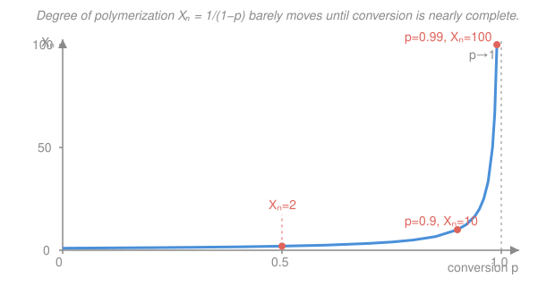

# Polymer & Materials Chemistry · Lesson 1.2: Step-growth polymerization & its kinetics

> ⏱ ~15 min · Module 1: Polymerization Mechanisms · Builds on: [1.1 What is a polymer? Classification & nomenclature](01-01-what-is-a-polymer-classification.md) · Unlocks: [1.3 The Carothers equation](01-03-carothers-equation.md)

## Why this matters

Nylon, polyester (PET), and polycarbonate — the workhorses of clothing, bottles, and engineering plastics — are all built the same slow way: two functional groups shake hands, spit out a small molecule, and repeat. The startling fact you'll prove here is that this reaction is **almost finished before it makes anything useful**: at 50% conversion the average chain is only *two* units long. High molecular weight is a late-stage phenomenon, and understanding why tells you exactly how hard you must drive a step-growth reaction to get a strong material.

## The idea

Picture a room full of people, each with a left hand and a right hand, told to pair off by shaking hands. At first everyone finds a partner fast — pairs form everywhere. But to build a long *chain* of people, you need a pair to link to another pair, then that quartet to link to another chain, and so on. Any group can grab any other group: a lone monomer, a dimer, a ten-mer — all react at the same eager rate. So the monomers vanish quickly (they're the most numerous), but stitching those short pieces into genuinely long chains requires nearly *every remaining* hand to find a partner. Until the very end, you have a soup of short oligomers, not polymer.

That is **step-growth polymerization**: chains grow by any-two-can-react condensation steps, and the degree of polymerization creeps up slowly, then rockets only as conversion approaches 100%. Contrast this with **chain-growth** (Lesson 1.4), where a handful of active centers each build one long chain immediately — there, long molecules exist from the first minute.

The reason the kinetics are even solvable is a beautiful simplification called the **equal-reactivity principle**: a `-COOH` group reacts at the same rate whether it dangles off a monomer or off a 500-unit chain. Reactivity is a *local* property of the functional group, not of the giant molecule carrying it. That lets us stop tracking every chain length separately and just count functional groups.

## The formal version

**Condensation vs. addition.** A **condensation** polymerization joins two groups and expels a small molecule (usually water):

$$\ce{-COOH + HO- -> -CO-O- + H2O} \qquad(\text{esterification})$$
$$\ce{-COOH + H2N- -> -CO-NH- + H2O} \qquad(\text{amidation})$$

*In words: an acid and an alcohol form an ester link and release water; an acid and an amine form an amide link and release water.* Nylon-6,6 (diamine + diacid) and PET (diol + diacid) are exactly these. An **addition** polymerization, by contrast, adds monomers with *no* byproduct (Lesson 1.4). Note: most step-growth is condensation, but the two labels classify different things — *mechanism* (step vs. chain) versus *byproduct* (condensation vs. addition).

**Conversion.** Let $c_0$ be the initial concentration (mol/L) of one reacting group, say `-COOH`, with an equal amount of `-OH`. Let $c$ be its concentration at time $t$. Define the **conversion**

$$p \equiv \frac{c_0 - c}{c_0} = 1 - \frac{c}{c_0}, \qquad\text{so}\qquad c = c_0(1-p).$$

*In words: $p$ is the fraction of functional groups that have already reacted.* At $p=0$ nothing has reacted; at $p=1$ every group is consumed.

**The rate law (equal reactivity).** Esterification is second-order — first-order in each group — so the rate of loss of `-COOH` equals a rate constant times $[\text{-COOH}][\text{-OH}]$. With equal amounts, $[\text{-COOH}]=[\text{-OH}]=c$. It is also acid-catalyzed; if we add a **strong acid catalyst** at fixed concentration and fold it into $k$, we get a clean second-order law:

$$-\frac{dc}{dt} = k\,c^2 .$$

*In words: the reaction speeds up with the square of how many groups remain, and slows to a crawl as they run out.* Separate and integrate from $c_0$ to $c$:

$$\int_{c_0}^{c} -\frac{dc}{c^2} = \int_0^t k\,dt \;\;\Longrightarrow\;\; \frac{1}{c} - \frac{1}{c_0} = kt .$$

Now substitute $c = c_0(1-p)$ and multiply through by $c_0$:

$$\boxed{\;\frac{1}{1-p} = 1 + c_0\,k\,t\;}$$

*In words: the quantity $1/(1-p)$ climbs in a straight line with time.* And that quantity is precisely the number-average degree of polymerization.

**Why $1/(1-p)$ is the chain length.** Start with $N_0$ monomer molecules. Every time two groups react, two molecules fuse into one, so the total molecule count drops by exactly one. The number of reacted `-COOH` groups is $N_0 p$, so the molecule count falls to $N = N_0(1-p)$. The number-average degree of polymerization — monomers per chain — is

$$X_n = \frac{\text{monomers}}{\text{molecules}} = \frac{N_0}{N_0(1-p)} = \frac{1}{1-p}.$$

*In words: average chain length is one over the fraction of unreacted groups.* (This is the **Carothers equation**; Lesson 1.3 adds stoichiometric imbalance and chain stoppers.) Combining it with the kinetics, $X_n = 1 + c_0 k t$ — chain length grows only *linearly* in time, which is why reaching high MW takes so long.

**Self-catalyzed variant.** With no added catalyst, the carboxylic acid catalyzes its own esterification, making the law third-order, $-dc/dt = k c^3$. Integrating gives $1/(1-p)^2 = 1 + 2c_0^2 kt$, so $X_n \propto \sqrt{t}$ at long times — even slower. Either way, the moral is the same: high MW comes late.

## Picture

The curve is flat and boring across almost the entire range — then explodes in the last few percent. That vertical wall near $p=1$ is the whole story of step-growth.

## Worked examples

**Example 1 (kinetics → time).** An acid-catalyzed polyesterification has $c_0 = 3.0\ \mathrm{mol/L}$ of each functional group and $k = 5.0\times10^{-3}\ \mathrm{L\,mol^{-1}\,s^{-1}}$. How long to reach $p = 0.99$ (i.e. $X_n = 100$)?

Use the integrated law $\dfrac{1}{1-p} = 1 + c_0 k t$. At $p=0.99$, $\dfrac{1}{1-p} = \dfrac{1}{0.01} = 100$, so

$$100 = 1 + c_0 k t \;\Longrightarrow\; c_0 k t = 99.$$

With $c_0 k = 3.0 \times 5.0\times10^{-3} = 1.5\times10^{-2}\ \mathrm{s^{-1}}$,

$$t = \frac{99}{1.5\times10^{-2}} = 6600\ \mathrm{s} \approx 1.8\ \text{hours}.$$

*Check.* To reach only $p=0.98$ ($X_n=50$) needs $c_0 k t = 49$, i.e. $t = 3267\ \mathrm{s} \approx 0.9$ h — **half** the time for **half** the chain length. Because $X_n = 1 + c_0kt$, doubling the chain length always costs (roughly) double the time. There is no shortcut to high MW.

**Example 2 (why high MW is a late-stage event).** Compare the average chain length at half-conversion and near-completion.

$$p = 0.5:\quad X_n = \frac{1}{1-0.5} = \frac{1}{0.5} = 2.$$
$$p = 0.99:\quad X_n = \frac{1}{1-0.99} = \frac{1}{0.01} = 100.$$

At $p=0.5$ — *half of all functional groups have already reacted* — the average molecule is a mere **dimer**. Fully half the conversion has bought you almost nothing: the mixture is monomers, dimers, and trimers. Only by grinding conversion from 0.99 to 0.999 do you climb from $X_n=100$ to $X_n=1000$. A useful nylon needs $X_n \sim 100$–$200$, which means $p > 0.99$ — pushing a condensation to within a whisper of completion, typically by continuously stripping out the water to pull the equilibrium forward.

## Watch out

- **You might think 90% conversion means 90% of the way to long chains.** It doesn't — $p=0.9$ gives $X_n=10$, still an oligomer. The relationship is $1/(1-p)$, brutally nonlinear: the action is entirely in the last percent, not the first ninety.
- **You might think monomers survive until late.** The opposite: because *any* two groups react, monomers are consumed *fastest* (they're the most abundant species early on). What's scarce late in the reaction isn't monomer — it's *unreacted groups on the long chains* that still need to find each other.
- **Don't conflate "condensation" with "step-growth."** They usually coincide but answer different questions. Some step-growth reactions (polyurethanes) release no small molecule (addition), and the mechanism label — step vs. chain — is the one that governs the MW-vs-$p$ curve.

## One-liner

> In step-growth, any two species can react, so monomer vanishes fast but the average chain length is only $X_n = 1/(1-p)$ — meaning high molecular weight is squeezed entirely into the final approach to $p=1$.

## Problems

**P1 (🟢)** A strong-acid-catalyzed polyesterification starts with $c_0 = 2.0\ \mathrm{mol/L}$ of each group and $k = 1.0\times10^{-2}\ \mathrm{L\,mol^{-1}\,s^{-1}}$. Using $\dfrac{1}{1-p}=1+c_0kt$, find $X_n$ and the conversion $p$ after $t = 4500\ \mathrm{s}$.

**P2 (🟡)** For the *self-catalyzed* case the rate law is third-order, $-\dfrac{dc}{dt} = k c^3$. (a) Integrate it and show that $\dfrac{1}{(1-p)^2} = 1 + 2c_0^2 kt$. (b) In this case $X_n$ grows like $\sqrt{t}$ at long times, versus linearly in $t$ for the catalyzed second-order case. Which route reaches a target high MW faster, and give the one-sentence reason. *(Cross-link: integrated rate laws in [physical-chemistry](../../physical-chemistry/syllabus.md).)*

**P3 (🔴)** The equal-reactivity principle claims a `-COOH` on a 500-unit chain reacts with the same rate constant $k$ as one on a free monomer. (a) Explain why this single assumption is what makes the kinetics solvable — what would we otherwise have to track? (b) Suppose instead that groups on long chains reacted 10× *slower*. Qualitatively, would this help or hurt the drive to high MW, and would the clean $X_n = 1/(1-p)$ result survive? *(Cross-link: esterification/amidation mechanism in [organic-chemistry](../../organic-chemistry/syllabus.md).)*

Solutions

**P1.** Compute $c_0 k = 2.0 \times 1.0\times10^{-2} = 2.0\times10^{-2}\ \mathrm{s^{-1}}$. Then

$$\frac{1}{1-p} = 1 + c_0 k t = 1 + (2.0\times10^{-2})(4500) = 1 + 90 = 91.$$

So $X_n = 91$, and $p = 1 - \dfrac{1}{91} = 1 - 0.0110 = 0.989$.

*Check.* $X_n=91$ needs $p$ just under 0.99 — consistent with the figure, where $X_n$ near 100 sits right against the $p\to1$ wall. ✓

**P2.** (a) Separate variables and integrate from $c_0$ to $c$:

$$\int_{c_0}^{c} -\frac{dc}{c^3} = \int_0^t k\,dt \;\Longrightarrow\; \left[\frac{1}{2c^2}\right]_{c_0}^{c} = kt \;\Longrightarrow\; \frac{1}{2c^2} - \frac{1}{2c_0^2} = kt.$$

Multiply by 2: $\dfrac{1}{c^2} = \dfrac{1}{c_0^2} + 2kt$. Substitute $c = c_0(1-p)$ and multiply through by $c_0^2$:

$$\frac{1}{(1-p)^2} = 1 + 2c_0^2 kt. \qquad\checkmark$$

Since $X_n = 1/(1-p)$, this reads $X_n^2 = 1 + 2c_0^2 kt$, so at long times $X_n \approx \sqrt{2c_0^2 k}\,\sqrt{t} \propto \sqrt{t}$.

(b) The **catalyzed second-order** route reaches high MW faster: there $X_n \propto t$ (linear), whereas self-catalyzed gives $X_n \propto \sqrt{t}$, which flattens out — to double $X_n$ you need roughly *four times* the time. Adding an external acid catalyst keeps the effective order at two and the growth linear, which is why industrial condensations use one (and remove water).

**P3.** (a) Without equal reactivity, the rate constant would depend on chain length, so we'd need a separate rate equation for every distinct reaction — monomer+monomer, monomer+dimer, dimer+trimer, ... — an *infinite coupled set* of ODEs, one per chain-length pair. Equal reactivity collapses all of them into a single second-order equation in the *total* group concentration $c$, which is what let us integrate to $1/(1-p)=1+c_0kt$. It is justified because a functional group's reactivity is a local property of its immediate bonding environment; the giant chain diffuses slowly, but once two ends encounter each other the chemical step is essentially unchanged.

(b) It would **hurt**: high-MW growth requires long chains to react with long chains precisely at the late stage, so a 10× penalty there would stall exactly the reactions that build molecular weight, flattening the top of the $X_n$-vs-$p$ curve even more. And the clean result would **not survive** — with a length-dependent rate constant the group-counting collapses, the kinetics become non-analytic, and $X_n = 1/(1-p)$ (which assumes every reacted group is equivalent) no longer follows.

## Connections

- **Backward:** [1.1](01-01-what-is-a-polymer-classification.md) classified polymers; this lesson shows the *condensation* polymers there (nylon, PET, polycarbonate) are built by step-growth, and it explains the linear/branched distinction dynamically — bifunctional monomers give chains, higher functionality (Lesson 1.3) gives networks.
- **Forward:** [1.3 The Carothers equation](01-03-carothers-equation.md) takes $X_n = 1/(1-p)$ and generalizes it for stoichiometric imbalance $r$ and chain stoppers — the levers you pull to *cap* molecular weight on purpose. Lesson 1.4 then contrasts this whole picture with chain-growth, where long chains appear immediately.
- **Sideways (physical chemistry):** the derivation is nothing but an integrated second-order rate law from chemical kinetics ([physical-chemistry](../../physical-chemistry/syllabus.md)); the esterification and amidation steps are the same acid–base condensations you meet in [organic-chemistry](../../organic-chemistry/syllabus.md), here run millions of times in a row.
