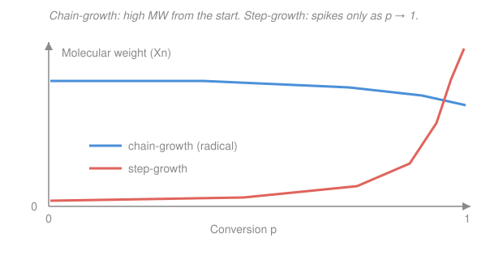

# Polymer & Materials Chemistry · Lesson 1.4: Chain-growth I: radical polymerization

> ⏱ ~15 min · Module 1: Polymerization Mechanisms · Builds on: [1.2 Step-growth polymerization](01-02-step-growth-polymerization.md), [1.3 The Carothers equation](01-03-carothers-equation.md), [physical-chemistry](../../physical-chemistry/syllabus.md) · Unlocks: [1.5 Ionic & coordination polymerization](01-05-ionic-coordination-polymerization.md)

## Why this matters

Roughly half the world's synthetic polymer — polyethylene, PVC, polystyrene, acrylics — is made by a single trick: light a spark of reactive radicals in a vat of vinyl monomer and let each one zipper thousands of monomers onto a growing chain in under a second. This is **chain-growth**, and it behaves nothing like the step-growth of [1.2](01-02-step-growth-polymerization.md): here you get full-length polymer from the very first minute, the average molecular weight barely moves as the reaction proceeds, and the rate famously scales with the *square root* of how much initiator you add. This lesson is where "kinetics" stops being an abstraction and starts predicting a plastic.

## The idea

Step-growth was democratic: every functional group reacted with every other, and long chains only appeared at the bitter end when almost everything had already coupled. Chain-growth is the opposite — **aristocratic**. At any instant only a vanishingly small number of chains are "alive" (they carry a radical, an unpaired electron), and each live chain grows explosively until it dies. A monomer either sits untouched, or it's grabbed by a live chain end and instantly becomes part of a long polymer. There is no oligomer soup in between.

Three things happen, in order, to every chain:

1. **Initiation** — a fragile initiator molecule falls apart into radicals; a radical adds to one monomer and the chain is born.
2. **Propagation** — that radical end adds monomer after monomer, thousands of times, in a heartbeat.
3. **Termination** — two live chains bump into each other and their radicals annihilate; both chains die.

The whole art is bookkeeping the tiny, fleeting population of radicals. Because radicals are *created* one-at-a-time (from initiator) but *destroyed* two-at-a-time (radical meets radical), their concentration settles at a level where birth exactly balances death. That balance — the **steady-state approximation** you met in [physical-chemistry](../../physical-chemistry/syllabus.md) — is what gives radical polymerization its signature half-order rate law.

## The formal version

Let $[M]$ be the monomer concentration (mol/L), $[I]$ the initiator concentration, and $[M^\bullet]$ the total concentration of live (radical-bearing) chains. Each step gets a rate.

**Initiation.** The initiator $\ce{I}$ decomposes into two primary radicals, which then add monomer:

$$\ce{I ->[k_d] 2 R^.} \qquad \ce{R^. + M ->[k_i] RM^.}$$

Decomposition is slow and rate-limiting, so the rate of radical (chain) generation is

$$R_i = 2 f k_d [I].$$

*In words: each initiator that breaks makes two radicals ($k_d$ is the decomposition rate constant, s⁻¹), but only a fraction $f$ — the **efficiency**, typically $0.3$–$0.8$ — actually escape their solvent cage and start chains; the rest recombine uselessly.*

**Propagation.** Every live end adds monomer with the same rate constant $k_p$ regardless of chain length:

$$\ce{M_n^. + M ->[k_p] M_{n+1}^.}, \qquad R_p = k_p [M][M^\bullet].$$

*In words: the rate of monomer consumption is proportional to how much monomer there is and how many live ends are eating it.* This $R_p$ is essentially the overall polymerization rate, since propagation devours far more monomer than initiation.

**Termination.** Two radicals meet and quench each other, by **combination** (the two chains weld into one) or **disproportionation** (one grabs an H from the other, giving one saturated and one unsaturated dead chain):

$$\ce{M_n^. + M_m^. -> M_{n+m}} \quad\text{(combination)}, \qquad \ce{M_n^. + M_m^. -> M_n + M_m} \quad\text{(disproportionation)}$$

$$R_t = 2 k_t [M^\bullet]^2.$$

*In words: termination is bimolecular in radicals — it needs two live ends — so its rate goes as $[M^\bullet]^2$; the factor of 2 counts both radicals lost per event.*

**Steady state.** Radicals are so reactive they never accumulate: within moments, generation balances destruction, $R_i = R_t$. Setting $2fk_d[I] = 2k_t[M^\bullet]^2$ and solving,

$$[M^\bullet] = \left(\frac{R_i}{2k_t}\right)^{1/2} = \left(\frac{f k_d [I]}{k_t}\right)^{1/2}.$$

*In words: the live-radical concentration self-adjusts to the square root of the initiation rate.* Plug this into $R_p$:

$$\boxed{\,R_p = k_p [M]\left(\frac{f k_d [I]}{k_t}\right)^{1/2}\,}$$

*In words: the polymerization rate is first-order in monomer but only **half-order in initiator**.* Double the initiator and the rate rises by just $\sqrt 2 \approx 1.41$ — because you're creating radicals faster, but they also die faster (bimolecularly), so their steady-state count only creeps up as a square root.

**Kinetic chain length.** How many monomers does one radical add before it dies? That's the **kinetic chain length** $\nu$ — the ratio of monomers consumed to chains started:

$$\nu = \frac{R_p}{R_i} = \frac{k_p[M][M^\bullet]}{2k_t[M^\bullet]^2} = \frac{k_p[M]}{2k_t[M^\bullet]} = \frac{k_p[M]}{2\left(f k_d k_t [I]\right)^{1/2}}.$$

*In words: $\nu$ is the average number of monomers per chain — high monomer and low initiator make long chains.* Note $\nu \propto [M]/[I]^{1/2}$: adding initiator makes the reaction **faster but the chains shorter**. The degree of polymerization follows directly — $X_n = 2\nu$ if chains die by combination (two kinetic chains fuse), $X_n = \nu$ if by disproportionation.

**Chain transfer (the Mayo picture).** A growing radical can also snatch an atom — usually H — from another molecule (monomer, solvent, initiator, or a deliberately added **chain-transfer agent**). This *kills the current chain* but hands the radical off to a new species that keeps propagating, so the overall rate barely changes while the molecular weight drops. Mayo captured it as

$$\frac{1}{X_n} = \frac{1}{X_{n,0}} + C_S\frac{[S]}{[M]},$$

*In words: every transfer event caps one chain early, so the reciprocal of chain length picks up a term proportional to how much transfer agent $[S]$ is around relative to monomer* ($C_S = k_{tr}/k_p$ is the transfer constant). A pinch of a good transfer agent (a thiol) lets you dial molecular weight down without slowing the reaction — the standard industrial MW knob.

## Picture

The contrast with [1.2](01-02-step-growth-polymerization.md) is the whole story in one figure. In **chain-growth**, a chain is born, grows to its full length, and dies all within a second, so the pot always holds a mix of *finished long polymer* and *untouched monomer* — the molecular weight is high from ~1% conversion and stays roughly flat; conversion just means "more chains, same length." In **step-growth**, everything is oligomer until the very end, and high MW appears only as $p \to 1$ (the $X_n = 1/(1-p)$ blow-up of [1.3](01-03-carothers-equation.md)).

## Worked examples

**Example 1 (mechanical — rate and radical concentration).** A vinyl monomer polymerizes at fixed temperature with $k_d = 1.0\times10^{-5}\ \mathrm{s^{-1}}$, $f = 0.5$, $k_p = 1.0\times10^{2}\ \mathrm{L\,mol^{-1}s^{-1}}$, $k_t = 1.0\times10^{7}\ \mathrm{L\,mol^{-1}s^{-1}}$, $[I] = 0.010\ \mathrm{mol/L}$, and $[M] = 5.0\ \mathrm{mol/L}$. Find $R_i$, the steady-state $[M^\bullet]$, and $R_p$.

Initiation rate:

$$R_i = 2fk_d[I] = 2(0.5)(1.0\times10^{-5})(0.010) = 1.0\times10^{-7}\ \mathrm{mol\,L^{-1}s^{-1}}.$$

Steady-state radical concentration:

$$[M^\bullet] = \left(\frac{R_i}{2k_t}\right)^{1/2} = \left(\frac{1.0\times10^{-7}}{2\times10^{7}}\right)^{1/2} = \left(5.0\times10^{-15}\right)^{1/2} = 7.1\times10^{-8}\ \mathrm{mol/L}.$$

That tiny number — about one live chain per hundred million monomers — is the point: radical polymerization runs on a whisper of radicals. Now the rate:

$$R_p = k_p[M][M^\bullet] = (1.0\times10^{2})(5.0)(7.1\times10^{-8}) = 3.5\times10^{-5}\ \mathrm{mol\,L^{-1}s^{-1}}.$$

*Check.* Via the boxed formula directly: $R_p = k_p[M](fk_d[I]/k_t)^{1/2} = 100\times5\times(0.5\times10^{-5}\times0.01/10^7)^{1/2} = 500\times7.1\times10^{-8} = 3.5\times10^{-5}$ ✓ — same answer, confirming $[M^\bullet]$ was right.

**Example 2 (kinetic chain length and the initiator trade-off).** For the same system, find $\nu$, then predict what happens to both $R_p$ and $\nu$ if $[I]$ is doubled to $0.020\ \mathrm{mol/L}$.

$$\nu = \frac{R_p}{R_i} = \frac{3.5\times10^{-5}}{1.0\times10^{-7}} = 3.5\times10^{2} \approx 350.$$

So each radical adds about 350 monomers before dying — if termination is pure combination, the dead chains are $X_n = 2\nu \approx 700$ units long. Now double $[I]$. Both $R_p$ and $\nu$ depend on $[I]$ only through a power of one-half, with opposite signs:

$$R_p \propto [I]^{1/2} \;\Rightarrow\; R_p \times \sqrt2 = 3.5\times10^{-5}\times1.41 = 5.0\times10^{-5}\ \mathrm{mol\,L^{-1}s^{-1}},$$

$$\nu \propto [I]^{-1/2} \;\Rightarrow\; \nu / \sqrt2 = 350/1.41 \approx 250.$$

*In words: pouring in more initiator buys you a faster reaction but shorter chains — the central tension of radical polymerization.* You cannot make it both fast and high-MW by cranking initiator; for that you need the living methods of [1.5](01-05-ionic-coordination-polymerization.md).

## Watch out

- **You might think doubling the initiator doubles the rate.** It multiplies it by only $\sqrt 2$. Radicals are born one-at-a-time but die two-at-a-time, so their steady-state population — and thus the rate — rises as $[I]^{1/2}$. That half-order exponent is the fingerprint of a radical mechanism; measuring it is how chemists *prove* the mechanism.
- **You might expect MW to climb with conversion, as it did in step-growth.** It doesn't. Each chain reaches full length in about a second, so at any conversion the flask holds finished long polymer plus leftover monomer. Higher conversion means *more* chains, not longer ones — the MW-vs-conversion curve is roughly flat (see the Picture), the mirror image of the [1.3](01-03-carothers-equation.md) blow-up.
- **You might conflate chain transfer with termination.** Termination destroys radicals and slows the reaction; chain transfer merely *relocates* the radical — it caps one chain but starts another, cutting molecular weight while leaving the rate almost untouched. That decoupling is exactly why transfer agents are the practical MW dial.

## One-liner

> Radicals are born one-by-one and die two-by-two, so the rate rides on $\sqrt{[I]}$ — and because each chain grows to full length in a heartbeat, long polymer exists from the first percent of conversion, molecular weight flat all the way.

## Problems

**P1 (🟢)** A monomer polymerizes with $f = 0.6$, $k_d = 2.0\times10^{-5}\ \mathrm{s^{-1}}$, $[I] = 0.0050\ \mathrm{mol/L}$, $k_p = 2.0\times10^{2}\ \mathrm{L\,mol^{-1}s^{-1}}$, $k_t = 2.0\times10^{7}\ \mathrm{L\,mol^{-1}s^{-1}}$, and $[M] = 4.0\ \mathrm{mol/L}$. Compute the initiation rate $R_i$, the steady-state radical concentration $[M^\bullet]$, and the polymerization rate $R_p$.

**P2 (🟡)** Using your P1 results, find the kinetic chain length $\nu$, and the degree of polymerization $X_n$ assuming termination is 100% by combination. Then: you want to *halve* $\nu$ (make shorter chains) by changing only the initiator loading — by what factor must you change $[I]$, and what does that do to the rate $R_p$?

**P3 (🔴 — MW control, looks ahead to dispersity in [2.1](02-01-molecular-weight-averages-dispersity.md))** With no transfer agent the polymer of P2 has $X_{n,0} = 730$. You add a thiol chain-transfer agent with transfer constant $C_S = k_{tr}/k_p = 15$. Using the Mayo equation $\dfrac{1}{X_n} = \dfrac{1}{X_{n,0}} + C_S\dfrac{[S]}{[M]}$, find the ratio $[S]/[M]$ needed to bring $X_n$ down to $200$. Comment on what happens to the polymerization rate.

Solutions

**P1.** Initiation rate:

$$R_i = 2fk_d[I] = 2(0.6)(2.0\times10^{-5})(0.0050) = 1.2\times10^{-7}\ \mathrm{mol\,L^{-1}s^{-1}}.$$

Steady-state radicals:

$$[M^\bullet] = \left(\frac{R_i}{2k_t}\right)^{1/2} = \left(\frac{1.2\times10^{-7}}{4.0\times10^{7}}\right)^{1/2} = \left(3.0\times10^{-15}\right)^{1/2} = 5.5\times10^{-8}\ \mathrm{mol/L}.$$

Polymerization rate:

$$R_p = k_p[M][M^\bullet] = (2.0\times10^{2})(4.0)(5.5\times10^{-8}) = 4.4\times10^{-5}\ \mathrm{mol\,L^{-1}s^{-1}}.$$

*Check.* $[M^\bullet]\sim10^{-8}$ mol/L, the expected radical-whisper level ✓; units of $R_p$: $(\mathrm{L\,mol^{-1}s^{-1}})(\mathrm{mol/L})(\mathrm{mol/L}) = \mathrm{mol\,L^{-1}s^{-1}}$ ✓.

**P2.** Kinetic chain length:

$$\nu = \frac{R_p}{R_i} = \frac{4.4\times10^{-5}}{1.2\times10^{-7}} \approx 365.$$

Combination fuses two kinetic chains per dead chain, so

$$X_n = 2\nu \approx 730.$$

To halve $\nu$: since $\nu \propto [I]^{-1/2}$, halving $\nu$ requires $[I]^{-1/2}$ to halve, i.e. $[I]^{1/2}$ to double, i.e.

$$[I] \to 4[I] \quad\text{(quadruple the initiator).}$$

The rate scales as $[I]^{1/2}$, so quadrupling $[I]$ multiplies $R_p$ by $\sqrt 4 = 2$: the reaction runs **twice as fast** while the chains come out **half as long**. Same trade-off as Example 2, just read backwards.

**P3.** Rearranging Mayo for $[S]/[M]$:

$$\frac{[S]}{[M]} = \frac{1}{C_S}\left(\frac{1}{X_n} - \frac{1}{X_{n,0}}\right) = \frac{1}{15}\left(\frac{1}{200} - \frac{1}{730}\right).$$

Compute the bracket: $\tfrac{1}{200} = 5.00\times10^{-3}$, $\tfrac{1}{730} = 1.37\times10^{-3}$, difference $= 3.63\times10^{-3}$. Then

$$\frac{[S]}{[M]} = \frac{3.63\times10^{-3}}{15} = 2.4\times10^{-4}.$$

So a thiol present at only ~0.024 mol% of the monomer slashes $X_n$ from 730 to 200. The rate is essentially **unchanged**: transfer relocates the radical rather than destroying it, so $[M^\bullet]$ and hence $R_p$ stay put — you have decoupled molecular weight from rate, which is precisely why transfer agents are the workhorse tool for tuning MW (and, as [2.1](02-01-molecular-weight-averages-dispersity.md) will show, the resulting distribution's dispersity).

## Flashback

**From Lesson 1.3 (the Carothers equation).** A step-growth polyester is made with a slight stoichiometric imbalance, $r = 0.97$, and driven to conversion $p = 0.98$ of the limiting groups. The mean molar mass of a structural unit is $M_0 = 110\ \mathrm{g/mol}$. Find the number-average degree of polymerization $X_n$ and $M_n$ — and contrast the molecular weight with what the radical run of this lesson would give at the same 98% conversion.

Solution

The Carothers equation with stoichiometric imbalance is

$$X_n = \frac{1+r}{1+r-2rp}.$$

Plug in $r = 0.97$, $p = 0.98$: numerator $1+r = 1.97$; denominator $1 + r - 2rp = 1.97 - 2(0.97)(0.98) = 1.97 - 1.9012 = 0.0688$. So

$$X_n = \frac{1.97}{0.0688} \approx 28.6, \qquad M_n = X_n M_0 \approx 28.6 \times 110 \approx 3.1\times10^{3}\ \mathrm{g/mol}.$$

*Check / contrast.* Even at 98% conversion, the stoichiometric imbalance caps step-growth at $X_n \approx 29$ (a modest ~3,000 g/mol oligomer) — high conversion alone is not enough. A radical chain-growth run reaches $X_n$ in the *hundreds to thousands* from the first few percent of conversion, because chains grow to full length instantly rather than assembling from oligomers. Same 98% number, wildly different molecular weight: the mechanism, not the conversion, sets the MW. ✓

## Connections

- **Backward:** this is the chain-growth counterweight to step-growth ([1.2](01-02-step-growth-polymerization.md), [1.3](01-03-carothers-equation.md)) — same goal (long chains) by an opposite route, and the MW-vs-conversion figure only makes sense side-by-side with the $X_n = 1/(1-p)$ blow-up. The steady-state approximation is imported wholesale from reaction kinetics in [physical-chemistry](../../physical-chemistry/syllabus.md).
- **Forward:** [1.5 Ionic & coordination polymerization](01-05-ionic-coordination-polymerization.md) removes the fatal flaw here — that termination is uncontrollable — with *living* chains that don't die, giving control over both MW and stereochemistry. The distribution of chain lengths this kinetics produces is quantified as dispersity in [2.1](02-01-molecular-weight-averages-dispersity.md).
- **Sideways (chemical kinetics):** the half-order rate law is a textbook consequence of a bimolecular termination step feeding a steady state — the same steady-state and rate-determining-step reasoning used for enzyme kinetics and atmospheric radical chains in general chemical kinetics. Measuring the exponent on $[I]$ is a classic way to diagnose a reaction mechanism.
