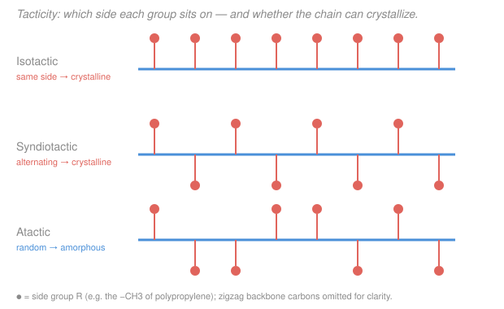

# Polymer & Materials Chemistry · Lesson 1.5: Chain-growth II — ionic & coordination polymerization

> ⏱ ~15 min · Module 1: Polymerization Mechanisms · Builds on: [1.4 Chain-growth I: radical](01-04-radical-polymerization.md) · Unlocks: [1.6 Copolymers & reactivity ratios](01-06-copolymers-reactivity-ratios.md), [2.1 MW averages & dispersity](02-01-molecular-weight-averages-dispersity.md)

## Why this matters

Radical polymerization is robust and cheap, but it hands you almost no control: chains start and die at random, so you get a broad spread of lengths and no say over the 3-D arrangement of side groups. If you want chains of *one* precise length, block copolymers stitched from two monomers, or a plastic that crystallizes because every side group points the same way, you need a mechanism where the active center lives long and behaves predictably. That is the whole game of ionic and coordination polymerization — and it is why polypropylene is a useful material at all.

## The idea

Swap the radical for a charged or metal-bound active center and everything changes.

**Anionic (living):** initiate every chain at essentially the same instant with a strong base (like *sec*-butyllithium), then let them all grow off a carbanion end. Two anions can't couple or disproportionate — like charges repel — so **there is no built-in death step**. Every chain grows for the same time from the same start, so they all reach nearly the same length. Cut off monomer and the chain ends stay "alive," waiting; add a *different* monomer and each chain keeps growing as a second block. This is how you build a polystyrene-*block*-polybutadiene chain to order.

**Cationic:** the carbocation active center is the opposite personality — reactive and twitchy. It readily hands a proton back to monomer or solvent (chain transfer), so chains keep dying and restarting. You get chain growth, but broad, hard-to-control molecular weights. It's the go-to for electron-rich monomers like isobutylene that radicals and anions can't touch.

**Coordination (Ziegler–Natta / metallocene):** grow the chain at a metal center (Ti, Zr...) where the monomer must dock at a specific site before it inserts. That docking geometry *forces* each new unit into the same orientation — so the side groups line up regularly along the backbone. That regularity, called **tacticity**, is what lets the chain fold into a crystal.

## The formal version

**Living polymerization.** A chain-growth polymerization with fast, complete initiation and no termination or chain transfer. All chains start together and grow at the same average rate, so at full monomer conversion

$$X_n = \frac{[M]_0}{[I]_0},$$

where $[M]_0$ is the initial monomer concentration, $[I]_0$ the initiator concentration, and $X_n$ the number-average degree of polymerization.

In words: every initiator molecule becomes exactly one chain, and all the monomer is shared out evenly among them — so length is just monomers-per-chain.

**Why the dispersity is near 1.** Because all chains grow for the same time by random monomer additions, their lengths follow a **Poisson distribution**, giving

$$Đ = \frac{M_w}{M_n} = 1 + \frac{X_n}{(X_n+1)^2} \approx 1 + \frac{1}{X_n}.$$

In words: the relative spread shrinks as chains get longer — a living polymer of $X_n = 500$ has $Đ \approx 1.002$, essentially monodisperse, versus $Đ \approx 1.5$–$2$ for radical chains. (We build the $M_n$/$M_w$/$Đ$ machinery properly in [2.1](02-01-molecular-weight-averages-dispersity.md).)

**The active-center step.** For an anionic (carbanion) center, propagation adds monomer to a living chain end:

$$\ce{R-CH2-CHX^- + CH2=CHX -> R-CH2-CHX-CH2-CHX^-}$$

For a cationic (carbocation) center it is the mirror image, $\ce{R-CH2-CHX^+ + CH2=CHX -> R-CH2-CHX-CH2-CHX^+}$ — but this cation is also prone to chain transfer, e.g. losing a proton to monomer, which kills that chain and starts a new one (capping $X_n$).

**Tacticity.** The relative configuration of the substituent-bearing (stereogenic) backbone carbons:

- **Isotactic** — every side group on the same side.
- **Syndiotactic** — side groups strictly alternate.
- **Atactic** — random placement.

In words: tacticity is *not* about which atoms are bonded (all three are the same polymer) but about their 3-D handedness repeating down the chain. Radical propagation has no stereocontrol, so it gives atactic chains; a coordination catalyst's fixed insertion geometry gives isotactic (Ziegler–Natta) or syndiotactic (certain metallocenes) chains.

## Picture

A **regular** backbone (isotactic or syndiotactic) is like a row of identical LEGO bricks: neighboring chains register and stack into a crystal lattice. An **atactic** backbone is like bricks with studs at random positions — no two chains fit, so it can only ever be an amorphous tangle. This is the direct handoff to [3.2 Crystallinity & melting](03-02-crystallinity-melting.md): stereoregularity is the *precondition* for a polymer to crystallize at all.

## Worked examples

**Example 1 (living anionic — target a length, predict the spread).**
You want polystyrene by living anionic polymerization. You charge $0.10\ \mathrm{mol}$ styrene ($M_0 = 104\ \mathrm{g/mol}$) and $2.0\times10^{-4}\ \mathrm{mol}$ of *sec*-BuLi initiator, and drive to full conversion.

*Degree of polymerization.* Each initiator makes one chain, monomer is shared evenly:

$$X_n = \frac{[M]_0}{[I]_0} = \frac{0.10}{2.0\times10^{-4}} = 500.$$

*Molecular weight.* $M_n = X_n \, M_0 = 500 \times 104 = 5.2\times10^{4}\ \mathrm{g/mol}.$

*Dispersity.* Poisson statistics give

$$Đ \approx 1 + \frac{1}{X_n} = 1 + \frac{1}{500} = 1.002.$$

Nearly monodisperse — because all 500-mer chains started together and grew for the same time, there is no mechanism to spread the lengths. *And* the ends are still living: inject butadiene now and every chain grows a polybutadiene block, giving a clean polystyrene-*b*-polybutadiene copolymer. That single fact — no termination — is what radical polymerization can never offer.

**Example 2 (tacticity governs crystallization — isotactic vs. atactic PP).**
Two polypropylene samples, same molar mass, same $\ce{-CH2-CH(CH3)-}$ repeat unit. Sample A (made with a Ziegler–Natta catalyst) is isotactic; sample B (made by a route with no stereocontrol) is atactic. Which is a useful crystalline plastic?

*Reasoning.* Crystallization requires chains to fold and pack side-by-side into a periodic lattice — that demands a **regular, repeating geometry** along each chain. In isotactic PP every methyl points the same way, so the chain coils into a uniform $3_1$ helix; identical helices stack neatly and crystallize (real isotactic PP is ~60–70% crystalline, $T_m \approx 165\,^\circ\text{C}$). In atactic PP the methyls sit on random sides, so no two chain segments have matching geometry — they cannot register into a lattice.

*Verdict.* Sample A (isotactic) crystallizes and is a stiff, load-bearing plastic; sample B (atactic) stays amorphous — a soft, tacky material used more as a sealant additive than a structural plastic. **Same chemical formula, opposite materials — the difference is purely stereoregularity.**

## Watch out

- **You might think "living" means the chains never stop reacting forever.** Actually it means there is no *inherent* termination step during polymerization — the chain ends stay reactive until *you* deliberately quench them (e.g. with methanol). "Living" is about the absence of self-death, not immortality.
- **You might think more initiator makes bigger chains.** It's the reverse: $X_n = [M]_0/[I]_0$, so *more* initiator splits the same monomer among *more* chains, giving *shorter* ones. (Contrast the radical case in the Flashback, where more initiator both shortens chains *and* speeds the rate.)
- **You might think isotactic and atactic PP are different compounds.** They're the same repeat unit and formula — the only difference is the 3-D configuration pattern of the side groups, and that alone flips it between a crystalline plastic and an amorphous goo.

## One-liner

> Kill the termination step and you control length (living anionic → $Đ\to1$, block copolymers); control the insertion geometry and you control tacticity (coordination → stereoregular, crystallizable) — regularity is the currency of both.

## Problems

**P1 (🟢)** You want poly(methyl methacrylate) with $M_n = 25{,}000\ \mathrm{g/mol}$ by living anionic polymerization ($M_0 = 100\ \mathrm{g/mol}$ for the MMA repeat unit). (a) What monomer-to-initiator ratio $[M]_0/[I]_0$ should you charge? (b) Estimate the dispersity $Đ$ you expect.

**P2 (🟡)** A colleague runs a radical polymerization of propylene and gets a soft, tacky, non-crystalline product; they want a stiff crystalline plastic instead. Which mechanism should they switch to, and *why* does the radical route fail to give a crystallizable polymer? Name the property that must change and link it to whether the chains can pack. (This is the setup for [3.2 Crystallinity & melting](03-02-crystallinity-melting.md).)

**P3 (🔴, optional)** In the cationic polymerization of isobutylene, chain length is limited by chain transfer to monomer, with transfer constant $C_{tr} = k_{tr}/k_p = 2.0\times10^{-3}$. When transfer dominates, the Mayo relation reduces to $1/X_n \approx C_{tr}$. (a) Estimate $X_n$. (b) The reaction is run at $-100\,^\circ\text{C}$ rather than room temperature; molecular weight rises sharply on cooling. Explain why, in terms of the activation energies of transfer vs. propagation.

Solutions

**P1** (a) In a living polymerization $X_n = M_n/M_0 = 25{,}000/100 = 250$, and $X_n = [M]_0/[I]_0$, so charge a ratio of **250** (e.g. 250 mmol monomer per 1 mmol initiator). (b) Poisson statistics give $Đ \approx 1 + 1/X_n = 1 + 1/250 = 1.004$ — essentially monodisperse. (The exact form $1 + X_n/(X_n+1)^2$ gives $1.00397$, the same to three figures.)

**P2** Switch to **coordination polymerization** (Ziegler–Natta or a stereospecific metallocene catalyst). The radical route fails because a free-radical chain end has no fixed geometry when it adds each monomer, so the methyl groups end up on random sides — the chain is **atactic**. The property that must change is **tacticity/stereoregularity**: only a regular (isotactic or syndiotactic) backbone has the repeating geometry needed for chains to register and pack into a crystal lattice. A coordination catalyst forces each monomer to insert in the same orientation, giving isotactic PP that crystallizes into a stiff plastic ($T_m \approx 165\,^\circ\text{C}$). Atactic chains, with random side-group placement, can never pack — they stay amorphous.

**P3** (a) With transfer dominating, $X_n \approx 1/C_{tr} = 1/(2.0\times10^{-3}) = 500$. (b) $X_n$ is set by the competition propagation-vs-transfer, roughly $X_n \sim k_p/k_{tr}$, and each rate constant follows Arrhenius, $k = A e^{-E_a/RT}$. So $X_n \propto \exp\!\big[-(E_{p} - E_{tr})/RT\big]$. Chain transfer has a *higher* activation energy than propagation ($E_{tr} > E_{p}$), so the exponent $-(E_p - E_{tr})/RT = (E_{tr}-E_p)/RT$ is positive and grows as $T$ falls: cooling suppresses transfer far more than it suppresses propagation, so chains grow longer before dying. This is exactly why industrial cationic isobutylene polymerization (butyl rubber) is run at very low temperature.

## Flashback

**From Lesson 1.4 (Chain-growth I: radical):** A steady-state radical polymerization runs at rate $R_p = 5.0\times10^{-4}\ \mathrm{mol\,L^{-1}s^{-1}}$ with kinetic chain length $\nu$. You now increase the initiator concentration $[I]$ by a factor of **9**, holding everything else fixed. (a) What is the new $R_p$? (b) By what factor does $\nu$ change? (c) In one sentence, what does this tradeoff cost you?

Solution

Recall the radical results $R_p \propto [I]^{1/2}$ and kinetic chain length $\nu = R_p/R_i \propto [M]/[I]^{1/2}$, i.e. $\nu \propto [I]^{-1/2}$.

(a) $R_p \propto [I]^{1/2}$, so a $9\times$ increase in $[I]$ multiplies $R_p$ by $\sqrt{9} = 3$: new $R_p = 3 \times 5.0\times10^{-4} = 1.5\times10^{-3}\ \mathrm{mol\,L^{-1}s^{-1}}$.

(b) $\nu \propto [I]^{-1/2}$, so $\nu$ changes by $9^{-1/2} = 1/3$ — the chains get **three times shorter**.

(c) Cranking up initiator buys you speed but at the price of molecular weight — you go faster and get shorter chains simultaneously, and you can't decouple the two. That inability to separate rate from length is exactly the limitation living polymerization (this lesson) removes: there, $X_n = [M]_0/[I]_0$ is set independently and the spread stays near-monodisperse.

## Connections

- **Backward:** This is the controlled cousin of [1.4 radical polymerization](01-04-radical-polymerization.md) — same chain-growth skeleton (initiation → propagation), but killing the termination/transfer steps is what buys control over length and stereochemistry.
- **Forward:** Living kinetics give the narrow, near-Poisson distributions we quantify in [2.1 MW averages & dispersity](02-01-molecular-weight-averages-dispersity.md), and tacticity is the gate to [3.2 Crystallinity & melting](03-02-crystallinity-melting.md) — no stereoregularity, no crystal. Block copolymers made this way also set up the microphase self-assembly in [4.4](04-04-self-assembly-functional-polymers.md).
- **Sideways:** The stereocontrol here is the same idea as asymmetric catalysis in organic chemistry — a chiral metal site dictating the configuration of each new stereocenter (see [organic-chemistry](../../organic-chemistry/syllabus.md)); and the Arrhenius competition in P3 is the same activation-energy reasoning used throughout physical chemistry ([physical-chemistry](../../physical-chemistry/syllabus.md)).
