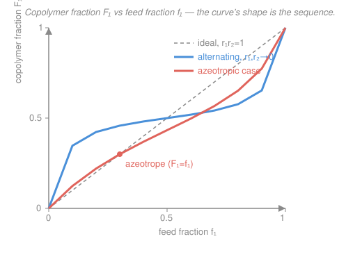

# Polymer & Materials Chemistry · Lesson 1.6: Copolymers & reactivity ratios

> ⏱ ~15 min · Module 1: Polymerization Mechanisms · Builds on: [1.4 Chain-growth I: radical](01-04-radical-polymerization.md), [1.5 Chain-growth II: ionic & coordination](01-05-ionic-coordination-polymerization.md) · Unlocks: Module 2, and block copolymers in [4.4 Self-assembly & functional polymers](04-04-self-assembly-functional-polymers.md)

## Why this matters

Almost every commercial "plastic" is really a **copolymer** — two (or more) monomers strung into one chain — because that's how you dial properties continuously: ABS, SBR rubber, acrylic paints, nitrile gloves. But two monomers in the pot almost never end up in the chain at the same ratio you fed them, and *how* they alternate along the backbone changes everything from toughness to whether the material microphase-separates. This lesson gives you the two numbers that predict both the composition and the sequence from a single kinetics idea.

## The idea

Picture a growing chain with a reactive end. That end is one of two kinds: it ends in monomer **1** or in monomer **2**. Each kind faces the same choice at every step — grab another 1, or grab a 2. So there are really only two questions that matter: *when the tip is a 1, does it prefer 1 or 2?* and *when the tip is a 2, does it prefer 1 or 2?*

Bottle each preference into a single ratio. A radical ending in monomer 1 adds its own kind at rate constant $k_{11}$ and the other kind at $k_{12}$; the ratio $r_1 = k_{11}/k_{12}$ says "how much do I prefer my own kind over yours." Same for the 2-ended chain: $r_2 = k_{22}/k_{21}$. That's it — two numbers, the **reactivity ratios**, and the entire sequence story falls out of them:

- Both close to **0**: each end *hates* its own kind and grabs the other → strict **alternating** (…1212121…).
- Both close to **1**: each end has no preference → **random / ideal** (feed ratio ≈ chain ratio).
- Both **greater than 1**: each end prefers its own kind → **blocky** runs of like monomers.

The feed you start with rarely equals the chain you get, because the more reactive monomer gets eaten first — which is why composition **drifts** as the batch runs.

## The formal version

Write the four propagation steps ($\sim\!M_i^{\bullet}$ is a chain whose reactive tip is monomer $i$; the incoming monomer is $M_1$ or $M_2$):

$$\sim\!M_1^{\bullet} + M_1 \xrightarrow{k_{11}} \sim\!M_1^{\bullet}\qquad \sim\!M_1^{\bullet} + M_2 \xrightarrow{k_{12}} \sim\!M_2^{\bullet}$$
$$\sim\!M_2^{\bullet} + M_2 \xrightarrow{k_{22}} \sim\!M_2^{\bullet}\qquad \sim\!M_2^{\bullet} + M_1 \xrightarrow{k_{21}} \sim\!M_1^{\bullet}$$

**Reactivity ratios.**

$$r_1 = \frac{k_{11}}{k_{12}}, \qquad r_2 = \frac{k_{22}}{k_{21}}.$$

In words: $r_1$ is how fast a 1-ended chain adds *another 1* versus adding a *2*; $r_2$ is the mirror for a 2-ended chain. Both are pure numbers, set by chemistry, temperature-mild.

**The copolymer (Mayo–Lewis) equation.** Let $f_1$ = mole fraction of monomer 1 in the *feed* (unreacted pool), $f_2 = 1 - f_1$; and $F_1$ = mole fraction of 1 in the copolymer being made *right now* (the instantaneous composition). Applying a steady state to the two chain-end types gives

$$F_1 = \frac{r_1 f_1^2 + f_1 f_2}{r_1 f_1^2 + 2 f_1 f_2 + r_2 f_2^2}.$$

In words: given the feed and the two ratios, this is the fraction of monomer 1 that lands in the chain at this instant. (It's "instantaneous" because as monomers deplete, $f_1$ moves and so does $F_1$.)

**Classification by the product $r_1 r_2$.** This single product captures the sequence tendency:

| $r_1 r_2$ | Behavior | Sequence |
|---|---|---|
| $\to 0$ ($r_1, r_2 \to 0$) | perfectly alternating | …121212… |
| $= 1$ (ideal) | random, no crossing of the diagonal | statistically random |
| $>1$ ($r_1, r_2 > 1$) | blocky | long like-runs; $\to$ two homopolymers as it grows |

In words: $r_1 r_2$ near 0 means alternation, near 1 means randomness, well above 1 means the two monomers segregate into blocks.

**Azeotropic composition.** If the $F_1$-vs-$f_1$ curve crosses the diagonal $F_1 = f_1$, at that feed the chain composition equals the feed composition — so it *doesn't drift*. Setting $F_1 = f_1$ and solving:

$$f_1^{\text{az}} = \frac{1 - r_2}{2 - r_1 - r_2}.$$

In words: run the reaction at this feed and the copolymer comes out at the same ratio you fed, holding steady the whole way. It exists as a real fraction only when $r_1, r_2$ are *both* $<1$ or *both* $>1$ (numerator and denominator same sign, quotient in $(0,1)$).

## Picture

The dashed diagonal is $F_1 = f_1$ (ideal $r_1 r_2 = 1$ with $r_1 = r_2 = 1$: chain mirrors feed). The blue curve ($r_1 = r_2 = 0.1$) is squeezed toward the horizontal $F_1 = 0.5$ band — alternation refuses to let either monomer dominate. The coral curve ($r_1 = 0.3, r_2 = 0.7$) *crosses* the diagonal at the marked point: that crossing is the azeotrope, the one feed that won't drift.

## Worked examples

**Example 1 (mechanical — plug into Mayo–Lewis, and see the ideal shortcut).** A monomer pair has $r_1 = 2.0$, $r_2 = 0.5$, fed at $f_1 = 0.40$ (so $f_2 = 0.60$). Find the instantaneous copolymer composition $F_1$.

Numerator: $r_1 f_1^2 + f_1 f_2 = 2.0(0.40)^2 + (0.40)(0.60) = 0.320 + 0.240 = 0.560$.

Denominator: $r_1 f_1^2 + 2 f_1 f_2 + r_2 f_2^2 = 0.320 + 2(0.240) + 0.5(0.60)^2 = 0.320 + 0.480 + 0.180 = 0.980$.

$$F_1 = \frac{0.560}{0.980} = 0.571.$$

Sanity check via the product: $r_1 r_2 = 2.0 \times 0.5 = 1.0$ exactly — this is an **ideal** system, so the equation collapses to $F_1 = \dfrac{r_1 f_1}{r_1 f_1 + f_2} = \dfrac{2.0(0.40)}{2.0(0.40) + 0.60} = \dfrac{0.80}{1.40} = 0.571$. ✓ Same answer, fewer terms — and because $r_1 > 1$, the more-reactive monomer 1 is enriched in the chain (0.571 > 0.400).

**Example 2 (classify, then find the azeotrope).** Styrene (1) and methyl methacrylate (2) copolymerize with $r_1 = 0.52$, $r_2 = 0.46$. (a) What sequence do you expect? (b) Is there an azeotrope, and where?

(a) Product: $r_1 r_2 = 0.52 \times 0.46 = 0.24$. Below 1 and both ratios $<1$, so each end mildly prefers the *other* monomer — a **random copolymer with a slight alternating tendency** (not strictly alternating, since neither ratio is near 0).

(b) Both $<1$, so an azeotrope exists:

$$f_1^{\text{az}} = \frac{1 - r_2}{2 - r_1 - r_2} = \frac{1 - 0.46}{2 - 0.52 - 0.46} = \frac{0.54}{1.02} = 0.529.$$

Feed styrene at mole fraction 0.529 and the copolymer comes out at 52.9% styrene and *stays there* as the batch converts — no drift, no compositional gradient across chains. Verify it's a fixed point by plugging $f_1 = 0.529$ back into Mayo–Lewis: numerator $= 0.52(0.529)^2 + (0.529)(0.471) = 0.1455 + 0.2492 = 0.3947$; denominator $= 0.1455 + 2(0.2492) + 0.46(0.471)^2 = 0.1455 + 0.4983 + 0.1021 = 0.7459$; $F_1 = 0.3947/0.7459 = 0.529 = f_1$. ✓

## Watch out

- You might think "feed ratio = chain ratio." Only at $r_1 r_2 = 1$ *and* $r_1 = r_2 = 1$ (or exactly at an azeotrope) does the chain mirror the feed. Otherwise the more reactive monomer is enriched early and the chain composition **drifts** as it depletes — batch copolymers are compositionally heterogeneous unless you feed-control.
- You might think small $r$ values mean "slow." $r_1$ is a *ratio* of two propagation constants, not a rate — $r_1 \to 0$ means the 1-ended chain strongly prefers monomer 2, which makes the reaction alternate, not stall.
- You might think an azeotrope always exists. It only exists when $r_1, r_2$ lie on the *same* side of 1. If one is $<1$ and the other $>1$, the curve never crosses the diagonal and there is no drift-free feed.

## One-liner

> Two ratios, $r_1$ and $r_2$, decide it all: their **product** sets the sequence (0 alternating, 1 random, $>1$ blocky), and Mayo–Lewis turns them plus the feed into the chain — equal only at the azeotrope.

## Problems

**P1 (🟢)** A monomer pair has $r_1 = 0.10$, $r_2 = 0.05$. (a) From $r_1 r_2$, classify the sequence. (b) At feed $f_1 = 0.50$, compute $F_1$ from the Mayo–Lewis equation and comment on why it's so close to 0.5.

**P2 (🟡)** Vinyl acetate (1) and styrene (2) have $r_1 = 0.02$, $r_2 = 55$. (a) What does the huge asymmetry predict about the product and the sequence early in the batch? (b) Does an azeotrope exist? Justify from the sign condition. (c) In one sentence, what happens to the copolymer composition as conversion proceeds?

**P3 (🔴, optional — bridge to 4.4)** You want a **block** copolymer of styrene and isoprene (the SBS rubber of shoe soles), where the two blocks later microphase-separate into ordered domains. Explain why you would *not* try to make it by feeding both monomers together into a radical polymerization, and name the mechanism from [1.5](01-05-ionic-coordination-polymerization.md) that does produce true blocks — connecting to why block architecture is required for the self-assembly in [4.4](04-04-self-assembly-functional-polymers.md).

Solutions

**P1** (a) $r_1 r_2 = 0.10 \times 0.05 = 0.005$, very near 0 with both ratios small → strongly **alternating**.

(b) $f_1 = f_2 = 0.50$. Numerator $= r_1 f_1^2 + f_1 f_2 = 0.10(0.25) + 0.25 = 0.025 + 0.250 = 0.275$. Denominator $= 0.025 + 2(0.25) + 0.05(0.25) = 0.025 + 0.500 + 0.0125 = 0.5375$. So

$$F_1 = \frac{0.275}{0.5375} = 0.512.$$

Essentially 0.5: with both ends preferring the *opposite* monomer, the chain is forced toward strict alternation, which pins the composition near 50:50 almost regardless of feed (the blue curve in the Picture, flattened into the mid-band). The tiny excess over 0.5 comes from $r_1 > r_2$ (monomer 1 slightly less self-avoiding).

**P2** (a) $r_1 r_2 = 0.02 \times 55 = 1.1$, near 1 numerically — but that lumps together two wildly different ends, so the "random" label is misleading. Read the ratios directly: a styrene-ended radical ($r_2 = 55$) overwhelmingly adds *more styrene*; a vinyl-acetate-ended radical ($r_1 = 0.02$) also prefers styrene. **Both ends want styrene**, so early on the chain is nearly all styrene — styrene is consumed almost to exclusion first. (This is the classic reason vinyl acetate and styrene "don't copolymerize well.")

(b) Azeotrope requires $r_1, r_2$ on the same side of 1. Here $r_1 = 0.02 < 1$ but $r_2 = 55 > 1$ — opposite sides — so **no azeotrope**. Check the formula: $f_1^{\text{az}} = (1 - 55)/(2 - 0.02 - 55) = (-54)/(-53.02) = 1.02$, outside $[0,1]$, confirming none exists.

(c) Styrene is devoured first, so as conversion proceeds the feed becomes vinyl-acetate-rich and later chains are made vinyl-acetate-heavy — extreme **composition drift**, giving a compositionally heterogeneous product (early chains styrene-rich, late chains acetate-rich).

**P3** In a radical copolymerization both chain ends are present simultaneously and each growing chain adds *whatever monomer its reactivity ratios favor at that instant* — you get a statistical (random/alternating/tapered) copolymer, never two long clean blocks, because a radical end can't be told "add only styrene now, only isoprene later." True blocks require a **living** mechanism — living anionic polymerization from [1.5](01-05-ionic-coordination-polymerization.md): polymerize all the styrene to completion (the chain ends stay active, no termination), then add isoprene, which grows off the same living ends as a second block. Only that clean A-block-then-B-block architecture gives the two chemically distinct, covalently joined blocks that microphase-separate into ordered nanodomains in [4.4](04-04-self-assembly-functional-polymers.md) — a random copolymer of the same monomers just makes one homogeneous phase.

## Flashback

**From Lesson 1.5 (Ionic & coordination polymerization):** In a living anionic polymerization there is no termination, so every initiator molecule grows exactly one chain and $X_n = \dfrac{\text{moles of monomer consumed}}{\text{moles of initiator}}$. You charge 0.50 mol of styrene ($M_0 = 104\ \mathrm{g/mol}$) with 2.0 mmol of *sec*-butyllithium initiator and drive to full conversion. Find the number-average degree of polymerization $X_n$ and $M_n$, and state (in a word) what you expect for the dispersity Đ and why.

Solution

Every initiator makes one chain, all monomer is consumed, so

$$X_n = \frac{0.50\ \text{mol}}{2.0\times 10^{-3}\ \text{mol}} = 250.$$

$$M_n = X_n \times M_0 = 250 \times 104 = 2.6\times 10^{4}\ \mathrm{g/mol} = 26{,}000\ \mathrm{g/mol}.$$

Dispersity: **near 1** (Poisson-narrow, Đ $\approx 1.0$–1.05). Because all chains start at essentially the same time (fast initiation) and none terminate, they all grow for the same duration and end up nearly the same length — the hallmark of living polymerization, in sharp contrast to the broad most-probable distribution of a terminating radical process.

## Connections

- **Backward:** this is the same steady-state-on-active-ends bookkeeping you used for kinetic chain length in [1.4](01-04-radical-polymerization.md) — but now applied to *which* monomer adds rather than *how many*, and the "living, no termination" control from [1.5](01-05-ionic-coordination-polymerization.md) is exactly what upgrades a statistical copolymer into a block copolymer.
- **Forward:** composition drift means a real copolymer sample is a *distribution* over composition as well as chain length — the mindset [2.1 Molecular-weight averages & dispersity](02-01-molecular-weight-averages-dispersity.md) formalizes, and block architecture is the raw material for microphase self-assembly in [4.4](04-04-self-assembly-functional-polymers.md).
- **Sideways (chemistry):** the reactivity ratios are ratios of rate constants governed by radical stability and steric/polar effects — the same structure–reactivity reasoning taught in [organic chemistry](../../organic-chemistry/syllabus.md), here quantified into two design numbers.
