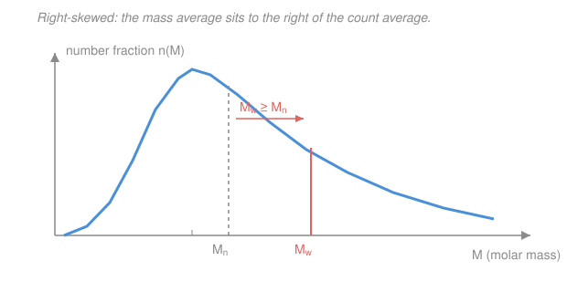

# Polymer & Materials Chemistry · Lesson 2.1: Molecular-weight averages & dispersity

> ⏱ ~15 min · Module 2: Molecular Weight & Chain Statistics · Builds on: [1.3 The Carothers equation](01-03-carothers-equation.md), [1.5 Ionic & coordination polymerization](01-05-ionic-coordination-polymerization.md) · Unlocks: [2.2 Measuring molecular weight](02-02-measuring-molecular-weight.md)

## Why this matters

A small molecule has *a* molar mass; a polymer sample never does. Because chains grow by chance — a radical adds one more monomer or terminates, a step-growth coupling happens or doesn't — every batch is a *mixture* of chain lengths, a whole distribution. So there is no single "the molecular weight." Instead we report **averages**, and the surprise is that two different, equally honest averages of the same sample can differ by a factor of three. Their ratio, the **dispersity**, is one of the most diagnostic numbers in polymer science: it tells you at a glance whether the chemistry was a controlled living polymerization or a messy free-for-all, and it controls whether the material is brittle or tough.

## The idea

Imagine a room with 10 people who each carry 10 dollars and 1 person carrying 1,000 dollars. Ask "what's the average wealth *per person*?" and you get $(10\times 10 + 1000)/11 \approx 100$ dollars — you counted heads. Now ask "if I grab a *dollar* at random, whose pocket did it come from?" Almost certainly the rich person's, because they hold most of the money. Same room, two averages, wildly different answers — because one weights by *how many people*, the other by *how much money each controls*.

Polymers work identically with mass playing the role of money. The **number-average** $M_n$ counts molecules: throw a dart at a random *chain* and ask its mass. The **weight-average** $M_w$ weights by mass: throw a dart at a random *gram of material* and ask what chain it belongs to. Because the big chains hoard the mass, the mass-dart lands on them far more often — so $M_w$ is always pulled *up* toward the heavy end, and $M_w \ge M_n$ with no exceptions. How far apart they sit is exactly how spread-out the distribution is.

## The formal version

Let the sample contain $N_i$ chains (a count, or moles) of molar mass $M_i$ (g/mol), for each distinct length $i$.

**Number-average molar mass.**

$$M_n = \frac{\sum_i N_i M_i}{\sum_i N_i}.$$

*In words: total mass divided by total number of chains — the mass of an average-picked molecule.* This is the ordinary mean weighted by how many chains there are.

**Weight-average molar mass.**

$$M_w = \frac{\sum_i N_i M_i^2}{\sum_i N_i M_i}.$$

*In words: weight each chain by its own mass before averaging — the mass of the chain owning an average-picked gram.* The extra factor of $M_i$ in the numerator (versus $M_n$) is the mass-weighting; it is what tilts the average toward heavy chains. Equivalently, defining the **weight fraction** $w_i = N_i M_i / \sum_j N_j M_j$ (the fraction of total mass in chains of length $i$),

$$M_w = \sum_i w_i M_i, \qquad \frac{1}{M_n} = \sum_i \frac{w_i}{M_i}.$$

**Dispersity.**

$$Đ = \frac{M_w}{M_n} \ge 1.$$

*In words: the ratio of the two averages measures the breadth of the distribution; $Đ = 1$ means every chain is identical (monodisperse).* (Older texts call this the polydispersity index, PDI.)

**Why $M_w \ge M_n$ — the moment view.** Both averages are ratios of *moments* of the number distribution. Writing $\langle M^k \rangle = \sum_i N_i M_i^k / \sum_i N_i$ for the $k$-th moment,

$$M_n = \frac{\langle M \rangle}{\langle 1 \rangle} = \langle M \rangle, \qquad M_w = \frac{\langle M^2 \rangle}{\langle M \rangle}, \qquad Đ = \frac{\langle M^2 \rangle}{\langle M \rangle^2} = 1 + \frac{\sigma^2}{M_n^2}.$$

*In words: dispersity equals one plus the variance-to-mean-squared ratio of the chain-mass distribution.* Since a variance $\sigma^2 = \langle M^2\rangle - \langle M\rangle^2$ can never be negative, $Đ \ge 1$ always, and it equals 1 only when the variance is zero — a single chain length. Đ is literally the normalized width of the distribution.

**The most-probable (Flory / Schulz) distribution.** Step-growth polymerization ([1.3](01-03-carothers-equation.md)) makes a chain of $x$ units whenever $x-1$ linkages formed and the next did not, giving the number fraction $n_x = (1-p)\,p^{x-1}$ at conversion $p$. Carothers already gave us $M_n$ through $X_n = 1/(1-p)$; the same distribution yields $X_w = (1+p)/(1-p)$, so

$$Đ = \frac{X_w}{X_n} = 1 + p \xrightarrow{\;p \to 1\;} 2.$$

*In words: any polymer made by ideal step-growth to near-full conversion has $Đ \approx 2$ — a universal fingerprint.* Contrast a living polymerization ([1.5](01-05-ionic-coordination-polymerization.md)), where every chain starts together and grows at the same rate: the lengths cluster tightly (a Poisson distribution) and $Đ \to 1$.

## Picture

## Worked examples

**Example 1 (equimolar mixture — the mass-weighting reveal).** A sample is an *equimolar* blend of two chain populations: $M_1 = 10{,}000$ and $M_2 = 100{,}000$ g/mol, with equal counts $N_1 = N_2 = N$.

Number-average — just count chains:

$$M_n = \frac{N(10{,}000) + N(100{,}000)}{2N} = \frac{110{,}000}{2} = 55{,}000 \ \text{g/mol}.$$

Weight-average — insert the extra $M_i$:

$$M_w = \frac{N(10{,}000)^2 + N(100{,}000)^2}{N(10{,}000) + N(100{,}000)} = \frac{1.0\times10^8 + 1.0\times10^{10}}{1.1\times10^5} = \frac{1.01\times10^{10}}{1.1\times10^5} \approx 91{,}800 \ \text{g/mol}.$$

$$Đ = \frac{91{,}800}{55{,}000} \approx 1.67.$$

Notice: equal numbers of each chain, yet $M_w$ has been dragged almost to the heavy end (92k, not the naive midpoint 55k). Half the *molecules* are short, but 91% of the *mass* lives in the long chains — and $M_w$ feels the mass.

**Example 2 (same masses, equal *weight* — what each average "feels").** Now blend the *same two masses* but in equal **weight** fractions: $w_1 = w_2 = \tfrac12$. (Equal grams of 10k and 100k material.) Since $M_w$ is the weight-fraction average of $M$:

$$M_w = w_1 M_1 + w_2 M_2 = \tfrac12(10{,}000) + \tfrac12(100{,}000) = 55{,}000 \ \text{g/mol},$$

$$\frac{1}{M_n} = \frac{w_1}{M_1} + \frac{w_2}{M_2} = \frac{0.5}{10{,}000} + \frac{0.5}{100{,}000} = 5.5\times10^{-5} \ \Rightarrow\ M_n \approx 18{,}200 \ \text{g/mol},$$

$$Đ = \frac{55{,}000}{18{,}200} \approx 3.0.$$

Look at what flipped. With equal *mass* in each population, there must be **ten times as many** short chains as long ones (a gram of 10k material is ten times as many molecules as a gram of 100k). So now the *count* is dominated by the light end, and $M_n$ collapses to 18k — while $M_w$, feeling only the equal masses, sits at the symmetric midpoint 55k. This is the whole intuition in one comparison: **$M_n$ feels the crowd of small molecules; $M_w$ feels where the mass lives.** Same two species, and shifting from equal-count to equal-mass nearly *doubled* the dispersity.

## Watch out

- **You might think $M_n$ and $M_w$ are just "two ways to round the same number."** They are structurally different weightings, and for a broad sample they can differ by 2–3×. Always state *which* average — a technique that reports $M_n$ (osmometry) and one that reports $M_w$ (light scattering, [2.2](02-02-measuring-molecular-weight.md)) will honestly disagree on the "molecular weight" of the *same* sample.
- **You might think a low-mass tail barely matters.** For $M_w$ it barely does — but $M_n$ is dominated by number, so a few percent of tiny oligomers or leftover monomer craters $M_n$ and inflates Đ. (This is the equal-weight example's lesson: the light chains are numerous even when they carry little mass.)
- **You might read $Đ = 2$ as "bad/uncontrolled."** For ideal step-growth, $Đ \approx 2$ is the *thermodynamically expected* result, not sloppiness — it falls straight out of the most-probable distribution. "Narrow" ($Đ < 1.1$) is the signature of living chain-growth, not the default everything should hit.

## One-liner

> $M_n$ counts molecules and $M_w$ counts grams, so $M_w \ge M_n$ always, and their ratio $Đ = 1 + \sigma^2/M_n^2$ is just the normalized width of the chain-length distribution.

## Problems

**P1 (🟢)** A sample contains 3 mol of chains at $M = 20{,}000$ g/mol and 1 mol of chains at $M = 60{,}000$ g/mol. Compute $M_n$, $M_w$, and $Đ$.

**P2 (🟡)** A batch polymer has $M_n = 40{,}000$ and $M_w = 100{,}000$ g/mol. (a) What is $Đ$? (b) Using $Đ = 1 + \sigma^2/M_n^2$, find the standard deviation $\sigma$ of the chain-mass distribution. (c) Is this sample more likely from a step-growth or a living polymerization? One sentence.

**P3 (🔴, optional — connects to [1.3](01-03-carothers-equation.md))** An ideal step-growth polyester is taken to conversion $p = 0.98$. Using the most-probable distribution, find $X_n$, $X_w$, and $Đ$. Then state the limiting $Đ$ as $p \to 1$ and give the one-sentence reason it never exceeds 2 for this mechanism.

Solutions

**P1** Counts $N_1 = 3$, $N_2 = 1$ (mol), masses $M_1 = 20{,}000$, $M_2 = 60{,}000$.

$$M_n = \frac{3(20{,}000) + 1(60{,}000)}{3 + 1} = \frac{120{,}000}{4} = 30{,}000 \ \text{g/mol}.$$

$$M_w = \frac{3(20{,}000)^2 + 1(60{,}000)^2}{3(20{,}000) + 1(60{,}000)} = \frac{3(4\times10^8) + 3.6\times10^9}{120{,}000} = \frac{1.2\times10^9 + 3.6\times10^9}{1.2\times10^5} = \frac{4.8\times10^9}{1.2\times10^5} = 40{,}000 \ \text{g/mol}.$$

$$Đ = \frac{40{,}000}{30{,}000} \approx 1.33.$$

*Check.* $M_n \le M_w \le M_2$, and Đ modestly above 1 for a two-species blend that isn't extreme — sensible. ✓

**P2** (a) $Đ = M_w/M_n = 100{,}000/40{,}000 = 2.5$.

(b) From $Đ = 1 + \sigma^2/M_n^2$: $\ \sigma^2 = (Đ - 1)\,M_n^2 = (1.5)(40{,}000)^2 = 1.5 \times 1.6\times10^9 = 2.4\times10^9 \ (\text{g/mol})^2$, so

$$\sigma = \sqrt{2.4\times10^9} \approx 49{,}000 \ \text{g/mol}.$$

(The spread exceeds the mean — a genuinely broad distribution.)

(c) Step-growth (or an uncontrolled radical run): $Đ = 2.5 > 2$ is broader than the ideal step-growth value and far from the $Đ \to 1$ of a living polymerization. A living system would give $Đ$ near 1.0–1.1.

*Check.* $\sigma/M_n = 49{,}000/40{,}000 \approx 1.22$, and $1 + 1.22^2 = 1 + 1.5 = 2.5 = Đ$ ✓.

**P3** Most-probable distribution at $p = 0.98$:

$$X_n = \frac{1}{1-p} = \frac{1}{0.02} = 50, \qquad X_w = \frac{1+p}{1-p} = \frac{1.98}{0.02} = 99.$$

$$Đ = \frac{X_w}{X_n} = 1 + p = 1.98.$$

As $p \to 1$, $Đ \to 2$. The reason: in ideal step-growth every unreacted end is equally likely to link next, so chain length is set by a string of independent "reacted?" coin flips (a geometric distribution). That randomness has a fixed relative width, capping the breadth at $Đ = 1 + p \le 2$ — you cannot get broader than the most-probable distribution from this mechanism without side reactions like branching. ✓

## Flashback

**From Lesson 1.3 (The Carothers equation):** A step-growth polyamide is made with *exact* stoichiometry ($r = 1$) and driven to a conversion of $p = 0.995$. Taking the mean molar mass of a repeat structural unit as $M_0 = 113$ g/mol, find the number-average degree of polymerization $X_n$ and the number-average molar mass $M_n$. (Fresh numbers.)

Solution

With exact stoichiometry the Carothers equation is $X_n = 1/(1-p)$:

$$X_n = \frac{1}{1 - 0.995} = \frac{1}{0.005} = 200.$$

$$M_n = X_n \, M_0 = 200 \times 113 = 22{,}600 \ \text{g/mol}.$$

*Check.* The lesson's headline point: reaching $M_n \approx 23$k requires driving conversion to 99.5% — high molar mass in step-growth arrives only in the last sliver of conversion, because $X_n$ blows up like $1/(1-p)$. ✓ (And by this lesson's result, that same sample would carry $Đ = 1 + p = 1.995 \approx 2$.)

## Connections

- **Backward:** $M_n$ is [1.3](01-03-carothers-equation.md)'s $X_n$ dressed in grams ($M_n = X_n M_0$), and the $Đ \to 2$ fingerprint comes straight from the step-growth conversion statistics of [1.2](01-02-step-growth-polymerization.md)–1.3; the $Đ \to 1$ contrast is the living-polymerization control from [1.5](01-05-ionic-coordination-polymerization.md).
- **Forward:** [2.2 Measuring molecular weight](02-02-measuring-molecular-weight.md) shows *which* average each instrument returns — osmometry counts molecules ($M_n$), light scattering weights by mass ($M_w$), and GPC/SEC traces the whole distribution — so the averages here become things you actually read off a curve.
- **Sideways (probability & statistics):** $M_n$, $M_w$, and $Đ$ are the first two moments and the normalized variance of a distribution — the same mean/variance machinery from probability and statistics (see the [prob-stat-refresher](../../prob-stat-refresher/syllabus.md)), with the "most-probable" distribution being the geometric distribution of independent trials.
