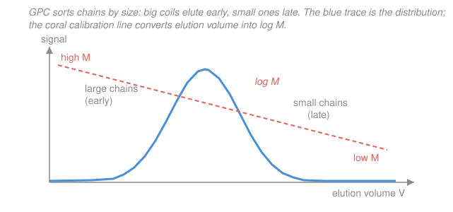

# Polymer & Materials Chemistry · Lesson 2.2: Measuring molecular weight

> ⏱ ~15 min · Module 2: Molecular Weight & Chain Statistics · Builds on: [2.1 Molecular-weight averages & dispersity](02-01-molecular-weight-averages-dispersity.md) · Unlocks: [2.3 The random coil: end-to-end distance](02-03-random-coil-end-to-end-distance.md)

## Why this matters

Lesson 2.1 handed us three numbers — $M_n$, $M_w$, and the dispersity $Đ = M_w/M_n$ — that summarize a distribution. But you cannot put a polymer chain on a balance or count molecules by eye. Every real measurement instead reads out some *physical shadow* of size: how much a solute lowers a solvent's chemical potential, how strongly a solution scatters light, how much it thickens, how fast a coil filters through a porous gel. Each shadow weights the distribution differently, so **each technique reports a different average**. Choose the wrong method and you get an "answer" that isn't the number you wanted. The whole lesson is one sentence: *the technique* is *the average.*

## The idea

Want the "average" wealth of a crowd? Two honest answers. Count heads and divide total money by people — that's a **number-average**: one vote each, so a billionaire barely moves it. Or weight each person by the money they hold — a **weight-average**: now the billionaire dominates. Neither is wrong; they answer different questions.

Physical measurements do exactly this automatically, depending on what they sense:

- **Count molecules** — *colligative* properties (each dissolved molecule raises osmotic pressure by the same amount, regardless of its size) → number-average $M_n$.
- **Sense mass** — light scattering (a big molecule scatters far more light than a small one) → weight-average $M_w$.
- **Sense pervaded volume** — viscosity (a bigger coil thickens the solution more) → a *viscosity-average* $M_v$, close to but not equal to $M_w$.
- **Separate by size** — chromatography (GPC) sorts chains and shows you the *entire* distribution, from which you compute any average you like — but only after calibration.

Same sample, four instruments, four different numbers. That's a feature: the gap between them *is* the dispersity.

## The formal version

**1. Membrane osmometry → $M_n$ (absolute).** Put polymer solution on one side of a semipermeable membrane, pure solvent on the other; solvent flows in until the osmotic pressure $\Pi$ balances it. For a dilute solution at concentration $c$ (mass per volume),

$$\frac{\Pi}{c} = RT\left(\frac{1}{M_n} + A_2\,c + \cdots\right),$$

with $R$ the gas constant, $T$ absolute temperature, and $A_2$ the second virial coefficient. *In words: plot $\Pi/c$ against $c$, extrapolate to $c\to 0$; the intercept is $RT/M_n$.* Because colligative effects **count** molecules, this is an *absolute* $M_n$ — no calibration standard needed. The slope $A_2$ reports solvent quality ($A_2>0$ good solvent, $A_2=0$ at the theta point — a hook into 2.4).

**2. Static light scattering → $M_w$ (absolute).** A dissolved chain scatters light in proportion to its mass. The excess Rayleigh ratio $R_\theta$ (scattering at angle $\theta$ above the pure solvent) obeys

$$\frac{Kc}{R_\theta} = \frac{1}{M_w}\left(1 + \tfrac{1}{3}\langle R_g^2\rangle\, q^2\right) + 2A_2\,c,$$

where $K$ is an optical constant (it contains the refractive-index increment $dn/dc$), $q$ the scattering vector, and $\langle R_g^2\rangle$ the mean-square radius of gyration. *In words: extrapolate $Kc/R_\theta$ to both zero concentration and zero angle — a **Zimm plot** — and the intercept is $1/M_w$.* As a bonus the angular slope gives $R_g$ (lesson 2.4) and the concentration slope gives $A_2$. Absolute, and weight-average because each chain contributes in proportion to its mass.

**3. Dilute-solution viscometry → $M_v$ (relative).** A dissolved coil pervades a volume and thickens the solvent. Define the **intrinsic viscosity**

$$[\eta] = \lim_{c\to 0}\frac{\eta - \eta_s}{\eta_s\, c}\quad(\text{units mL/g}),$$

with $\eta$ the solution viscosity and $\eta_s$ the solvent's — the fractional thickening per unit concentration, extrapolated to infinite dilution. It grows with chain size as a power law, the **Mark–Houwink equation**:

$$\boxed{\,[\eta] = K\,M_v^{\,a}\,}$$

$K$ and $a$ are empirical constants fixed by the *polymer + solvent + temperature*. *In words: measure $[\eta]$, then invert to read off $M_v$.* The exponent $a$ encodes how expanded the coil is: $a\approx 0.5$ in a theta solvent (ideal, unperturbed coil), rising toward $\approx 0.8$ in a good solvent (swollen coil), $\to 0$ for a compact sphere and up to $\approx 2$ for a rigid rod. Cheap and fast, but *relative* — you need $K,a$ from prior calibration. The average it reports sits between $M_n$ and $M_w$ (equal to $M_w$ only if $a=1$).

**4. Gel permeation chromatography (GPC / SEC) → the whole distribution (relative).** Pump the solution through a column packed with porous beads. Small chains wander deep into the pores (long path, elute *late*); large chains are excluded (short path, elute *early*). Separation is by **hydrodynamic volume** — size in solution — *not* mass. A detector records signal versus elution volume, tracing the distribution's shape. To turn elution volume into $M$ you need a calibration curve $\log M$ vs. elution volume, built from narrow standards (usually polystyrene). The catch: two chemically different polymers of the same $M$ have different sizes, so raw GPC only gives "polystyrene-equivalent" $M$. The fix is **universal calibration** — the quantity $[\eta]M$ is proportional to hydrodynamic volume, so all polymers fall on one master curve:

$$[\eta]_1 M_1 = [\eta]_2 M_2 \quad\text{(same elution volume)}.$$

*In words: if you know $K,a$ for your polymer, you can ride the polystyrene calibration to your polymer's true $M$.* GPC is the only routine method that hands you the *full* distribution — hence $M_n$, $M_w$, $M_v$, and $Đ$ all at once.

## Picture

## Worked examples

**Example 1 (Mark–Houwink — compute, then invert).** For a certain polymer in a good solvent, $K = 1.0\times10^{-2}\ \mathrm{mL/g}$ and $a = 0.80$.

*(a) Forward:* the intrinsic viscosity of a $M = 1.0\times10^{5}\ \mathrm{g/mol}$ sample.

$$[\eta] = K\,M^{a} = (1.0\times10^{-2})\,(1.0\times10^{5})^{0.80} = (1.0\times10^{-2})(10^{4}) = 100\ \mathrm{mL/g}.$$

(Here $(10^5)^{0.8} = 10^{5\times0.8} = 10^{4}$.)

*(b) Invert:* a different batch of the *same* polymer/solvent measures $[\eta] = 10\ \mathrm{mL/g}$. Solve $[\eta] = K M_v^{a}$ for $M_v$:

$$M_v = \left(\frac{[\eta]}{K}\right)^{1/a} = \left(\frac{10}{1.0\times10^{-2}}\right)^{1/0.80} = (1000)^{1.25} = 10^{3\times1.25} = 10^{3.75} \approx 5.6\times10^{3}\ \mathrm{g/mol}.$$

*Sanity:* smaller $[\eta]$ (thinner solution) → smaller coils → smaller $M_v$. ✓ Note the same chain measured in a *theta* solvent would have $a\approx0.5$ and a different $K$, giving a different $[\eta]$ for the same $M$ — the constants are solvent-specific because they encode coil expansion.

**Example 2 (match four measurements to their averages).** Four labs measure one broad polymer sample and report:

| Method | Result (g/mol) |
|---|---|
| Membrane osmometry | 40,000 |
| Light scattering | 90,000 |
| Dilute-solution viscometry ($a=0.7$) | 80,000 |
| GPC | full curve |

Assign each to $M_n$, $M_w$, $M_v$, or "distribution," and say which to trust.

- Osmometry **counts** molecules → $M_n = 40{,}000$ (the smallest, as $M_n$ always is).
- Light scattering **weights by mass** → $M_w = 90{,}000$ (the largest).
- Viscometry → $M_v = 80{,}000$; with $0<a<1$ it lies between $M_n$ and $M_w$, and near $M_w$ because $a=0.7$ is closer to $1$ than to $0$.
- GPC gives the **whole distribution**, from which $M_n\approx40{,}000$, $M_w\approx90{,}000$, so $Đ = M_w/M_n \approx 2.25$.

*Which to trust for a broad sample?* No single average captures the breadth, and averages can hide dangerous tails, so **read the GPC curve** for shape. But GPC is *relative* (calibration-dependent) — for an *absolute* anchor, trust light scattering for $M_w$ and osmometry for $M_n$. The very fact that $M_n < M_v < M_w$ confirms the sample is polydisperse; if all three agreed, $Đ$ would be $\approx 1$.

## Watch out

- **You might think GPC weighs molecules.** It sorts by *hydrodynamic volume* (size in solution), not mass — two polymers of equal $M$ elute at different volumes. That's why raw GPC gives only "polystyrene-equivalent" $M$, and why universal calibration ($[\eta]M$) is needed for the true value.
- **You might think every method reports $M_w$.** Only mass-sensing ones do. Colligative osmometry reports $M_n$; viscometry reports $M_v$ (equal to $M_w$ *only* if $a=1$). Use each result as the average it actually is.
- **You might think intrinsic viscosity $[\eta]$ is a viscosity.** It's a limiting *slope* — concentration-normalized thickening, extrapolated to $c\to0$, with units of inverse concentration (mL/g). It measures the volume one gram of coils pervades, not a thickness.
- **You might think $K$ and $a$ are universal constants.** They are specific to polymer + solvent + temperature, and $a$ is a direct readout of coil expansion — the same physics you'll scale up in 2.4.

## One-liner

> Every molecular-weight method reads a physical shadow of size — colligative counting gives $M_n$, scattering gives $M_w$, viscosity gives $M_v$, and only GPC (once calibrated by $[\eta]M$) hands you the whole distribution.

## Problems

**P1 (🟢)** For a polymer/solvent pair with $K = 2.0\times10^{-2}\ \mathrm{mL/g}$ and $a = 0.75$: (a) compute $[\eta]$ for a sample of $M = 1.0\times10^{4}\ \mathrm{g/mol}$; (b) a second sample measures $[\eta] = 90\ \mathrm{mL/g}$ — find its viscosity-average $M_v$.

**P2 (🟡)** You suspect a polymer contains a small high-molar-mass "tail" (a few very long chains from side branching) that wrecks its melt processing. Osmometry gives $M_n = 50{,}000$ and looks normal. (a) Which *average* is most inflated by such a tail, and which single technique would most sensitively reveal the tail itself? (b) What happens to $Đ$? Tie your answer to why the longest chains dominate melt viscosity (forward-link to [4.3 Viscoelasticity & polymer rheology](04-03-viscoelasticity-rheology.md), where $\eta \propto M^{3.4}$).

**P3 (🔴, optional — universal calibration)** At one elution volume, a polystyrene standard of $M_{\text{PS}} = 1.0\times10^{5}\ \mathrm{g/mol}$ co-elutes with your polymer. Mark–Houwink constants: polystyrene $K_{\text{PS}} = 1.2\times10^{-2}\ \mathrm{mL/g},\ a_{\text{PS}} = 0.70$; your polymer $K = 4.0\times10^{-2}\ \mathrm{mL/g},\ a = 0.60$. Using $[\eta]_{\text{PS}}M_{\text{PS}} = [\eta]M$, find your polymer's *true* $M$ and compare it to the PS-equivalent value.

Solutions

**P1** (a) $(1.0\times10^{4})^{0.75} = 10^{4\times0.75} = 10^{3} = 1000$, so

$$[\eta] = K M^{a} = (2.0\times10^{-2})(1000) = 20\ \mathrm{mL/g}.$$

(b) Invert $[\eta] = K M_v^{a}$:

$$M_v = \left(\frac{[\eta]}{K}\right)^{1/a} = \left(\frac{90}{2.0\times10^{-2}}\right)^{1/0.75} = (4500)^{1.333}.$$

Take logs: $\log_{10}4500 = 3.653$, times $1.333 = 4.871$, so $M_v = 10^{4.871} \approx 7.4\times10^{4}\ \mathrm{g/mol}$.

*Check:* $[\eta]=90$ is well above the $20\ \mathrm{mL/g}$ of the $10^4$ sample, so $M_v$ should be several times $10^4$ — and $7.4\times10^4$ is. ✓

**P2** (a) A high-$M$ tail barely changes $M_n$: $M_n$ counts molecules, and a handful of giants is a negligible *head count*. But $M_w$ **weights by mass**, and each giant carries enormous weight, so $M_w$ is strongly inflated — light scattering (which reports $M_w$) is the sensitive average, while **GPC** most directly *reveals* the tail as a shoulder or bump at low elution volume (early, large-$M$ side of the trace). (b) Since $M_n$ is roughly unchanged and $M_w$ jumps, $Đ = M_w/M_n$ rises — the tell-tale of a broadened, tailed distribution. This matters because melt viscosity scales as $\eta \propto M^{3.4}$ (lesson 4.3): the longest chains, entangling most, dominate flow far out of proportion to their number — exactly the mass-weighting that inflates $M_w$.

**P3** Compute each side of $[\eta]_{\text{PS}}M_{\text{PS}} = [\eta]M$.

Polystyrene: $[\eta]_{\text{PS}} = K_{\text{PS}}M_{\text{PS}}^{a_{\text{PS}}} = (1.2\times10^{-2})(10^{5})^{0.70} = (1.2\times10^{-2})(10^{3.5}) = (1.2\times10^{-2})(3162) \approx 37.9\ \mathrm{mL/g}$. So

$$[\eta]_{\text{PS}}M_{\text{PS}} = 37.9 \times 1.0\times10^{5} \approx 3.79\times10^{6}.$$

Your polymer: $[\eta]M = K M^{a}\cdot M = K M^{1+a} = (4.0\times10^{-2})\,M^{1.6}$. Set equal:

$$(4.0\times10^{-2})\,M^{1.6} = 3.79\times10^{6}\ \Longrightarrow\ M^{1.6} = 9.48\times10^{7}.$$

Take logs: $\log_{10}(9.48\times10^{7}) = 7.977$; divide by $1.6$ gives $4.986$, so

$$M = 10^{4.986} \approx 9.7\times10^{4}\ \mathrm{g/mol}.$$

*Check:* the true $M$ ($\approx 9.7\times10^{4}$) differs from the PS-equivalent value ($1.0\times10^{5}$) by only a few percent here — but for polymers whose coils are much more or less expanded than polystyrene's, the correction can be large, which is the entire reason universal calibration exists. ✓

## Flashback

**From Lesson 2.1 (Molecular-weight averages & dispersity):** A sample is a mixture of **3 mol** of chains at $M = 20{,}000\ \mathrm{g/mol}$ and **1 mol** of chains at $M = 60{,}000\ \mathrm{g/mol}$. Compute $M_n$, $M_w$, and $Đ$. (Fresh numbers — set up the moment ratios from scratch.)

Solution

Number-average (total mass over total moles):

$$M_n = \frac{\sum n_i M_i}{\sum n_i} = \frac{3(20{,}000) + 1(60{,}000)}{3 + 1} = \frac{60{,}000 + 60{,}000}{4} = 30{,}000\ \mathrm{g/mol}.$$

Weight-average (second moment over first):

$$M_w = \frac{\sum n_i M_i^{2}}{\sum n_i M_i} = \frac{3(20{,}000)^2 + 1(60{,}000)^2}{3(20{,}000) + 1(60{,}000)} = \frac{1.2\times10^{9} + 3.6\times10^{9}}{1.2\times10^{5}} = \frac{4.8\times10^{9}}{1.2\times10^{5}} = 40{,}000\ \mathrm{g/mol}.$$

Dispersity:

$$Đ = \frac{M_w}{M_n} = \frac{40{,}000}{30{,}000} \approx 1.33.$$

*Check:* $M_n < M_w$ always, and $Đ > 1$ for any real mixture — here modestly so, since the two populations differ by only $3\times$ in mass. ✓

## Connections

- **Backward:** 2.1 defined $M_n$ as a count-weighted (first-moment) average and $M_w$ as a mass-weighted (second-over-first-moment) average — this lesson shows *which instrument physically computes which*. Osmometry realizes $M_n$, light scattering realizes $M_w$, and $Đ = M_w/M_n$ is precisely the factor by which those two methods disagree.
- **Forward:** the Mark–Houwink exponent $a$ and the light-scattering $R_g$ are direct readouts of coil size and solvent quality. In [2.3](02-03-random-coil-end-to-end-distance.md) the ideal random walk gives $a\approx0.5$; in [2.4 Radius of gyration & excluded volume](02-04-radius-of-gyration-excluded-volume.md) self-avoidance swells the coil to $R\sim N^{3/5}$, pushing $a$ toward $0.8$.
- **Sideways (physical chemistry):** osmometry and light scattering are the colligative and optical methods straight from physical-chemistry, and the second virial coefficient $A_2$ appearing in both is the same nonideality term as in real-gas and real-solution thermodynamics — a positive $A_2$ means molecules effectively repel, i.e. a good solvent. See [../../physical-chemistry/syllabus.md](../../physical-chemistry/syllabus.md).
