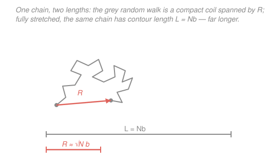

# Polymer & Materials Chemistry · Lesson 2.3: The random coil — end-to-end distance

> ⏱ ~15 min · Module 2: Molecular Weight & Chain Statistics · Builds on: [2.1 Molecular-weight averages & dispersity](02-01-molecular-weight-averages-dispersity.md), [`prob-stat-refresher` (random walks, sums, CLT)](../../prob-stat-refresher/syllabus.md) · Unlocks: [2.4 Radius of gyration & excluded volume](02-04-radius-of-gyration-excluded-volume.md), [3.4 Rubber elasticity](03-04-rubber-elasticity-entropic-spring.md)

## Why this matters

A polymer chain is a floppy string of thousands of freely rotating bonds, buffeted by thermal kicks. It never lies straight — it balls up into a wandering, ever-changing tangle called a **random coil**. The single most important fact in all of polymer physics is how big that ball is, and the answer is startling: a coil of $N$ segments is only about $\sqrt N$ segments *across*, not $N$. A chain long enough to reach across a room, stretched out, occupies a blob a hundred times smaller. That $\sqrt N$ law is the seed of everything downstream — the radius of gyration ([2.4](02-04-radius-of-gyration-excluded-volume.md)), why rubber springs back ([3.4](03-04-rubber-elasticity-entropic-spring.md)), how chains diffuse and entangle. And it is nothing but a random walk, the same one you met in probability.

## The idea

Picture a very drunk walker who takes $N$ steps, each of the same length $b$, in a completely random direction each time — no memory of where the last step pointed. Where do they end up? On *average*, right back where they started: for every walk that drifts east, an equally likely mirror walk drifts west, and they cancel. So the average displacement is zero.

But "zero on average" does not mean "goes nowhere." Any *single* walk wanders off; it just wanders in an unpredictable direction. To measure the typical distance travelled we can't average the displacement (that's zero) — we average its **square**, which can't cancel because it's always positive. That mean-square distance grows in proportion to the *number* of steps, so the typical distance grows like $\sqrt N$. Take four times as many steps and you only get twice as far from home. That is exactly why a diffusing particle covers a distance $\propto\sqrt{t}$ rather than $\propto t$ — same math, different label.

A polymer chain **is** this walk frozen in space. Each rigid segment is a step of length $b$; the joints swivel freely, so each segment points in a random direction independent of its neighbours. The walker's final position is the chain's **end-to-end vector** $\mathbf R$. Its typical length is the size of the coil.

## The formal version

**The freely jointed chain (FJC).** Model the chain as $N$ segments, each a vector $\mathbf b_i$ of fixed length $|\mathbf b_i| = b$ (in nm; $b$ is the segment or "Kuhn" length). The directions are independent and uniformly random, with no correlation between different segments and no self-avoidance (a "phantom" chain — segments may overlap). The **end-to-end vector** is the sum of the steps:

$$\mathbf R = \sum_{i=1}^{N}\mathbf b_i .$$

*In words: walk down the backbone adding each segment head-to-tail; $\mathbf R$ points from the first atom to the last.*

**Mean end-to-end vector.** Averaging over all the ways the chain can flop (denote the average $\langle\cdot\rangle$):

$$\langle\mathbf R\rangle = \sum_{i=1}^N \langle\mathbf b_i\rangle = \mathbf 0 .$$

*In words: on average the two ends sit on top of each other — because every direction is as likely as its opposite.* This is an average over a whole population of chains, **not** a claim that one chain shrinks to a point.

**Mean-square end-to-end distance.** Since $\langle\mathbf R\rangle=\mathbf 0$ carries no size information, use the mean square. Expand the dot product $\mathbf R\cdot\mathbf R$:

$$\langle R^2\rangle = \left\langle \Big(\sum_i \mathbf b_i\Big)\cdot\Big(\sum_j \mathbf b_j\Big)\right\rangle = \sum_{i=1}^N\sum_{j=1}^N \langle \mathbf b_i\cdot\mathbf b_j\rangle .$$

Split the double sum into diagonal ($i=j$) and off-diagonal ($i\neq j$) terms. Each diagonal term is $\langle\mathbf b_i\cdot\mathbf b_i\rangle = b^2$. Each off-diagonal term vanishes, because independent segments with random directions are uncorrelated: $\langle\mathbf b_i\cdot\mathbf b_j\rangle = \langle\mathbf b_i\rangle\cdot\langle\mathbf b_j\rangle = 0$. Only the $N$ diagonal terms survive:

$$\boxed{\;\langle R^2\rangle = N b^2\;}\qquad\Longrightarrow\qquad R_{\text{rms}} \equiv \sqrt{\langle R^2\rangle} = \sqrt{N}\,b .$$

*In words: the typical coil size grows as the square root of the number of segments — the random-walk law.*

**Coil size vs. contour length.** If you pulled the same chain straight, its length would be the **contour length** $L = Nb$ (every segment laid end-to-end). Compare:

$$\frac{R_{\text{rms}}}{L} = \frac{\sqrt N\, b}{N b} = \frac{1}{\sqrt N}.$$

*In words: the coil spans only a fraction $1/\sqrt N$ of its stretched length* — for a long chain, a tiny fraction. The coil is compact; the contour is enormous. Hold onto this contrast; it is the whole lesson.

**The Gaussian distribution.** $\mathbf R$ is a sum of $N$ independent random steps, so for large $N$ the [Central Limit Theorem](../../prob-stat-refresher/syllabus.md) says its probability density is a 3D bell curve centred at the origin:

$$P(\mathbf R) = \left(\frac{3}{2\pi N b^2}\right)^{3/2}\exp\!\left(-\frac{3R^2}{2Nb^2}\right),\qquad R = |\mathbf R|.$$

*In words: the end-to-end vector is Gaussian — most chains have $\mathbf R$ near zero, and a fully stretched chain ($R\to L$) is exponentially rare.* Each Cartesian component ($R_x,R_y,R_z$) is an independent 1D Gaussian of variance $Nb^2/3$, and the three multiply to give the formula above. This is the "Gaussian chain," the workhorse model of [rubber elasticity](03-04-rubber-elasticity-entropic-spring.md).

**Most-probable distance.** $P(\mathbf R)$ is the density *at a point*; the chance the end lands at distance $R$ in *any* direction multiplies by the surface area of a sphere, $4\pi R^2$. This **radial distribution** $4\pi R^2 P(R)$ starts at zero (no volume at the origin), rises, then falls. Setting its derivative to zero gives the most-probable end-to-end distance:

$$R^* = \sqrt{\tfrac{2}{3}Nb^2} = b\sqrt{\tfrac{2N}{3}}\approx 0.816\,R_{\text{rms}} .$$

*In words: the single likeliest coil size is a bit smaller than the RMS size, because squaring in $R_{\text{rms}}$ weights the long-tail walks more heavily.* All three measures ($R^*$, the mean $\langle R\rangle$, and $R_{\text{rms}}$) scale as $\sqrt N\,b$; they differ only by numbers of order one.

## Picture

## Worked examples

**Example 1 (coil size vs. contour — the headline number).** Take a chain with $N = 10^4$ segments of length $b = 0.25$ nm. Then

$$R_{\text{rms}} = \sqrt N\,b = \sqrt{10^4}\times 0.25\ \text{nm} = 100\times 0.25\ \text{nm} = 25\ \text{nm},$$

while the contour length is

$$L = Nb = 10^4 \times 0.25\ \text{nm} = 2500\ \text{nm} = 2.5\ \mu\text{m}.$$

The coil is

$$\frac{R_{\text{rms}}}{L} = \frac{25}{2500} = 0.01 = \frac{1}{\sqrt N} = \frac{1}{100},$$

i.e. **about 1 % of its fully stretched length.** A chain that would reach 2.5 µm if pulled taut curls into a blob just 25 nm across. That ~100-fold compaction is the random coil in one number.

**Example 2 (using the Gaussian — the most-probable size).** For the same chain, where is the end *most likely* to be found? Maximize the radial distribution $g(R) = 4\pi R^2 P(R) \propto R^2 \exp(-\alpha R^2)$ with $\alpha = \dfrac{3}{2Nb^2}$. Differentiate and set to zero:

$$\frac{d}{dR}\Big[R^2 e^{-\alpha R^2}\Big] = \big(2R - 2\alpha R^3\big)e^{-\alpha R^2} = 0 \;\Longrightarrow\; R^2 = \frac{1}{\alpha} = \frac{2Nb^2}{3}.$$

So $R^* = b\sqrt{2N/3}$. Plugging in the numbers:

$$R^* = 0.25\ \text{nm}\times\sqrt{\frac{2\times 10^4}{3}} = 0.25\times 81.6\ \text{nm} \approx 20.4\ \text{nm}.$$

Compare to $R_{\text{rms}} = 25$ nm: the most-probable distance is smaller by the factor $\sqrt{2/3}\approx 0.816$, exactly as predicted. Both are ~1 % of the 2500 nm contour — the "which average" quibble is tiny next to the huge coil-vs-contour gap. (Notice the echo of [2.1](02-01-molecular-weight-averages-dispersity.md): as with $M_n$ vs $M_w$, *how you weight the distribution* shifts the answer by a small factor, never an order of magnitude.)

## Watch out

- **You might think size scales with $N$.** It scales with $\sqrt N$. Only a fully *stretched* chain has a size $\propto N$ (that's the contour length $L=Nb$). Doubling the molar mass grows the coil by just $\sqrt2\approx 1.41$, not by two. This single exponent — $\tfrac12$ for an ideal chain — is what [2.4](02-04-radius-of-gyration-excluded-volume.md) will *correct* to $\approx 3/5$ once real chains are forbidden to overlap.
- **You might read $\langle\mathbf R\rangle=\mathbf 0$ as "the coil has no size."** The *vector* averages to zero by symmetry (directions cancel); the *distance* does not. Always characterize size with $R_{\text{rms}}=\sqrt{\langle R^2\rangle}$, never with $\langle\mathbf R\rangle$.
- **You might trust the Gaussian all the way out to $R = L$.** It's an approximation valid for $R \ll L$; near full extension it wrongly predicts a nonzero chance beyond $L$, which is physically impossible (a chain can't be longer than its contour). Real chains stiffen enormously as they approach $L$ — the origin of finite-extensibility and non-Hookean rubber at large stretch.

## One-liner

> A polymer is a random walk: its end-to-end distance grows as $R_{\text{rms}}=\sqrt N\,b$, so the coil is only a fraction $1/\sqrt N$ of its stretched contour length $L=Nb$ — compact, floppy, and Gaussian.

## Problems

**P1 (🟢)** An ideal freely jointed chain has $N = 2500$ segments of length $b = 0.30$ nm. Find (a) the RMS end-to-end distance $R_{\text{rms}}$, (b) the contour length $L$, and (c) the coil's size as a fraction of $L$. Confirm the fraction equals $1/\sqrt N$.

**P2 (🟡)** For the same chain, find the most-probable end-to-end distance $R^*$ and its ratio to $R_{\text{rms}}$. (Use the radial distribution $4\pi R^2 P(R)$.)

**P3 (🔴 — bridge to probability)** Show that the $x$-component of the end-to-end vector, $R_x = \sum_i b_{i,x}$, is Gaussian with mean $0$ and variance $Nb^2/3$, and explain in one sentence how this reproduces $\langle R^2\rangle = Nb^2$. Then state the exact analogy to a particle undergoing diffusion (Brownian motion) for time $t$.

Solutions

**P1.** With $N=2500$, $b=0.30$ nm and $\sqrt{2500}=50$:

(a) $R_{\text{rms}} = \sqrt N\,b = 50 \times 0.30\ \text{nm} = 15\ \text{nm}.$

(b) $L = Nb = 2500 \times 0.30\ \text{nm} = 750\ \text{nm}.$

(c) $\dfrac{R_{\text{rms}}}{L} = \dfrac{15}{750} = 0.02 = 2\%.$ And $\dfrac{1}{\sqrt N} = \dfrac{1}{50} = 0.02$ ✓. The coil is 2 % of its stretched length.

*Check.* Units: $\sqrt{\text{(dimensionless)}}\times\text{nm}=\text{nm}$ ✓. A shorter chain than Example 1 ($N=2500$ vs $10^4$) is a larger fraction of its contour ($2\%$ vs $1\%$), consistent with $1/\sqrt N$ shrinking as $N$ grows. ✓

**P2.** From the lesson, $R^* = b\sqrt{2N/3}$:

$$R^* = 0.30\ \text{nm}\times\sqrt{\frac{2\times 2500}{3}} = 0.30\times\sqrt{1666.7}\ \text{nm} = 0.30\times 40.8\ \text{nm} \approx 12.2\ \text{nm}.$$

Ratio to the RMS value:

$$\frac{R^*}{R_{\text{rms}}} = \frac{b\sqrt{2N/3}}{\sqrt N\,b} = \sqrt{\tfrac{2}{3}} \approx 0.816,$$

so $R^* = 0.816\times 15\ \text{nm} \approx 12.2\ \text{nm}$ ✓ — the two routes agree.

*Check.* $R^* < R_{\text{rms}}$, as it must be: squaring in $R_{\text{rms}}$ up-weights the long walks in the tail, pulling the RMS above the peak of the radial distribution. ✓

**P3.** Each segment is isotropic, so its three components share the mean-square length equally: $\langle b_{i,x}^2\rangle = \langle b_{i,y}^2\rangle = \langle b_{i,z}^2\rangle$, and since $b_{i,x}^2+b_{i,y}^2+b_{i,z}^2 = b^2$, each equals $b^2/3$. Also $\langle b_{i,x}\rangle = 0$ (positive and negative $x$-steps are equally likely). Now $R_x = \sum_{i=1}^N b_{i,x}$ is a **sum of $N$ independent, identically distributed random variables** of mean $0$ and variance $b^2/3$. By the rule that variances of independent variables add,

$$\operatorname{Var}(R_x) = \sum_{i=1}^N \operatorname{Var}(b_{i,x}) = N\cdot\frac{b^2}{3} = \frac{Nb^2}{3},$$

and by the **Central Limit Theorem** the sum is Gaussian: $R_x \sim \mathcal N(0,\,Nb^2/3)$. By symmetry $R_y$ and $R_z$ are identical, so

$$\langle R^2\rangle = \langle R_x^2\rangle + \langle R_y^2\rangle + \langle R_z^2\rangle = 3\times\frac{Nb^2}{3} = Nb^2,$$

reproducing the boxed result. **Diffusion analogy:** a Brownian particle taking uncorrelated thermal steps has mean-square displacement $\langle r^2\rangle = 6Dt$ (with $D$ the diffusion coefficient), growing linearly in time $t$ — exactly as $\langle R^2\rangle$ grows linearly in segment count $N$. The chain's "time" is its own backbone: walking $N$ segments down the chain is the spatial analogue of a particle diffusing for time $t\propto N$, so both sizes scale as $\sqrt N$ (or $\sqrt t$).

*Check.* Multiplying three 1D Gaussians of variance $Nb^2/3$ gives $P(\mathbf R)\propto\exp[-(R_x^2+R_y^2+R_z^2)/(2Nb^2/3)] = \exp[-3R^2/(2Nb^2)]$, matching the lesson's $P(\mathbf R)$ ✓. ✓

## Flashback

**From Lesson 2.1 (Molecular-weight averages & dispersity).** A polymer sample contains 2 mol of chains of molar mass $M = 20{,}000$ g/mol and 3 mol of chains of $M = 60{,}000$ g/mol. Compute the number-average $M_n$, the weight-average $M_w$, and the dispersity $Đ = M_w/M_n$.

Solution

Let $N_i$ be the mole amounts. Number-average weights by *count*:

$$M_n = \frac{\sum_i N_i M_i}{\sum_i N_i} = \frac{2(20{,}000) + 3(60{,}000)}{2+3} = \frac{40{,}000 + 180{,}000}{5} = \frac{220{,}000}{5} = 44{,}000\ \text{g/mol}.$$

Weight-average weights by *mass* ($\propto N_i M_i$), i.e. uses the next moment:

$$M_w = \frac{\sum_i N_i M_i^2}{\sum_i N_i M_i} = \frac{2(20{,}000)^2 + 3(60{,}000)^2}{2(20{,}000)+3(60{,}000)} = \frac{8.0\times10^{8} + 1.08\times10^{10}}{220{,}000} = \frac{1.16\times10^{10}}{220{,}000} \approx 52{,}700\ \text{g/mol}.$$

Dispersity:

$$Đ = \frac{M_w}{M_n} = \frac{52{,}700}{44{,}000} \approx 1.20.$$

*Check.* $M_w \ge M_n$ always, with equality only for a perfectly uniform sample; here $Đ=1.20 > 1$ signals a genuine spread of chain lengths. The big chains dominate $M_w$ (they carry most of the mass) but are outnumbered in $M_n$ — the same "which average, which weighting" theme that separates $R^*$ from $R_{\text{rms}}$ in this lesson. ✓

## Connections

- **Backward:** the "which average of a distribution" logic is straight from [2.1](02-01-molecular-weight-averages-dispersity.md) — there it was $M_n$ vs $M_w$; here it's $R^*$ vs $R_{\text{rms}}$, small factors set by how you weight the same bell curve. The contour length $L=Nb$ ties directly to degree of polymerization, the chain-length variable from Module 1.
- **Forward:** [2.4](02-04-radius-of-gyration-excluded-volume.md) replaces $R$ with the experimentally measured **radius of gyration** $R_g$ (with $R_g^2 = Nb^2/6$ for this ideal chain) and then breaks the ideal picture: real chains avoid overlapping themselves, swelling the coil to $R\sim N^{3/5}$ in a good solvent. The Gaussian $P(\mathbf R)$ becomes the entropic spring behind [rubber elasticity 3.4](03-04-rubber-elasticity-entropic-spring.md), where stretching the coil lowers its entropy and pulls it back with force $f = (3kT/Nb^2)\,x$.
- **Sideways (probability & diffusion):** the freely jointed chain is literally the random walk of [`prob-stat-refresher`](../../prob-stat-refresher/syllabus.md); $\langle R^2\rangle = Nb^2$ is the discrete cousin of Einstein's diffusion law $\langle r^2\rangle = 6Dt$, and the Gaussian $P(\mathbf R)$ is the Central Limit Theorem applied to a sum of $N$ random steps. Same mathematics governs a monomer counting down a backbone and a pollen grain jittering in water.
