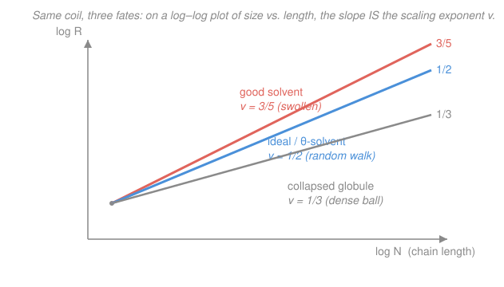

# Polymer & Materials Chemistry · Lesson 2.4: Real chains — radius of gyration & excluded volume

> ⏱ ~15 min · Module 2: Molecular Weight & Chain Statistics · Builds on: [2.3 The random coil: end-to-end distance](02-03-random-coil-end-to-end-distance.md) · Unlocks: Module 3 (solid-state properties) and Flory–Huggins solution thermodynamics ([4.1](04-01-polymer-solutions-flory-huggins.md))

## Why this matters

The ideal chain of [2.3](02-03-random-coil-end-to-end-distance.md) gave us $\langle R^2\rangle = Nb^2$ — clean, but wrong on two counts. First, end-to-end distance isn't even *measurable*: light scattering and viscometry (from [2.2](02-02-measuring-molecular-weight.md)) see how mass is spread about the chain's center, not where its two loose ends happen to land. Second, a real chain is locally stiff and can't pass through itself. This lesson swaps in the size that experiments actually report — the **radius of gyration** — and then fixes the two lies of the ideal model, arriving at the single most quoted result in polymer physics: in a good solvent a coil swells as $R\sim N^{3/5}$, not $N^{1/2}$.

## The idea

**A better ruler.** The ends of a coil are two arbitrary points; averaging over them is noisy and, worse, invisible to instruments. Instead ask: how far, on average, does a typical *segment* sit from the chain's center of mass? That RMS spread is the **radius of gyration** $R_g$ — the same "how spread out is the mass" idea as a moment of inertia's radius. It's a single honest number for the coil's physical size, and it's what a scattering experiment measures. For an ideal coil it's just a fixed fraction of the end-to-end size: $R_g = R_{\mathrm{rms}}/\sqrt6$.

**Two corrections to reality.** The ideal walk assumes each step is independent (it isn't — backbone bonds are stiff over short ranges) and that the walk may cross itself freely (it can't — two segments can't occupy the same space). The first correction is *local* and turns out to be cosmetic: a stiff real chain, viewed from far enough away, looks exactly like an ideal chain built from bigger effective links (**Kuhn segments**). The second correction is *global* and changes everything: forbidding self-overlap (**excluded volume**) pushes segments apart, so the coil **swells**, and its size grows with $N$ faster than a random walk's.

## The formal version

**Radius of gyration.** For a chain of $N$ segments at positions $\mathbf r_i$ with center of mass $\mathbf r_{\mathrm{cm}}$,

$$R_g^2 \equiv \frac{1}{N}\sum_{i=1}^{N}\left\langle\,|\mathbf r_i - \mathbf r_{\mathrm{cm}}|^2\right\rangle.$$

*In words: $R_g$ is the root-mean-square distance of the segments from the coil's own center — its physical radius.* Doing the sum for an ideal (Gaussian) chain gives the key link to [2.3](02-03-random-coil-end-to-end-distance.md):

$$\boxed{\,R_g^2 = \frac{Nb^2}{6} = \frac{\langle R^2\rangle}{6}\,}\qquad\Longrightarrow\qquad R_g = \frac{R_{\mathrm{rms}}}{\sqrt6},$$

where $b$ is the segment length and $R_{\mathrm{rms}}=\sqrt{\langle R^2\rangle}=\sqrt N\,b$. *In words: for an ideal coil the measurable radius is just the end-to-end size shrunk by $\sqrt6\approx2.45$.*

**Local stiffness: the characteristic ratio and persistence length.** Real backbone bonds have fixed angles and hindered rotation, so consecutive steps are correlated and the true chain is *bigger* than the naive freely-jointed guess. Package that stiffness into the **characteristic ratio**

$$C_\infty \equiv \frac{\langle R^2\rangle}{n\,\ell^2}\;>\;1,$$

with $n$ the number of real backbone bonds and $\ell$ the bond length. *In words: $C_\infty$ counts how many times larger the real coil is (in $\langle R^2\rangle$) than a phantom chain of independent bonds.* The related **persistence length** $l_p$ is the contour distance over which the chain "forgets" its direction. The payoff: any locally stiff chain can be re-described as an **equivalent ideal chain** of $N_K$ **Kuhn segments** of length $b_K$ (with $b_K = 2l_p$) chosen so that $\langle R^2\rangle = N_K b_K^2$. *In words: coarse-grain the stiffness away and a real chain becomes an ideal chain with fewer, longer links — Gaussian statistics survive, just with renormalized numbers.*

**Excluded volume and swelling.** Two segments can't overlap; each excludes a small volume $v$ to the others. This self-avoidance is a net repulsion that inflates the coil. A **Flory argument** balances that repulsion against the entropic cost of stretching. Write the free energy of a coil of size $R$ as

$$\frac{F(R)}{k_BT}\;\simeq\;\underbrace{\frac{R^2}{Nb^2}}_{\text{stretching (entropy)}}\;+\;\underbrace{v\,\frac{N^2}{R^3}}_{\text{self-repulsion}}.$$

*In words: the first term resists stretching (a random coil doesn't want to be pulled out); the second is the crowding penalty — roughly (number of pairs $N^2$) times (chance two segments meet, $\sim v/R^3$).* Minimizing over $R$ (set $dF/dR=0$) gives $R^5\simeq v\,b^2N^3$, i.e.

$$\boxed{\,R \sim N^{3/5}\,}\qquad(\text{good solvent, self-avoiding walk}).$$

Collecting the three regimes as $R \sim N^{\nu}$ with the **Flory exponent** $\nu$:

$$\nu = \tfrac13\ (\text{collapsed globule}),\qquad \nu=\tfrac12\ (\text{ideal}),\qquad \nu=\tfrac35\ (\text{swollen, good solvent}).$$

*In words: a dense ball packs its mass into $R^3\propto N$; a random walk spreads as $\sqrt N$; a self-avoiding walk in a friendly solvent spreads faster still.* ($\nu=3/5$ is Flory's tidy value; the exact self-avoiding-walk exponent is $\approx0.588$ — close enough that $3/5$ is what everyone uses.)

**The theta solvent.** Excluded volume isn't destiny. Cooling or worsening the solvent makes segments *attract* each other, and at one special temperature — the **theta ($\theta$) point** — that attraction exactly cancels the excluded-volume repulsion. The effective $v\to0$, the crowding term vanishes, and **ideal scaling returns**: $R\sim N^{1/2}$. *In words: at the theta point a real chain, in bulk average, behaves exactly like the phantom ideal chain of [2.3](02-03-random-coil-end-to-end-distance.md).* This is why the ideal model is worth learning at all — and we pin down the theta condition ($\chi=\tfrac12$) quantitatively in [4.2](04-02-solvent-quality-theta-phase-separation.md).

## Picture

## Worked examples

**Example 1 (the measurable size).** An ideal chain has $N=5{,}000$ segments of length $b=0.80$ nm. Find $R_{\mathrm{rms}}$ and $R_g$.

The end-to-end size is the [2.3](02-03-random-coil-end-to-end-distance.md) result:

$$\langle R^2\rangle = Nb^2 = 5000\times(0.80)^2 = 3200\ \mathrm{nm^2},\qquad R_{\mathrm{rms}}=\sqrt{3200}\approx56.6\ \mathrm{nm}.$$

The radius of gyration is a factor $\sqrt6$ smaller — and *this* is what light scattering would report:

$$R_g = \frac{R_{\mathrm{rms}}}{\sqrt6} = \frac{56.6}{2.449}\approx23.1\ \mathrm{nm}\qquad\left(\text{check: }\sqrt{\tfrac{Nb^2}{6}}=\sqrt{533.3}\approx23.1\ \mathrm{nm}\ \checkmark\right).$$

So the coil is a diffuse ball roughly 46 nm across, even though its stretched-out contour ($Nb=4{,}000$ nm) is nearly a hundred times longer. That gap between contour length and coil size is the whole reason random-coil statistics matter.

**Example 2 (scaling — why self-avoidance shows up in the exponent).** Take a chain and quadruple its degree of polymerization, $N\to4N$. By what factor does the coil size $R$ grow (a) in a theta solvent, (b) in a good solvent?

Use $R\sim N^\nu$, so a ratio in $N$ becomes a ratio in $R$ raised to $\nu$:

$$\text{(a) theta, }\nu=\tfrac12:\quad \frac{R'}{R}=4^{1/2}=2.0.$$

$$\text{(b) good, }\nu=\tfrac35:\quad \frac{R'}{R}=4^{0.6}=e^{0.6\ln4}=e^{0.832}\approx2.3.$$

Same fourfold increase in mass, but the swollen chain grows about 15% *more* in size. **The one-line reason:** in a good solvent the added segments don't merely lengthen the walk, they also shove the existing segments apart to avoid overlapping them — so size climbs faster than the random walk's $\sqrt N$.

## Watch out

- **You might think $R_g$ and $R_{\mathrm{rms}}$ are just two names for "coil size."** They differ by a fixed $\sqrt6$ for an ideal chain — and *only* for an ideal chain. Quote which one you mean: instruments report $R_g$, the freely-jointed formula gives $R_{\mathrm{rms}}$.
- **You might think stiffness (local) and swelling (excluded volume) are the same correction.** They aren't. Stiffness just rescales an ideal chain into Kuhn segments — the exponent stays $\nu=\tfrac12$. Excluded volume changes the exponent itself to $\tfrac35$. One is a change of ruler; the other is a change of physics.
- **You might think "good solvent" means "bigger $M$."** Solvent quality changes the *exponent* $\nu$, not $N$. Doubling $M$ in a fixed solvent grows the coil along that solvent's own scaling line; changing the solvent tilts the line.

## One-liner

> The measurable size is $R_g=R_{\mathrm{rms}}/\sqrt6$; stiffness only renames the links, but self-avoidance genuinely swells the coil from $N^{1/2}$ to $N^{3/5}$ — until a theta solvent cancels it and the ideal chain returns.

## Problems

**P1 (🟢)** An ideal chain has $N=2{,}400$ segments of length $b=0.50$ nm. Compute $\langle R^2\rangle$, $R_{\mathrm{rms}}$, and $R_g$.

**P2 (🟡)** A polymer coil's degree of polymerization is increased ninefold, $N\to9N$. By what factor does its radius grow (a) in a theta solvent, (b) in a good solvent? Give one sentence saying which regime a real polymer in a *warm, thermodynamically friendly* solvent falls into, and why. *(This scaling is the same physics you'll use to locate the theta point in [4.2](04-02-solvent-quality-theta-phase-separation.md).)*

**P3 (🔴, optional)** Polyethylene has $n$ C–C backbone bonds of length $\ell=0.154$ nm and characteristic ratio $C_\infty=6.9$. By what factor is the real chain's $R_{\mathrm{rms}}$ larger than the naive freely-jointed estimate that treats each backbone bond as an independent step? Name the physical origin of the difference.

Solutions

**P1** With $N=2400$, $b=0.50$ nm:

$$\langle R^2\rangle = Nb^2 = 2400\times(0.50)^2 = 2400\times0.25 = 600\ \mathrm{nm^2},$$
$$R_{\mathrm{rms}}=\sqrt{600}\approx24.5\ \mathrm{nm},\qquad R_g=\frac{R_{\mathrm{rms}}}{\sqrt6}=\frac{24.5}{2.449}\approx10.0\ \mathrm{nm}.$$

*Check.* Directly, $R_g=\sqrt{Nb^2/6}=\sqrt{100}=10.0$ nm ✓. Units: $b$ in nm, $\langle R^2\rangle$ in nm², lengths in nm ✓.

**P2** Use $R\sim N^\nu$, so the size ratio is $9^\nu$:

$$\text{(a) theta, }\nu=\tfrac12:\ 9^{1/2}=3.0. \qquad \text{(b) good, }\nu=\tfrac35:\ 9^{0.6}=e^{0.6\ln9}=e^{1.318}\approx3.7.$$

A warm, friendly ("good") solvent swells the coil, so a real polymer there follows $\nu=\tfrac35$: the solvent prefers polymer–solvent contacts, excluded volume is unscreened, and the self-avoiding chain expands faster than a random walk. (Cool it to the theta temperature and case (a) takes over.)

**P3** The freely-jointed estimate ignores bond correlations: $\langle R^2\rangle_{\mathrm{FJC}}=n\ell^2$. The real chain has $\langle R^2\rangle_{\mathrm{real}}=C_\infty\,n\ell^2$. Sizes go as the square root:

$$\frac{R_{\mathrm{rms,real}}}{R_{\mathrm{rms,FJC}}}=\sqrt{\frac{C_\infty n\ell^2}{n\ell^2}}=\sqrt{C_\infty}=\sqrt{6.9}\approx2.6.$$

The real chain is about $2.6\times$ larger. **Origin:** fixed tetrahedral bond angles and hindered internal rotation make successive backbone steps *correlated* — the chain is locally stiff and stays straighter over short ranges than independent steps would, so it reaches farther. Crucially this is a *local* effect: it inflates the prefactor via $C_\infty$ (equivalently, coarse-grains into longer Kuhn segments) but leaves the exponent at $\nu=\tfrac12$.

## Flashback

**From Lesson 2.3 (The random coil: end-to-end distance):** A freely-jointed chain has $N=3{,}600$ segments, each of length $b=0.20$ nm. Compute the mean-square end-to-end distance $\langle R^2\rangle$ and the RMS end-to-end distance. *(Fresh numbers — this is the ideal size that Example 1 then converts into a measurable $R_g$.)*

Solution

For a freely-jointed (ideal) chain, $\langle R^2\rangle = Nb^2$:

$$\langle R^2\rangle = 3600\times(0.20)^2 = 3600\times0.04 = 144\ \mathrm{nm^2},\qquad R_{\mathrm{rms}}=\sqrt{144}=12\ \mathrm{nm}.$$

*Check.* The stretched contour length is $Nb=720$ nm, yet the coil spans only 12 nm end-to-end — the hallmark $\sqrt N$ collapse of a random walk (here $\sqrt{3600}=60$, and $60\times0.20=12$ nm) ✓. Its $R_g$ would be $12/\sqrt6\approx4.9$ nm.

## Connections

- **Backward:** this is [2.3](02-03-random-coil-end-to-end-distance.md)'s ideal chain, made honest. The $\langle R^2\rangle=Nb^2$ result survives verbatim inside $R_g^2=Nb^2/6$, and its Gaussian statistics reappear at the theta point. The size $R_g$ is exactly the quantity light scattering and viscometry from [2.2](02-02-measuring-molecular-weight.md) report — this closes Module 2 by connecting the *model* size to the *measured* size.
- **Forward:** solvent quality is thermodynamics. [4.1](04-01-polymer-solutions-flory-huggins.md) builds the free energy of mixing, and [4.2](04-02-solvent-quality-theta-phase-separation.md) turns the good/theta/poor distinction of this lesson into the Flory–Huggins parameter $\chi$, fixing the theta point at $\chi=\tfrac12$ and predicting when coils collapse and solutions demix. The swollen-coil / entropic-stretching idea also returns as rubber's entropic spring in [3.4](03-04-rubber-elasticity-entropic-spring.md).
- **Sideways (statistical mechanics):** the self-avoiding walk and its exponent $\nu$ are a genuine critical phenomenon — the Flory argument here is a mean-field cousin of the scaling laws in `stat-mech`, where competition between entropy and interaction fixes a nontrivial power law. The coil–globule transition is a phase transition of a single molecule.
