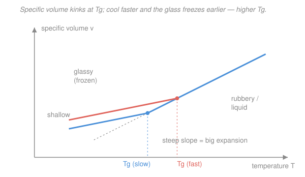

# Polymer & Materials Chemistry · Lesson 3.1: The glass transition

> ⏱ ~15 min · Module 3: Solid-State & Thermal Properties · Builds on: [2.4 Radius of gyration & excluded volume](02-04-radius-of-gyration-excluded-volume.md), [`stat-mech`](../../stat-mech/syllabus.md) · Unlocks: [3.2 Crystallinity & melting](03-02-crystallinity-melting.md)

## Why this matters

Cool a rubber band in liquid nitrogen and it shatters like glass; warm a cold plastic ruler and it goes floppy. The same chains, the same bonds — what changed is whether the backbone can *wiggle*. That switch happens at the **glass transition temperature** $T_g$, the single most practically important number for an amorphous polymer: it decides whether your material is a stiff plastic or a soft rubber at the temperature you use it. And its deepest lesson is that $T_g$ is **not a real phase transition** — it's motion losing a race against the clock.

## The idea

Picture a long chain buried in a melt of its neighbors. At high temperature the chain has room and energy: short stretches of backbone (a dozen or so segments — the same **segment** picture from [2.4](02-04-radius-of-gyration-excluded-volume.md)) constantly reshuffle, sliding past each other. The material flows or gives — it's **rubbery**. Now cool it. Two things shrink: the thermal energy that powers the wiggling, and the **free volume** — the little pockets of empty space a segment needs to hop into to move. Cool far enough and a segment simply has nowhere to go and no energy to get there. The large-scale cooperative motion **freezes**, and the material becomes a rigid **glass**: hard, brittle, still amorphous (no crystal — just a liquid caught mid-wiggle and locked).

Here's the subtle part. The freezing isn't a sudden collapse into a new ordered state — it's motion getting **too slow to observe**. As you cool, the time a segment needs to rearrange grows explosively. $T_g$ is just the temperature where that rearrangement time crosses *your* experimental timescale (seconds to minutes). Measure faster — cool quicker — and you catch the chains "frozen" while they're still a bit warmer. So **cool faster, and $T_g$ comes out higher.** A true thermodynamic transition (like ice melting) doesn't care how fast you look. This one does. That rate-dependence is the fingerprint of a **kinetic** transition, not an equilibrium one — a distinction worth pinning to your work in [`stat-mech`](../../stat-mech/syllabus.md), where a real phase transition is defined by equilibrium thermodynamics, independent of how you probe it.

## The formal version

**Glass transition temperature $T_g$.** The temperature at which large-scale cooperative **segmental motion** (coordinated rotation/translation of backbone segments) freezes out on the experimental timescale, turning a rubbery/liquid amorphous polymer into a rigid glass.

*In words: $T_g$ is where the backbone stops being able to rearrange fast enough to keep up with you.*

Because it's kinetic, $T_g$ shifts with cooling rate — roughly a few kelvin per decade of rate. It is **operationally defined**, not a sharp thermodynamic point.

**Free-volume picture.** Write the specific volume (volume per gram) as occupied volume plus free volume, $v = v_{\text{occ}} + v_f$. Segmental motion needs $v_f$ above some threshold; below $T_g$, $v_f$ is frozen at a small locked-in value.

*In words: chains need elbow room to move, and $T_g$ is where the elbow room runs out.*

**Signatures at $T_g$.** Two measurable kinks, both because the glass has fewer active motions than the rubber:

- **Specific volume vs. $T$:** a change in slope. The slope is the thermal expansion coefficient $\alpha = \frac{1}{v}\left(\frac{\partial v}{\partial T}\right)_P$; it **drops** on cooling through $T_g$ (frozen chains expand less). A kink, not a jump — $v$ itself is continuous.
- **Heat capacity $C_p$ vs. $T$:** a **step down** on cooling. Below $T_g$ there are fewer ways to absorb heat (segmental modes are dead), so $C_p$ is smaller. This step is what a DSC (differential scanning calorimeter) reads to report $T_g$.

*In words: nothing about the material jumps at $T_g$ — but how it responds to heat and temperature changes slope, because a whole class of wiggles switches off.*

**What shifts $T_g$.** Anything that makes segmental motion harder (needs more energy or more room) **raises** $T_g$; anything that eases it **lowers** $T_g$:

| Raises $T_g$ | Lowers $T_g$ |
|---|---|
| Stiff backbone (rings, double bonds, e.g. aromatic units) | Flexible backbone (e.g. C&#8211;O&#8211;C ether, Si&#8211;O siloxane links) |
| Bulky side groups (steric hindrance to rotation) | Small/no side groups |
| Polar side groups / H-bonding (extra attraction) | Long flexible side chains ("internal plasticizer") |
| Crosslinking (ties chains together) | **Plasticizer** (small molecules that add free volume) |

*In words: rigid, sticky, or tied-down chains freeze early (high $T_g$); loose, greasy, or diluted chains keep moving to lower temperatures (low $T_g$).*

**Fox equation** (for a miscible blend or a plasticized polymer): the $T_g$ of the mixture follows a weighted reciprocal average,

$$\frac{1}{T_g} = \frac{w_1}{T_{g,1}} + \frac{w_2}{T_{g,2}},$$

where $w_i$ is the **weight fraction** of component $i$ (so $w_1 + w_2 = 1$) and $T_{g,i}$ its pure-component glass transition (in **kelvin**).

*In words: mix in a low-$T_g$ component and the blend's $T_g$ slides down toward it — this is exactly how a plasticizer softens a rigid plastic.*

**$T_g$ vs. $T_m$.** Do not confuse them. $T_m$, the **melting temperature**, is where *crystalline* order (a real phase, covered in [3.2](03-02-crystallinity-melting.md)) is destroyed — a genuine first-order thermodynamic transition with a latent heat. $T_g$ is the kinetic freezing of the *amorphous* fraction. A fully amorphous polymer (atactic polystyrene, PMMA) has **only** a $T_g$; a semicrystalline polymer (polyethylene, PET) has **both** — a $T_g$ for its amorphous regions and a higher $T_m$ for its crystals. As a rough rule of thumb, $T_g \approx \tfrac{1}{2}$ to $\tfrac{2}{3}\,T_m$ (in kelvin).

## Picture

The steep (rubbery/liquid) line and the shallow (glassy) line meet in a **kink** at $T_g$ — no jump in $v$, just a slope change. The coral branch was cooled faster: it departs from the liquid line **earlier** (higher $T_g$) and freezes in **more free volume** (sits above). That the curve depends on cooling rate at all is the whole point — a thermodynamic transition wouldn't.

## Worked examples

**Example 1 (Fox equation — plasticized PVC, then classify).** Rigid PVC has $T_{g,1} = 354$ K. It's blended with 30 wt% of a plasticizer with $T_{g,2} = 189$ K. Find the blend's $T_g$, and decide whether the material is glassy or rubbery at room temperature (298 K).

Weight fractions: $w_1 = 0.70$ (PVC), $w_2 = 0.30$ (plasticizer). Apply Fox:

$$\frac{1}{T_g} = \frac{0.70}{354} + \frac{0.30}{189} = 0.0019774 + 0.0015873 = 0.0035647\ \text{K}^{-1}.$$

$$T_g = \frac{1}{0.0035647} \approx 280.5\ \text{K} \;\; (\approx 7\,^\circ\text{C}).$$

Now compare to the use temperature: $298\ \text{K} > T_g = 280.5\ \text{K}$. We're **above** $T_g$, so the segments are mobile — the material is **rubbery/flexible** at room temperature. This is exactly why plasticized PVC becomes vinyl tubing, cling film, and flexible flooring, while unplasticized PVC ($T_g = 354\ \text{K} = 81\,^\circ\text{C}$, well above room temp) is the rigid stuff of pipes and window frames. One additive slid $T_g$ from 81 °C down past room temperature and turned a hard plastic soft.

*Check.* The blend $T_g$ must lie **between** 189 and 354 K — it does (280.5). And because Fox uses reciprocals, the answer sits below the naive weight-average $0.70(354)+0.30(189)=305$ K — the low-$T_g$ plasticizer pulls harder than a linear mix would suggest. ✓

**Example 2 (rank by structure — PE, PS, PC).** Rank polyethylene (PE), polystyrene (PS), and bisphenol-A polycarbonate (PC) from lowest to highest $T_g$, using only backbone/side-group arguments.

Reason through the two levers — backbone flexibility and side-group bulk/stiffness:

- **PE**, $\ce{[-CH2-CH2-]_n}$: a bare, flexible all-carbon backbone with only hydrogens on the side. Nothing hinders rotation; segments move down to very low temperature. **Lowest $T_g$** (in fact $\approx 150$ K, $-120\,^\circ\text{C}$).
- **PS**, $\ce{[-CH2-CH(C6H5)-]_n}$: same flexible backbone, but a **bulky phenyl ring** hangs off every other carbon. That ring sterically blocks segmental rotation, so freezing happens much warmer. **Middle $T_g$** ($\approx 373$ K, $100\,^\circ\text{C}$).
- **PC** (bisphenol-A polycarbonate): the **rings are in the backbone itself** (aromatic units plus the carbonate linkage), making the chain intrinsically stiff — it can barely bend, let alone reshuffle. **Highest $T_g$** ($\approx 420$ K, $\sim150\,^\circ\text{C}$).

**Order: PE < PS < PC.** The principle: bulk *beside* the backbone (PS) raises $T_g$; stiffness *in* the backbone (PC) raises it even more, because it kills flexibility everywhere at once rather than just obstructing it.

*Check.* The ranking tracks everyday intuition — PE is a floppy bag/bottle material at room temp (well above its $T_g$), PS is a hard, brittle glass at room temp (just below its $T_g$), and PC is the tough, heat-resistant stuff of safety glasses and headlamp lenses (far below its $T_g$). ✓

## Watch out

- **You might think $T_g$ is a fixed material constant like a melting point.** It isn't — it depends on cooling rate (and on how it's measured), because it's kinetic. Quote it with a method (e.g. "DSC, 10 K/min"). A published $T_g$ is a convention, not a thermodynamic fact.
- **You might think the glass is "more ordered" than the rubber, like a crystal.** No — the glass is just as disordered as the liquid it froze from; it's a *frozen liquid*, not a crystal. Order (crystallinity) is a separate axis, and it's what $T_m$ is about, not $T_g$.
- **You might plug Celsius into the Fox equation.** It requires **absolute temperature (K)** — reciprocals of Celsius are meaningless (and blow up near 0 °C). Convert first, always.

## One-liner

> $T_g$ is not where the chains freeze — it's where they get *too slow to keep up with you*; cool faster or stiffen the backbone and that moment arrives warmer.

## Problems

**P1 (🟢)** Polypropylene has $T_g \approx 260$ K. You copolymerize/blend it (assume miscible) with a rubbery component of $T_g = 200$ K at 50 wt% each. Use the Fox equation to estimate the blend $T_g$. Is it above or below the simple weight-average, and why?

**P2 (🟡)** Two chemists report $T_g$ for the *same* amorphous polymer: 378 K and 382 K, using nominally identical DSC runs except one cooled the sample at 1 K/min and the other at 20 K/min. (a) Which cooling rate gave which value, and why? (b) One of them insists the 4 K gap proves a measurement error. Are they right? Explain in one sentence what the gap actually reflects.

**P3 (🔴)** Poly(dimethylsiloxane) (silicone, the Si&#8211;O backbone $\ce{[-Si(CH3)2-O-]_n}$) has one of the lowest $T_g$ values of any common polymer, about 150 K. Poly(methyl methacrylate) (PMMA, plexiglass) has $T_g \approx 378$ K. Using the structural levers from this lesson, give two independent reasons the silicone's $T_g$ is so much lower.

Solutions

**P1** With $w_1 = w_2 = 0.50$, $T_{g,1} = 260$ K, $T_{g,2} = 200$ K:

$$\frac{1}{T_g} = \frac{0.50}{260} + \frac{0.50}{200} = 0.0019231 + 0.0025000 = 0.0044231\ \text{K}^{-1},$$

$$T_g = \frac{1}{0.0044231} \approx 226\ \text{K}.$$

The simple weight-average would be $\tfrac12(260)+\tfrac12(200) = 230$ K. The Fox value (226 K) is **below** it. Because Fox averages *reciprocals*, the lower-$T_g$ component carries extra weight — free-volume additivity, not temperature additivity — so the blend leans toward the softer partner. ✓ (Check: 226 K lies between 200 and 260, as any blend $T_g$ must.)

**P2** (a) **20 K/min gave 382 K; 1 K/min gave 378 K.** Cooling faster freezes the segmental motion while the sample is still slightly warmer (the rearrangement time crosses the *shorter* observation window at a higher $T$), so the fast run reports the higher $T_g$. (b) Not an error. The 4 K gap is the **kinetic signature of the glass transition** — $T_g$ genuinely depends on cooling rate (a few K per decade of rate here), precisely because it is not an equilibrium phase transition.

**P3** Two independent reasons the Si&#8211;O backbone freezes so late (low $T_g$):

1. **Extremely flexible backbone.** The Si&#8211;O bond is long and the Si&#8211;O&#8211;Si bond angle is wide and soft, giving very low barriers to backbone rotation. Segments can reshuffle down to very low temperature. (Contrast PMMA's all-carbon backbone carrying a bulky, polar ester side group that both sterically hinders and attracts — pushing $T_g$ up.)
2. **Small, non-polar side groups with weak intermolecular attraction.** The methyls on silicon are small and greasy; chains barely stick to their neighbors, so little thermal energy is needed to keep them moving. PMMA's polar $\ce{-COOCH3}$ groups add dipolar attraction that must be overcome, raising $T_g$.

Either the intrinsic flexibility *or* the weak cohesion alone would lower $T_g$; silicone has both, which is why it stays a soft elastomer far below freezing. ✓

## Flashback

**From Lesson 2.4 (scaling $R \sim N^{\nu}$):** A polymer's degree of polymerization is increased 16-fold, from $N$ to $16N$. By what factor does its RMS end-to-end distance grow (a) modeled as an **ideal** (theta) chain, and (b) in a **good solvent**? Give the exponent you use in each case and one sentence on why the good-solvent chain grows faster.

Solution

The size scales as $R \sim N^{\nu}$, so scaling $N$ by a factor 16 scales $R$ by $16^{\nu}$.

(a) **Ideal chain:** $\nu = \tfrac12$, so the factor is $16^{1/2} = 4$.

(b) **Good solvent:** $\nu = \tfrac{3}{5}$ (Flory exponent), so the factor is $16^{3/5} = 16^{0.6} \approx 5.3$.

The good-solvent chain grows faster (5.3× vs 4×) because **excluded volume** — segments repelling each other and refusing to overlap — swells the coil, and that self-avoidance compounds with length, giving a larger exponent than the ideal random walk. ✓ (Check: both exceed the compact-globule case $\nu = 1/3$, factor $16^{1/3} \approx 2.5$, as they should — a swollen coil is bigger than a collapsed ball.)

## Connections

- **Backward:** the "segment" that freezes at $T_g$ is the same coarse-grained backbone unit that defined chain size in [2.3](02-03-random-coil-end-to-end-distance.md) and [2.4](02-04-radius-of-gyration-excluded-volume.md) — the glass transition is those segments losing the mobility that let the coil rearrange.
- **Forward:** [3.2 Crystallinity & melting](03-02-crystallinity-melting.md) introduces $T_m$, the *thermodynamic* partner to $T_g$; a semicrystalline polymer shows both, and the interplay ($T_g$ governs the amorphous fraction, $T_m$ the crystals) sets its whole thermal-mechanical profile. Rubber elasticity ([3.4](03-04-rubber-elasticity-entropic-spring.md)) only works *above* $T_g$, where segments are free to explore conformations.
- **Sideways (statistical mechanics / thermodynamics):** the kinetic-vs-equilibrium distinction here is the core idea of a real phase transition in [`stat-mech`](../../stat-mech/syllabus.md) and [`thermodynamics-physics`](../../thermodynamics-physics/syllabus.md) — $T_g$ is the textbook example of a transition that is *not* thermodynamic, because it depends on how fast you probe it.
