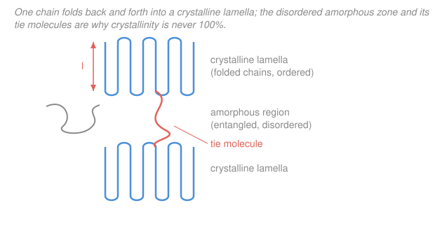

# Polymer & Materials Chemistry · Lesson 3.2: Crystallinity & melting in polymers

> ⏱ ~15 min · Module 3: Solid-State & Thermal Properties · Builds on: [3.1 The glass transition](03-01-glass-transition.md), [1.5 Ionic & coordination polymerization](01-05-ionic-coordination-polymerization.md) · Unlocks: [3.3 Semicrystalline morphology](03-03-semicrystalline-morphology.md)

## Why this matters

A milk jug is stiff and cloudy; a food-wrap film is limp and clear — both are polyethylene, the *same* repeat unit. The difference is **how much of the chain managed to crystallize**. Crystallinity is the single biggest lever on a plastic's stiffness, density, opacity, and where it melts. But here is the twist that makes polymers unlike table salt or copper: a polymer *cannot* fully crystallize. It is always **semicrystalline** — crystalline islands frozen in an amorphous sea — and understanding why unlocks how to read a material from a simple density measurement.

## The idea

Picture the chain you built in Module 2: a kilometer-long, floppy, entangled noodle. To crystallize means to line up perfectly into a regular lattice. A short molecule (a sugar, a metal atom) can do this cleanly. But one polymer chain is thousands of segments long and hopelessly tangled with its neighbors — asking all of it to register into a perfect lattice is like asking a bowl of spaghetti to align into a grid *without cutting any strand*. Some stretches manage it; the tangles, chain ends, and imperfect segments never do. So you always get **crystalline lamellae** (thin, ordered plates) embedded in an **amorphous matrix** (disordered, glassy or rubbery depending on $T$ vs. $T_g$ from [3.1](03-01-glass-transition.md)).

The trick nature uses to crystallize *any* of it is **chain folding**: a chain dives down through a thin crystal, folds back on itself at the surface like a ribbon of taffy, dives back down, and repeats. The crystal grows only ~10 nm thick — the *fold length* — even though the chain is microns long. Those folded plates are lamellae.

Two consequences follow. First, "how crystalline is it?" becomes a *number between 0 and 1*, not yes/no — and we can get it from **density** (crystal packs tighter than amorphous, so denser = more crystalline). Second, because these crystals are thin plates riddled with fold surfaces, they melt at a **real, sharp temperature** $T_m$ (unlike the mushy kinetic $T_g$), but *below* the ideal value — thinner plates melt lower.

## The formal version

**Semicrystalline, always.** Real bulk polymers reach crystallinities of roughly 0 to 80%, never 100%. A perfectly regular chain (linear polyethylene, isotactic polypropylene) crystallizes readily; an irregular one barely at all. *In words: crystallization needs a chain that can register into a lattice, and only a fraction of a tangle of long chains ever manages it.*

**Regularity is the entry ticket.** A chain crystallizes only if its repeat units are geometrically interchangeable. **Tacticity** — the stereochemistry set by the polymerization mechanism in [1.5](01-05-ionic-coordination-polymerization.md) — is decisive: *isotactic* polypropylene (all methyl groups on one side, made with a Ziegler–Natta catalyst) is highly crystalline and melts near $165\,^\circ\text{C}$; *atactic* polypropylene (random methyls, made by a radical route) is a tacky amorphous goo that never crystallizes. Bulky side groups, branching, and comonomers all disrupt registration and cut crystallinity. *In words: only a stereoregular, geometrically repetitive chain can pack — irregularity is measured directly as lost crystallinity.*

**Degree of crystallinity from density (the two-phase model).** Treat the solid as crystalline fraction plus amorphous fraction and assume **volumes add** — specific volume ($v = 1/\rho$) is a mass-weighted average of the two phases. Let $x_c$ be the *mass* fraction crystalline, $\rho$ the measured density, and $\rho_c,\rho_a$ the fully-crystalline and fully-amorphous densities. Then

$$\frac{1}{\rho} = x_c\frac{1}{\rho_c} + (1-x_c)\frac{1}{\rho_a}.$$

*In words: the sample's volume-per-gram is the crystalline volume-per-gram and the amorphous volume-per-gram, weighted by their mass shares.* Solve for $x_c$ (multiply through by $\rho\rho_a\rho_c$ and collect):

$$\boxed{\,x_c = \frac{\rho_c\,(\rho-\rho_a)}{\rho\,(\rho_c-\rho_a)}\,}$$

The corresponding **volume** fraction crystalline (add volumes directly instead) is the simpler

$$\phi_c = \frac{\rho-\rho_a}{\rho_c-\rho_a},$$

and the two are related by $x_c = (\rho_c/\rho)\,\phi_c$. *In words: measure one density, know the two endpoints, read off the crystalline fraction — mass or volume.* You get $\rho_c$ from X-ray unit-cell dimensions and $\rho_a$ from the melt extrapolated back to solid temperature.

**Melting: a genuine first-order transition.** Unlike $T_g$ (a kinetic freezing, [3.1](03-01-glass-transition.md)), melting a crystal is a true thermodynamic first-order transition — latent heat $\Delta H_f$ is absorbed, and at equilibrium

$$T_m^0 = \frac{\Delta H_f}{\Delta S_f},$$

where $\Delta H_f$ is the enthalpy of fusion (per unit mass) and $\Delta S_f$ the entropy of fusion. $T_m^0$ is the melting point of a *perfect, infinitely thick* crystal. *In words: melting happens when the entropy gained by disordering finally pays for the enthalpy of breaking the lattice.*

**Gibbs–Thomson: thin crystals melt low.** Real lamellae are only ~10 nm thick, so a large share of their material sits in the two high-energy **fold surfaces**, each costing surface free energy $\sigma_e$ (per unit area). That surface tax destabilizes the crystal and drops its melting point below $T_m^0$:

$$\boxed{\,T_m(l) = T_m^0\left(1 - \frac{2\sigma_e}{\Delta H_f\,\rho_c\,l}\right)}$$

where $l$ is the lamellar thickness, $\rho_c$ the crystal density, and the factor 2 counts *both* fold surfaces. *In words: a thin crystal is nearly all surface, and surfaces are expensive, so it gives up and melts early; the depression scales as $1/l$.* Thicken the lamella (slow crystallization, annealing) and $T_m$ climbs toward $T_m^0$. This is why a polymer melts over a *range* — a distribution of lamellar thicknesses melts over a distribution of temperatures.

## Picture

## Worked examples

**Example 1 (density → crystallinity).** A polyethylene sample measures $\rho = 1.05\ \mathrm{g/cm^3}$. The fully amorphous and fully crystalline densities are $\rho_a = 1.00$ and $\rho_c = 1.15\ \mathrm{g/cm^3}$. Find the mass degree of crystallinity.

Plug straight into the boxed formula:

$$x_c = \frac{\rho_c(\rho-\rho_a)}{\rho(\rho_c-\rho_a)} = \frac{1.15\,(1.05-1.00)}{1.05\,(1.15-1.00)} = \frac{1.15 \times 0.05}{1.05 \times 0.15} = \frac{0.0575}{0.1575} = 0.365.$$

So the sample is **36.5% crystalline by mass**. (The volume fraction is a touch lower, $\phi_c = (\rho-\rho_a)/(\rho_c-\rho_a) = 0.05/0.15 = 0.333$, i.e. 33.3% — sensible, since the denser crystalline phase carries more mass than its volume share.) *Check:* $\rho$ sits one-third of the way from $\rho_a$ to $\rho_c$, so $\phi_c \approx 1/3$; the mass fraction is scaled up by $\rho_c/\rho = 1.10$, giving $0.333 \times 1.10 = 0.365$ ✓.

**Example 2 (Gibbs–Thomson → melting point of a real lamella).** For polyethylene take $T_m^0 = 415\ \mathrm{K}$, fold-surface energy $\sigma_e = 0.090\ \mathrm{J/m^2}$, heat of fusion $\Delta H_f = 2.9\times10^{5}\ \mathrm{J/kg}$, and crystal density $\rho_c = 1000\ \mathrm{kg/m^3}$. At what temperature does a lamella of thickness $l = 10\ \mathrm{nm}$ melt?

Work in SI so the depression term is dimensionless. First the denominator $\Delta H_f\,\rho_c\,l$ (an energy per area, matching $\sigma_e$):

$$\Delta H_f\,\rho_c\,l = (2.9\times10^{5})(1000)(10\times10^{-9}) = (2.9\times10^{8}\ \mathrm{J/m^3})(10^{-8}\ \mathrm{m}) = 2.9\ \mathrm{J/m^2}.$$

Then the surface tax:

$$\frac{2\sigma_e}{\Delta H_f\,\rho_c\,l} = \frac{2(0.090)}{2.9} = \frac{0.180}{2.9} = 0.062.$$

$$T_m(l) = 415\,(1 - 0.062) = 415 \times 0.938 = 389\ \mathrm{K} \approx 116\,^\circ\text{C}.$$

So a 10 nm crystal melts about **26 K below** the ideal $T_m^0 = 415\ \mathrm{K}$ ($142\,^\circ\text{C}$). Halve the thickness to $l = 5\ \mathrm{nm}$ and the depression *doubles* to $\sim 52$ K, giving $T_m \approx 363\ \mathrm{K}$ ($90\,^\circ\text{C}$) — thin crystals melt lower because they are almost entirely fold surface, and the surface is what wants to melt. *Check:* the bracket is dimensionless and the correction is a modest few percent, as it must be for a 10 nm crystal that is still mostly interior ✓.

## Watch out

- **You might think a "highly crystalline" polymer is a single crystal.** It never is — even 80%-crystalline HDPE is lamellae in an amorphous matrix. "Semicrystalline" is not a hedge; it is the actual state. 100% is physically unreachable for a chain of any real length.
- **You might treat $T_m$ like $T_g$.** They are different beasts: $T_g$ (from [3.1](03-01-glass-transition.md)) is a *kinetic* freezing of the amorphous phase with no latent heat and a rate-dependent value; $T_m$ is a *thermodynamic* first-order transition of the crystalline phase with latent heat $\Delta H_f$. A semicrystalline polymer has **both** — the amorphous fraction goes through $T_g$, the crystalline fraction through $T_m$, always with $T_g < T_m$.
- **You might expect one sharp melting point.** A real polymer melts over a *range* because it contains a spread of lamellar thicknesses, and Gibbs–Thomson maps each thickness to its own $T_m(l)$. The thinnest, most defective crystals melt first.

## One-liner

> Long chains can only fold into thin lamellae inside an amorphous matrix, so crystallinity is a density-readable fraction between 0 and 1, and the thin crystals — nearly all fold surface — melt below the ideal $T_m^0$ by Gibbs–Thomson.

## Problems

**P1 (🟢)** An isotactic polypropylene sample has density $\rho = 0.904\ \mathrm{g/cm^3}$; the amorphous and crystalline densities are $\rho_a = 0.850$ and $\rho_c = 0.936\ \mathrm{g/cm^3}$. Find the mass degree of crystallinity. Then: its *atactic* twin, made by a radical route, is measured at $\rho = 0.850\ \mathrm{g/cm^3}$ — what is its crystallinity, and why (link the answer to [1.5](01-05-ionic-coordination-polymerization.md))?

**P2 (🟡)** Using the Example 2 polyethylene constants ($T_m^0 = 415\ \mathrm{K}$, $\sigma_e = 0.090\ \mathrm{J/m^2}$, $\Delta H_f = 2.9\times10^{5}\ \mathrm{J/kg}$, $\rho_c = 1000\ \mathrm{kg/m^3}$), a slowly annealed sample now melts at $T_m = 401\ \mathrm{K}$. Work backward to find its lamellar thickness $l$, and say whether it is thicker or thinner than the 10 nm crystal in the example.

**P3 (🔴)** A semicrystalline polymer is heated. Explain, in terms of *which phase does what*, why you would see a step in heat capacity at one temperature and a latent-heat peak at a higher temperature — and which of the two moves if you heat faster. (This is what a DSC scan shows; it ties directly to [3.3 Semicrystalline morphology](03-03-semicrystalline-morphology.md).)

Solutions

**P1** Mass crystallinity of the isotactic sample:

$$x_c = \frac{\rho_c(\rho-\rho_a)}{\rho(\rho_c-\rho_a)} = \frac{0.936\,(0.904-0.850)}{0.904\,(0.936-0.850)} = \frac{0.936 \times 0.054}{0.904 \times 0.086} = \frac{0.050544}{0.077744} = 0.650.$$

So **65% crystalline** — a stiff, opaque, useful plastic. The **atactic** sample has $\rho = 0.850 = \rho_a$, so the numerator $\rho - \rho_a = 0$ and $x_c = 0$: **0% crystalline**, an amorphous tacky solid. The reason is stereoregularity from [1.5](01-05-ionic-coordination-polymerization.md): a Ziegler–Natta (or metallocene) catalyst places every methyl group on the same side (isotactic), so the repeat units are geometrically interchangeable and register into a lattice; a radical route scatters the methyls at random (atactic), and no two segments pack the same way, so nothing crystallizes. *Check:* density landing exactly at $\rho_a$ must give zero crystallinity — it does ✓.

**P2** Rearrange Gibbs–Thomson for $l$. From $T_m = T_m^0\!\left(1 - \frac{2\sigma_e}{\Delta H_f\rho_c l}\right)$,

$$\frac{2\sigma_e}{\Delta H_f\rho_c l} = 1 - \frac{T_m}{T_m^0} = 1 - \frac{401}{415} = \frac{14}{415} = 0.03373.$$

$$l = \frac{2\sigma_e}{\Delta H_f\rho_c\,(0.03373)} = \frac{2(0.090)}{(2.9\times10^{5})(1000)(0.03373)} = \frac{0.180}{9.782\times10^{6}} = 1.84\times10^{-8}\ \mathrm{m} \approx 18\ \mathrm{nm}.$$

About **18 nm — thicker** than the 10 nm crystal, which is exactly why it melts higher (401 K vs. 389 K). Annealing thickens lamellae, and thicker lamellae carry less surface penalty, so $T_m$ climbs toward $T_m^0$. *Check:* the depression here (14 K) is smaller than the example's (26 K), and $1/l$ scaling predicts $l \approx 10\ \mathrm{nm} \times (26/14) \approx 18.6$ nm ✓.

**P3** A semicrystalline polymer is a two-phase solid, and each phase has its own thermal signature.

- **The step in heat capacity** at the lower temperature is the **glass transition of the amorphous phase** ([3.1](03-01-glass-transition.md)): its segments unfreeze, $C_p$ jumps, but *no latent heat* is absorbed — it is a kinetic, second-order-like change, so it appears as a step, not a peak.
- **The latent-heat peak** at the higher temperature is the **melting of the crystalline phase**: a first-order transition where the lamellae absorb $\Delta H_f$ to disorder, producing an endothermic peak whose area gives the heat of fusion (and hence, via $\Delta H_f$ of a perfect crystal, the crystallinity).

Heating **faster** shifts the **$T_g$ step upward** — the glass transition is kinetic, so less time to relax means the material stays glassy to a higher temperature. The **melting peak barely moves**, because $T_m$ is set by thermodynamics ($T_m^0$ and lamellar thickness), not by scan rate. *Check:* the distinguishing test between $T_g$ and $T_m$ is exactly rate-dependence and latent heat — $T_g$ has neither latent heat nor a fixed value; $T_m$ has both ✓.

## Flashback

**From Lesson 3.1 (the Fox equation for blends):** A miscible blend is 60 wt% of polymer A ($T_{g,A} = 378\ \mathrm{K}$) and 40 wt% of polymer B ($T_{g,B} = 228\ \mathrm{K}$). Use the Fox equation $\dfrac{1}{T_g} = \dfrac{w_A}{T_{g,A}} + \dfrac{w_B}{T_{g,B}}$ to find the blend's glass-transition temperature. Is it glassy or rubbery at room temperature ($\approx 295\ \mathrm{K}$)?

Solution

$$\frac{1}{T_g} = \frac{0.60}{378} + \frac{0.40}{228} = 0.0015873 + 0.0017544 = 0.0033417\ \mathrm{K^{-1}}.$$

$$T_g = \frac{1}{0.0033417} \approx 299\ \mathrm{K} \approx 26\,^\circ\text{C}.$$

At room temperature ($\approx 295\ \mathrm{K}$) the blend is just **below** its $T_g$, so it is **glassy** — but only barely, by about 4 K, so it would feel stiff yet close to softening (a warm day would push it over into rubbery). *Check:* the Fox result must land between the two components' values (228–378 K) and be pulled toward the more abundant, higher-$T_g$ A — 299 K sits between them, nearer the 40% B side because the reciprocal average weights the low-$T_g$ component heavily ✓.

## Connections

- **Backward:** the amorphous fraction here is exactly the phase whose freezing you studied in [3.1](03-01-glass-transition.md) — a semicrystalline polymer has *both* a $T_g$ (amorphous) and a $T_m$ (crystalline). Whether a chain can crystallize at all was set back in [1.5](01-05-ionic-coordination-polymerization.md): tacticity and stereoregularity are the entry ticket, which is why catalyst choice controls crystallinity.
- **Forward:** [3.3 Semicrystalline morphology](03-03-semicrystalline-morphology.md) zooms out from a single lamella to how lamellae organize into spherulites, connected by the amorphous tie molecules drawn in this lesson's figure — the structural link between molecular order and bulk toughness.
- **Sideways (physical chemistry / thermodynamics):** the melting relation $T_m^0 = \Delta H_f/\Delta S_f$ and the Gibbs–Thomson size-dependent melting are the same physics that governs nanoparticle melting and capillary phase transitions in [physical-chemistry](../../physical-chemistry/syllabus.md) — small crystals of *anything* melt below the bulk value because surface energy scales with the surface-to-volume ratio.
