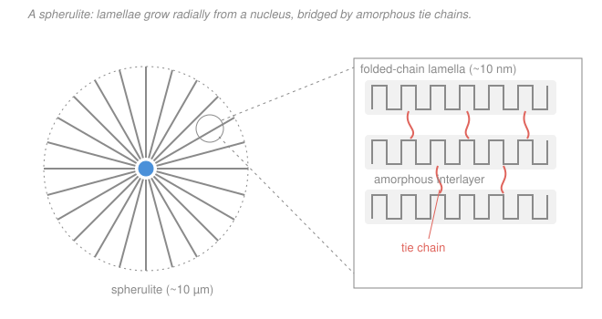

# Polymer & Materials Chemistry · Lesson 3.3: Semicrystalline morphology

> ⏱ ~15 min · Module 3: Solid-State & Thermal Properties · Builds on: [3.2 Crystallinity & melting](03-02-crystallinity-melting.md), [3.1 The glass transition](03-01-glass-transition.md) · Unlocks: [3.4 Rubber elasticity](03-04-rubber-elasticity-entropic-spring.md)

## Why this matters

Take two films of the *same* polyethylene. Cool one slowly and it comes out cloudy and stiff; quench the other in cold water and it comes out clear and floppy. Same chemistry, same molecular weight — the difference is entirely **morphology**: how the crystals are sized and arranged. A milk jug is tough because of one specific structural feature you can point to under a microscope, and a cling-film's clarity is another. This lesson teaches you to read that microstructure top-down — from the millimeter-scale spherulite you see with crossed polarizers down to the folded chains inside a single lamella — and to predict stiffness, toughness, and clarity from what you see.

## The idea

Lesson [3.2](03-02-crystallinity-melting.md) told you a polymer is *part* crystal, *part* amorphous, and that the crystalline part is made of chains folded back and forth into thin plates. This lesson is about **how those plates organize**, and it's a story of nested scales — like a head of cabbage, structure inside structure.

- **Smallest:** a chain folds into a thin crystalline plate, a **lamella** (~10 nm thick). Between plates sits a rubbery/glassy **amorphous layer**.
- **Middle:** lamellae stack, separated by those amorphous layers. Crucially, individual chains are long enough to thread out of one lamella, wander through the amorphous gap, and re-enter the next. Those bridging chains are **tie chains** — the rivets holding the sandwich together.
- **Largest:** starting from a single speck (a **nucleus**), lamellae grow *outward in all directions*, twisting and branching to fill space, until the whole aggregate is a sphere — a **spherulite** (microns to millimeters). Neighboring spherulites grow until they collide and tile the material.

So the everyday plastic in your hand is a packing of spherulites, each a sunburst of lamellae, each lamella a stack of folded chains glued to its neighbors by tie chains. Every mechanical and optical property traces back to some feature on this ladder.

## The formal version

**Lamella.** A chain-folded crystalline plate, thickness $\ell \sim 10\text{–}20$ nm (set by crystallization temperature via Gibbs–Thomson, from [3.2](03-02-crystallinity-melting.md)), lateral extent far larger. *In words: the crystal is a thin ribbon because the chain keeps folding back instead of extending — the fold surfaces are the flat faces.*

**Stacked lamellae + amorphous interlayer.** Lamellae stack with amorphous material between them. Chain ends, entanglements, branches, and stray loops are excluded from the crystal and pile up in these interlayers. The interlayer contains three chain types: **tie chains** (bridge two lamellae), **loose loops/cilia** (leave and re-enter the same lamella, or dangle), and free chain ends. *In words: whatever won't fit neatly into the fold gets rejected into the disordered gap.*

**Spherulite.** A roughly spherical, **polycrystalline** aggregate of lamellae radiating from a common nucleus, with amorphous material filling between the radiating arms. *In words: not one big crystal — a fan of thousands of tiny lamellar crystals all sharing a center.* Because the lamellae are optically **birefringent** and line up radially, a spherulite viewed between **crossed polarizers** shows a dark **Maltese cross** (extinction arms along the polarizer axes) — the fingerprint that tells you the sample is spherulitic, not a single crystal.

**Nucleation & growth.** Crystallization is two competing steps: *nucleation* (a stable crystal seed appears) then *growth* (chains add to it). Overall conversion follows the **Avrami equation**,

$$X(t) = 1 - \exp\!\left(-K t^{\,n}\right),$$

where $X(t)$ is the fraction crystallized by time $t$, $K$ is a rate constant, and $n$ is the **Avrami exponent** (typically 2–4) encoding the nucleation mode and growth geometry. *In words: crystallinity follows a lazy-S curve — slow start (seeds forming), fast middle (spherulites expanding), slow finish (spherulites collide and choke each other off).* Two nucleation modes:

- **Homogeneous:** seeds form spontaneously from thermal fluctuations of the melt — rare, needs deep undercooling.
- **Heterogeneous:** seeds form on foreign surfaces (dust, catalyst residue, deliberately added **nucleating agents**) — far easier, dominates in practice, and lets you *dial the number of spherulites*.

**The master lever — undercooling.** Cool just below $T_m$: few nuclei, each grows large → **few big spherulites**. Cool far below $T_m$ (quench): the nucleation rate outruns growth, so many seeds freeze in at once → **many tiny spherulites**, and less total crystallinity because chains run out of mobility before they finish ordering. *In words: slow cooling grows a few big crystals; fast cooling freezes in a swarm of small ones.*

## Picture

## Worked examples

**Example 1 (processing → spherulite size → clarity and stiffness).** You blow two films of the same polypropylene. Film A is cooled slowly on a warm roll; film B is quenched against a chilled roll. Predict clarity and stiffness of each.

*Reason down the ladder.* Slow cooling (A) means small undercooling → **few nuclei**, each spherulite growing large, easily $2\text{–}10\ \mu\text{m}$ across. Visible light has wavelength $\lambda \approx 0.4\text{–}0.7\ \mu\text{m}$; spherulites larger than $\lambda$ scatter it strongly, so **A is hazy/opaque**. Slow cooling also gives chains time to crystallize fully → **high crystallinity → stiff, high modulus** (crystals are the rigid load-bearing phase).

Quenching (B) means large undercooling → **many nuclei firing at once**, each spherulite arrested while still *sub-micron*, i.e. smaller than $\lambda$ → little scattering → **B is clear**. The quench also traps chains before they finish ordering → **lower crystallinity → softer, more flexible, tougher** film.

*Takeaway:* clarity is governed by spherulite **size relative to $\lambda$**, stiffness by **degree of crystallinity** — and quenching pushes both toward "clear and soft." This is exactly why cling-film and quenched packaging are transparent.

**Example 2 (tie-chain density → toughness).** Two HDPE grades are molded to the **same** 70% crystallinity. Grade A has weight-average molar mass $\overline{M}_w = 50{,}000$ g/mol; grade B has $\overline{M}_w = 300{,}000$ g/mol. Which is tougher, and why?

*The crystallinity is identical, so stiffness is nearly identical — toughness must come from the amorphous network.* Toughness is the ability to absorb energy before fracture, and in a semicrystalline solid that means **transmitting load across the amorphous interlayers without the lamellae simply sliding apart**. That job is done by **tie chains**: a chain can only bridge two lamellae if it is long enough to span a lamella, the amorphous gap, and re-enter the next crystal. Longer chains (grade B) thread through several lamellae each → **high tie-chain density** → the crystals are stitched into a load-sharing network → cracks are bridged and blunted → **grade B is much tougher** (higher impact strength, drawable into strong fibers). Grade A's short chains often fold within a single lamella or end in the amorphous layer as useless loose ends → **few tie chains** → the interlamellar layers are weak planes → brittle, cracks run straight through. This is why high-MW HDPE is the choice for pressure pipe and impact parts even though its crystallinity is no higher.

## Watch out

- **You might think a spherulite is a single crystal.** It isn't — it's a radial *aggregate* of thousands of lamellar crystals plus amorphous filler. The Maltese cross under crossed polarizers is the tell: a true single crystal wouldn't give that extinction pattern, and a fully amorphous sample gives no birefringence at all.
- **You might think "more crystalline = more opaque."** Not directly — opacity comes from spherulites **bigger than the light's wavelength**, not from crystallinity per se. A highly crystalline polymer whose spherulites are kept sub-micron (quenched, or seeded with a *clarifying agent* to make a swarm of tiny ones) can be both crystalline and clear. Size, not amount, sets clarity.
- **You might think toughness and stiffness rise together.** Usually they trade off. Cranking crystallinity raises stiffness but *thins the amorphous layers and their tie-chain network*, embrittling the material — unless you keep chains long enough to preserve tie chains. Stiffness lives in the crystals; toughness lives in the coral bridges between them.

## One-liner

> Crystallinity sets stiffness, spherulite size (versus the wavelength of light) sets clarity, and the tie chains threading the amorphous interlayers set toughness — three dials on one nested microstructure.

## Problems

**P1 (🟢)** A polymer crystallizes by the Avrami law $X(t) = 1 - \exp(-K t^{\,n})$ with $n = 3$ and $K = 0.01\ \text{min}^{-3}$. (a) Find the crystallization half-time $t_{1/2}$ (the time to reach $X = 0.5$). (b) In one sentence, what does the value $n$ physically encode?

**P2 (🟡)** Two grades of the same polymer are processed to identical degree of crystallinity, but grade A has far lower molar mass than grade B. Predict which has higher impact toughness, and justify it entirely from morphology — name the specific structural feature and why molar mass controls it.

**P3 (🔴)** An injection-molded polypropylene cup made by fast cooling comes out fairly clear; the same resin slow-cooled into a thick sheet comes out hazy and noticeably stiffer. (a) Explain both the clarity *and* the stiffness difference through the morphology. (b) You need a part that is **both** highly crystalline (for stiffness/heat resistance) **and** clear. Suggest one formulation route and explain, in morphological terms, why it works.

Solutions

**P1.** (a) Set $X = 0.5$: $0.5 = 1 - \exp(-K t_{1/2}^{\,n})$, so $\exp(-K t_{1/2}^{\,n}) = 0.5$, giving $K t_{1/2}^{\,n} = \ln 2$. Therefore

$$t_{1/2} = \left(\frac{\ln 2}{K}\right)^{1/n} = \left(\frac{0.693}{0.01}\right)^{1/3} = (69.3)^{1/3} \approx 4.1\ \text{min}.$$

*Check.* $4.1^3 \approx 69$ ✓, and units: $K$ has units $\text{min}^{-3}$ so $K t^3$ is dimensionless inside the exp, as required. (b) The Avrami exponent $n$ encodes the **nucleation mode and growth dimensionality** — e.g. instantaneous vs. sporadic nucleation combined with 1-D/2-D/3-D growth — so $n$ tells you *how* the crystals are being seeded and in how many dimensions they spread, not just how fast.

**P2.** **Grade B (higher molar mass) is tougher.** The controlling feature is **tie-chain density** — chains that bridge across an amorphous interlayer to link two adjacent lamellae. A chain can only form a tie if it is long enough to span one lamella, cross the amorphous gap, and enter the next crystal, so **longer chains (higher molar mass) make more tie chains**. Since both grades have the same crystallinity, their stiffness is essentially equal, but grade B's dense tie-chain network stitches the lamellae into a load-sharing structure that bridges and blunts cracks (absorbing energy), while grade A's short chains mostly terminate as loose ends in the amorphous layer, leaving weak interlamellar planes that crack easily. Same crystals, different bridges.

**P3.** (a) Fast cooling (the cup) means **large undercooling → many nuclei fire simultaneously → many spherulites, each arrested sub-micron**, i.e. smaller than the wavelength of visible light ($\sim 0.5\ \mu\text{m}$), so they barely scatter → the part is fairly clear. The quench also gives chains little time to order → **lower crystallinity → less stiff**. Slow cooling (the sheet) means **small undercooling → few nuclei → each spherulite grows large** ($\gg \lambda$) → strong light scattering → hazy; and full crystallization time → **higher crystallinity → stiffer**. Clarity tracks spherulite size versus $\lambda$; stiffness tracks crystallinity. (b) Add a **nucleating / clarifying agent** (a fine dispersion of heterogeneous nuclei). It floods the melt with seeds so crystallization completes into a **huge number of very small spherulites — sub-wavelength, so they don't scatter (clear)** — while total crystallinity stays high (so stiff and heat-resistant). You've decoupled the two dials: many tiny crystals give you clarity *and* crystallinity at once. (This is exactly how clarified polypropylene housewares are made.)

## Flashback

**From Lesson 3.2 (Crystallinity from density) — fresh numbers.** A polyethylene sample has bulk density $\rho = 0.930\ \text{g/cm}^3$. For this polymer the fully amorphous density is $\rho_a = 0.855\ \text{g/cm}^3$ and the perfect-crystal density is $\rho_c = 1.000\ \text{g/cm}^3$. Find the **mass** degree of crystallinity.

Solution

Crystals pack tighter than amorphous chains, so density rises linearly with the *volume* fraction of crystal. The **volume** fraction crystalline is

$$\phi_c = \frac{\rho - \rho_a}{\rho_c - \rho_a} = \frac{0.930 - 0.855}{1.000 - 0.855} = \frac{0.075}{0.145} \approx 0.517.$$

Convert to a **mass** fraction by weighting with the crystal's higher density, $w_c = \rho_c\,\phi_c/\rho$:

$$w_c = \frac{\rho_c(\rho - \rho_a)}{\rho\,(\rho_c - \rho_a)} = \frac{1.000\,(0.075)}{0.930\,(0.145)} = \frac{0.075}{0.1349} \approx 0.556.$$

So about **52% by volume, 56% by mass** crystalline — a typical HDPE value.

*Check.* The mass fraction exceeds the volume fraction because the crystalline phase is denser, so it carries more than its share of the mass ✓. If $\rho$ equaled $\rho_a$ both fractions would be 0, and if $\rho$ equaled $\rho_c$ both would be 1 ✓.

## Connections

- **Backward:** the folded-chain lamella and the density method come straight from [3.2](03-02-crystallinity-melting.md); the amorphous interlayers are governed by the glass transition of [3.1](03-01-glass-transition.md) — whether those interlayers (and thus the tie chains) are glassy-brittle or rubbery-tough at room temperature depends on $T_g$.
- **Forward:** those coral tie chains and the rubbery amorphous network are the entropic springs of [3.4 Rubber elasticity](03-04-rubber-elasticity-entropic-spring.md) — a semicrystalline solid behaves like a rubbery matrix reinforced by rigid crystal fillers, and the Module 4 mechanical story builds directly on this size-and-tie-chain picture.
- **Sideways (materials science):** nucleation-and-growth with the Avrami/JMAK equation is *the same mathematics* used for solidification, precipitation, and phase transformations in metals and ceramics — see the [materials-science syllabus](../../materials-science/syllabus.md). "Few big grains from slow cooling, many small grains from quenching" is a law that governs steel microstructure just as it governs polymer spherulites.
