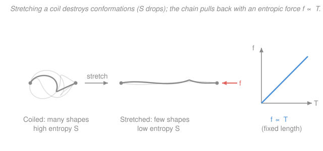

# Polymer & Materials Chemistry · Lesson 3.4: Rubber elasticity — the entropic spring

> ⏱ ~15 min · Module 3: Solid-State & Thermal Properties · Builds on: [2.3 The random coil](02-03-random-coil-end-to-end-distance.md), [`stat-mech` free energy & entropy](../../stat-mech/syllabus.md) · Unlocks: Module 4 — [4.3 Viscoelasticity & rheology](04-03-viscoelasticity-rheology.md)

## Why this matters

Stretch a steel spring and you're prying atoms apart against their bonds — you store *energy*. Stretch a rubber band and almost nothing energetic happens: the bonds barely move. So what pulls it back? **Entropy.** A rubber band is a spring made of disorder, and once you see that, three "paradoxes" fall out for free — its stiffness *grows* with temperature, a stretched band *contracts* when you heat it, and stretching it fast makes it warm. This is the cleanest example in all of materials science of a force with no energy behind it, and it closes Module 3 by tying chain statistics straight to thermodynamics.

## The idea

Take one chain from [Lesson 2.3](02-03-random-coil-end-to-end-distance.md). Left alone, it's a random coil — and the reason it *is* a coil is pure counting: there are astronomically many crumpled shapes with the two ends near each other, and very few stretched-out shapes with the ends far apart. The coil isn't pulled inward by any force; it's just overwhelmingly *likely* to be crumpled, because crumpled has more ways to happen.

Now grab the two ends and pull them apart. You're forcing the chain into that rare, stretched-out regime — you've thrown away almost all of its available shapes. Fewer shapes means lower **entropy**. And nature charges you for lowering entropy: the chain pushes back, trying to return to the high-entropy crumpled state. That push-back *is* the retractive force. No bond was stretched; you simply reduced the chain's freedom, and it wants it back.

That single idea explains the weird thermal behavior. Entropy's grip is stronger when it's hotter (the free energy is $-TS$, so entropy's pull scales with $T$). So a hotter rubber band is a *stiffer* spring — the opposite of a metal, which softens when heated. Feel it yourself: stretch a rubber band against your lip and it warms; let it snap back and it cools.

## The formal version

**Single-chain entropy.** From [2.3](02-03-random-coil-end-to-end-distance.md), an ideal chain of $N$ segments of length $b$ has a Gaussian distribution of end-to-end vectors, $P(\mathbf R) \propto \exp\!\big(\!-\tfrac{3R^2}{2Nb^2}\big)$, where $R = |\mathbf R|$ is the end-to-end distance (m). The number of conformations at a given $\mathbf R$ is proportional to $P(\mathbf R)$, so by Boltzmann's $S = k_B \ln \Omega$ (see [`stat-mech`](../../stat-mech/syllabus.md)),

$$S(R) = S_0 - \frac{3k_B R^2}{2Nb^2},$$

with $k_B = 1.38\times10^{-23}\ \mathrm{J/K}$ the Boltzmann constant and $S_0$ a constant. *In words: the farther apart you hold the ends, the fewer shapes remain, so the entropy falls off as $R^2$.*

**Free energy and force.** An ideal chain has no conformation-dependent internal energy — every shape costs the same bond energy — so $U$ is constant in $R$ and the Helmholtz free energy is *all entropy*:

$$A(R) = U - TS = A_0 + \frac{3k_B T}{2Nb^2}R^2.$$

*In words: pulling the ends apart costs free energy purely because it costs entropy.* The force needed to hold the ends at separation $R$ is the slope of this energy:

$$\boxed{\,f = \frac{\partial A}{\partial R} = -T\frac{\partial S}{\partial R} = \frac{3k_B T}{Nb^2}\,R\,}$$

*In words: the chain is a Hookean spring — force proportional to extension — but its spring constant $k_{\text{ch}} = 3k_B T/(Nb^2)$ is made of temperature, not stiffness of bonds.* This is an **entropic spring**: same $f = kR$ form as [SHM's Hooke's law](../../mechanics-refresher/syllabus.md), but $k_{\text{ch}} \propto T$.

**Why $f\propto T$ is the fingerprint of entropy.** Writing $dA = -S\,dT + f\,dR$ gives the Maxwell relation

$$\left(\frac{\partial f}{\partial T}\right)_{\!R} = -\left(\frac{\partial S}{\partial R}\right)_{\!T}.$$

*In words: tension rises with temperature exactly to the extent that stretching lowers entropy.* For an ideal chain the entropy term is everything, so tension is strictly proportional to $T$ — a purely energetic spring (a metal) would show $(\partial f/\partial T)_R \approx 0$ instead.

**From one chain to a network.** A rubber is a *network*: chains crosslinked into strands so the material can't flow. If $\nu_c$ is the number density of elastically active strands (strands per unit volume, $\mathrm{m}^{-3}$), summing the single-chain free energies over an affine (uniform) deformation gives a shear modulus

$$G = \nu_c\, k_B T, \qquad \nu_c = \frac{\rho N_A}{M_c},$$

with $\rho$ the density, $N_A = 6.022\times10^{23}\ \mathrm{mol^{-1}}$, and $M_c$ the molar mass between crosslinks. *In words: rubber's stiffness is just $k_B T$ per network strand per unit volume — more crosslinks (smaller $M_c$) or higher $T$ make it stiffer.* Under uniaxial stretch ratio $\lambda$, the engineering stress is $\sigma = G(\lambda - \lambda^{-2})$.

**Thermoelastic inversion (briefly).** Real rubbers also expand thermally and have a small energetic elasticity, so at *very small* strains ordinary thermal expansion can make tension *drop* with $T$ before the entropic term takes over. The crossover (near ~10% strain) is the **thermoelastic inversion point**; above it, $f\propto T$ wins and the entropic picture holds.

## Picture

## Worked examples

**Example 1 — the single-chain entropic spring.** A network strand has $N = 100$ segments of length $b = 0.5\ \mathrm{nm}$. Hold its ends at $R = 10\ \mathrm{nm}$ at body temperature $T = 300\ \mathrm{K}$. What retractive force does it exert?

First a sanity check on the stretch: the *relaxed* RMS size is $\sqrt{Nb^2} = \sqrt{100}\times 0.5 = 5\ \mathrm{nm}$, so $R = 10\ \mathrm{nm}$ is a factor-of-two stretch — modest, still safely Gaussian. Now plug in, with $k_B T = 1.38\times10^{-23}\times 300 = 4.14\times10^{-21}\ \mathrm{J}$ and $Nb^2 = 100\times(0.5\times10^{-9})^2 = 2.5\times10^{-17}\ \mathrm{m^2}$:

$$f = \frac{3k_B T}{Nb^2}R = \frac{3\,(4.14\times10^{-21})}{2.5\times10^{-17}}\,(1.0\times10^{-8}) = (4.97\times10^{-4}\ \mathrm{N/m})(1.0\times10^{-8}\ \mathrm{m}) \approx 5.0\times10^{-12}\ \mathrm{N}.$$

So $f \approx 5\ \mathrm{pN}$ — piconewtons, the natural scale of single-molecule forces. The spring constant $k_{\text{ch}} \approx 0.5\ \mathrm{mN/m}$ is tiny, and it would grow if we warmed the chain.

**Example 2 — the heating paradox.** A rubber band holds up a fixed weight (so the *force* $f$ is fixed, set by the load). You warm it from $T_1 = 300\ \mathrm{K}$ to $T_2 = 330\ \mathrm{K}$. Does it lengthen or shorten — and how does a steel wire under the same load behave?

Rearrange the spring law for the extension at fixed force: $R = \dfrac{f\,Nb^2}{3k_B T} \propto \dfrac{1}{T}$. With $f$ held constant by the weight,

$$\frac{R_2}{R_1} = \frac{T_1}{T_2} = \frac{300}{330} \approx 0.91.$$

The elastic extension **shrinks by ~9%: the loaded rubber band contracts and lifts the weight when heated.** Physically, heating strengthens entropy's pull ($f\propto T$ at fixed length means the band now pulls *harder* than the load), so it retracts until the tension rematches the weight. A steel wire does the opposite: it has ordinary positive thermal expansion and energetic (bond) elasticity, so it *lengthens* when heated and the weight drops. Rubber and metal move in opposite directions under heat — the tell-tale sign that rubber's elasticity is entropic.

## Watch out

- **You might think stretching rubber stores energy in strained bonds, like a metal spring.** For an ideal rubber it doesn't — $U$ is independent of shape, and the entire restoring force is $-T\,\partial S/\partial R$. (Real rubbers have a small energetic component; that's what thermoelastic inversion exposes at low strain.)
- **You might expect heat to soften rubber and make it expand, as it does almost everything else.** Under load a rubber band *contracts* on heating, and at fixed length its tension and modulus both *rise* ($G = \nu_c k_B T \propto T$). Hotter entropy pulls harder.
- **This all lives above $T_g$.** Below the glass transition ([3.1](03-01-glass-transition.md)) the strands are frozen, segmental motion is dead, and the material is a hard glass — no entropic spring. Rubber elasticity needs mobile chains between crosslinks.

## One-liner

> Rubber pulls back not because you stretched its bonds but because you stole its disorder — an entropic spring whose stiffness is $k_B T$ per strand, so it pulls harder when it's hotter.

## Problems

**P1 (🟢)** A single network strand has $N = 150$ segments with $b = 0.4\ \mathrm{nm}$, held at end-to-end distance $R = 8\ \mathrm{nm}$ and temperature $T = 310\ \mathrm{K}$. Compute the retractive force $f$. ($k_B = 1.38\times10^{-23}\ \mathrm{J/K}$.)

**P2 (🟡)** A crosslinked rubber has shear modulus $G = 0.40\ \mathrm{MPa}$ at $T = 300\ \mathrm{K}$ and density $\rho = 900\ \mathrm{kg/m^3}$. (a) Find the number density of network strands $\nu_c$ and the molar mass between crosslinks $M_c$. (b) The rubber is clamped at fixed length and heated to $350\ \mathrm{K}$. By what factor does its tension (and modulus) change, and which way?

**P3 (🔴, ties to `stat-mech`)** Starting from $A(R,T) = A_0(T) + \dfrac{3k_B T}{2Nb^2}R^2$ for an ideal chain (recall $U$ is independent of $R$): (a) obtain $f$ and show $\left(\partial f/\partial T\right)_R = f/T$, hence $f\propto T$. (b) In one sentence, use the fact that stretching lowers conformational entropy to explain why yanking a rubber band quickly (adiabatically) warms it.

Solutions

**P1** Assemble the pieces: $k_B T = 1.38\times10^{-23}\times 310 = 4.28\times10^{-21}\ \mathrm{J}$, and $Nb^2 = 150\times(0.4\times10^{-9})^2 = 150\times 1.6\times10^{-19} = 2.4\times10^{-17}\ \mathrm{m^2}$. Then

$$f = \frac{3k_B T}{Nb^2}R = \frac{3\,(4.28\times10^{-21})}{2.4\times10^{-17}}\,(8\times10^{-9}) = (5.35\times10^{-4}\ \mathrm{N/m})(8\times10^{-9}\ \mathrm{m}) \approx 4.3\times10^{-12}\ \mathrm{N}.$$

So $f \approx 4.3\ \mathrm{pN}$. *Check.* Units: $(\mathrm{J})/(\mathrm{m^2})\times\mathrm{m} = \mathrm{J/m} = \mathrm{N}$ ✓. Same piconewton scale as the worked example, as expected for a single stretched chain.

**P2 (a)** Invert $G = \nu_c k_B T$:

$$\nu_c = \frac{G}{k_B T} = \frac{0.40\times10^{6}}{4.14\times10^{-21}} \approx 9.7\times10^{25}\ \mathrm{strands/m^3}.$$

Then $M_c = \dfrac{\rho N_A}{\nu_c} = \dfrac{900\times 6.022\times10^{23}}{9.7\times10^{25}} \approx 5.6\ \mathrm{kg/mol} = 5600\ \mathrm{g/mol}.$ (A crosslink every ~5600 g/mol of chain — a lightly crosslinked elastomer.) *Check.* Units: $(\mathrm{Pa})/(\mathrm{J}) = (\mathrm{J/m^3})/\mathrm{J} = \mathrm{m^{-3}}$ ✓ for $\nu_c$; $(\mathrm{kg/m^3})(\mathrm{mol^{-1}})/(\mathrm{m^{-3}}) = \mathrm{kg/mol}$ ✓ for $M_c$.

**(b)** Both $f|_L$ and $G$ scale as $T$, so heating $300\to 350\ \mathrm{K}$ raises them by the factor $350/300 \approx 1.17$ — a **~17% increase**: the clamped band pulls harder and gets stiffer as it warms. This is the entropic signature; a metal would barely change (or soften).

**P3 (a)** Differentiate at fixed $T$:

$$f = \left(\frac{\partial A}{\partial R}\right)_T = \frac{3k_B T}{Nb^2}R.$$

Now differentiate that with respect to $T$ at fixed $R$: $\left(\dfrac{\partial f}{\partial T}\right)_R = \dfrac{3k_B}{Nb^2}R = \dfrac{f}{T}$. A quantity whose $T$-derivative equals itself over $T$ is linear through the origin, so $f\propto T$. (Equivalently, via the Maxwell relation $(\partial f/\partial T)_R = -(\partial S/\partial R)_T$: stretching lowers $S$, so the right side is positive and tension rises with $T$.)

**(b)** Stretching drops the chain's conformational entropy ($\Delta S_{\text{conf}} < 0$); in a fast adiabatic stretch the total entropy can't change, so the *thermal* entropy must rise to compensate — and more thermal entropy means a higher temperature, so the band warms.

## Flashback

**From Lesson 2.3 (random-coil end-to-end distance).** A freely jointed chain has $N = 2500$ segments of length $b = 0.3\ \mathrm{nm}$. Compute (i) the RMS end-to-end distance $\sqrt{\langle R^2\rangle}$ and (ii) the fully extended contour length $L = Nb$, then state the ratio. (Fresh numbers.)

Solution

(i) For an ideal freely jointed chain, $\langle R^2\rangle = Nb^2$, so

$$\sqrt{\langle R^2\rangle} = \sqrt{N}\,b = \sqrt{2500}\times 0.3\ \mathrm{nm} = 50\times 0.3 = 15\ \mathrm{nm}.$$

(ii) $L = Nb = 2500\times 0.3 = 750\ \mathrm{nm}$. Ratio: $\dfrac{\sqrt{\langle R^2\rangle}}{L} = \dfrac{15}{750} = 0.02$. *Check.* The coil's typical size is only 2% of its stretched-out length — a walk of $N$ steps drifts $\sqrt{N}$, not $N$ — which is exactly why so few conformations are stretched, and therefore why pulling the ends apart costs entropy. That entropy cost is the retractive force of this whole lesson.

## Connections

- **Backward:** the entire result rests on [2.3](02-03-random-coil-end-to-end-distance.md)'s Gaussian coil — the $\exp(-3R^2/2Nb^2)$ that counts conformations becomes, through $S = k_B\ln\Omega$, the entropy $S(R)$ we differentiated. And rubber elasticity only exists *above* the [glass transition](03-01-glass-transition.md) (3.1), where strands are mobile. This closes Module 3.
- **Forward:** [4.3 Viscoelasticity & rheology](04-03-viscoelasticity-rheology.md) keeps the entropic-spring idea but lets the crosslinks be temporary *entanglements* that slip over time — an elastic network at short times, a flowing liquid at long times, with the modulus $G = \nu_c k_B T$ reappearing as the rubbery plateau.
- **Sideways (`stat-mech` / `thermodynamics-physics`):** this is a textbook use of $A = U - TS$ and the Maxwell relation from $dA = -S\,dT + f\,dR$ ([`stat-mech`](../../stat-mech/syllabus.md), [`thermodynamics-physics`](../../thermodynamics-physics/syllabus.md)). Rubber is the mechanical mirror of the ideal gas: an ideal gas's *pressure* is entirely entropic ($P = -T(\partial S/\partial V)_T$), and rubber's *tension* is entirely entropic ($f = -T(\partial S/\partial R)_T$) — same physics, one pushing on a piston, the other pulling on a chain.
