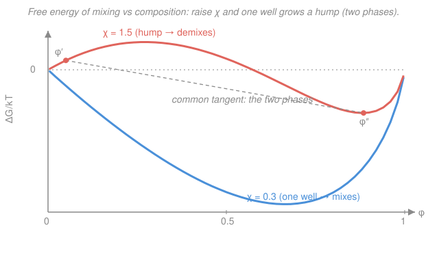

# Polymer & Materials Chemistry · Lesson 4.1: Polymer solutions & Flory–Huggins theory

> ⏱ ~15 min · Module 4: Solutions, Rheology & Functional Polymers · Builds on: [2.4 Radius of gyration & excluded volume](02-04-radius-of-gyration-excluded-volume.md), [`stat-mech`](../../stat-mech/syllabus.md) · Unlocks: [4.2 Solvent quality, theta & phase separation](04-02-solvent-quality-theta-phase-separation.md)

## Why this matters

Sugar dissolves in water without a second thought; polystyrene sits in that same water as a stubborn lump. Both are "just molecules" — so why does *connecting monomers into a chain* turn a happy solute into one that refuses to mix? Flory–Huggins theory answers this with one lattice count and one interaction parameter, and the punchline is a single factor of $1/N$: a chain of $N$ monomers moves as **one** object, not $N$ free ones, so it gains almost no entropy from dissolving. That one insight explains solubility, swelling, membranes, paints, drug formulation, and why "like dissolves like" is really a statement about $\chi$.

## The idea

Mixing is a tug-of-war between two urges. **Entropy** wants everything spread out and jumbled — disorder is favorable, so it pushes *toward* mixing. **Energy** (enthalpy) asks whether A-likes-B contacts are as comfortable as A-likes-A and B-likes-B contacts; if unlike neighbors are uncomfortable, energy pushes *against* mixing. Whichever wins decides whether a solution stays one clear phase or splits into two.

Here is the twist that makes polymers special. Picture a checkerboard of cells (a **lattice**), and drop molecules onto it so every cell is filled. Small solvent molecules each grab one cell and can sit *anywhere* — enormous freedom, huge entropy. Now glue $N$ of those units into a chain: the beads must stay adjacent, so once you place the first one, the rest are nearly pinned. You have replaced $N$ independent choices with essentially **one** choice. The chain still counts as $N$ cells' worth of material but contributes the translational entropy of a *single* particle. Long chains therefore bring almost nothing to the entropy side of the tug-of-war — so even a mild dislike between chain and solvent (a modest energy penalty) is enough to win, and the polymer refuses to dissolve. That missing entropy, killed by connectivity, is the whole story.

## The formal version

Let $\phi$ be the **volume fraction** of polymer (fraction of lattice cells occupied by chain segments), so $1-\phi$ is the solvent fraction. Let $N$ be the number of lattice segments per chain (its degree of polymerization), and $k_B$ Boltzmann's constant. Everything below is *per lattice site*, which is why the answer is universal.

**Entropy of mixing.** Counting the ways to arrange solvent molecules and chains on the lattice gives

$$\frac{\Delta S_{mix}}{k_B} = -\left[\frac{\phi}{N}\ln\phi + (1-\phi)\ln(1-\phi)\right].$$

*In words: each species contributes (its fraction) × (log of its fraction), but the polymer's term is divided by $N$ — because one chain, not $N$ monomers, does the wandering.* Both logs are negative, so $\Delta S_{mix} > 0$: mixing always *gains* entropy. But as $N\to\infty$ the polymer term $\frac{\phi}{N}\ln\phi \to 0$, and only the solvent term survives — the entropic drive to mix nearly vanishes for long chains.

**Enthalpy of mixing.** Each polymer–solvent contact costs an energy relative to the average of like–like contacts. Bundle all of that lattice bookkeeping into one dimensionless number, the **Flory (chi) parameter** $\chi$:

$$\frac{\Delta H_{mix}}{k_B T} = \chi\,\phi(1-\phi).$$

*In words: the energy penalty is proportional to the number of unlike (polymer–solvent) contacts, which is largest at 50/50 and zero at either pure limit.* Here $T$ is temperature. $\chi > 0$ means unlike contacts are unfavorable (the usual case); $\chi = 0$ means the polymer can't tell solvent from itself; $\chi < 0$ means it actively *likes* solvent.

**Free energy of mixing.** Combine them through $\Delta G_{mix} = \Delta H_{mix} - T\,\Delta S_{mix}$:

$$\boxed{\;\frac{\Delta G_{mix}}{k_B T} = \frac{\phi}{N}\ln\phi + (1-\phi)\ln(1-\phi) + \chi\,\phi(1-\phi)\;}$$

*In words: the two negative log terms (entropy) pull the free energy down toward mixing; the positive $\chi$ term (energy) pushes it up toward demixing.* Whether the mixture is stable at a given $\phi$ is read off the **shape** of this curve — a single downward well means one happy phase; a curve with a hump (two wells joined by a common tangent) means the system lowers its energy by splitting into a dilute and a concentrated phase.

**Where $\chi$ comes from — solubility parameters.** For non-polar systems you can estimate $\chi$ from **Hildebrand solubility parameters** $\delta$, where $\delta = \sqrt{E_{coh}/V}$ is the square root of the cohesive energy density (how strongly a substance sticks to itself, units $\mathrm{MPa}^{1/2}$):

$$\chi \approx \chi_S + \frac{V_{\text{site}}}{RT}\,(\delta_p - \delta_s)^2,$$

with $\delta_p,\delta_s$ the polymer and solvent parameters, $V_{\text{site}}$ a reference (segment) molar volume, $R$ the gas constant, and $\chi_S \approx 0.34$ a small empirical entropic offset. *In words: the closer the two materials' "self-stickiness," the smaller $\chi$ — the quantitative version of "like dissolves like."* Note the square: mismatch of either sign costs you, so a solvent is best when $\delta_s$ matches $\delta_p$.

## Picture

Both curves are for $N=100$. At $\chi = 0.3$ (blue) the free energy is one smooth valley — every composition is stable, so the polymer dissolves at all concentrations. At $\chi = 1.5$ (coral) a **hump** has appeared: the dashed **common tangent** touches the curve at two compositions $\phi'$ (dilute) and $\phi''$ (concentrated). Any overall mixture between them lowers its free energy by splitting into those two coexisting phases — the polymer has "come out of solution." Raising $\chi$ (or, usually, lowering $T$) is what grows the hump; *finding exactly when it first appears is the critical point, and that is [Lesson 4.2](04-02-solvent-quality-theta-phase-separation.md)'s job.*

## Worked examples

**Example 1 (the $1/N$ shrinking act).** Take a fixed dilute composition $\phi = 0.1$ and a fixed $\chi = 0.4$. Watch each term as the chain grows.

The enthalpy term never changes with $N$:

$$\frac{\Delta H_{mix}}{k_B T} = \chi\,\phi(1-\phi) = 0.4 \times 0.1 \times 0.9 = 0.0360.$$

The entropy term has two pieces, $\frac{\phi}{N}\ln\phi$ (polymer) and $(1-\phi)\ln(1-\phi)$ (solvent). The solvent piece is fixed:

$$(1-\phi)\ln(1-\phi) = 0.9\ln(0.9) = 0.9(-0.1054) = -0.0948.$$

The polymer piece $\frac{\phi}{N}\ln\phi = \frac{0.1}{N}\ln(0.1) = \frac{-0.2303}{N}$ collapses as $N$ grows:

| $N$ | $\frac{\phi}{N}\ln\phi$ | $\dfrac{\Delta G_{mix}}{k_BT} = \frac{\phi}{N}\ln\phi + (1-\phi)\ln(1-\phi) + \chi\phi(1-\phi)$ |
|---|---|---|
| $1$ | $-0.2303$ | $-0.2303 - 0.0948 + 0.0360 = -0.2891$ |
| $10$ | $-0.0230$ | $-0.0819$ |
| $100$ | $-0.0023$ | $-0.0611$ |
| $1000$ | $-0.0002$ | $-0.0591$ |

At $N=1$ the polymer's own entropy contributes $-0.23$ — a big shove toward mixing. By $N=1000$ it contributes $-0.0002$, essentially nothing: the driving force has flattened from $-0.289$ to $-0.059$, five times weaker, and it's still barely negative only because the *solvent* keeps gaining entropy. That thinning margin is exactly why a slightly larger $\chi$ would tip a long chain over into demixing while leaving a small molecule comfortably dissolved.

**Example 2 (small molecule vs. polymer at the same $\chi$).** How dislike-tolerant is each? A mixture stays fully miscible until $\chi$ reaches its **critical** value, which the lattice model gives as

$$\chi_c = \tfrac{1}{2}\left(1 + N^{-1/2}\right)^2.$$

(We take this result as given here; it is derived in [4.2](04-02-solvent-quality-theta-phase-separation.md).) Evaluate it at the two extremes:

$$N = 1:\quad \chi_c = \tfrac12(1+1)^2 = 2.0, \qquad\qquad N = 1000:\quad \chi_c = \tfrac12(1+0.0316)^2 = 0.532.$$

So a small-molecule solvent ($N=1$) tolerates unlike contacts all the way up to $\chi = 2$ before it demixes, while a polymer of $N=1000$ throws in the towel at $\chi \approx 0.53$ — barely above the $\chi = \tfrac12$ that marks a merely-indifferent solvent. Now pick any $\chi$ *between* those thresholds, say $\chi = 0.55$:

- **Small molecule** ($N=1$): $0.55 \ll 2.0$, so it is far from critical — dissolves completely, one phase.
- **Polymer** ($N=1000$): $0.55 > 0.532$, past critical — the free-energy curve has grown a hump and the chain **phase-separates** into a dilute and a concentrated layer.

Same chemistry, same $\chi$, opposite fate — decided entirely by the $1/N$ that gutted the chain's mixing entropy. As $N\to\infty$, $\chi_c \to \tfrac12$: the threshold hits its floor, so essentially *any* net dislike ($\chi > \tfrac12$) demixes a long enough polymer. This is why high-molecular-weight polymers are notoriously hard to dissolve.

## Watch out

- **You might think $\Delta S_{mix} > 0$ guarantees mixing.** It doesn't — mixing needs $\Delta G_{mix} = \Delta H_{mix} - T\Delta S_{mix} < 0$ *and* a curve with no hump. A positive entropy that's tiny (large $N$) is easily overpowered by a positive $\chi$ term.
- **You might read "$\Delta G_{mix} < 0$ at my composition" as "stable."** Sign isn't enough — stability is about **curvature**. A point can sit on a downward curve yet still lie under a common tangent, meaning the system lowers energy further by splitting. It's the hump, not the sign, that signals phase separation.
- **You might treat $\chi$ as a pure energy.** In practice $\chi$ absorbs a small entropic piece too (the $\chi_S \approx 0.34$ offset) and drifts with temperature and even concentration. Usually $\chi \propto 1/T$, so *cooling* a solution raises $\chi$ and can trigger demixing — the everyday "it precipitated when it got cold."

## One-liner

> Chaining $N$ monomers together divides their mixing entropy by $N$, so the tiniest energetic dislike ($\chi > \tfrac12$) is enough to keep a long polymer from dissolving.

## Problems

**P1 (🟢)** For a polymer solution with $\phi = 0.2$, $\chi = 0.5$, and $N = 50$, compute $\dfrac{\Delta G_{mix}}{k_BT}$. Then state which single term you would change, and in which direction, to make mixing *more* favorable.

**P2 (🟡)** A polymer has solubility parameter $\delta_p = 18.5\ \mathrm{MPa}^{1/2}$. Solvent A has $\delta_A = 18.0$ and solvent B has $\delta_B = 15.0\ \mathrm{MPa}^{1/2}$. Using $\chi \approx 0.34 + \frac{V_{\text{site}}}{RT}(\delta_p-\delta_s)^2$ with $V_{\text{site}} = 100\ \mathrm{cm^3/mol}$, $R = 8.314\ \mathrm{J\,mol^{-1}K^{-1}}$, $T = 298\ \mathrm{K}$, compute $\chi$ for each solvent. For a long chain ($\chi_c \to \tfrac12$), which solvent dissolves the polymer? (Note: $1\ \mathrm{MPa}^{1/2}\!\cdot\!\mathrm{MPa}^{1/2}\cdot\mathrm{cm^3/mol} = 1\ \mathrm{J/mol}$, since $1\ \mathrm{MPa} = 1\ \mathrm{J/cm^3}$.)

**P3 (🔴, optional)** Show from the entropy term that in the limit $N\to\infty$ the polymer's contribution to $\Delta S_{mix}/k_B$ vanishes for any fixed $\phi \in (0,1)$, and explain in one sentence why the solvent term does *not* vanish. Connect this to the coil picture from [2.4](02-04-radius-of-gyration-excluded-volume.md): what physical object is the "one particle" whose translational entropy we keep?

Solutions

**P1** Plug in $\phi = 0.2$, $N = 50$, $\chi = 0.5$:

$$\frac{\phi}{N}\ln\phi = \frac{0.2}{50}\ln(0.2) = 0.004 \times (-1.6094) = -0.00644,$$
$$(1-\phi)\ln(1-\phi) = 0.8\ln(0.8) = 0.8(-0.2231) = -0.17851,$$
$$\chi\phi(1-\phi) = 0.5 \times 0.2 \times 0.8 = 0.08000.$$

Sum:

$$\frac{\Delta G_{mix}}{k_BT} = -0.00644 - 0.17851 + 0.08000 = -0.1050.$$

Negative, so it mixes at this composition. To make mixing *more* favorable, **lower $\chi$** (choose a better-matched solvent, or in most systems raise $T$): the entropy terms are already fixed by $\phi$ and $N$, and $\chi$ is the only knob that adds a *positive* (anti-mixing) contribution. Reducing it from $0.5$ toward $0$ drives $\Delta G_{mix}$ further down.

*Check.* The polymer entropy term ($-0.006$) is already nearly negligible next to the solvent's ($-0.179$) even at $N=50$ — the $1/N$ suppression at work.

**P2** The bracket $\frac{V_{\text{site}}}{RT} = \frac{100}{8.314 \times 298} = \frac{100}{2477.6} = 0.04036\ \mathrm{mol/J}$ (using the unit note, $\mathrm{cm^3/mol}$ times $\mathrm{MPa} = \mathrm{J/cm^3}$ gives $\mathrm{J/mol}$, cancelling $RT$'s $\mathrm{J/mol}$).

Solvent A: $(\delta_p-\delta_A)^2 = (18.5-18.0)^2 = 0.25\ \mathrm{MPa}$, so

$$\chi_A = 0.34 + 0.04036 \times 0.25 = 0.34 + 0.0101 = 0.350.$$

Solvent B: $(\delta_p-\delta_B)^2 = (18.5-15.0)^2 = 12.25\ \mathrm{MPa}$, so

$$\chi_B = 0.34 + 0.04036 \times 12.25 = 0.34 + 0.494 = 0.834.$$

For a long chain the threshold is $\chi_c \to \tfrac12$. Since $\chi_A = 0.35 < 0.5$, **solvent A dissolves** the polymer; $\chi_B = 0.83 > 0.5$, so **solvent B does not** — its $\delta$ is too far from the polymer's. This is "like dissolves like" made quantitative: the well-matched solvent (small $\delta$ mismatch) wins.

*Check.* The offset $\chi_S = 0.34$ alone is already near the $\tfrac12$ threshold, so even a small mismatch can push a long chain over — consistent with high-MW polymers being fussy about solvents.

**P3** Fix $\phi \in (0,1)$ and let $N\to\infty$. The two entropy pieces are

$$\frac{\Delta S_{mix}}{k_B} = -\frac{\phi}{N}\ln\phi - (1-\phi)\ln(1-\phi).$$

The polymer piece $-\frac{\phi}{N}\ln\phi$: since $\phi\ln\phi$ is a finite number, dividing by $N\to\infty$ sends it to $0$. So the polymer contributes nothing. The solvent piece $-(1-\phi)\ln(1-\phi)$ has **no** $1/N$ factor — solvent molecules are still individual free particles, each wandering over the whole lattice — so it stays finite. Hence in the limit $\Delta S_{mix}/k_B \to -(1-\phi)\ln(1-\phi) > 0$: mixing entropy comes *entirely* from the small solvent, not from the chain.

Physical link to [2.4](02-04-radius-of-gyration-excluded-volume.md): the "one particle" whose translational entropy survives is the **whole coil** — the random-walk blob of size $R_g$. All $N$ monomers are tied into that single object, so they share one center-of-mass to place, not $N$; connectivity is exactly what converts $N$ entropies into one.

## Flashback

**From Lesson 3.4 (Rubber elasticity: the entropic spring):** A single ideal chain of $N = 2500$ freely-jointed segments, each of length $b = 0.3\ \mathrm{nm}$, is held stretched to an end-to-end distance $x = 20\ \mathrm{nm}$ at $T = 300\ \mathrm{K}$. Using the entropic-spring result $f = \dfrac{3k_BT}{Nb^2}\,x$, find the retractive force. (Take $k_B = 1.38\times10^{-23}\ \mathrm{J/K}$.)

Solution

The chain acts as a linear spring with stiffness $\kappa = \dfrac{3k_BT}{Nb^2}$. First the denominator:

$$Nb^2 = 2500 \times (0.3\times10^{-9}\,\mathrm{m})^2 = 2500 \times 9\times10^{-20} = 2.25\times10^{-16}\ \mathrm{m^2}.$$

Numerator $3k_BT = 3 \times 1.38\times10^{-23} \times 300 = 1.242\times10^{-20}\ \mathrm{J}$. So

$$\kappa = \frac{1.242\times10^{-20}}{2.25\times10^{-16}} = 5.52\times10^{-5}\ \mathrm{N/m},$$

and with $x = 20\ \mathrm{nm} = 2.0\times10^{-8}\ \mathrm{m}$,

$$f = \kappa x = 5.52\times10^{-5} \times 2.0\times10^{-8} = 1.10\times10^{-12}\ \mathrm{N} \approx 1.1\ \mathrm{pN}.$$

*Check.* Piconewton-scale forces are exactly what single-molecule pulling experiments (optical tweezers) measure on stretched chains, and the force is purely entropic — it scales with $T$, not with any bond energy, the same entropy-drives-everything theme as this lesson's mixing entropy.

## Connections

- **Backward:** the surviving "one particle" of the entropy count is the random coil of [2.4](02-04-radius-of-gyration-excluded-volume.md) — connectivity that gave the coil its $R_g \sim N^{1/2}$ size is the same connectivity that divides the mixing entropy by $N$ here.
- **Forward:** [4.2](04-02-solvent-quality-theta-phase-separation.md) turns the $\chi$ term into a classification (good / theta / poor solvent), finds exactly when the hump appears (the critical point $\chi_c, \phi_c$), and links $\chi = \tfrac12$ back to the ideal-coil scaling — solvent quality *is* the excluded-volume sign of [2.4](02-04-radius-of-gyration-excluded-volume.md).
- **Sideways (statistical mechanics / thermodynamics):** the lattice count is the polymer version of the classic **entropy of mixing** for an ideal solution in [`stat-mech`](../../stat-mech/syllabus.md) and [`thermodynamics-physics`](../../thermodynamics-physics/syllabus.md) — set $N=1$ and Flory–Huggins collapses to the regular-solution model, with the $\chi$ term playing the role of the mean-field interaction energy those courses derive.
