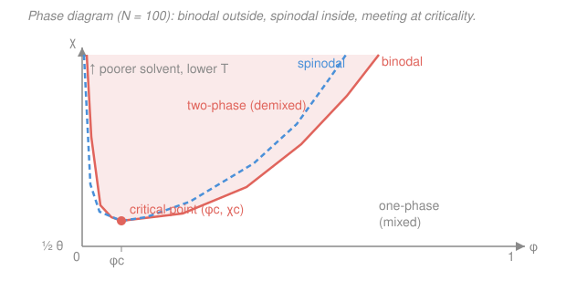

# Polymer & Materials Chemistry · Lesson 4.2: Solvent quality, theta conditions & phase separation

> ⏱ ~15 min · Module 4: Solutions, Rheology & Functional Polymers · Builds on: [4.1 Polymer solutions & Flory–Huggins](04-01-polymer-solutions-flory-huggins.md), [2.4 Radius of gyration & excluded volume](02-04-radius-of-gyration-excluded-volume.md) · Unlocks: [4.3 Viscoelasticity & rheology](04-03-viscoelasticity-rheology.md)

## Why this matters

A single number — the Flory–Huggins parameter $\chi$ — decides whether a dissolved chain fluffs open into a swollen cloud, coils up ideally, or clenches into a dense little ball, and whether the whole solution stays clear or splits into two milky layers. The same $\chi$ that set the free energy of mixing in [4.1](04-01-polymer-solutions-flory-huggins.md) now tells you the *solvent quality* and the *phase boundary*. The punchline is dramatic and specific to polymers: long chains phase-separate at the tiniest whiff of solvent dislike, at a polymer fraction that vanishes as the chains get longer.

## The idea

Think of a chain in solution as constantly voting on who it wants to touch. If a monomer would rather be next to solvent than next to another monomer, the chain spreads out to maximize its solvent contacts — a **good solvent**, and the coil *swells*. If a monomer would rather touch its own kind, the chain pulls in to hide from the solvent — a **poor solvent**, and the coil *collapses* toward a globule. Exactly between these, the monomer is indifferent: attractions and self-avoidance cancel, and the chain behaves like the pure random walk of [2.3](02-03-random-coil-end-to-end-distance.md) — the **theta ($\theta$) condition**.

That single knob is $\chi$: small $\chi$ = good, $\chi = \tfrac12$ = theta, large $\chi$ = poor. Turn it far enough and the chains stop merely shrinking — they give up on mixing altogether and the solution *demixes*, spitting out a polymer-rich phase and a nearly pure solvent phase. The geometry of that split is written into the shape of the free-energy curve $\Delta G_{mix}(\phi)$ from 4.1: where it bulges the wrong way, the solution can lower its energy by separating.

## The formal version

**Solvent quality and excluded volume.** The self-avoidance of a monomer — its **excluded volume** $v$ (the volume it forbids to others, from [2.4](02-04-radius-of-gyration-excluded-volume.md)) — is renormalized by solvent competition to

$$v \approx b^3\,(1 - 2\chi),$$

where $b$ is the segment length and $\chi$ the Flory–Huggins parameter. *In words: the effective push between two monomers is repulsive when $\chi<\tfrac12$, zero when $\chi=\tfrac12$, and attractive when $\chi>\tfrac12$.* This one sign controls the whole coil:

| Regime | Condition | Effective $v$ | Coil size scaling |
|---|---|---|---|
| **Good** | $\chi < \tfrac12$ | $>0$ (repulsive) | $R \sim N^{3/5}$ (swollen) |
| **Theta ($\theta$)** | $\chi = \tfrac12$ | $=0$ (screened) | $R \sim N^{1/2}$ (ideal) |
| **Poor** | $\chi > \tfrac12$ | $<0$ (attractive) | $R \sim N^{1/3}$ (globule) |

*In words: the Flory exponent $\nu$ in $R\sim N^\nu$ slides from $3/5$ down through $1/2$ to $1/3$ as the solvent worsens.* The $3/5$ and $1/2$ are exactly the good-solvent and ideal exponents of [2.4](02-04-radius-of-gyration-excluded-volume.md); the $1/3$ is new and comes from a collapsed ball of *constant density* — pack $N$ monomers at fixed density and its volume $\sim N$, so $R\sim N^{1/3}$. Sweeping $\chi$ through $\tfrac12$ (by cooling, usually) drives the **coil–globule transition**: a swollen coil continuously contracting into a dense globule.

**Phase separation from $\Delta G_{mix}$.** Recall the Flory–Huggins free energy of mixing per lattice site from [4.1](04-01-polymer-solutions-flory-huggins.md):

$$\frac{\Delta G_{mix}}{k_B T} = \underbrace{\frac{\phi}{N}\ln\phi + (1-\phi)\ln(1-\phi)}_{\text{entropy (mixing wants this)}} + \underbrace{\chi\,\phi(1-\phi)}_{\text{energy (large }\chi\text{ resists)}},$$

with $\phi$ the polymer volume fraction and $N$ the chain length (lattice sites per chain). Call it $f(\phi)$. A solution of overall composition $\phi$ splits into two phases $\phi'$ and $\phi''$ whenever that lowers the total free energy — read off the curve two ways:

- **Binodal (coexistence) — the common tangent.** The two coexisting compositions $\phi',\phi''$ are the points sharing one straight tangent line to $f(\phi)$: $f'(\phi')=f'(\phi'')$ and equal intercept. *In words: two phases coexist when they have equal chemical potentials — geometrically, one line kisses the curve at both.* These are the outermost boundary: outside it the solution is one stable phase.
- **Spinodal — the inflection.** Where the curve turns from cupping up to cupping down:

$$f''(\phi) = \frac{1}{N\phi} + \frac{1}{1-\phi} - 2\chi = 0 \quad\Longrightarrow\quad \boxed{\;\chi_s(\phi) = \frac{1}{2}\left(\frac{1}{N\phi} + \frac{1}{1-\phi}\right)\;}$$

*In words: where $f''<0$ the free energy curves the wrong way, so any tiny fluctuation lowers energy — the solution is unstable and demixes spontaneously (spinodal decomposition).* Between binodal and spinodal the solution is metastable (needs a nucleus).

**The critical point.** The binodal and spinodal meet at the top of the two-phase dome, where the two coexisting phases merge into one. It sits where $f''=f'''=0$. From $f'''=-\dfrac{1}{N\phi^2}+\dfrac{1}{(1-\phi)^2}=0$:

$$\phi_c = \frac{1}{1+\sqrt N}, \qquad \chi_c = \frac{1}{2}\left(1 + N^{-1/2}\right)^2.$$

*In words: as chains get longer ($N\to\infty$), $\chi_c\to\tfrac12$ and $\phi_c\to 0$.* Long chains phase-separate at the *tiniest* solvent dislike (barely past the theta point) and at a *vanishing* polymer fraction — the same $1/N$ entropy penalty that made polymers barely want to mix in 4.1 now makes them barely able to stay mixed.

## Picture

The critical point sits far to the left (small $\phi_c$) and just above $\chi=\tfrac12$ — the signature asymmetry of a polymer solution. Raising $\chi$ (cooling) pushes you up into the demixed region.

## Worked examples

**Example 1 (mechanical — critical point for $N=100$).** Locate the critical point and state the long-chain limit.

$$\phi_c = \frac{1}{1+\sqrt{100}} = \frac{1}{1+10} = \frac{1}{11} \approx 0.091,$$

$$\chi_c = \frac{1}{2}\left(1 + \frac{1}{\sqrt{100}}\right)^2 = \frac{1}{2}\left(1 + 0.1\right)^2 = \frac{1}{2}(1.21) = 0.605.$$

So a chain of 100 segments demixes once $\chi$ climbs past $0.605$, and the critical composition is only $9\%$ polymer. As $N\to\infty$: $\phi_c\to 0$ and $\chi_c\to\tfrac12$ — infinitely long chains phase-separate the instant the solvent turns even slightly poor, and do so at essentially zero polymer content. *That $\tfrac12$ is the theta value: for huge $N$, "theta" and "critical" collapse onto the same point.*

**Example 2 (why you'd care — classify by $\chi$, predict the coil).** A polymer of $N = 10^4$ sits in a solvent with $\chi = 0.45$. Since $\chi < \tfrac12$, this is a **good solvent**: excluded volume $v\propto(1-2\chi) = 0.10 > 0$, so monomers repel and the coil **swells** to $R\sim N^{3/5}$ instead of the ideal $N^{1/2}$. How much bigger? Compare exponents at $N=10^4$:

$$\frac{R_{\text{good}}}{R_{\text{ideal}}} \sim \frac{N^{3/5}}{N^{1/2}} = N^{1/10} = (10^4)^{0.1} = 10^{0.4} \approx 2.5.$$

The swollen coil is about $2.5\times$ larger in radius than the ideal chain — and that ratio *grows* with $N$, so swelling matters most for long chains.

Now cool the same solution until $\chi = 0.55 > \tfrac12$: a **poor solvent**. Excluded volume flips sign, $v\propto(1-2\chi)=-0.10<0$, monomers now attract, and the coil **collapses** toward a dense globule with $R\sim N^{1/3}$. It has passed through the coil–globule transition. Between them, at exactly $\chi = 0.50$, sits the theta point where the chain is ideal ($R\sim N^{1/2}$) — the same walk you first met in [2.3](02-03-random-coil-end-to-end-distance.md).

## Watch out

- **You might think $\chi = \tfrac12$ means "half-dissolved" or a weak solvent.** It's the razor's edge where monomer–monomer attraction *exactly cancels* excluded-volume repulsion, so the chain is ideal. It's not weak — it's *perfectly balanced*, and it's the reference against which "good" and "poor" are defined.
- **You might think the critical point sits at $\phi_c = \tfrac12$, as it does for two small molecules.** For polymers the entropy is lopsided — the chain contributes almost none ($\phi\ln\phi/N$ is tiny) — so the dome is pushed hard to the left: $\phi_c = 1/(1+\sqrt N)\to 0$. The critical mixture is nearly all solvent.
- **You might conflate the binodal and spinodal.** The binodal (common tangent) is the true coexistence boundary; between it and the inner spinodal ($f''=0$) the solution is *metastable* — one phase until a nucleus forms. Only inside the spinodal does it demix on its own, with no barrier.

## One-liner

> One knob, $\chi$: below $\tfrac12$ the coil swells ($N^{3/5}$), at $\tfrac12$ it's ideal ($N^{1/2}$), above it collapses ($N^{1/3}$) — and long chains cross into two-phase demixing the instant $\chi$ nudges past $\tfrac12$, at vanishing polymer fraction.

## Problems

**P1 (🟢)** A polymer has $N = 400$ lattice sites in a solvent. Compute the critical parameters $\chi_c$ and $\phi_c$, and state what each tends to as $N\to\infty$.

**P2 (🟡)** For the $N = 100$ solution, use the spinodal formula $\chi_s(\phi) = \tfrac12\!\left(\tfrac{1}{N\phi} + \tfrac{1}{1-\phi}\right)$ to find $\chi_s$ at $\phi = 0.20$. If the solvent is cooled to $\chi = 0.62$, is this composition inside the spinodal (spontaneously demixing) or not? (Recall $\chi_c = 0.605$ here.)

**P3 (🔴, optional)** In a poor solvent the collapsed globule has roughly constant internal monomer density $\rho$, independent of $N$. (a) Show this forces $R\sim N^{1/3}$. (b) For $N = 10^4$, estimate the ratio of the good-solvent coil radius ($\nu = 3/5$) to the collapsed globule radius ($\nu = 1/3$). This ties directly to the excluded-volume scaling of [2.4](02-04-radius-of-gyration-excluded-volume.md).

Solutions

**P1** With $N = 400$, $\sqrt N = 20$:

$$\phi_c = \frac{1}{1+\sqrt{400}} = \frac{1}{1+20} = \frac{1}{21} \approx 0.048,$$

$$\chi_c = \frac{1}{2}\left(1 + \frac{1}{20}\right)^2 = \frac{1}{2}(1.05)^2 = \frac{1}{2}(1.1025) = 0.551.$$

As $N\to\infty$: $\phi_c\to 0$ and $\chi_c\to\tfrac12$. *Check:* longer than the $N=100$ chain of Example 1, so it demixes even more easily ($\chi_c$ dropped $0.605\to0.551$, closer to $\tfrac12$) and at a smaller polymer fraction ($0.091\to0.048$). ✓

**P2** Plug $N=100$, $\phi = 0.20$ into the spinodal:

$$\chi_s = \frac{1}{2}\left(\frac{1}{100\times 0.20} + \frac{1}{1-0.20}\right) = \frac{1}{2}\left(\frac{1}{20} + \frac{1}{0.8}\right) = \frac{1}{2}(0.05 + 1.25) = \frac{1}{2}(1.30) = 0.65.$$

The composition is inside the spinodal only when $\chi > \chi_s$, i.e. when $f''<0$. Here $\chi = 0.62 < 0.65 = \chi_s$, so $f''>0$: the solution is *not* inside the spinodal — it is locally stable at this composition (metastable or one-phase). *Check:* $\chi = 0.62$ does exceed $\chi_c = 0.605$, so the system is above the critical point and a two-phase region exists — but at this particular $\phi=0.20$ you sit between the binodal and spinodal, not yet in the spontaneously-demixing core. ✓

**P3** (a) Constant density means $\rho = \dfrac{N}{\tfrac{4}{3}\pi R^3}$ is independent of $N$. Solving, $R^3 \propto N$, hence $R\sim N^{1/3}$. *In words: a space-filling ball of fixed packing must grow its radius as the cube root of the number of monomers.*

(b) Ratio of exponents at $N = 10^4$:

$$\frac{R_{\text{good}}}{R_{\text{globule}}} \sim \frac{N^{3/5}}{N^{1/3}} = N^{\,3/5 - 1/3} = N^{\,4/15} = (10^4)^{4/15} = 10^{16/15} \approx 10^{1.07} \approx 12.$$

The swollen good-solvent coil is roughly an order of magnitude ($\sim 12\times$) larger in radius than the collapsed globule of the *same* chain — the coil–globule transition is a dramatic size change, and it grows with $N$. *Check:* exponent $4/15 > 0$, so the gap widens with chain length, consistent with 2.4's message that self-avoidance matters more the longer the chain. ✓

## Flashback

**From Lesson 4.1 (Polymer solutions & Flory–Huggins):** For a solution with $N = 50$, $\phi = 0.20$, and $\chi = 0.30$, compute $\dfrac{\Delta G_{mix}}{k_B T}$ per lattice site using

$$\frac{\Delta G_{mix}}{k_B T} = \frac{\phi}{N}\ln\phi + (1-\phi)\ln(1-\phi) + \chi\,\phi(1-\phi).$$

Which of the two entropy terms is negligible, and what is the one-word reason?

Solution

Term by term:

$$\frac{\phi}{N}\ln\phi = \frac{0.20}{50}\ln(0.20) = 0.004 \times (-1.609) = -0.0064,$$
$$(1-\phi)\ln(1-\phi) = 0.80\,\ln(0.80) = 0.80 \times (-0.2231) = -0.1785,$$
$$\chi\,\phi(1-\phi) = 0.30 \times 0.20 \times 0.80 = +0.0480.$$

Sum: $-0.0064 - 0.1785 + 0.0480 = -0.137$. So $\dfrac{\Delta G_{mix}}{k_B T} \approx -0.14$ per site — negative, so the components mix here (as expected for small $\chi$).

The **polymer's** translational-entropy term ($-0.0064$) is negligible — about $28\times$ smaller than the solvent's ($-0.1785$). The one-word reason: **$1/N$**. Chaining $N$ monomers into one molecule divides their mixing entropy by $N$, so a long polymer contributes almost no entropy of mixing. That same suppression is exactly why $\phi_c = 1/(1+\sqrt N)\to 0$ in this lesson: with the polymer entropy gutted, only a hair of solvent dislike is needed to tip the balance toward demixing. ✓

## Connections

- **Backward:** the swelling ($N^{3/5}$), ideal ($N^{1/2}$), and excluded-volume ideas are lifted straight from [2.4](02-04-radius-of-gyration-excluded-volume.md) — this lesson just puts the sign of $v$ under the control of $\chi$ and adds the collapsed $N^{1/3}$ globule. The free-energy curve is [4.1](04-01-polymer-solutions-flory-huggins.md)'s $\Delta G_{mix}$, now mined for its curvature.
- **Forward:** [4.3 Viscoelasticity & rheology](04-03-viscoelasticity-rheology.md) works with concentrated solutions and melts, where solvent quality and coil size set how strongly chains overlap and entangle — the starting point for reptation and the $\eta\propto M^{3.4}$ scaling.
- **Sideways (materials & phase equilibria):** the common-tangent construction and the spinodal are the *same* tools that draw miscibility gaps in metal alloys and glasses — spinodal decomposition is a general phase-transition mechanism, treated in the [materials-science](../../materials-science/syllabus.md) and [physical-chemistry](../../physical-chemistry/syllabus.md) tracks. The equal-chemical-potential coexistence condition is the polymer version of the phase-equilibrium rule from classical thermodynamics.
