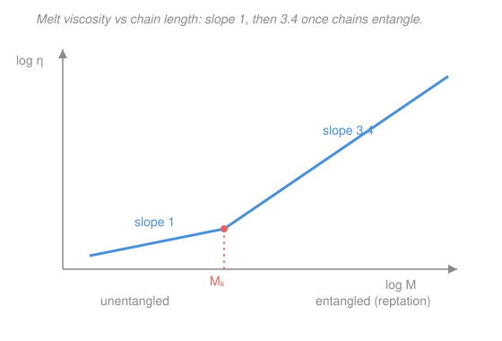

# Polymer & Materials Chemistry · Lesson 4.3: Viscoelasticity & polymer rheology

> ⏱ ~15 min · Module 4: Solutions, Rheology & Functional Polymers · Builds on: [3.4 Rubber elasticity](03-04-rubber-elasticity-entropic-spring.md), [4.1 Polymer solutions & Flory–Huggins](04-01-polymer-solutions-flory-huggins.md) · Unlocks: [4.4 Self-assembly & functional polymers](04-04-self-assembly-functional-polymers.md)

## Why this matters

Silly Putty bounces off the floor like a rubber ball, yet left on a table overnight it puddles like honey. Same material, opposite behavior — the only thing that changed is *how fast you poked it*. Every polymer melt and solid lives on this spectrum between spring and syrup, and where it sits depends on the timescale of the experiment. This lesson gives you the two-element mechanical models that capture it, the single dimensionless number that decides "solid or liquid," and the reason a modest increase in chain length makes a melt dramatically thicker — the $\eta \propto M^{3.4}$ law that governs why processing plastics is so sensitive to molecular weight.

## The idea

Two idealized responses bracket all of materials. A perfect **elastic solid** (a spring) stores energy: push it, it pushes back instantly, and it forgets nothing — release it and it snaps fully home. A perfect **viscous liquid** (a dashpot — a piston in oil) dissipates energy: push it and it flows, the *rate* of flow set by how hard you push, and it never springs back. Stress in a spring depends on how far you've deformed (strain); stress in a dashpot depends on how *fast* you're deforming (strain rate).

A polymer is **both at once**, and which face it shows depends on time. Poke it faster than the chains can rearrange and they respond like a tangle of stretched springs — elastic. Poke it slower than they can slither past one another and they flow — viscous. This time-dependence is **viscoelasticity**, and you probe it two ways: hold a fixed *strain* and watch the stress bleed away (**stress relaxation**), or hold a fixed *stress* and watch the strain creep upward (**creep**). Wire a spring and a dashpot together — in series or in parallel — and you reproduce each of these curves.

## The formal version

Let $\sigma$ be **stress** (force per area, Pa), $\varepsilon$ the **strain** (fractional deformation, dimensionless), $E$ the elastic **modulus** (stiffness, Pa), and $\eta$ the **viscosity** (resistance to flow, Pa·s). The two pure elements:

$$\sigma = E\,\varepsilon \quad(\text{spring}), \qquad \sigma = \eta\,\dot\varepsilon \quad(\text{dashpot}),$$

where $\dot\varepsilon = d\varepsilon/dt$ is the strain rate. *In words: a spring's stress tracks how far it is stretched; a dashpot's stress tracks how fast it is being stretched.*

**Maxwell model (spring + dashpot in series).** The two elements carry the *same* stress and their strains *add*. Differentiating and combining gives $\dot\varepsilon = \dot\sigma/E + \sigma/\eta$. Hold the strain fixed ($\dot\varepsilon = 0$, a stress-relaxation test) and solve:

$$\boxed{\;\sigma(t) = \sigma_0\, e^{-t/\tau}, \qquad \tau = \frac{\eta}{E}\;}$$

*In words: clamp a Maxwell material at fixed stretch and its stress decays exponentially, with a relaxation time $\tau$ set by viscosity over stiffness.* The dashpot slowly gives way, letting the spring unload. Big $\eta$ or small $E$ means slow relaxation. Maxwell captures a **liquid** (given forever, all stress relaxes to zero) with short-time elasticity.

**Kelvin–Voigt model (spring + dashpot in parallel).** Now the strains are *equal* and the stresses *add*: $\sigma = E\varepsilon + \eta\dot\varepsilon$. Apply a fixed stress $\sigma_0$ (a creep test) and solve:

$$\varepsilon(t) = \frac{\sigma_0}{E}\left(1 - e^{-t/\tau}\right), \qquad \tau = \frac{\eta}{E}.$$

*In words: load a Kelvin–Voigt material and it creeps toward its final strain exponentially, the dashpot delaying the spring.* Because the spring is always there, the strain saturates rather than running away — this is a **solid** with delayed (retarded) elasticity. (Real polymers need several such elements in combination, but these two capture the essential shapes.)

**The Deborah number.** Whether a material reads as solid or liquid is not intrinsic — it is the *ratio* of its internal relaxation time to your observation time:

$$\mathrm{De} = \frac{\tau}{t_{\text{obs}}}.$$

*In words: if the material relaxes slower than you look ($\mathrm{De}\gg 1$) it behaves as an elastic solid; if it relaxes faster than you look ($\mathrm{De}\ll 1$) it flows like a liquid.* The name comes from Deborah's song, "the mountains flowed" — given enough time, even rock creeps.

**Time–temperature superposition (WLF).** Raising temperature speeds up chain motion exactly like waiting longer — so a relaxation curve measured at temperature $T$ is the *same shape* as one at a reference $T_0$, just slid horizontally in $\log(\text{time})$ by a shift factor $a_T$. Near the glass transition (see [3.1](03-01-glass-transition.md)) the Williams–Landel–Ferry equation fits the shift:

$$\log a_T = \frac{-C_1 (T - T_0)}{C_2 + (T - T_0)},$$

with empirical constants $C_1, C_2$. *In words: measurements taken at many temperatures collapse onto one master curve spanning far more decades of time than any single experiment could reach* — you trade temperature for time.

**Entanglements and reptation.** Below a critical **entanglement molar mass** $M_e$, short chains slide past each other freely and the melt viscosity rises linearly, $\eta \propto M$. Above $M_e$, chains thread through one another and cannot cross; each is trapped in a virtual **tube** formed by its neighbors. Its only escape is to **reptate** — snake lengthwise out of the tube, end first, like pulling a strand of cooked spaghetti out of the pile. The theory predicts a reptation (disengagement) time $\tau_{\text{rep}} \propto M^{3}$, so since $\eta = G\,\tau_{\text{rep}}$ with a plateau modulus $G$ that is *independent* of $M$,

$$\eta \propto M^{3.4} \quad (M > M_e), \qquad \eta \propto M^{1} \quad (M < M_e).$$

*In words: once chains entangle, viscosity climbs as roughly the 3.4 power of chain length* — double the length and the melt gets ~10× thicker. The experimental exponent 3.4 slightly exceeds the ideal-tube prediction 3.0 (finite-length corrections), but the qualitative jump at $M_e$ is universal.

## Picture

## Worked examples

**Example 1 (Maxwell relaxation — read off the decay).** A polymer melt behaves as a single Maxwell element with modulus $E = 1\ \text{MPa} = 1\times 10^{6}\ \text{Pa}$ and viscosity $\eta = 1\times 10^{7}\ \text{Pa·s}$. It is suddenly stretched and held. Find the relaxation time and the fraction of stress remaining after $t = 20\ \text{s}$.

The relaxation time is viscosity over stiffness:

$$\tau = \frac{\eta}{E} = \frac{1\times 10^{7}\ \text{Pa·s}}{1\times 10^{6}\ \text{Pa}} = 10\ \text{s}.$$

(Units: $\text{Pa·s}/\text{Pa} = \text{s}$ ✓.) The stress follows $\sigma(t) = \sigma_0 e^{-t/\tau}$, so at $t = 20\ \text{s} = 2\tau$:

$$\frac{\sigma(20)}{\sigma_0} = e^{-20/10} = e^{-2} \approx 0.135.$$

About **13.5%** of the initial stress survives after two relaxation times — the rest has bled off through viscous flow.

**Example 2 (reptation scaling — the cost of doubling length).** A monodisperse melt sits well above $M_e$. Its molar mass is doubled. By what factor does the zero-shear viscosity change?

Above $M_e$ the melt obeys $\eta \propto M^{3.4}$, so a ratio of viscosities depends only on the ratio of molar masses:

$$\frac{\eta_2}{\eta_1} = \left(\frac{M_2}{M_1}\right)^{3.4} = 2^{3.4}.$$

Compute: $2^{3.4} = e^{3.4\ln 2} = e^{3.4\times 0.693} = e^{2.357} \approx 10.6.$

So doubling chain length makes the melt about **10.6× more viscous**. *The one-line tube reason:* a longer chain sits in a longer tube **and** diffuses along it more slowly, so the time to snake free grows far faster than length itself — steeply penalizing every extra monomer. This is why a small drift in molecular weight can wreck an injection-molding run.

## Watch out

- **You might think a material is "a solid" or "a liquid" as a fixed fact, but actually it depends on the timescale.** Silly Putty with $\tau \approx 1\ \text{s}$ is elastic to a fast bounce ($\mathrm{De}\gg 1$) and viscous to slow gravity ($\mathrm{De}\ll 1$). Glass, pitch, and Earth's mantle are all "liquids" on a long enough clock.
- **You might read $\eta \propto M^{3.4}$ as fundamental, but the clean prediction is the exponent 3 from the tube model** ($\tau_{\text{rep}}\propto M^3$). The measured 3.4 includes finite-chain corrections. Don't over-interpret the extra 0.4 — the physics is the near-cubic explosion, not the decimal.
- **You might confuse the two relaxation times $\tau$.** Both the Maxwell and Kelvin–Voigt $\tau$ equal $\eta/E$, but one governs *stress decay at fixed strain* and the other *strain growth at fixed stress*. They are duals, not the same measurement.

## One-liner

> A polymer is a spring on short timescales and a liquid on long ones — set by $\mathrm{De}=\tau/t_{\text{obs}}$ — and once chains entangle, viscosity climbs as $M^{3.4}$ because each chain must reptate out of its tube.

## Problems

**P1 (🟢)** A polymer is modeled as a single Maxwell element with $E = 2\times 10^{6}\ \text{Pa}$ and $\eta = 4\times 10^{8}\ \text{Pa·s}$. (a) Find the relaxation time $\tau$. (b) It is stretched and held; what fraction of the initial stress remains after $t = 400\ \text{s}$?

**P2 (🟡)** Silly Putty has a relaxation time $\tau \approx 1\ \text{s}$. Compute its Deborah number and classify its behavior (a) during a bounce, where the contact lasts $t_{\text{obs}} \approx 0.01\ \text{s}$, and (b) sitting on a desk for $t_{\text{obs}} = 1\ \text{hour}$. Explain the everyday observation each predicts.

**P3 (🔴, optional)** A melt above $M_e$ has zero-shear viscosity $\eta = 5\times 10^{4}\ \text{Pa·s}$. A process needs the viscosity below $1\times 10^{4}\ \text{Pa·s}$. Using $\eta \propto M^{3.4}$, by what factor must the molar mass be reduced? Then connect this to [3.4 Rubber elasticity](03-04-rubber-elasticity-entropic-spring.md): the entanglement network gives a melt a *rubbery plateau modulus* $G$ before it flows — what is the physical origin of that modulus, and how is it like a cross-linked rubber?

Solutions

**P1** (a) $\tau = \eta/E = (4\times 10^{8})/(2\times 10^{6}) = 200\ \text{s}$ (units $\text{Pa·s}/\text{Pa}=\text{s}$ ✓). (b) $t = 400\ \text{s} = 2\tau$, so

$$\frac{\sigma}{\sigma_0} = e^{-t/\tau} = e^{-400/200} = e^{-2} \approx 0.135.$$

About **13.5%** remains — same two-relaxation-time result as Example 1, since only the ratio $t/\tau$ matters.

**P2** $\mathrm{De} = \tau / t_{\text{obs}}$.

(a) Bounce: $\mathrm{De} = 1/0.01 = 100 \gg 1$. The putty relaxes far slower than the contact lasts, so it stores the impact elastically and springs back — **it bounces like a solid**.

(b) Desk, $t_{\text{obs}} = 1\ \text{hour} = 3600\ \text{s}$: $\mathrm{De} = 1/3600 \approx 2.8\times 10^{-4} \ll 1$. Now the material relaxes thousands of times over during observation, so it flows — **it slowly spreads into a puddle like a liquid**. Same material, opposite behavior, decided entirely by the timescale.

**P3** With $\eta \propto M^{3.4}$, the viscosity ratio fixes the molar-mass ratio:

$$\frac{\eta_2}{\eta_1} = \left(\frac{M_2}{M_1}\right)^{3.4} \;\Longrightarrow\; \frac{M_2}{M_1} = \left(\frac{\eta_2}{\eta_1}\right)^{1/3.4} = \left(\frac{1\times 10^{4}}{5\times 10^{4}}\right)^{1/3.4} = (0.2)^{0.294}.$$

Compute: $(0.2)^{0.294} = e^{0.294\ln 0.2} = e^{0.294\times(-1.609)} = e^{-0.473} \approx 0.62.$ So $M$ must drop to about **62% of its value** — a mere ~38% cut in molar mass buys a 5× drop in viscosity, the same steep leverage running in reverse.

*Connection to 3.4:* the rubbery plateau modulus comes from the *entanglements acting as temporary cross-links*. Just as a chemically cross-linked rubber resists deformation because stretching lowers the chains' conformational **entropy** (the entropic spring, $G = n k_B T$ with $n$ network strands per volume), an entangled melt resists *fast* deformation because the entanglements pin the chains into a transient network with $n$ set by the entanglement density. The difference is permanence: chemical cross-links never release, so a rubber is elastic forever; entanglements eventually slip by reptation, so a melt is only *temporarily* rubbery and then flows.

## Flashback

**From Lesson 3.4 (Rubber elasticity — the entropic spring):** A lightly cross-linked elastomer has a network strand density $n = 2.0\times 10^{26}\ \text{strands/m}^3$ at $T = 300\ \text{K}$. Estimate its shear modulus using the entropic-network result $G = n k_B T$ (Boltzmann constant $k_B = 1.38\times 10^{-23}\ \text{J/K}$). Would $G$ rise or fall if you warmed the rubber, and why?

Solution

$$G = n k_B T = (2.0\times 10^{26})(1.38\times 10^{-23})(300) \approx 8.3\times 10^{5}\ \text{Pa} \approx 0.83\ \text{MPa}.$$

(Units: $(\text{m}^{-3})(\text{J/K})(\text{K}) = \text{J/m}^3 = \text{Pa}$ ✓.) Because $G \propto T$, warming the rubber makes it **stiffer** — the hallmark of an *entropic* spring. The restoring force comes from the chains' tendency to return to their high-entropy coiled state, and thermal agitation strengthens that tendency, unlike an ordinary (energetic) solid that softens when heated. This is the same entanglement-network modulus that reappears above as the melt's rubbery plateau.

## Connections

- **Backward:** the rubbery plateau modulus is the entropic-spring modulus $G = n k_B T$ from [3.4](03-04-rubber-elasticity-entropic-spring.md), here supplied by entanglements rather than chemical cross-links; and the whole time–temperature story is anchored at the glass transition $T_g$ of [3.1](03-01-glass-transition.md), where chain motion freezes and relaxation times diverge.
- **Forward:** [4.4 Self-assembly & functional polymers](04-04-self-assembly-functional-polymers.md) builds on this flow-and-network picture — physical gels and block-copolymer domains are exactly transient networks whose lifetime (a Deborah-number question) decides whether they behave as solids or liquids.
- **Sideways (physics):** the Maxwell element is the same first-order relaxation $e^{-t/\tau}$ that governs an RC circuit discharging and a mass relaxing in a viscous medium — one linear differential equation wearing a rheology uniform, the mechanical analog of the exponential decay you meet in [`stat-mech`](../../stat-mech/syllabus.md) response theory.
