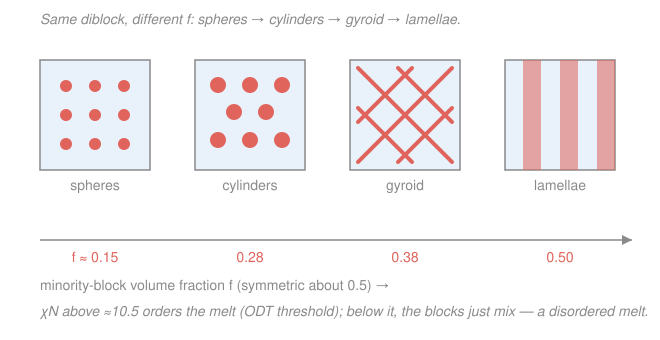

# Polymer & Materials Chemistry · Lesson 4.4: Self-assembly & functional polymers (a taste)

> ⏱ ~15 min · Module 4: Solutions, Rheology & Functional Polymers · Builds on: [4.2 Solvent quality, theta & phase separation](04-02-solvent-quality-theta-phase-separation.md), [4.3 Viscoelasticity & rheology](04-03-viscoelasticity-rheology.md) · Unlocks: course complete → [materials-science](../../materials-science/syllabus.md)

## Why this matters

Everything so far treated a polymer as *one* kind of chain and asked what a tangle of them does. Now flip the design knob: stitch **two** incompatible blocks into one chain, or make the chain *feel* its environment, and the material organizes itself — into 20-nanometer patterns you never drew, into hollow capsules that carry drugs, into a gel that dumps its water when you warm it a few degrees. Self-assembly is how nanotechnology gets structure for free, and it runs entirely on thermodynamics you already know: the same immiscibility that split a solution in 4.2, now leashed by a covalent bond. This is the closing taste — the bridge from *chain-to-property* into designing materials on purpose.

## The idea

Take a homopolymer blend of A and B chains in a poor mutual solvent (or just melt them together). From 4.2 you know what happens: if $\chi > 1/2$-ish they **macrophase-separate** — A pools here, B pools there, two bulk domains you can see, minimizing costly A–B contact.

Now covalently tie every A chain to a B chain at one end: a **diblock copolymer**, $\text{A}_{N_A}$–$\text{B}_{N_B}$. The blocks still hate each other and still try to separate. But they *can't* run to opposite ends of the beaker — they're chemically handcuffed. The compromise: separate as far as the tether allows, which is one chain-length, ~10–50 nm. The result is **microphase separation** — the melt fills with a regular, crystal-like pattern of A-rich and B-rich nanodomains. Which pattern? It's a packing problem set by one number: the **volume fraction** $f$ of the minority block. A little A → A balls up into **spheres** in a B sea; more A → **cylinders**; equal blocks → flat alternating **lamellae** (with a knotty **gyroid** network in the narrow window between).

Same instinct in solution gives you soap on steroids: an **amphiphile** (one water-loving block, one water-hating block) hides its hydrophobic half from water and exposes its hydrophilic half — assembling into **micelles** (balls) or **vesicles** (hollow shells). And "feeling the environment" is just the 4.2 solvent-quality dial made switchable: a **stimuli-responsive** polymer sits near $\chi = 1/2$ and a nudge in temperature tips it across, so the chain collapses or a gel dumps its solvent on command.

## The formal version

**Microphase separation of a diblock.** Two numbers govern the phase behavior:

- **Composition** $f = \dfrac{N_A v_A}{N_A v_A + N_B v_B}$ — the volume fraction of block A ($N_i$ = degree of polymerization, $v_i$ = monomer volume). For equal monomer volumes, $f = N_A/(N_A+N_B)$. *In words:* what fraction of the chain is the minority block — this picks the **shape**.
- **Segregation strength** $\chi N$ — the Flory interaction parameter $\chi$ (from 4.1–4.2) times total degree of polymerization $N = N_A + N_B$. *In words:* how strongly the blocks are driven apart, times how many contacts feel it — this picks **whether it orders at all**, and how sharp the domain walls are.

For a symmetric diblock ($f = 1/2$), theory (Leibler) gives an **order–disorder transition (ODT)** at

$$\chi N \approx 10.5.$$

*In words:* below $\chi N \approx 10.5$ the entropy of mixing wins and the blocks blend into a boring **disordered melt**; above it, they lock into an ordered nanostructure. Domain spacing then grows as $d \sim b\,N^{2/3}\chi^{1/6}$ — bigger blocks and stronger dislike make coarser patterns. Note the parallel to 4.2's critical point $\chi_c \to 1/2$ for long chains: **length amplifies immiscibility**. Here, for fixed $\chi$, only long enough chains ($N > 10.5/\chi$) order.

**Amphiphile assembly in a selective solvent.** When the solvent is good for one block and poor for the other, the poor block collapses into a core and the good block forms a solvated **corona**. The driving force in water is the **hydrophobic effect** — water pays a large entropy penalty to cage a nonpolar surface, so it minimizes that surface area. Whether you get a spherical **micelle**, a **cylinder**, or a bilayer **vesicle** tracks the same core-block-fraction logic as $f$ above: a bigger hydrophobic fraction flattens the preferred interface, so micelle → vesicle.

**Conducting polymers (a taste).** A **conjugated** backbone — alternating single and double bonds, e.g. polyacetylene $\ce{[-CH=CH-]_n}$ — delocalizes its $\pi$ electrons into a band along the chain. But pristine, it's a semiconductor, not a wire: the band is full. **Doping** (chemical oxidation or reduction, e.g. exposing it to $\ce{I2}$) adds or removes electrons, creating mobile charge carriers and raising conductivity by *orders of magnitude*. PEDOT:PSS — a doped conjugated polymer blended with a polyanion — is the transparent electrode in your OLED and touchscreen.

**Stimuli-responsive polymers and gels.** A polymer with a **lower critical solution temperature (LCST)** is soluble when *cold* and phase-separates when *warm* — the opposite of sugar. Poly(N-isopropylacrylamide), **PNIPAM**, has an LCST near $32\,^\circ\text{C}$: cross the LCST and each chain undergoes the **coil→globule** collapse of 4.2 (effective $\chi$ climbs past $1/2$), and the solution turns cloudy. Cross-link such chains into a network and you get a **hydrogel** — a solid that swells with solvent. Its equilibrium swelling balances the osmotic drive to imbibe solvent (a mixing/good-solvent pull) against the **entropic-spring retraction** of the network (rubber elasticity, 3.4), and its shear modulus is $G = \nu k_B T$ with $\nu$ the number density of network strands. A PNIPAM gel therefore *collapses and expels water* above its LCST — a switchable volume change you can trigger with a few degrees.

## Picture

## Worked examples

**Example 1 (composition picks the shape; $\chi N$ picks whether there is one).**

A diblock has $N_A = 60$, $N_B = 140$ (equal monomer volumes), and $\chi = 0.06$ at the processing temperature.

*Step 1 — composition.* $f_A = \dfrac{60}{60+140} = \dfrac{60}{200} = 0.30$. The minority block A is 30% by volume. On the symmetric phase diagram, $f \approx 0.30$ sits in the **cylinder** window (roughly $0.17 \lesssim f \lesssim 0.34$; below that, spheres; near $0.5$, lamellae). So the prediction is **A cylinders packed in a B matrix**.

*Step 2 — does it order at all?* $N = 200$, so

$$\chi N = 0.06 \times 200 = 12 > 10.5.$$

Above the ODT — **yes, it microphase-separates** into those cylinders.

*Step 3 — shorten the chain.* Keep the same composition but cut the total to $N = 150$ ($N_A=45$, $N_B=105$, so $f$ unchanged at $0.30$). Now

$$\chi N = 0.06 \times 150 = 9 < 10.5.$$

Below the ODT: the blocks **blend into a disordered melt** — no nanostructure, even though the chemistry is identical. The lesson: composition would *still* want cylinders, but there aren't enough contacts to pay for the interfaces. Length is what makes incompatibility bite — exactly the 4.2 message ($\chi_c \to 1/2$ as $N\to\infty$) in a new suit.

**Example 2 (PNIPAM's LCST — why heat makes it cloudy).**

Dissolve PNIPAM in cold water: clear. Warm past $\sim 32\,^\circ\text{C}$: it turns milky. Heating usually helps things dissolve — what's inverted here?

*The thermodynamics.* Mixing is governed by $\Delta G_{\text{mix}} = \Delta H_{\text{mix}} - T\,\Delta S_{\text{mix}}$ (per 4.1). For PNIPAM two effects fight:

- $\Delta H_{\text{mix}} < 0$: the amide groups hydrogen-bond to water — energetically favorable, wants to dissolve.
- $\Delta S_{\text{mix}} < 0$ *(the twist)*: to solvate the greasy isopropyl groups, water must freeze into an ordered "cage" (the hydrophobic effect). Counting the chain's own mixing entropy *and* this lost water freedom, the **net entropy of mixing is negative**.

Because $\Delta S_{\text{mix}} < 0$, the term $-T\Delta S_{\text{mix}}$ is **positive and grows with $T$**. Cold: $\Delta H_{\text{mix}}$ dominates, $\Delta G_{\text{mix}} < 0$, soluble. Hot: $-T\Delta S_{\text{mix}}$ takes over, $\Delta G_{\text{mix}} > 0$, the polymer demixes. The switch is at $\Delta G_{\text{mix}} = 0$:

$$T_{\text{LCST}} = \frac{\Delta H_{\text{mix}}}{\Delta S_{\text{mix}}}.$$

*Toy numbers.* With $\Delta H_{\text{mix}} \approx -5\ \text{kJ/mol}$ and $\Delta S_{\text{mix}} \approx -16\ \text{J/(mol·K)}$ (both negative → positive ratio):

$$T_{\text{LCST}} \approx \frac{-5000}{-16} \approx 313\ \text{K} \approx 40\,^\circ\text{C},$$

the right ballpark. In the language of 4.2: heating drives the effective $\chi$ **up** through $1/2$, water turns from good to poor solvent, each chain undergoes the **coil→globule** collapse, and the dense globules (then aggregates) scatter light — that's the cloud. The cloudiness *is* phase separation, made by warming rather than cooling because the entropy of released water, not enthalpy, is running the show.

## Watch out

- **You might think** a diblock macrophase-separates like a blend — two big domains. **Actually** the covalent tether forbids it: the interface can't move farther than one chain, so separation is capped at the nanoscale. That constraint is the whole point; it manufactures order.
- **You might think** more incompatible blocks ($\chi$ up) *always* means separation. **Actually** ordering needs $\chi N$ above $\approx 10.5$: a short enough chain stays a homogeneous melt no matter how much the blocks dislike each other. Composition sets the shape; $\chi N$ sets existence.
- **You might think** LCST behavior violates "hot dissolves better." **Actually** it obeys thermodynamics exactly — the demixing is *entropy*-driven (ordered hydration water released on heating), so a positive $-T\Delta S$ wins at high $T$. UCST (normal) systems are enthalpy-driven; LCST systems just have the opposite sign on $\Delta S_{\text{mix}}$.

## One-liner

> Tie incompatible blocks together and they can only separate on the nanoscale — composition $f$ chooses the pattern, $\chi N$ decides there is one; tune $\chi$ with a stimulus and the same chain assembles, collapses, or dumps its water on cue.

## Problems

**P1 (🟢)** A diblock copolymer has $N_A = 30$, $N_B = 170$ (equal monomer volumes) and $\chi = 0.10$. (a) Compute the minority-block volume fraction $f_A$ and predict the morphology. (b) Compute $\chi N$ and state whether the melt is ordered or disordered.

**P2 (🟡, cross-subject)** An amphiphilic diblock joins a hydrophilic PEG block to a hydrophobic PLA block. Placed in water it self-assembles. (a) Which block forms the *core* of the aggregate, and what single physical effect drives assembly? (b) You now synthesize a version with a much *longer* hydrophobic block (larger core fraction). Do you expect spherical micelles or hollow vesicles, and why? (This is the same design logic as the diblock's $f$ — and the same effect that builds every cell membrane, a bridge into biophysics.)

**P3 (🔴, optional)** A PNIPAM hydrogel has network-strand number density $\nu = 1.0 \times 10^{26}\ \text{m}^{-3}$ at $T = 298\ \text{K}$ ($k_B = 1.38\times10^{-23}\ \text{J/K}$). (a) Using the rubber-elasticity result $G = \nu k_B T$ from [3.4](03-04-rubber-elasticity-entropic-spring.md), find the shear modulus. (b) The gel is warmed from $25\,^\circ\text{C}$ to $40\,^\circ\text{C}$, crossing PNIPAM's LCST. Does it swell more or deswell, and why? Frame the answer as a competition between two forces.

Solutions

**P1** (a) $f_A = \dfrac{30}{30+170} = \dfrac{30}{200} = 0.15$. A volume fraction near $0.15$ is below the cylinder window (~$0.17$), so the minority block forms **spheres of A packed in a B matrix** (BCC lattice). (b) $N = 200$, so $\chi N = 0.10 \times 200 = 20 > 10.5$. Well above the ODT — the melt is **ordered** (microphase-separated). So: A spheres in B, and yes it self-organizes.

**P2** (a) The **hydrophobic PLA block forms the core**, shielded from water; the hydrophilic PEG forms the solvated corona. The driver is the **hydrophobic effect** — water minimizes the ordered "cage" it must form around nonpolar surface, so it buries the PLA (an entropy-driven collapse, the same physics as PNIPAM's LCST and Example 2). (b) A larger hydrophobic fraction lowers the preferred interfacial curvature — the greasy core wants a flatter interface with less corona per unit area. Low curvature means a **bilayer that closes into a hollow vesicle** (a polymersome) rather than a high-curvature sphere. Small core fraction → micelles; large core fraction → vesicles — exactly the $f$-driven sphere→lamella progression of the melt, now in solution. This curvature/packing logic is identical to why lipids (two tails, big hydrophobic fraction) form bilayer membranes, not micelles.

**P3** (a) $G = \nu k_B T = (1.0\times10^{26})(1.38\times10^{-23})(298) = 1.38\times10^{3} \times 298 \approx 4.1\times10^{5}\ \text{Pa} \approx 0.41\ \text{MPa}$. A soft solid, as gels are. (b) It **deswells (collapses and expels water)**. Equilibrium swelling balances two forces: the **osmotic/mixing pull** that draws water in (favorable when water is a good solvent, $\chi < 1/2$) versus the network's **entropic-spring retraction** (3.4) resisting expansion. Below the LCST water is a good solvent, mixing wins, the gel is swollen. Warming past the LCST drives $\chi$ above $1/2$ (water turns poor, Example 2): the mixing pull reverses into an *expulsion*, the elastic retraction now goes unopposed, and the network contracts — a sharp volume phase transition. This is the coil→globule collapse of 4.2 realized in a cross-linked solid.

## Flashback

**From Lesson 4.3 (Viscoelasticity & rheology):** A polymer melt is modeled as a single Maxwell element (a spring and dashpot in series) with relaxation time $\tau = 4\ \text{s}$. It is suddenly strained and then held fixed. (a) What fraction of the initial stress remains after $6\ \text{s}$? (b) After how long has the stress decayed to $10\%$ of its initial value?

Solution

A Maxwell element under constant strain relaxes stress exponentially: $\sigma(t) = \sigma_0\, e^{-t/\tau}$.

(a) $\dfrac{\sigma(6)}{\sigma_0} = e^{-6/4} = e^{-1.5} \approx 0.223$ — about **22%** remains.

(b) Set $e^{-t/\tau} = 0.10 \Rightarrow t = \tau\ln 10 = 4 \times 2.303 \approx 9.2\ \text{s}$.

(The single time constant is the giveaway of a Maxwell element: solid-like at times $\ll \tau$, liquid-like at times $\gg \tau$ — a real melt is a spread of such modes, but one $\tau$ captures the essential creep-into-flow.)

## Connections

- **Backward:** this is 4.2's phase separation with a leash — a diblock *wants* to macrophase-separate ($\chi > 1/2$ logic) but the covalent bond caps it at the nanoscale; the LCST collapse is 4.2's coil→globule with $\chi$ crossing $1/2$; the gel modulus $G = \nu k_B T$ is the entropic spring of [3.4](03-04-rubber-elasticity-entropic-spring.md), and its melt-like relaxation is [4.3](04-03-viscoelasticity-rheology.md).
- **Forward:** *course complete.* These self-assembling and responsive systems are the entry point to designing materials by structure rather than composition — continue into [materials-science](../../materials-science/syllabus.md), where block-copolymer templating, conducting polymers, and stimuli-responsive gels become tools for lithography, organic electronics, and soft actuators.
- **Sideways:** amphiphile self-assembly and the hydrophobic effect are exactly how lipid bilayers and protein cores form — the physics of biological membranes (biophysics/biochemistry). And conducting polymers are organic condensed-matter physics: conjugation makes a $\pi$-band and doping sets the carrier density, the same band-and-carrier language as [condensed-matter](../../condensed-matter/syllabus.md).
