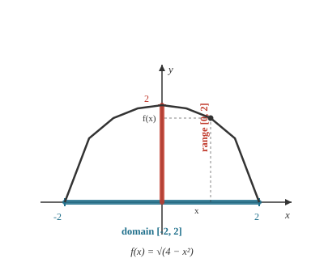

# Precalculus · Lesson 1.1: Functions as objects

> ⏱ ~15 min · Module 1: Functions and transformations · Builds on: nothing (course start) · Unlocks: 1.2 (composition and inverses)

## Why this matters

Calculus doesn't act on numbers — it acts on **functions**. Before you can ask "how fast is this changing?" you need something that *changes*: a rule linking an input to an output. Every model you'll meet downstream is one of these rules wearing a costume — position as a function of time, cost as a function of quantity, probability as a function of an outcome. This lesson reactivates the function idea from [`algebra-foundations`](../../algebra-foundations/syllabus.md), but at a higher altitude: not "a formula to plug into," but an **object** with its own anatomy — a set of legal inputs and a set of reachable outputs — that you'll spend the rest of the course reshaping.

## The idea

Think of a function as a **machine**. You drop an input in one end; exactly one output comes out the other. That word *exactly* is the whole definition: same input, same output, every single time — no machine that sometimes gives you 5 and sometimes 7 for the same input. A vending machine that dispensed a random snack per button press wouldn't be a function.

Two more parts come free with the machine:

- The **domain** is the set of inputs the machine will accept without jamming. Feed it something illegal and it refuses.
- The **range** is the set of outputs it can actually produce — everything that ever comes out the chute.

You already know machines like this: "square it," "take the square root," "charge 2 dollars per coffee." The shift in this course is to stop thinking about *what's inside the box* and start treating the box itself as a thing you can name, chain, and take apart.

## The formal version

A **function** $f$ from a set $D$ (the domain) assigns to each input $x \in D$ **exactly one** output, written $f(x)$.

In words: one input in, one output out — and never two outputs for one input.

The notation $f(x)$ means *"the output of machine $f$ when fed input $x$."* Read it "f of x." Critically, **$f(x)$ is not $f$ times $x$** — $f$ isn't a number, it's the machine; the parentheses mean *evaluate*, not *multiply*. To evaluate, replace every $x$ in the rule with the input.

- **Domain**: every legal input. When a function is given by a formula with no stated domain, the convention is *the largest set of real inputs that keeps the output a real number*. Two rules catch almost everything:
  - **No division by zero** — kill any input that makes a denominator $0$.
  - **No even root of a negative** — a square root (or 4th root, …) needs its inside $\ge 0$.
- **Range**: the set of all outputs $f(x)$ as $x$ runs over the domain.

The **vertical-line test**: a curve in the plane is the graph of a function of $x$ **iff every vertical line hits it at most once**. In words: if some input $x$ lines up with two points, that input has two outputs — disqualified.

A **piecewise function** applies different rules on different parts of the domain, e.g.

$$
f(x) = \begin{cases} x^2 & x < 1 \\ 2x - 1 & x \ge 1 \end{cases}
$$

In words: use the top rule for inputs below $1$, the bottom rule from $1$ on. It's still one machine — as long as the pieces don't overlap, every input gets exactly one output.

## Picture

The curve is $f(x)=\sqrt{4-x^2}$ (the top half of a circle). Read its **domain** off the $x$-axis — the inputs directly under the curve, here $[-2,2]$, because $4-x^2$ must stay $\ge 0$. Read its **range** off the $y$-axis — the output heights the curve reaches, here $[0,2]$. Domain lives horizontally, range lives vertically; that split is worth burning in now.

## Worked examples

**Example 1 (mechanical — evaluation is substitution).** Let $f(x) = 3x^2 - x$.

$$f(2) = 3(2)^2 - 2 = 12 - 2 = 10.$$

Now feed it a *lump* instead of a number — the machine doesn't care what you drop in:

$$f(a+1) = 3(a+1)^2 - (a+1) = 3(a^2 + 2a + 1) - a - 1 = 3a^2 + 5a + 2.$$

Note what $f(2)$ did **not** mean: it is not "$f$ times $2$." There is no multiplication here — $f$ names the rule, and the $2$ went *into* it. Getting comfortable substituting whole expressions (not just numbers) is exactly the muscle Lesson 1.2 needs for composition.

**Example 2 (why you'd care — context sets the domain).** You have 40 meters of fence for a rectangular pen against no wall. If the width is $w$, the two widths and two lengths use $2w + 2\ell = 40$, so $\ell = 20 - w$, and the enclosed area is

$$A(w) = w(20 - w).$$

As a bare formula, $A$ accepts any real $w$. But a *width* can't be zero or negative, and $\ell = 20 - w$ must stay positive too — so the **real** domain is $0 < w < 20$. The physical situation, not the algebra, drew that boundary. (The range turns out to be $(0, 100]$, maxing out at the square $w=10$ — but reading a range usually takes more than plugging in, which is the trap in "Watch out.") This move — *a formula is legal everywhere, but the context restricts the domain* — is constant in physics and econ.

## Watch out

- You might think $f(x)$ means "$f$ times $x$," but $f$ is a **machine, not a number** — the parentheses say *evaluate at $x$*. Likewise $f(a+b) \ne f(a) + f(b)$ in general; you have to run $a+b$ through the rule (check with $f(x)=x^2$: $f(1+1)=4$, but $f(1)+f(1)=2$).
- You might think the domain is "all real numbers unless told otherwise," but you must actively **hunt for illegal inputs**: a zero denominator, a negative under an even root — and in applied problems, whatever the context forbids. Silence is not permission.
- You might think **range is as easy to read as domain**, but it's usually harder: the domain is "which inputs are allowed," while the range asks "what outputs can this rule *reach*" — you have to understand the function's behavior, not just substitute. Reading it off a graph (the heights the curve attains) is often the fastest route.

## One-liner

> A function is a reliable machine — one input, exactly one output; its domain is every input it will accept, its range every output it can produce.

## Problems

**P1 (🟢)** Find the domain of $h(x) = \dfrac{\sqrt{x-2}}{x-5}$. Write it in interval notation.

**P2 (🟡)** For the piecewise function
$$f(x) = \begin{cases} x^2 & x < 1 \\ 2x - 1 & x \ge 1 \end{cases}$$
compute $f(-2)$, $f(1)$, and $f(3)$. Then explain in one sentence why this definition is a legitimate function even though it uses two rules.

**P3 (🔴, optional)** The equation $x^2 + y^2 = 25$ describes a circle of radius $5$. Explain, using the vertical-line test, why $y$ is **not** a function of $x$ here. Then write a rule for $y$ that *is* a function, and state its domain and range. (This is exactly the move that produced the curve in the Picture.)

Solutions

**P1** Two constraints. The even root needs $x - 2 \ge 0$, i.e. $x \ge 2$. The denominator forbids $x - 5 = 0$, i.e. $x \ne 5$. Combine: start from $[2, \infty)$ and punch out $5$:
$$\boxed{[2,\,5) \cup (5,\,\infty)}.$$

**P2** Pick the rule by which piece the input lands in.
- $-2 < 1$, use $x^2$: $f(-2) = (-2)^2 = 4$.
- $1 \ge 1$, use $2x - 1$: $f(1) = 2(1) - 1 = 1$. (At the seam, the "$\ge$" tells you which piece owns $x=1$.)
- $3 \ge 1$, use $2x - 1$: $f(3) = 2(3) - 1 = 5$.

It's a legitimate function because the two conditions $x<1$ and $x\ge 1$ never overlap and together cover every real input, so **each input is handled by exactly one rule** — one input, one output.

**P3** Solve for $y$: $y^2 = 25 - x^2$, so $y = \pm\sqrt{25 - x^2}$. At $x = 0$ that gives $y = 5$ *and* $y = -5$ — the vertical line $x=0$ meets the circle at two points, so one input has two outputs. That fails the vertical-line test, so $y$ is not a function of $x$.

To repair it, keep just one branch — the upper half:
$$y = \sqrt{25 - x^2}.$$
Domain: need $25 - x^2 \ge 0$, i.e. $-5 \le x \le 5$, so $[-5, 5]$. Range: the square root is $\ge 0$ and peaks at $x=0$ giving $y=5$, so $[0, 5]$. (The lower branch $y = -\sqrt{25-x^2}$ works too, with range $[-5,0]$.)

## Flashback

*(None — course start.)*

## Connections

- **Backward:** this is the function concept from [`algebra-foundations`](../../algebra-foundations/syllabus.md), lifted from "a formula you evaluate" to "an object with a domain and range you can inspect and manipulate" — the viewpoint the rest of Module 1 is built on.
- **Forward:** Lesson 1.2 (composition and inverses) chains two machines together and runs one backward — and an inverse exists *only when* the forward machine passes a horizontal-line test, the range-side mirror of today's vertical-line test. Further out, [`calc-refresher`](../../calc-refresher/syllabus.md) takes these functions as the raw material derivatives and integrals act on; you can't differentiate what isn't a function.
- **Sideways:** any "output determined by an input" is a function — position $s(t)$ in physics, cost $C(q)$ or demand $Q(p)$ in economics, concentration $C(t)$ in chemistry. Spotting the domain the *context* allows (Example 2) is the first modeling skill each of those subjects will lean on.
