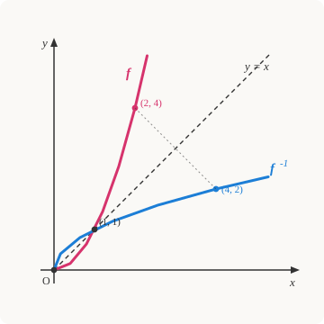

# Precalculus · Lesson 1.2: Composition and inverses

> ⏱ ~15 min · Module 1: Functions and transformations · Builds on: 1.1 (functions as objects) · Unlocks: 1.3 (transformations of graphs)

## Why this matters

Once a function is an *object* (Lesson 1.1) and not just a formula, the two most useful things you can do with objects are **chain them** and **reverse them**. Chaining is composition — the structure the chain rule differentiates and the shape of every "pipeline" in physics, code, and economics. Reversing is inversion — how you solve for what you actually want: a logarithm is nothing but the inverse of an exponential, Fahrenheit-from-Celsius is the inverse of Celsius-from-Fahrenheit, and decoding is the inverse of encoding. Get comfortable here and half of Module 2 becomes "apply the inverse."

## The idea

**Composition** is doing one function, then feeding its output straight into another. Think of two machines bolted together: raw material goes into $g$, whatever comes out goes into $f$. We write that combined machine $f\circ g$, read "$f$ of $g$," and the rule is **do the inside first**: $(f\circ g)(x)=f\big(g(x)\big)$. Order matters — putting on socks then shoes is not the same as shoes then socks.

**Inversion** is the undo button. If $f$ turns 3 into 10, then $f^{-1}$ is the machine that turns 10 back into 3. Run a function and then its inverse and you're exactly where you started — the net effect is "do nothing."

But undo is only possible if $f$ never sends two different inputs to the *same* output. If both 2 and $-2$ map to 4, then handed a 4, the undo machine can't know which one to return. A function you *can* reverse is called **one-to-one**, and that single condition is the whole story of when an inverse exists.

## The formal version

**Composition.** For functions $f$ and $g$,
$$(f\circ g)(x) = f\big(g(x)\big).$$
In words: apply $g$ to $x$, then apply $f$ to that result. Its domain is every $x$ that is (a) allowed into $g$, **and** (b) produces a $g(x)$ that is allowed into $f$. Both gates must pass.

**One-to-one.** $f$ is *one-to-one* (injective) if different inputs give different outputs:
$$x_1 \neq x_2 \;\Longrightarrow\; f(x_1)\neq f(x_2).$$
In words: no output is hit twice. Graphically this is the **horizontal-line test** — if every horizontal line crosses the graph at most once, $f$ is one-to-one.

**Inverse.** If $f$ is one-to-one, its *inverse* $f^{-1}$ is the unique function satisfying
$$f^{-1}\big(f(x)\big)=x \quad\text{for all } x \text{ in the domain of } f, \qquad f\big(f^{-1}(y)\big)=y \quad\text{for all } y \text{ in the range of } f.$$
In words: composing a function with its inverse (either order) gives back the identity — the do-nothing function. Note $f^{-1}$ means *inverse function*, **not** the reciprocal $1/f$.

**Domain/range swap.** Because $f^{-1}$ reads the arrows backward, the inputs and outputs trade places:
$$\text{domain}(f^{-1}) = \text{range}(f), \qquad \text{range}(f^{-1}) = \text{domain}(f).$$

## Picture

Every point $(a,b)$ on $f$ becomes the point $(b,a)$ on $f^{-1}$ — swap the coordinates. Geometrically, swapping coordinates is a reflection across the dashed line $y=x$, so **the graph of $f^{-1}$ is the mirror image of the graph of $f$ across $y=x$.** Here $f(x)=x^2$ (for $x\ge 0$) sends $2\mapsto 4$, and its inverse $f^{-1}(x)=\sqrt{x}$ sends $4\mapsto 2$; the two curves meet on the mirror line at $(1,1)$, a point that reflects to itself.

## Worked examples

**Example 1 (mechanical — compose and find the domain).** Let $f(x)=\sqrt{x}$ and $g(x)=x-4$. Then
$$(f\circ g)(x) = f\big(g(x)\big) = f(x-4) = \sqrt{x-4}.$$
Domain check, both gates: $g$ accepts every real $x$ (gate a is open), but $f$ only accepts non-negatives, so we need $g(x)=x-4\ge 0$, i.e. $x\ge 4$. **Domain: $[4,\infty)$.**

Reverse the order and the machine changes: $(g\circ f)(x)=g\big(\sqrt{x}\big)=\sqrt{x}-4$, with domain $[0,\infty)$. Same two functions, different composite, different domain — order matters.

**Example 2 (why you'd care — find an inverse, and use it).** Celsius-to-Fahrenheit is $F(c)=\tfrac{9}{5}c+32$. To convert *back*, you want the inverse. The recipe is **swap $x$ and $y$, then solve for $y$**:

Write $y=\tfrac{9}{5}x+32$. Swap: $x=\tfrac{9}{5}y+32$. Solve: $x-32=\tfrac{9}{5}y \Rightarrow y=\tfrac{5}{9}(x-32)$. So
$$F^{-1}(x)=\tfrac{5}{9}(x-32),$$
which is exactly the Fahrenheit-to-Celsius formula. Sanity check by composition: $F^{-1}\big(F(100)\big)=F^{-1}(212)=\tfrac{5}{9}(180)=100$. The undo returns the original — that composition-gives-identity check is how you *prove* two functions are inverses, no graph required.

## Watch out

- You might think $f^{-1}(x)$ means $\dfrac{1}{f(x)}$, but that superscript $-1$ denotes the **inverse function**, not a reciprocal. $\sin^{-1}(x)$ is arcsine, not $\csc x$. (When people *do* mean a power, they write $(f(x))^{-1}$ or $1/f(x)$.)
- You might think every function has an inverse, but only **one-to-one** functions do. $f(x)=x^2$ over all reals fails the horizontal-line test (the line $y=4$ hits it at $x=\pm 2$), so it has no inverse — until you **restrict the domain**. Keep only $x\ge 0$ and the surviving branch is one-to-one, with inverse $\sqrt{x}$; that restriction is why $\sqrt{\;}$ returns only the non-negative root. Restricting a domain to force an inverse into existence is a standard, deliberate move, not a cheat.
- You might think $f\circ g=g\circ f$, but composition is **not commutative** in general (Example 1). The one place they always agree is $f$ with its own inverse: $f\circ f^{-1}=f^{-1}\circ f=\text{identity}$.

## One-liner

> Composition bolts two machines in series ("inside first"); the inverse is the undo button, and it exists exactly when no output is ever hit twice.

## Problems

**P1 (🟢)** Let $f(x)=2x+1$ and $g(x)=x^2$. Compute $(f\circ g)(3)$ and $(g\circ f)(3)$, and write general formulas for $(f\circ g)(x)$ and $(g\circ f)(x)$.

**P2 (🟡)** Find the inverse of $f(x)=\dfrac{x+2}{x-3}$. State the domain of $f$ and the domain of $f^{-1}$, and verify your answer by checking $f\big(f^{-1}(x)\big)=x$ at one convenient value.

**P3 (🔴, optional)** The function $h(x)=x^2-6x+5$ is a parabola and is *not* one-to-one over all reals. Find the largest domain of the form $[k,\infty)$ on which $h$ is one-to-one, then find $h^{-1}$ on that domain and state its range.

Solutions

**P1** Inside first each time. $(f\circ g)(3)=f\big(g(3)\big)=f(9)=2(9)+1=\boxed{19}$. $(g\circ f)(3)=g\big(f(3)\big)=g(7)=7^2=\boxed{49}$ — different, because order matters. General: $(f\circ g)(x)=f(x^2)=2x^2+1$; $(g\circ f)(x)=g(2x+1)=(2x+1)^2=4x^2+4x+1$.

**P2** Swap and solve. Start with $y=\dfrac{x+2}{x-3}$, swap to $x=\dfrac{y+2}{y-3}$, then clear the fraction: $x(y-3)=y+2 \Rightarrow xy-3x=y+2 \Rightarrow xy-y=3x+2 \Rightarrow y(x-1)=3x+2$. So
$$f^{-1}(x)=\frac{3x+2}{x-1}.$$
Domain of $f$: all reals except $x=3$ (denominator zero). Domain of $f^{-1}$: all reals except $x=1$ — and indeed $x=1$ is the value $f$ can never output (its horizontal asymptote), so range$(f)$ excludes $1$, matching the domain/range swap. Check at $x=0$: $f^{-1}(0)=\dfrac{2}{-1}=-2$, and $f(-2)=\dfrac{-2+2}{-2-3}=\dfrac{0}{-5}=0$. ✓

**P3** Complete the square: $h(x)=x^2-6x+5=(x-3)^2-4$. The vertex is at $x=3$, and the parabola is one-to-one on either side of it; the largest domain of the form $[k,\infty)$ is $\boxed{[3,\infty)}$ (the increasing branch). To invert, set $y=(x-3)^2-4$, swap: $x=(y-3)^2-4 \Rightarrow (y-3)^2=x+4 \Rightarrow y-3=\pm\sqrt{x+4}$. On $[3,\infty)$ we need $y\ge 3$, so take the **$+$** root:
$$h^{-1}(x)=3+\sqrt{x+4}.$$
Its domain is range$(h)=[-4,\infty)$ (the vertex value $-4$ is the minimum output), and its range is domain$(h)=[3,\infty)$ — the swap again. Quick check: $h^{-1}(-4)=3+0=3$ and $h(3)=(0)-4=-4$. ✓

## Flashback

*(None — course start; flashbacks begin at Lesson 1.3.)*

## Connections

- **Backward:** this rests entirely on Lesson 1.1's domain/range machinery — the composition domain is just "which inputs survive both gates," and the inverse's domain/range are 1.1's domain/range with the labels swapped.
- **Forward (the marquee example):** Lesson 2.3 defines the logarithm as *the inverse of the exponential* — $\log_b$ undoes $b^x$, so $\log_b(b^x)=x$ is nothing but $f^{-1}\big(f(x)\big)=x$ from this lesson. Lesson 1.3 next reads the reflection-across-$y=x$ picture as one more graph transformation.
- **Sideways (`calc-refresher`):** the **chain rule** is how you differentiate a composition $f\circ g$, and the **inverse-function derivative** rule ($\big(f^{-1}\big)'(y)=1/f'(x)$) falls straight out of differentiating $f^{-1}(f(x))=x$. In the wider world, composition-then-inverse is exactly **encode → decode** and **convert → convert-back** (Example 2's temperature round-trip is a unit conversion undoing itself).
