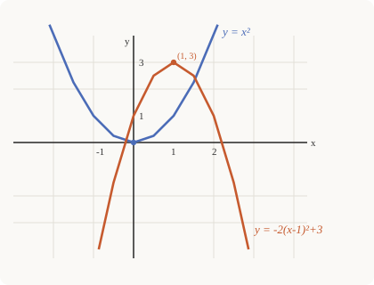

# Precalculus · Lesson 1.3: Transformations of graphs

> ⏱ ~15 min · Module 1: Functions and transformations · Builds on: 1.1 (functions as objects) · Unlocks: 2.1 (polynomial functions)

## Why this matters

You are about to meet a zoo of function families — polynomials, exponentials, rationals, sinusoids. The good news: each family is really *one* master shape that gets slid, stretched, and flipped. Learn to read those moves off an equation and you can sketch a curve you've never seen in five seconds flat, no plotting table. That reflex — "oh, that's just $\sin$ shifted left and stretched tall" — is exactly how physicists read a wave and how you'll read every graph in `calc-refresher`.

## The idea

Every graph you'll draw this course is a **parent function** wearing a disguise. There are six parents worth memorizing cold:

$$y=x, \quad y=x^2, \quad y=x^3, \quad y=\sqrt{x}, \quad y=|x|, \quad y=\tfrac{1}{x}.$$

A **transformation** is a small edit to the formula that moves or reshapes the picture without changing which family it belongs to. Four moves cover almost everything:

- **Shift** — pick the whole graph up and set it down somewhere else.
- **Stretch/compress** — pull it taller or squash it flatter (or wider/narrower).
- **Reflect** — flip it across an axis like a mirror.

The trick is that outside edits (done to the whole output $f(x)$) behave the way your gut expects, and inside edits (done to $x$ before $f$ touches it) behave *backwards*. Nail that one asymmetry and the rest is bookkeeping.

## The formal version

Start with a parent $y=f(x)$. Let $h,k$ be shift amounts and $a,b>0$ be scale factors.

**Vertical shift** — $y=f(x)+k$: moves the graph up by $k$ (down if $k<0$). *In words: add to the output, the picture rises.*

**Horizontal shift** — $y=f(x-h)$: moves the graph right by $h$ (left if $h<0$). *In words: subtract from the input, the picture goes right — the "backwards" one.*

**Vertical stretch** — $y=a\,f(x)$: multiplies every height by $a$. If $a>1$ it stretches tall; if $0<a<1$ it compresses flat. *In words: scale the output, heights scale.*

**Horizontal stretch** — $y=f(bx)$: divides every $x$-coordinate by $b$. If $b>1$ it *compresses* toward the $y$-axis; if $0<b<1$ it stretches wide — again backwards. *In words: scale the input, widths scale the opposite way.*

**Reflections** — $y=-f(x)$ flips across the $x$-axis (heights negate); $y=f(-x)$ flips across the $y$-axis (left and right swap).

Why is horizontal backwards? Because $f(x-h)$ asks: *what input do I feed to get the parent's value?* To make $f(x-h)$ equal $f(0)$ you need $x=h$ — so the feature that sat at $0$ now sits at $h$, i.e. it moved right. The input change is undone by $f$, so it lands in reverse.

The general template, all moves at once:

$$y = a\,f\big(b(x-h)\big)+k.$$

## Picture

Below, the parent $y=x^2$ (blue) and one heavily disguised copy, $y=-2(x-1)^2+3$ (orange). Read the disguise straight off the constants: $h=1$ (right 1), $k=3$ (up 3), $a=2$ (twice as tall), and the minus sign flips it upside down. The vertex — the parent's corner at the origin — has been carried to $(1,3)$.

## Worked examples

**Example 1 (mechanical).** Sketch $y=\sqrt{x+4}-2$ from the parent $y=\sqrt{x}$.

Rewrite the inside as $x-(-4)$, so $h=-4$: shift **left 4**. Then $k=-2$: shift **down 2**. The parent starts at its endpoint $(0,0)$; that endpoint travels to $(-4,-2)$. From there the curve still rises to the right, same shape. Domain went from $x\ge 0$ to $x\ge -4$; range from $y\ge 0$ to $y\ge -2$. No stretch, no flip — two slides and you're done.

**Example 2 (why you'd care).** A biologist's bacteria count doubles on a clean schedule, but a technician reports the numbers relative to a baseline drawn 3 hours late and measured in thousands. If the true count is $P(t)=2^t$, the reported curve is

$$R(t) = \tfrac{1}{1000}\,P(t-3) = \tfrac{1}{1000}\,2^{\,t-3}.$$

That's the parent $2^t$ shifted **right 3** (the late start) and **compressed vertically by $\tfrac{1}{1000}$** (the unit change) — two transformations encoding two lab decisions. This is the everyday move in data work: *re-baselining shifts horizontally, re-scaling units stretches vertically.* Recognizing that lets you undo someone's reporting choices and recover the real process underneath.

**Even and odd symmetry.** Two reflections are so common they get names. A function is **even** if $f(-x)=f(x)$ — reflecting across the $y$-axis changes nothing (like $x^2$, $|x|$, $\cos$). It's **odd** if $f(-x)=-f(x)$ — a $y$-axis flip equals an $x$-axis flip, giving $180^\circ$ rotational symmetry about the origin (like $x$, $x^3$, $\tfrac1x$, $\sin$). Spotting symmetry halves your sketching work and, downstream in calculus, kills integrals to zero for free.

## Watch out

- You might think $f(x-3)$ shifts **left** because of the minus sign — but actually it shifts **right 3**. Inside edits always run backwards; read $x-h$ and ask "what makes the inside zero?"
- You might think $y=f(2x)$ stretches the graph wider — actually it **compresses** it to half-width. Inside scaling is the reciprocal of what it looks like; only *outside* scaling ($a\,f(x)$) does the intuitive thing.
- You might think order never matters — but for a full $a f(b(x-h))+k$, do horizontal moves in the order (shift then stretch as *written inside*, i.e. factor out $b$ first) and apply the outside stretch **before** the vertical shift. Stretch-then-shift and shift-then-stretch give different pictures: $2f(x)+1 \ne 2(f(x)+1)$.

## One-liner

> Every graph is a parent function in disguise; outside edits act as they look, inside edits act in reverse.

## Problems

**P1 (🟢)** Starting from $y=|x|$, describe in order the transformations that produce $y=|x-2|+3$, and state the coordinates of the new corner (vertex).

**P2 (🟡)** The graph of $y=-\tfrac{1}{2}x^2$ is a transformation of $y=x^2$. Name every transformation, then find the value of the transformed function at $x=4$ *without expanding* — read it off the parent.

**P3 (🔴, optional)** Decide whether each is even, odd, or neither, using the definition: (a) $f(x)=x^3-4x$, (b) $g(x)=x^2+x$, (c) $h(x)=\tfrac{1}{x^2}$. For any that's even or odd, say what symmetry its graph has.

Solutions

**P1** Inside: $x-2$ means $h=2$, a shift **right 2**. Outside: $+3$ means $k=3$, a shift **up 3**. No stretch or reflection. The parent's corner sits at $(0,0)$; carrying it right 2 and up 3 lands the new corner (vertex) at $\boxed{(2,3)}$.

**P2** Two moves on $y=x^2$: the factor $\tfrac12$ is a **vertical compression by $\tfrac12$** (heights halved), and the minus sign is a **reflection across the $x$-axis** (flipped upside down). No horizontal shift or stretch. At $x=4$: the parent gives $4^2=16$; apply $-\tfrac12$ to the *output*, so $y=-\tfrac12(16)=\boxed{-8}$.

**P3**
(a) $f(-x)=(-x)^3-4(-x)=-x^3+4x=-(x^3-4x)=-f(x)$ → **odd**; graph has $180^\circ$ rotational symmetry about the origin.
(b) $g(-x)=(-x)^2+(-x)=x^2-x$. This is neither $g(x)=x^2+x$ nor $-g(x)=-x^2-x$ → **neither**; no axis/origin symmetry.
(c) $h(-x)=\tfrac{1}{(-x)^2}=\tfrac{1}{x^2}=h(x)$ → **even**; graph is symmetric across the $y$-axis.

## Flashback

**From Lesson 1.1 (Functions as objects):** Let $f(x)=\dfrac{\sqrt{x-1}}{x-4}$. Evaluate $f(5)$, and state the domain of $f$.

Solution

Evaluate: $f(5)=\dfrac{\sqrt{5-1}}{5-4}=\dfrac{\sqrt{4}}{1}=\dfrac{2}{1}=2$.

Domain: two constraints. The square root needs $x-1\ge 0$, so $x\ge 1$. The denominator needs $x-4\ne 0$, so $x\ne 4$. Combine: $\boxed{[1,4)\cup(4,\infty)}$.

## Connections

- **Backward:** this reuses domain and range from Lesson 1.1 — every shift and stretch moves those intervals, so you track them as you transform (see both worked examples and the flashback).
- **Forward:** Lesson 2.1 reads a polynomial's shape as a transformed power function, and 3.1 gets its whole personality — amplitude, period, phase shift — from $a\sin(b(x-h))+k$. Every family in Module 2–3 is a parent in disguise; this is the master key.
- **Sideways (data / calculus):** re-baselining a dataset is a horizontal shift and changing units is a vertical stretch (Example 2) — the same algebra you'll use in `calc-refresher` when a substitution $u=x-h$ slides a hard integral onto a friendlier parent.
