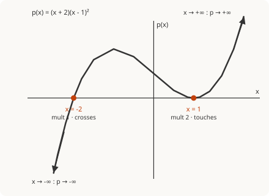

# Precalculus · Lesson 2.1: Polynomial functions

> ⏱ ~15 min · Module 2: Polynomial, rational, exponential, and logarithmic functions · Builds on: 1.3 (transformations of graphs) · Unlocks: 2.2 (rational functions)

## Why this matters

Polynomials are the friendliest curves in mathematics: no breaks, no asymptotes, defined everywhere, and a shape you can sketch from almost no information. That last part is the payoff. A trajectory in physics, a cost curve in economics, the smooth "best local approximation" that calculus builds out of Taylor polynomials — all of them are polynomials, and being able to read a factored polynomial's whole shape at a glance is a reflex you'll reuse constantly. It's also the exact skill that makes rational functions (Lesson 2.2, ratios of two of these) tractable.

## The idea

Look at any polynomial from far enough away and only one thing matters: the **highest-power term**. Everything else is a rounding error. Zoom in near the x-axis instead, and a different thing matters: **the factors**, because each factor that hits zero is a place the curve visits the axis. So a factored polynomial secretly tells you both stories at once — the leading term governs the two far ends, and the factors govern the middle where it crosses or grazes the axis. Sketching a polynomial is just stitching those two pieces of information together.

Two rules run the whole show:

- **The ends:** the leading term wins. Its **degree** (even or odd) says whether the two ends point the same way or opposite ways; its **sign** flips the whole picture up or down.
- **The zeros:** each real zero is a factor $(x-r)$ set to zero. How many times that factor repeats — its **multiplicity** — decides whether the curve slices straight through the axis (odd) or bounces off it (even).

## The formal version

A **polynomial function** of degree $n$ is
$$p(x) = a_n x^n + a_{n-1}x^{n-1} + \cdots + a_1 x + a_0, \qquad a_n \neq 0,$$
where $n$ is a non-negative integer, the constants $a_i$ are the **coefficients**, and $a_n$ — the coefficient of the highest power — is the **leading coefficient**. In words: a finite sum of whole-number powers of $x$ with constant weights.

**End behavior.** As $x \to \pm\infty$, $p(x)$ behaves like its leading term $a_n x^n$. In words: far out, the biggest power dwarfs everything else. This gives four cases:

| degree $n$ | leading coeff $a_n$ | as $x\to-\infty$ | as $x\to+\infty$ |
|---|---|---|---|
| even | $+$ | $+\infty$ | $+\infty$ |
| even | $-$ | $-\infty$ | $-\infty$ |
| odd | $+$ | $-\infty$ | $+\infty$ |
| odd | $-$ | $+\infty$ | $-\infty$ |

Mnemonic: **even degree** → both ends agree (like a parabola); **odd degree** → ends disagree (like a line); a **negative** leading coefficient reflects the whole thing top-to-bottom.

**Factor theorem.** $r$ is a real zero of $p$ (i.e. $p(r)=0$) **if and only if** $(x-r)$ is a factor of $p(x)$. In words: zeros and linear factors are the same information wearing two outfits. So a fully factored polynomial
$$p(x) = a_n\,(x-r_1)^{m_1}(x-r_2)^{m_2}\cdots(x-r_k)^{m_k}$$
hands you every real zero $r_i$ for free, each with a **multiplicity** $m_i$ (how many times its factor appears).

**Multiplicity → crossing behavior.** At a zero $r$ of multiplicity $m$:

- $m$ **odd** → the curve **crosses** the axis (changes sign) at $r$;
- $m$ **even** → the curve **touches and turns back** (same sign on both sides) at $r$, tangent to the axis.

**Turning points.** A degree-$n$ polynomial has **at most $n-1$ turning points** (places where it switches from rising to falling or back). In words: degree caps the number of wiggles. Calculus will sharpen "at most" into "exactly the number of real solutions of $p'(x)=0$" — see Connections.

## Picture

The cubic $p(x)=(x+2)(x-1)^2$. Degree $3$ (odd) with leading coefficient $+1$: the left end dives to $-\infty$, the right end climbs to $+\infty$. The factor $(x+2)^1$ has odd multiplicity, so the curve **crosses** at $x=-2$; the factor $(x-1)^2$ has even multiplicity, so the curve **touches and bounces** at $x=1$ without changing sign. Degree $3$ allows at most $2$ turning points — and there are exactly two (a peak near $x=-1$, the bounce at $x=1$).

## Worked examples

**Example 1 (mechanical).** Describe the shape of $p(x) = -2(x+3)(x-1)^3$.

- **Degree:** multiply out the powers of $x$: $1 + 1 + 3 = 4$? No — count factors of $x$: $(x+3)$ contributes $1$, $(x-1)^3$ contributes $3$, total degree $= 4$. **Even.**
- **Leading coefficient:** the sign of $-2 \cdot (x)(x)^3 = -2x^4$, so $a_4 = -2$, **negative**. Even degree + negative leading coefficient → **both ends go to $-\infty$**.
- **Zeros:** $x=-3$ (multiplicity $1$, odd → **crosses**) and $x=1$ (multiplicity $3$, odd → **crosses**, but flattens as it goes through, since higher odd multiplicity means a gentler S-shaped crossing).
- **Turning points:** at most $4-1 = 3$.

Sketch: comes up from $-\infty$ on the left, crosses at $x=-3$, arcs over some peak, slides down through the flattened crossing at $x=1$, and heads back to $-\infty$ on the right.

**Example 2 (why you'd care).** A parabola is a degree-2 polynomial, and this is the case you'll meet most (projectile heights, quadratic cost curves, Lesson 4.1's conics). Take $h(t) = -16t^2 + 64t = -16t(t-4)$, the height in feet of a ball $t$ seconds after launch.

- **Factored form is already done:** zeros at $t=0$ and $t=4$, each multiplicity $1$ → the ball is at ground level ($h=0$) at launch and at $t=4$ s, crossing each time.
- **End behavior:** degree $2$ (even), leading coefficient $-16$ (negative) → both ends to $-\infty$ (the model only makes physical sense between the zeros).
- **Turning point:** at most $2-1 = 1$, and by symmetry it sits halfway between the zeros, at $t=2$ s, giving the peak height $h(2) = -16(4)+64(2) = 64$ ft.

You read off the launch time, landing time, and peak location without a single derivative — purely from factors, degree, and sign. Calculus (`calc-refresher`) will later confirm $h'(t)=-32t+64=0$ at exactly $t=2$.

## Watch out

- You might think a higher-degree polynomial always has more crossings, but **degree is a ceiling, not a count**: $x^4+1$ has degree $4$ and *zero* real zeros. Degree $n$ means *at most* $n$ real zeros and *at most* $n-1$ turning points.
- You might think every zero means the graph crosses the axis — but **even multiplicity means it only touches**. Miss the multiplicity and your sketch changes sign where it shouldn't.
- You might read the *constant* term as the leading coefficient. **"Leading" = highest power, not the number sitting alone.** In $3 - 5x + 2x^3$, the leading coefficient is $2$ (from $x^3$), not $3$.
- Degree from factored form is the **sum of the multiplicities**, not the number of distinct factors: $(x-1)^2(x+4)$ has degree $3$, not $2$.

## One-liner

> Far from the origin the leading term dictates the two ends; near the axis the factors dictate the crossings — and a factor's multiplicity says whether the curve slices through (odd) or bounces off (even).

## Problems

**P1 (🟢)** For $p(x) = -x^3(x-2)(x+1)^2$, state (a) the degree, (b) the end behavior at both ends, (c) each real zero with its multiplicity and whether the curve crosses or touches there.

**P2 (🟡)** Build a polynomial in factored form of **smallest possible degree** whose graph crosses the x-axis at $x=-3$, is tangent to the x-axis at $x=2$, passes through the origin, and has both ends heading to $+\infty$. (One valid answer suffices; state the leading coefficient's sign.)

**P3 (🔴, optional)** A degree-5 polynomial with a positive leading coefficient has exactly three distinct real zeros. Its end behavior forces the left end to $-\infty$ and the right end to $+\infty$. Argue that at least one of its three zeros must have even multiplicity, and give the possible multiplicity lists.

Solutions

**P1** Rewrite mentally as factors of $x$: $x^3$ gives multiplicity $3$ at $x=0$; $(x-2)$ gives multiplicity $1$ at $x=2$; $(x+1)^2$ gives multiplicity $2$ at $x=-1$.
(a) Degree $= 3+1+2 = 6$.
(b) Leading term: $-x^3 \cdot x \cdot x^2 = -x^6$, so leading coefficient $-1$, degree even. Even degree + negative leading coefficient → **both ends $\to -\infty$**.
(c) Zeros: $x=0$ (mult $3$, odd → **crosses**, with a flattened S), $x=2$ (mult $1$, odd → **crosses**), $x=-1$ (mult $2$, even → **touches/bounces**).

**P2** Requirements translate to factors: crosses at $x=-3$ → factor $(x+3)$ to an **odd** power (use $1$); tangent at $x=2$ → factor $(x-2)$ to an **even** power (use $2$); passes through the origin → $x=0$ is a zero, factor $x$ (use $1$, crossing is fine, none specified). So far $(x+3)^1 x^1 (x-2)^2$ has degree $1+1+2=4$ — **even**, which allows both ends to agree. Both ends to $+\infty$ needs a **positive** leading coefficient. Answer:
$$p(x) = (x+3)\,x\,(x-2)^2,$$
degree $4$, positive leading coefficient. (Any positive multiple works.) Note you *cannot* do it in lower degree: tangency alone forces multiplicity $\ge 2$ at $x=2$, and three distinct zero conditions force degree $\ge 4$.

**P3** Degree $5$ is odd, so the total of all multiplicities is $5$. With three *distinct* zeros the multiplicities $(m_1,m_2,m_3)$ are positive integers summing to $5$. If all three were odd, their sum would be odd + odd + odd = **odd**, which is consistent with $5$ — so oddness of the sum alone doesn't force an even multiplicity. Recheck via the partitions of $5$ into exactly three positive parts: $\{3,1,1\}$ and $\{2,2,1\}$. In $\{3,1,1\}$ all parts are odd (all three zeros cross); in $\{2,2,1\}$ two parts are even (two tangencies). **So an even multiplicity is *not* forced** — the correct statement is that the multiplicities must be either $\{3,1,1\}$ or $\{2,2,1\}$. (The intended lesson: sum-of-multiplicities $=$ degree tightly constrains the possibilities; always enumerate the partitions rather than guessing.)

## Flashback

**From Lesson 1.3 (Transformations of graphs):** The parent function is $f(x)=x^2$. Describe the graph of $g(x) = -\tfrac{1}{2}(x+4)^2 + 3$ as an ordered sequence of transformations of $f$, and state the coordinates of its vertex and whether it opens up or down.

Solution

Read the transformations from the inside out, in order:

1. **Horizontal shift:** $(x+4)^2$ shifts $f$ **left 4** units.
2. **Vertical stretch/compression + reflection:** the factor $-\tfrac{1}{2}$ compresses vertically by a factor of $\tfrac12$ (flatter) **and** reflects across the x-axis (opens downward).
3. **Vertical shift:** $+3$ moves the whole graph **up 3** units.

The vertex sits where the squared term is zero, at $x=-4$, giving $g(-4)=3$: **vertex $(-4,\,3)$**, opening **downward** (negative leading coefficient). As a preview of this lesson: $g$ is a degree-2 polynomial with leading coefficient $-\tfrac12$, so both ends head to $-\infty$ — consistent with "opens downward."

## Connections

- **Backward:** end behavior is just the parent power function $y=x^n$ (Lesson 1.3) after a possible reflection — the leading term *is* a transformed $x^n$, which is why only its degree and sign survive at the far ends.
- **Forward:** Lesson 2.2 studies **rational functions**, ratios $\dfrac{p(x)}{q(x)}$ of two polynomials — their zeros come from $p$'s factors and their vertical asymptotes/holes from $q$'s, so today's factor-reading is a direct prerequisite. Lesson 4.1 revisits the degree-2 case (the parabola) as a conic section.
- **Sideways (calculus):** in `calc-refresher`, the **power rule** turns each term $a_k x^k$ into $k\,a_k x^{k-1}$, so $p'(x)$ is another polynomial of degree $n-1$ — and its real zeros are exactly the **critical points / turning points** you bounded by "$n-1$" here. Later, **Taylor polynomials** run this in reverse: they build the best local polynomial approximation of *any* smooth function, making the humble polynomial the universal stand-in that calculus reaches for again and again.
