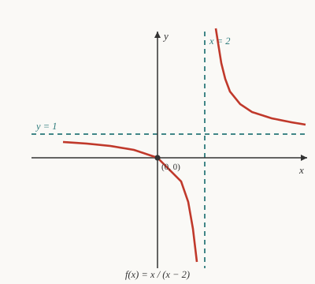

# Precalculus · Lesson 2.2: Rational functions

> ⏱ ~15 min · Module 2: Polynomial, rational, exponential, and logarithmic functions · Builds on: 2.1 (polynomial functions) · Unlocks: 2.3 (exponential and logarithmic functions)

## Why this matters

The moment you divide one changing quantity by another — concentration as drug per volume, cost per unit produced, force that falls off with distance — you get a rational function. Its whole personality lives at the places where the formula *breaks*: where the denominator hits zero and the output rockets to infinity, or where the graph flattens out far from the origin. Reading those breakpoints off the algebra, before you ever plot a point, is the skill. It's also a dress rehearsal for `calc-refresher`: every asymptote you find here is secretly a limit, and this lesson teaches your eye to see them.

## The idea

A rational function is just a fraction of two polynomials, $\dfrac{P(x)}{Q(x)}$. Everything interesting follows from one fact you've known since grade school: **you cannot divide by zero.**

So ask two questions. *Where does the bottom hit zero?* There the function either blows up to $\pm\infty$ (a **vertical asymptote** — an invisible wall the curve races toward but never touches) or, if that same factor also sat in the top and cancels, it leaves a single missing point (a **hole**). *What happens far away, as $x$ runs off to $\pm\infty$?* There the two polynomials fight, and whichever grows faster decides whether the graph settles onto a flat line (a **horizontal asymptote**), a tilted line (a **slant asymptote**), or neither. Find the walls and the far-off behavior, plot the intercepts, and the curve has almost nowhere left to go — you can sketch it by connecting the dots between its asymptotes.

## The formal version

A **rational function** is
$$f(x) = \frac{P(x)}{Q(x)}, \qquad Q(x) \neq \text{the zero polynomial},$$
where $P$ and $Q$ are polynomials. *In words:* one polynomial over another.

**Domain.** All real $x$ *except* the zeros of the denominator: $\{x : Q(x) \neq 0\}$. Those excluded points are exactly where something dramatic happens.

**Vertical asymptote vs. hole.** First factor top and bottom and cancel common factors. For a value $a$ with $Q(a)=0$:
- if $(x-a)$ still divides the denominator *after* canceling, then $x=a$ is a **vertical asymptote**: $f(x)\to\pm\infty$ there;
- if $(x-a)$ cancels *completely* (its power in the top was at least its power in the bottom), then $x=a$ is a **hole** — the point is simply missing, and the graph elsewhere looks like the simplified function.

*In words:* a leftover factor in the bottom is a wall; a fully-canceled factor is a puncture.

**End behavior — compare the degrees.** Let $n=\deg P$ and $m=\deg Q$, with leading coefficients $a$ (top) and $b$ (bottom).

| Case | As $x\to\pm\infty$ | Asymptote |
|---|---|---|
| $n < m$ | $f(x)\to 0$ | horizontal $y=0$ |
| $n = m$ | $f(x)\to a/b$ | horizontal $y=a/b$ |
| $n = m+1$ | grows like a line | **slant** $y=$ quotient |
| $n > m+1$ | grows like a curve | none (polynomial-shaped) |

*In words:* if the bottom wins the graph flattens to zero; a tie flattens to the ratio of leading coefficients; if the top wins by exactly one degree the graph tilts onto a straight line.

**Finding a slant asymptote.** When $n=m+1$, do polynomial (long) division — the method itself is [`algebra-foundations` 3.3](../../algebra-foundations/lessons/03-03-polynomial-division.md), and the recipe is on this course's [reference card](../reference.md#polynomial-long-division-how-you-get-a-slant-asymptote) — giving $f(x)=(\text{line})+\dfrac{\text{remainder}}{Q(x)}$. The remainder term vanishes as $x\to\pm\infty$, so the line *is* the asymptote. For example,
$$\frac{x^2+1}{x-1}=x+1+\frac{2}{x-1}\ \Longrightarrow\ \text{slant asymptote } y=x+1.$$

**Intercepts.** The $y$-intercept is $f(0)$ (if $0$ is in the domain). The $x$-intercepts are the zeros of the *numerator* that survive canceling — i.e. where $P(x)=0$ but $Q(x)\neq 0$.

## Picture

The curve $f(x)=\dfrac{x}{x-2}$ has a vertical wall at $x=2$ (denominator zero, no cancellation) and, since top and bottom are both degree $1$ with leading coefficients $1$ and $1$, a horizontal asymptote at $y=1$. Notice how each branch hugs *both* dashed lines: racing up the wall on one side, flattening toward $y=1$ far away. It also slips through the origin, which is both intercepts at once.

## Worked examples

**Example 1 (mechanical) — full analysis.** Analyze $f(x)=\dfrac{x^2-1}{x^2-4}$.

Factor: $f(x)=\dfrac{(x-1)(x+1)}{(x-2)(x+2)}$. Nothing cancels.

- **Domain:** exclude the denominator's zeros, $x=2$ and $x=-2$. So all reals except $\pm 2$.
- **Vertical asymptotes:** both leftover factors give walls — $x=2$ and $x=-2$.
- **Horizontal asymptote:** degrees are equal ($2=2$), leading coefficients $1$ and $1$, so $y=\tfrac{1}{1}=1$.
- **$x$-intercepts:** numerator zeros $x=1$ and $x=-1$ (both in domain) → points $(1,0)$ and $(-1,0)$.
- **$y$-intercept:** $f(0)=\dfrac{-1}{-4}=\tfrac14$ → point $\left(0,\tfrac14\right)$.

Five features, zero plotting. That's enough to sketch three branches locked between the walls.

**Example 2 (why you'd care) — a drug that clears out.** A drug's blood concentration is $C(t)=\dfrac{20t}{t^2+4}$ (mg/L, $t\ge 0$ in hours). What happens in the long run?

The denominator $t^2+4$ is never zero, so there are **no vertical asymptotes** — the domain is all $t\ge 0$, and the graph is smooth. Degrees: top is $1$, bottom is $2$, so $n<m$ and
$$\lim_{t\to\infty} C(t) = 0 \quad(\text{horizontal asymptote } y=0).$$
*In words:* the drug eventually clears — concentration decays to zero. The only zero of $C$ is $t=0$ (numerator $20t=0$), matching the obvious fact that there's none in the blood before the dose. This is the exact long-run reasoning **Boss problem 2** asks for; the peak concentration in between is a job for `calc-refresher`, where you set the derivative to zero.

## Watch out

- **You might think every denominator zero is a vertical asymptote, but actually a canceled factor is a hole.** $\dfrac{x^2-4}{x-2}=x+2$ for $x\neq 2$: no wall, just a missing point at $(2,4)$. Always factor and cancel *before* declaring asymptotes.
- **You might think canceling once always kills the wall, but check the multiplicity.** In $\dfrac{x^2-4}{(x-2)^2}=\dfrac{x+2}{x-2}$, one $(x-2)$ cancels but one remains — still a vertical asymptote, not a hole. A factor is only a hole when the top's power *matches or beats* the bottom's.
- **You might think there's always a horizontal asymptote, but when the top out-degrees the bottom there isn't one.** Equal degrees give $y=a/b$ — *not* $y=0$, and *not* $y=1$ by reflex. If the top wins by exactly one, you get a slant line instead; divide to find it.

## One-liner

> A rational function is defined by where it breaks: walls at the leftover denominator zeros, and a flight path — flat, tilted, or gone — set by which polynomial grows faster.

## Problems

**P1 (🟢)** State the domain of $f(x)=\dfrac{x-2}{x^2-x-2}$, and classify $x=2$ and $x=-1$ as a hole or a vertical asymptote.

**P2 (🟡)** Find every asymptote (including any slant) and both intercepts of $f(x)=\dfrac{x^2-x-6}{x-1}$.

**P3 (🔴, optional)** Does $f(x)=\dfrac{x^2-4}{x^2-4x+4}$ have a hole or a vertical asymptote at $x=2$? Justify with the factor powers, then give the horizontal asymptote.

Solutions

**P1** Factor the denominator: $x^2-x-2=(x-2)(x+1)$, so $f(x)=\dfrac{x-2}{(x-2)(x+1)}$.

The $(x-2)$ cancels completely (power $1$ on top, power $1$ on bottom), leaving $\dfrac{1}{x+1}$ for $x\neq 2$. Denominator zeros are $x=2$ and $x=-1$, so the **domain** is all reals except $x=2$ and $x=-1$.

- At $x=2$: fully canceled → **hole** (at $\left(2,\tfrac13\right)$, since $\tfrac{1}{2+1}=\tfrac13$).
- At $x=-1$: the $(x+1)$ survives in the denominator → **vertical asymptote**.

**P2** Factor the top: $x^2-x-6=(x-3)(x+2)$; the bottom $x-1$ shares no factor, so nothing cancels.
- **Vertical asymptote:** $x=1$.
- **$x$-intercepts:** numerator zeros $x=3$ and $x=-2$ → $(3,0)$ and $(-2,0)$.
- **$y$-intercept:** $f(0)=\dfrac{0-0-6}{0-1}=\dfrac{-6}{-1}=6$ → $(0,6)$.
- **Slant asymptote:** degree $2$ over degree $1$ ($n=m+1$), so divide. $x^2-x-6=(x-1)\cdot x + (-6)$, hence
$$f(x)=x-\frac{6}{x-1}.$$
The remainder term $\to 0$ as $x\to\pm\infty$, so the slant asymptote is $y=x$. (No horizontal asymptote, since the top out-degrees the bottom.)

**P3** Factor both: numerator $x^2-4=(x-2)(x+2)$; denominator $x^2-4x+4=(x-2)^2$. So
$$f(x)=\frac{(x-2)(x+2)}{(x-2)^2}=\frac{x+2}{x-2}\quad(x\neq 2).$$
The top contributes one factor of $(x-2)$, the bottom two; canceling leaves one $(x-2)$ *in the denominator*. Because a factor survives below, $x=2$ is a **vertical asymptote, not a hole** — the top's power ($1$) does not match the bottom's ($2$). Horizontal asymptote: original degrees are equal ($2=2$) with leading coefficients $1$ and $1$, so $y=1$.

## Flashback

**From Lesson 2.1 (Polynomial functions):** For $p(x)=-2(x+1)^2(x-3)$, state the degree and leading coefficient, describe the end behavior as $x\to\pm\infty$, and say whether the graph crosses or merely touches the $x$-axis at each zero.

Solution

Multiply the highest-degree pieces: $(x+1)^2(x-3)$ contributes $x^2\cdot x=x^3$, times $-2$, so the leading term is $-2x^3$. **Degree $3$, leading coefficient $-2$.**

Odd degree with a negative leading coefficient, so the ends point opposite ways with the sign flipped: as $x\to-\infty$, $p(x)\to+\infty$; as $x\to+\infty$, $p(x)\to-\infty$.

Zeros: $x=-1$ has multiplicity $2$ (even) → the graph **touches** and turns back (bounces); $x=3$ has multiplicity $1$ (odd) → the graph **crosses** the axis.

## Connections

- **Backward:** every step here — factoring, canceling common factors, long division — is the rational-expression algebra from [`algebra-foundations`](../../algebra-foundations/syllabus.md), now put to work reading a graph.
- **Forward:** [`calc-refresher`](../../calc-refresher/syllabus.md) makes all of this rigorous: a vertical asymptote is $\lim_{x\to a}f(x)=\pm\infty$, and a horizontal/slant asymptote is $\lim_{x\to\pm\infty}$ of the function. The "peak concentration" this lesson deferred is a derivative set to zero.
- **Sideways:** the far-field flattening you found by comparing degrees is the same end-behavior instinct from Lesson 2.1 (Polynomial functions) — a polynomial is just a rational function with denominator $1$, and Module 4 will reuse this eye for shape when sketching conics.
