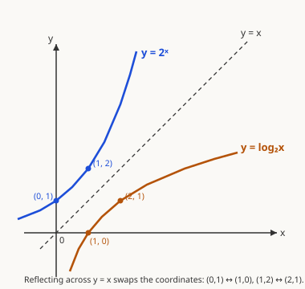

# Precalculus · Lesson 2.3: Exponential and logarithmic functions

> ⏱ ~15 min · Module 2: Polynomial, rational, exponential, and logarithmic functions · Builds on: 1.2 (composition and inverses) · Unlocks: 3.1 (trig functions for calculus)

## Why this matters

Anything that grows or shrinks by a *fixed percentage per step* — money at compound interest, a population, a cooling coffee, a radioactive sample — is exponential. And every time you need to run that process *backwards* ("how long until it doubles? until half is gone?"), you reach for a logarithm. Logs also quietly rescale the world so we can see it: pH, decibels, and the Richter scale all compress enormous ranges into readable numbers. In `calc-refresher` you'll meet the punchline — $e^x$ is the one function equal to its own derivative, and $\ln$ shows up in nearly every integral — so owning these two families now pays off constantly.

## The idea

An **exponential** function puts the variable in the *exponent*: $f(x) = b^x$. Multiplying the input by adding $1$ multiplies the output by $b$. That's the whole personality — repeated multiplication, not repeated addition. If $b > 1$ you get **growth** (each step scales up); if $0 < b < 1$ you get **decay** (each step scales down toward zero).

A **logarithm** is the question the exponential answers in reverse. "$b^x = c$" asks *"$b$ raised to what gives $c$?"* — and $\log_b c$ **is** that exponent. So the log is nothing exotic: it's the inverse function of the exponential, exactly the undo-operation you built in Lesson 1.2. Exponential turns an exponent into a value; log turns a value back into its exponent.

## The formal version

For a base $b > 0,\ b \neq 1$:

$$y = b^x \quad\Longleftrightarrow\quad x = \log_b y.$$

In words: the two equations say the *same fact* two ways — the log form just solves the exponential form for the exponent. This is the single identity everything below rests on. Two named cases: **common log** $\log x := \log_{10} x$ and **natural log** $\ln x := \log_e x$, where $e \approx 2.71828$ is the base of *continuous* growth (the limit of compounding "$1+\tfrac{r}{n}$" as $n\to\infty$).

Because log inverts exponential, three cancellation facts fall out immediately:

$$b^{\log_b x} = x, \qquad \log_b(b^x) = x, \qquad \log_b 1 = 0,\quad \log_b b = 1.$$

The **log laws** (each is a multiplication fact about exponents, read backwards):

$$\log_b(xy) = \log_b x + \log_b y, \quad \log_b\!\left(\tfrac{x}{y}\right) = \log_b x - \log_b y, \quad \log_b(x^p) = p\,\log_b x.$$

In words: logs turn multiplication into addition and powers into multipliers — that's *why* they tame products and exponents. Finally, **change of base** lets any log ride on the two your calculator has:

$$\log_b x = \frac{\ln x}{\ln b} = \frac{\log x}{\log b}.$$

## Picture

The blue curve $y = 2^x$ and the amber curve $y = \log_2 x$ are mirror images across the dashed line $y = x$ — the geometric signature of inverse functions. Reflection swaps every coordinate pair: the exponential passes through $(0,1)$ and $(1,2)$, so the log passes through $(1,0)$ and $(2,1)$. Notice the domains swap too: $2^x$ eats every real number and spits out only positives, so $\log_2 x$ only accepts positive inputs. **You can never take the log of zero or a negative.**

## Worked examples

**Example 1 (mechanical — convert and solve).** Solve $3^x = 50$.

Translate to log form directly: $x = \log_3 50$. That's an exact answer; for a decimal, use change of base:

$$x = \frac{\ln 50}{\ln 3} = \frac{3.912}{1.099} \approx 3.56.$$

Check the sanity: $3^3 = 27$ and $3^4 = 81$, and $50$ sits between them closer to $81$, so an exponent near $3.6$ is right. The general move for *any* $b^x = c$: take a log of both sides (natural log is fine) and use $\log(b^x) = x\log b$ to drop the exponent down: $x\ln 3 = \ln 50$.

**Example 2 (why you'd care — a log scale).** Chemists report acidity as $\text{pH} = -\log[\mathrm{H}^+]$, where $[\mathrm{H}^+]$ is the hydrogen-ion concentration in moles per liter. A sample has $[\mathrm{H}^+] = 4.0 \times 10^{-5}$. Then

$$\text{pH} = -\log(4.0 \times 10^{-5}) = -\big(\log 4.0 + \log 10^{-5}\big) = -(0.602 - 5) = 4.40.$$

That used two log laws (product, then power) to split a scary number into arithmetic. The payoff of the scale: each whole pH unit is a **10×** change in concentration, so pH 4 is ten times more acidic than pH 5. Decibels ($10\log$ of a power ratio) and the Richter magnitude ($\log$ of shaking amplitude) work the same way — logs compress multiplicative ranges into additive ones we can read.

## Watch out

- You might think $\log(x + y) = \log x + \log y$. **It does not.** The sum law is for $\log(xy)$ — logs convert *multiplication* to addition, never addition to anything. $\log(2+3) \neq \log 2 + \log 3$.
- You might think a decay base like $0.5$ eventually hits zero. It doesn't — $b^x$ with $0 < b < 1$ shrinks toward zero forever but never reaches it (a horizontal asymptote at $y = 0$). "Half-life" is the time to halve, and it keeps repeating.
- Solving a log equation can manufacture **extraneous roots**. After combining logs and solving, plug answers back in: any value that forces the log of zero or a negative is not a real solution, even though the algebra produced it.

## One-liner

> An exponential turns an exponent into a number; a logarithm turns that number back into its exponent — same fact, read forwards or backwards.

## Problems

**P1 (🟢)** (a) Rewrite $2^5 = 32$ in logarithmic form. (b) Solve $5^x = 20$ for $x$, giving a decimal to two places.

**P2 (🟡)** You invest 1,000 dollars at 4% interest compounded continuously, so the balance is $A(t) = 1000\,e^{0.04t}$ dollars after $t$ years. (a) How long until the balance reaches 2,500 dollars? (b) What is the **doubling time**, and why doesn't it depend on the starting amount? *(This is the compound-interest bridge to `mathematical-finance`.)*

**P3 (🔴, optional)** Solve $\log_2 x + \log_2(x - 2) = 3$. Be sure to check for extraneous roots.

Solutions

**P1** (a) The base is $2$, the exponent is $5$, the result is $32$, so $\log_2 32 = 5$.
(b) $5^x = 20 \Rightarrow x = \log_5 20 = \dfrac{\ln 20}{\ln 5} = \dfrac{2.996}{1.609} \approx \boxed{1.86}$. Check: $5^{1.86}$ is between $5^1=5$ and $5^2=25$, closer to $25$ — consistent.

**P2** (a) Set $1000\,e^{0.04t} = 2500 \Rightarrow e^{0.04t} = 2.5$. Take $\ln$: $0.04t = \ln 2.5 = 0.9163 \Rightarrow t = \dfrac{0.9163}{0.04} \approx \boxed{22.9\text{ years}}$.
(b) Doubling: $e^{0.04t} = 2 \Rightarrow 0.04t = \ln 2 \Rightarrow t = \dfrac{\ln 2}{0.04} \approx \boxed{17.3\text{ years}}$. It's independent of the starting amount because the balance is always the start times the *factor* $e^{0.04t}$; asking when that factor equals $2$ never mentions the start. Every exponential process has a fixed doubling (or halving) time for this reason.

**P3** Combine with the product law: $\log_2\big(x(x-2)\big) = 3$. Convert to exponential form: $x(x-2) = 2^3 = 8 \Rightarrow x^2 - 2x - 8 = 0 \Rightarrow (x-4)(x+2) = 0$, so $x = 4$ or $x = -2$. **Check the domain:** the original has $\log_2 x$ and $\log_2(x-2)$, both requiring positive inputs, so $x > 2$. Thus $x = -2$ is extraneous (it would demand $\log_2(-2)$). The only solution is $\boxed{x = 4}$.

## Flashback

**From Lesson 1.2 (Composition and inverses):** Let $f(x) = 5x + 2$ and $g(x) = \sqrt{x}$. Find $(g \circ f)(x)$ and state its domain, then find $f^{-1}(x)$.

Solution

$(g \circ f)(x) = g(f(x)) = \sqrt{5x + 2}$. The square root needs a non-negative input: $5x + 2 \ge 0 \Rightarrow x \ge -\tfrac{2}{5}$, so the domain is $\left[-\tfrac{2}{5}, \infty\right)$.

For the inverse, set $y = 5x + 2$ and solve for $x$: $x = \dfrac{y - 2}{5}$. Swapping names, $f^{-1}(x) = \dfrac{x - 2}{5}$. Quick check that it undoes $f$: $f^{-1}(f(x)) = \dfrac{(5x+2)-2}{5} = x$. ✓

## Connections

- **Backward:** this makes the inverse machinery of Lesson 1.2 concrete — $\log_b$ *is* the inverse of $b^x$, mirror-imaged across $y=x$ — and deepens the exponent rules from `algebra-foundations` 5.1–5.2 by reading them backwards as the log laws.
- **Forward:** `calc-refresher` shows $\dfrac{d}{dx}e^x = e^x$ (the function that is its own derivative) and $\dfrac{d}{dx}\ln x = \tfrac{1}{x}$, which is why $\ln$ appears in so many integrals; the continuous-growth model $A_0 e^{rt}$ here is exactly compound interest in `mathematical-finance`.
- **Sideways:** the same $\log_2$ measures information in bits in `information-theory` (surprise $= -\log_2 p$), and continuous exponential decay $A_0 e^{-kt}$ is the law of radioactive decay in physics — the half-life algebra of P2 transfers verbatim.
