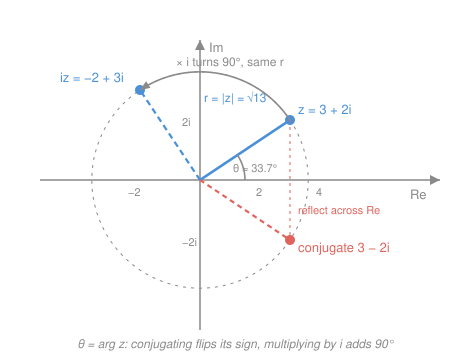

# Precalculus · Lesson 2.4: Complex numbers

> ⏱ ~15 min · Module 2: Polynomial, rational, exponential, and logarithmic functions · Builds on: [2.1 Polynomial functions](02-01-polynomial-functions.md), [`algebra-foundations` 4.1](../../algebra-foundations/lessons/04-01-quadratic-equations.md) · Unlocks: [3.1 Trig functions for calculus](03-01-trig-functions-for-calculus.md)

## Why this matters

[`algebra-foundations` 4.1](../../algebra-foundations/lessons/04-01-quadratic-equations.md) left you with an IOU: when the discriminant $\Delta = b^2-4ac$ is negative the parabola floats clear of the axis, and the honest answer was "no *real* solution." This lesson cashes that IOU — and the payoff is far bigger than tidying up one quadratic. The two roots you get back are a **conjugate pair**, and a conjugate pair is the algebraic fingerprint of *rotation and oscillation*. That is why a $90^\circ$ rotation matrix has eigenvalues $\pm i$ in [`linalg-refresher` 3.1](../../linalg-refresher/lessons/03-01-eigenvalues-eigenvectors.md), and why a spring-and-damper equation rings instead of sagging in [`ode-refresher` 2.1](../../ode-refresher/lessons/02-01-second-order-constant-coefficient.md). Every one of those courses reaches for $i$ on page one and assumes you own it. After this lesson you do.

## The idea

Solve $x^2 + 1 = 0$. You need a number whose square is $-1$, and no real number qualifies — squares of reals are never negative. So you have two choices: declare the question broken, or **enlarge the number system until it has an answer**.

You have made this move before, three times, without noticing. Counting numbers can't do $3 - 5$, so we invented negatives. Integers can't do $3 \div 5$, so we invented fractions. Rationals can't do $\sqrt{2}$, so we invented irrationals. Each time the recipe was identical: name the missing object, insist the old arithmetic rules still hold, and check nothing breaks. Do it once more — name a symbol $i$ with $i^2 = -1$ — and you get the **complex numbers**.

Here's the part worth waiting for. Once you allow $i$, every number takes the form $a + bi$: two independent knobs, so complex numbers don't fit on a *line*, they fill a **plane**. And on that plane multiplication stops being "stretch along a line" and becomes **stretch *and* turn**. That single geometric fact — multiplying by a complex number rotates — is why complex numbers show up everywhere something goes around and around: waves, AC current, orbits, vibrating beams.

## The formal version

**The imaginary unit.** Define $i$ by
$$i^2 = -1.$$
*In words: $i$ is, by decree, a square root of $-1$. It isn't "found" anywhere on the real line; it is adjoined to it.*

**Complex numbers.** A **complex number** is $z = a + bi$ with $a, b$ real. Call $a = \operatorname{Re} z$ the **real part** and $b = \operatorname{Im} z$ the **imaginary part** (note: $\operatorname{Im} z$ is the real number $b$, not $bi$). Every real number is complex, with $b = 0$ — the reals are a *line inside* the plane, not a rival system.

**Arithmetic: the old rules, plus $i^2 = -1$.** Add and subtract componentwise; multiply by expanding as usual and then collapsing every $i^2$:
$$(a+bi) + (c+di) = (a+c) + (b+d)i,$$
$$(a+bi)(c+di) = ac + adi + bci + bd\,i^2 = (ac - bd) + (ad + bc)i.$$
*In words: nothing new to memorize — FOIL, then replace $i^2$ by $-1$ and re-sort into "real stuff" and "$i$ stuff."*

**Conjugate.** The **conjugate** of $z = a+bi$ is $\bar z = a - bi$ — same number with the sign of the imaginary part flipped. Its one indispensable property:
$$z\bar z = (a+bi)(a-bi) = a^2 - (bi)^2 = a^2 + b^2,$$
a **real, non-negative** number.
*In words: multiplying by the conjugate is the difference-of-squares trick, and it launders a complex number into a real one.*

**Division.** That launder is how you divide: multiply top and bottom by the conjugate of the bottom, exactly as you rationalize a radical denominator.
$$\frac{a+bi}{c+di} = \frac{a+bi}{c+di}\cdot\frac{c-di}{c-di} = \frac{(ac+bd) + (bc-ad)i}{c^2+d^2}.$$
*In words: clear the $i$ out of the denominator, then split into real part and imaginary part.*

**The complex plane.** Plot $z = a+bi$ at the point $(a,b)$: horizontal axis real, vertical axis imaginary. Then
$$\lvert z\rvert = \sqrt{a^2+b^2} \quad (\text{the \textbf{modulus}}), \qquad \theta = \arg z \ \text{ with } \ \tan\theta = \frac{b}{a} \quad (\text{the \textbf{argument}}).$$
*In words: the modulus is the distance from the origin — the same Pythagorean length as a vector's magnitude in [4.2](04-02-vectors-parametric-and-polar.md) — and the argument is the angle it points, measured counterclockwise from the positive real axis.* Note $\lvert z\rvert^2 = z\bar z$, and that conjugating reflects across the real axis: $\lvert \bar z\rvert = \lvert z\rvert$, $\arg \bar z = -\arg z$.

**Polar form, and why multiplication rotates.** Since $a = r\cos\theta$ and $b = r\sin\theta$ with $r = \lvert z\rvert$,
$$z = r(\cos\theta + i\sin\theta).$$
Multiply two of them and use the sum identities from [3.1](03-01-trig-functions-for-calculus.md):
$$r_1(\cos\alpha + i\sin\alpha)\cdot r_2(\cos\beta + i\sin\beta) = r_1 r_2\big(\cos(\alpha+\beta) + i\sin(\alpha+\beta)\big).$$
*In words: **moduli multiply, arguments add**. Multiplying by $z$ scales the plane by $\lvert z\rvert$ and rotates it by $\arg z$ — one number carrying two instructions.* Test it on $i$ itself: $\lvert i\rvert = 1$, $\arg i = 90^\circ$, so multiplying by $i$ is a pure quarter turn. Do it twice and you have turned $180^\circ$, which is multiplication by $-1$ — that's $i^2 = -1$, read off the geometry.

**Euler's formula.** The polar factor has a name:
$$e^{i\theta} = \cos\theta + i\sin\theta, \qquad\text{so}\qquad z = re^{i\theta}.$$
*In words: $e^{i\theta}$ is exactly the point on [3.1](03-01-trig-functions-for-calculus.md)'s unit circle at angle $\theta$ — the same $(\cos\theta, \sin\theta)$ you have been reading off that circle all along, now written as one exponential.* Its modulus is $\sqrt{\cos^2\theta + \sin^2\theta} = 1$ by the Pythagorean identity, so it never leaves the circle; and the rotate-and-scale rule becomes the ordinary exponent law $e^{i\alpha}e^{i\beta} = e^{i(\alpha+\beta)}$. Setting $\theta = \pi$ gives $e^{i\pi} = -1$. (Take the formula on faith here; [`calc-refresher` 3.2](../../calc-refresher/lessons/03-02-power-and-taylor-series.md) proves it by matching the power series of $e^x$, $\cos x$, and $\sin x$.)

**The payoff: $\Delta < 0$ gives a conjugate pair.** Run the quadratic formula without flinching at the negative under the root. Writing $\sqrt{\Delta} = i\sqrt{\lvert\Delta\rvert}$ when $\Delta < 0$,
$$x = \frac{-b \pm i\sqrt{4ac-b^2}}{2a} = \underbrace{-\frac{b}{2a}}_{\text{real part}} \pm\, i\underbrace{\frac{\sqrt{4ac-b^2}}{2a}}_{\text{imaginary part}}.$$
*In words: a real quadratic that misses the axis has exactly two complex roots, and they are conjugates — same real part, opposite imaginary parts.* This is no accident: **any** polynomial with real coefficients has non-real roots in conjugate pairs, because conjugating the whole equation leaves it unchanged. And with complex roots allowed, [2.1](02-01-polynomial-functions.md)'s "at most $n$ zeros" upgrades to **exactly** $n$ zeros counted with multiplicity — the Fundamental Theorem of Algebra.

## Picture

The blue segment is $z = 3+2i$: length $\lvert z\rvert = \sqrt{9+4} = \sqrt{13}$, angle $\arg z = \tan^{-1}\tfrac{2}{3} \approx 33.7^\circ$. The coral point is $\bar z = 3-2i$, the mirror image across the real axis — same length, opposite angle. And $iz = -2+3i$ sits on the *same dashed circle*, a quarter turn counterclockwise: multiplying by $i$ changed the direction and left the size alone.

## Worked examples

**Example 1 (mechanical — the four operations).** With $z = 2+3i$ and $w = 1-i$:

$$z + w = 3 + 2i, \qquad zw = (2+3i)(1-i) = 2 - 2i + 3i - 3i^2 = 2 + i + 3 = 5 + i.$$

For the quotient, multiply by $\bar w / \bar w = (1+i)/(1+i)$:

$$\frac{z}{w} = \frac{(2+3i)(1+i)}{(1-i)(1+i)} = \frac{2 + 2i + 3i + 3i^2}{1 + 1} = \frac{-1 + 5i}{2} = -\tfrac{1}{2} + \tfrac{5}{2}i.$$

And $\lvert z\rvert = \sqrt{4+9} = \sqrt{13}$, while $z\bar z = (2+3i)(2-3i) = 4+9 = 13 = \lvert z\rvert^2$ ✓.

**Example 2 (why you'd care — the pair that oscillates).** Solve $x^2 - 2x + 5 = 0$. Here $\Delta = 4 - 20 = -16 < 0$, so the parabola misses the axis. Push through anyway:

$$x = \frac{2 \pm \sqrt{-16}}{2} = \frac{2 \pm 4i}{2} = 1 \pm 2i.$$

Check the root $1+2i$: $(1+2i)^2 = 1 + 4i + 4i^2 = -3+4i$, and $-3+4i - 2(1+2i) + 5 = -3 + 4i - 2 - 4i + 5 = 0$ ✓. A conjugate pair, as promised, with sum $2 = -b/a$ and product $(1+2i)(1-2i) = 1+4 = 5 = c/a$ — the old sum/product checks survive intact.

Now watch what that pair *does*. In [`ode-refresher` 2.1](../../ode-refresher/lessons/02-01-second-order-constant-coefficient.md) the equation $y'' - 2y' + 5y = 0$ is solved by guessing $y = e^{rt}$, which turns it into exactly this quadratic. So $r = 1 \pm 2i$, and by Euler's formula

$$e^{(1+2i)t} = e^{t}\,e^{2it} = e^{t}\big(\cos 2t + i\sin 2t\big).$$

The **real part** of the root, $1$, sets the growing envelope $e^{t}$; the **imaginary part**, $2$, sets the ringing frequency. Combining the conjugate pair cancels the imaginary parts and leaves the real answer $y = e^{t}(c_1\cos 2t + c_2\sin 2t)$. That is the whole payoff of this lesson in one line: *negative discriminant $\Rightarrow$ conjugate pair $\Rightarrow$ oscillation.*

## Watch out

- **You might think $\sqrt{-4}\cdot\sqrt{-9} = \sqrt{36} = 6$.** It doesn't: the rule $\sqrt{a}\sqrt{b} = \sqrt{ab}$ is only valid for non-negative $a,b$. Convert to $i$ *first* — $\sqrt{-4}\,\sqrt{-9} = (2i)(3i) = 6i^2 = -6$ — and the trap closes.
- **You might think $z^2 = \lvert z\rvert^2$.** No: $z\bar z = \lvert z\rvert^2$ is the real one. For $z = 2+3i$, $z^2 = -5+12i$ while $\lvert z\rvert^2 = 13$. When you divide, you multiply by the **conjugate** of the denominator, never by the denominator itself.
- **You might think $\arg z = \tan^{-1}(b/a)$ always.** The arctangent only returns angles in $(-90^\circ, 90^\circ)$, so for any $z$ in the left half-plane ($a<0$) you must add $180^\circ$. Same trap, same fix, as reading a vector's direction angle in [4.2](04-02-vectors-parametric-and-polar.md).
- **You might think "imaginary" means fake.** It's a 17th-century insult that stuck. Complex numbers are as legitimate as negatives — and $\lvert z\rvert$ measures something completely concrete. The one real casualty is **order**: there is no sensible "$z < w$" on a plane.

## One-liner

> A complex number is a point on a plane *and* an instruction — scale by $\lvert z\rvert$, turn by $\arg z$ — and a real quadratic that misses the axis pays you back in a conjugate pair, which is what oscillation looks like before it starts moving.

## Problems

**P1 (🟢)** Let $z = 3+2i$ and $w = 1-4i$. Write $z+w$, $zw$, and $\dfrac{z}{w}$ in the form $a+bi$.

**P2 (🟡)** Solve $x^2 - 4x + 13 = 0$. Verify that the roots are conjugates by checking that their sum is $-b/a$ and their product is $c/a$, then find the modulus of each root.

**P3 (🔴, optional)** (a) Write $z = 1+i$ in polar form and use the rotate-and-scale rule to compute $z^8$. (b) In [`linalg-refresher` 3.1](../../linalg-refresher/lessons/03-01-eigenvalues-eigenvectors.md), the $90^\circ$ rotation matrix $R = \begin{bmatrix}0&-1\\1&0\end{bmatrix}$ has characteristic equation $\lambda^2 + 1 = 0$, hence $\lambda = \pm i$. Using this lesson's geometry, say in one or two sentences why eigenvalues of modulus $1$ and argument $\pm 90^\circ$ are exactly what a pure rotation *should* produce.

Solutions

**P1** Sum: $(3+1) + (2-4)i = 4 - 2i$.

Product: $(3+2i)(1-4i) = 3 - 12i + 2i - 8i^2 = 3 - 10i + 8 = 11 - 10i$.

Quotient — multiply by $\bar w/\bar w = (1+4i)/(1+4i)$; the denominator becomes $1^2 + 4^2 = 17$:
$$\frac{3+2i}{1-4i} = \frac{(3+2i)(1+4i)}{17} = \frac{3 + 12i + 2i + 8i^2}{17} = \frac{-5 + 14i}{17} = -\tfrac{5}{17} + \tfrac{14}{17}i.$$

**P2** $\Delta = (-4)^2 - 4(1)(13) = 16 - 52 = -36 < 0$, so expect a conjugate pair:
$$x = \frac{4 \pm \sqrt{-36}}{2} = \frac{4 \pm 6i}{2} = 2 \pm 3i.$$
Sum: $(2+3i) + (2-3i) = 4 = -b/a$ ✓. Product: $(2+3i)(2-3i) = 4 + 9 = 13 = c/a$ ✓ (the conjugate product is exactly the difference-of-squares laundering). Modulus: $\lvert 2 \pm 3i\rvert = \sqrt{4+9} = \sqrt{13}$ for both — conjugates always share a modulus. Note the product of the roots, $13$, *is* $\lvert z\rvert^2$; that happens precisely because the two roots are each other's conjugate.

**P3** (a) $r = \lvert 1+i\rvert = \sqrt{1+1} = \sqrt 2$ and $\theta = 45^\circ = \tfrac{\pi}{4}$ (first quadrant, so no adjustment), giving $z = \sqrt2\,\big(\cos\tfrac{\pi}{4} + i\sin\tfrac{\pi}{4}\big) = \sqrt2\,e^{i\pi/4}$. Raising to the 8th power multiplies the modulus eight times over and adds the argument eight times:
$$z^8 = (\sqrt2)^8 e^{i\cdot 8\pi/4} = 16\,e^{2\pi i} = 16(\cos 2\pi + i\sin 2\pi) = 16.$$
Sanity check without polar form: $(1+i)^2 = 1 + 2i + i^2 = 2i$, so $z^8 = (2i)^4 = 16\,i^4 = 16$ ✓. Eight quarter-turns of $45^\circ$ is a full $360^\circ$ — the number lands back on the positive real axis, which is why the answer is real.

(b) Multiplying by a complex number of modulus $1$ scales by nothing and rotates by its argument. A pure rotation must preserve every length, so its eigenvalues can't have modulus other than $1$; and the turn it performs is $90^\circ$, which is precisely $\arg(\pm i) = \pm 90^\circ$. The sign pair reflects that the plane can be traversed either way around — the conjugate pair is the two-dimensional rotation seen from its two "circling" directions. (There is no *real* eigenvector because no real arrow survives a quarter turn pointing along its own line.)

## Flashback

**From Lesson 2.1 (Polynomial functions):** Without graphing, state the end behavior of $p(x) = -(x-1)^2(x+3)$ and describe what the curve does at each zero.

Solution

Degree is $2 + 1 = 3$ (sum of the multiplicities), and the leading term is $-x\cdot x^2 = -x^3$: negative leading coefficient, odd degree, so the curve **rises on the left and falls on the right** ($p\to+\infty$ as $x\to-\infty$, $p\to-\infty$ as $x\to+\infty$).

Zeros: $x = 1$ with multiplicity $2$ — even, so the curve **touches and turns around** without crossing; and $x = -3$ with multiplicity $1$ — odd, so it **crosses** straight through.

Tie-in: all three roots (counted with multiplicity) happen to be real here. This lesson explains the general rule — a degree-3 polynomial always has exactly three roots once complex ones count, and any non-real ones arrive in conjugate pairs, so an odd-degree real polynomial can never dodge having at least one real zero.

## Connections

- **Backward:** this closes the loop on [`algebra-foundations` 4.1](../../algebra-foundations/lessons/04-01-quadratic-equations.md)'s $\Delta<0$ case, and upgrades [2.1](02-01-polynomial-functions.md)'s "at most $n$ zeros" ceiling into an exact count.
- **Forward:** [3.1](03-01-trig-functions-for-calculus.md)'s unit circle is the set of numbers $e^{i\theta}$, and [4.2](04-02-vectors-parametric-and-polar.md)'s polar coordinates $(r,\theta)$ are polar form wearing different clothes. [`complex-analysis` 1.1](../../complex-analysis/lessons/01-01-complex-numbers-geometry.md) picks this up at Tier 2 and builds calculus on top of it.
- **Sideways (linear algebra):** a rotation matrix has no real eigenvector, and its eigenvalues $\pm i$ in [`linalg-refresher` 3.1](../../linalg-refresher/lessons/03-01-eigenvalues-eigenvectors.md) are the same "$\lvert\lambda\rvert=1$, argument $=$ the turn" statement as this lesson's rotate-and-scale rule.
- **Sideways (differential equations):** Example 2 *is* [`ode-refresher` 2.1](../../ode-refresher/lessons/02-01-second-order-constant-coefficient.md)'s oscillatory case — real part sets the envelope, imaginary part sets the frequency — and the same conjugate pair governs AC circuits, damped springs, and every resonance you will meet.
