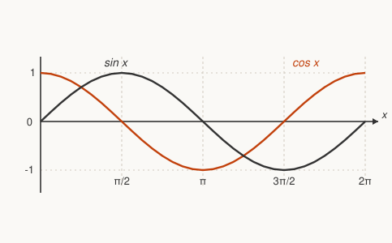

# Precalculus · Lesson 3.1: Trig functions for calculus

> ⏱ ~15 min · Module 3: Trigonometric functions, sequences, and series · Builds on: 1.3 (transformations of graphs) · Unlocks: 3.2 (sequences and sigma notation)

## Why this matters

Trigonometry is where calculus gets its two most useful periodic building blocks: $\sin$ and $\cos$ are the functions that reappear as vibrations, waves, orbits, and alternating current. In [`calc-refresher`](../../calc-refresher/syllabus.md) you'll differentiate them ($\tfrac{d}{dx}\sin x = \cos x$), integrate their squares using one identity, and use $\sin$ and $\cos$ as substitutions to tame square roots. In [`mechanics-refresher`](../../mechanics-refresher/syllabus.md), simple harmonic motion *is* a shifted cosine. This lesson is not a re-teach — you built all of this in [`trigonometry`](../../trigonometry/syllabus.md). It's a fast repack of exactly the pieces calculus grabs off the shelf.

## The idea

Put a point on the unit circle and walk it counterclockwise. Its **height** above the $x$-axis is $\sin\theta$; its **horizontal position** is $\cos\theta$. That's the whole definition — everything else is bookkeeping. Because the point comes back to where it started after one full loop, both functions repeat forever: they are *periodic*. And the "angle" $\theta$ is measured not in degrees but in **radians** — the arc length swept out on a circle of radius 1 — because that's the only unit that makes the calculus clean. In radians, a tiny angle and its sine are nearly the same number, and that single fact is why the derivatives come out simple.

## The formal version

**Radians.** One full turn is $2\pi$ radians $= 360^\circ$, so $\pi\text{ rad} = 180^\circ$ and $1\text{ rad} = \tfrac{180}{\pi}^\circ \approx 57.3^\circ$. On a circle of radius $r$, an angle $\theta$ (in radians) subtends arc length $s = r\theta$.
*In words: a radian is "how far you walked along the rim, in radius-lengths."*

**The six functions.** For the point $(\cos\theta,\sin\theta)$ on the unit circle,
$$\tan\theta=\frac{\sin\theta}{\cos\theta},\qquad \cot\theta=\frac{\cos\theta}{\sin\theta},\qquad \sec\theta=\frac{1}{\cos\theta},\qquad \csc\theta=\frac{1}{\sin\theta}.$$
*In words: everything is built from $\sin$ and $\cos$; $\tan\theta$ is the slope of the radius line.*

**Special angles calculus reuses.** Memorize this row — it's the answer key for nearly every clean derivative check and integral bound:

| $\theta$ | $0$ | $\tfrac{\pi}{6}$ | $\tfrac{\pi}{4}$ | $\tfrac{\pi}{3}$ | $\tfrac{\pi}{2}$ |
|---|---|---|---|---|---|
| $\sin\theta$ | $0$ | $\tfrac{1}{2}$ | $\tfrac{\sqrt2}{2}$ | $\tfrac{\sqrt3}{2}$ | $1$ |
| $\cos\theta$ | $1$ | $\tfrac{\sqrt3}{2}$ | $\tfrac{\sqrt2}{2}$ | $\tfrac{1}{2}$ | $0$ |
| $\tan\theta$ | $0$ | $\tfrac{1}{\sqrt3}$ | $1$ | $\sqrt3$ | — |

**The identities calculus leans on.**

$$\sin^2\theta+\cos^2\theta=1 \quad\Longrightarrow\quad 1+\tan^2\theta=\sec^2\theta.$$
*In words: the Pythagorean identity — coordinates on a unit circle — and its cousin, which is the engine behind trig substitution.*

$$\sin 2\theta = 2\sin\theta\cos\theta,\qquad \cos 2\theta = 1-2\sin^2\theta = 2\cos^2\theta-1.$$

Solving the last one for the squares gives the **power-reduction** identities — the trick for integrating $\sin^2$ and $\cos^2$:
$$\cos^2\theta=\frac{1+\cos 2\theta}{2},\qquad \sin^2\theta=\frac{1-\cos 2\theta}{2}.$$
*In words: a squared trig term is secretly a plain cosine wave at double the frequency plus a constant — and a plain cosine is trivial to integrate.*

## Picture

Read the two curves off the circle: $\sin x$ (dark) starts at $0$ and rises; $\cos x$ (accent) starts at $1$ and falls. Each has **amplitude** $1$, **period** $2\pi$, and they are the same wave shifted by $\tfrac{\pi}{2}$: $\cos x = \sin\!\left(x+\tfrac{\pi}{2}\right)$.

**Transformations** work exactly as in [Lesson 1.3](01-03-transformations-of-graphs.md), just with named knobs. For $y = A\sin\!\big(B(x-C)\big)+D$:

- $|A|$ = **amplitude** (vertical stretch); the wave now runs from $D-|A|$ to $D+|A|$.
- $B$ sets the **period** $= \dfrac{2\pi}{B}$ (horizontal compression by factor $B$).
- $C$ = **phase shift** (horizontal slide); $D$ = vertical slide of the midline.

$\tan x$ is a different animal: period $\pi$ (not $2\pi$), no amplitude, and vertical asymptotes wherever $\cos x = 0$, i.e. at $x=\pm\tfrac{\pi}{2},\pm\tfrac{3\pi}{2},\dots$ — the spots where the slope of the radius goes vertical.

## Why radians are non-negotiable

Try to differentiate $\sin$ from the limit definition and you hit
$$\frac{d}{dx}\sin x = \lim_{h\to 0}\frac{\sin(x+h)-\sin x}{h},$$
which collapses to $\cos x$ **only because** $\lim_{h\to 0}\tfrac{\sin h}{h}=1$ when $h$ is in radians. That limit is the **small-angle fact**: for small $x$ (radians),
$$\sin x \approx x,\qquad \cos x \approx 1-\tfrac{x^2}{2},\qquad \tan x \approx x.$$
In degrees the same limit equals $\tfrac{\pi}{180}$, and every derivative would drag an ugly constant. So calculus, physics, and this course use radians *always* — degrees are for surveyors.

## Worked examples

**Example 1 (mechanical).** Given $\sin\theta = \tfrac{3}{5}$ with $\theta$ in the second quadrant, find $\cos\theta$ and $\tan\theta$.

From $\sin^2\theta+\cos^2\theta=1$: $\cos^2\theta = 1-\tfrac{9}{25}=\tfrac{16}{25}$, so $\cos\theta=\pm\tfrac45$. In quadrant II, $x<0$, so $\cos\theta = -\tfrac45$. Then $\tan\theta = \tfrac{\sin\theta}{\cos\theta} = \tfrac{3/5}{-4/5} = -\tfrac34$. The Pythagorean identity did all the work; the quadrant only fixed the sign.

**Example 2 (why you'd care).** Integrating $\cos^2 x$ looks hard until you use power reduction:
$$\int_0^{\pi}\cos^2 x\,dx = \int_0^{\pi}\frac{1+\cos 2x}{2}\,dx = \left[\frac{x}{2}+\frac{\sin 2x}{4}\right]_0^{\pi} = \frac{\pi}{2}+0 = \frac{\pi}{2}.$$
Without the identity, $\cos^2 x$ has no elementary antiderivative you can write down directly. This exact move recurs constantly in `calc-refresher` and in computing the average power of an AC signal in physics.

## Watch out

- You might think $\sin^2 x$ means $\sin(x^2)$ — it does **not**. $\sin^2 x = (\sin x)^2$; the exponent rides on the whole value. But $\sin^{-1}x$ breaks the pattern and means $\arcsin x$, not $\tfrac{1}{\sin x}$ (that's $\csc x$). Blame historical notation.
- You might think you can plug degrees into $\sin x \approx x$ or into $\tfrac{d}{dx}\sin x=\cos x$. You can't — both are radian-only facts. Set your mental calculator to radians and leave it there.
- You might think amplitude changes the period. It doesn't: $A$ stretches vertically, $B$ stretches horizontally, and they're independent knobs.

## One-liner

> $\sin$ and $\cos$ are the height and shadow of a point circling the origin — measured in radians so that, up close, $\sin x$ *is* $x$ and the calculus falls out clean.

## Problems

**P1 (🟢)** Without a calculator, give exact values: $\sin\tfrac{\pi}{3}$, $\cos\tfrac{\pi}{6}$, $\tan\tfrac{\pi}{4}$, and $\cos\tfrac{2\pi}{3}$.

**P2 (🟡)** Use a double-angle (power-reduction) identity to find the **exact** value of $\cos^2\tfrac{\pi}{8}$.

**P3 (🔴, optional)** Using the small-angle facts, evaluate $\displaystyle\lim_{x\to 0}\frac{\sin 3x}{x}$, and state what the answer would become if $x$ were measured in degrees instead.

Solutions

**P1** Straight off the special-angle row: $\sin\tfrac{\pi}{3} = \tfrac{\sqrt3}{2}$, $\cos\tfrac{\pi}{6} = \tfrac{\sqrt3}{2}$, $\tan\tfrac{\pi}{4} = 1$. For $\tfrac{2\pi}{3} = 120^\circ$ (quadrant II), $\cos$ is negative with reference angle $\tfrac{\pi}{3}$: $\cos\tfrac{2\pi}{3} = -\cos\tfrac{\pi}{3} = -\tfrac12$.

**P2** Power reduction: $\cos^2\theta = \tfrac{1+\cos 2\theta}{2}$ with $\theta = \tfrac{\pi}{8}$, so $2\theta = \tfrac{\pi}{4}$:
$$\cos^2\tfrac{\pi}{8} = \frac{1+\cos\tfrac{\pi}{4}}{2} = \frac{1+\tfrac{\sqrt2}{2}}{2} = \frac{2+\sqrt2}{4}.$$
(Numerically $\approx 0.8536$; check: $\cos\tfrac{\pi}{8}\approx 0.9239$, and $0.9239^2 \approx 0.8536$. ✓)

**P3** For small $x$ (radians), $\sin 3x \approx 3x$, so $\tfrac{\sin 3x}{x} \approx \tfrac{3x}{x} = 3$. Rigorously, $\tfrac{\sin 3x}{x} = 3\cdot\tfrac{\sin 3x}{3x}\to 3\cdot 1 = 3$. If $x$ were in degrees, $\sin 3x^\circ \approx \tfrac{\pi}{180}(3x)$, and the limit would be $\tfrac{3\pi}{180} = \tfrac{\pi}{60}\approx 0.052$ — the same "wrong constant" that would infect every trig derivative. Radians make it exactly $3$.

## Flashback

**From Lesson 1.3 (Transformations of graphs):** Start from the parent $f(x)=x^2$ and build $g(x) = -\tfrac12(x-4)^2 + 5$. Describe $g$ as an ordered sequence of transformations of $f$, then state the vertex, the maximum value, and the range.

Solution

Read the knobs from the outside in on $g(x) = -\tfrac12\,(x-4)^2 + 5$:

1. **Shift right 4**: $x \mapsto x-4$ moves the vertex to $x=4$.
2. **Vertical compress by $\tfrac12$**: multiply by $\tfrac12$ (the parabola opens more gently).
3. **Reflect across the $x$-axis**: the minus sign flips it to open **downward**.
4. **Shift up 5**: $+5$ lifts the vertex to height $5$.

Vertex: $(4,\,5)$. Because it opens downward, that vertex is a **maximum**, so the maximum value is $5$ and the range is $(-\infty,\,5]$. (Order matters between steps 2–3 and step 4: stretch/reflect before the final vertical shift, exactly as in Lesson 1.3.)

## Connections

- **Backward:** every value here comes from the unit circle you built in [`trigonometry` 2.2](../../trigonometry/lessons/02-02-the-unit-circle.md); the identities are derived in full in [`trigonometry` 3.2](../../trigonometry/lessons/03-02-fundamental-identities.md), and the graph transformations reuse the machinery of [Lesson 1.3](01-03-transformations-of-graphs.md).
- **Forward:** [`calc-refresher`](../../calc-refresher/syllabus.md) differentiates $\sin/\cos$ using the small-angle limit, integrates $\sin^2/\cos^2$ with power reduction, and uses $x=\sin\theta$ / $x=\tan\theta$ substitutions that live or die by $\sin^2+\cos^2=1$ and $1+\tan^2=\sec^2$. Next lesson, [3.2](03-02-sequences-and-sigma-notation.md), switches from continuous waves to discrete sums.
- **Sideways (physics):** simple harmonic motion in [`mechanics-refresher`](../../mechanics-refresher/syllabus.md) is $x(t)=A\cos(\omega t+\phi)$ — amplitude, angular frequency, and phase shift are the same three knobs $A$, $B$, $C$ from this lesson, now carrying physical units.
