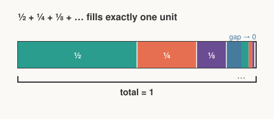

# Precalculus · Lesson 3.3: Series and the infinite geometric sum

> ⏱ ~15 min · Module 3: Trigonometric functions, sequences, and series · Builds on: 3.2 (sequences and sigma notation) · Unlocks: 4.1 (conic sections)

## Why this matters

"Add infinitely many numbers and get a *finite* answer" sounds like a contradiction — yet it's the engine behind the value of a perpetuity in finance, the total energy in a decaying oscillation, and the repeating-decimal fact that $0.\overline{9}=1$. More importantly, it's the first place you'll watch a **limit** do real work. Once you see that an infinite sum is secretly "the limit of the finite sums," the leap to calculus stops being a leap.

## The idea

A **sequence** lists terms: $a_1, a_2, a_3, \dots$. A **series** is what you get when you *add* them: $a_1 + a_2 + a_3 + \cdots$. The question is whether that running total settles down.

Picture a one-meter walk where each step covers half the *remaining* distance. First step: $\tfrac12$. Then $\tfrac14$, then $\tfrac18$, forever. You never take a "last step," yet you never pass the one-meter mark either — the leftover gap halves each time and shrinks to nothing. The total *approaches* $1$ and never overshoots. That approaching-a-ceiling behavior is **convergence**, and the ceiling is the sum.

The magic only happens because each term is a fixed fraction of the one before. Halve every step and the pile fills a finite box. Keep the steps the same size, or make them *grow*, and the pile is bottomless — it **diverges**.

## The formal version

A **geometric series** has a first term $a$ and a constant **ratio** $r$ between consecutive terms:

$$a + ar + ar^2 + ar^3 + \cdots = \sum_{k=0}^{\infty} a\,r^{k}.$$

Start with the **finite** partial sum of the first $n$ terms, $S_n = a + ar + \cdots + ar^{n-1}$. The classic trick: subtract $rS_n$ from $S_n$ and watch the middle collapse (a **telescoping** cancellation):

$$S_n - rS_n = a - ar^{n} \quad\Longrightarrow\quad S_n = a\,\frac{1 - r^{n}}{1 - r}\quad (r \neq 1).$$

In words: the whole finite sum compresses into two surviving terms over $1-r$. Now let $n\to\infty$. If $\lvert r\rvert < 1$, then $r^{n}\to 0$ (a fraction raised to ever-higher powers vanishes), and the survivor is

$$\boxed{\,\sum_{k=0}^{\infty} a\,r^{k} = \frac{a}{1 - r}\,}\qquad \text{when } \lvert r\rvert < 1.$$

In words: the infinite sum is the *limit* of the partial sums, and that limit is first term over "one minus the ratio." If $\lvert r\rvert \geq 1$, the term $r^{n}$ does **not** die — the partial sums blow up (or oscillate without settling) — and the series **diverges**: it has no sum.

## Picture

Each shaded piece is half the length of the one before ($a=\tfrac12$, $r=\tfrac12$). Together they tile the unit bar exactly, with the blue "gap" shrinking to zero — the physical meaning of $\dfrac{1/2}{1-1/2}=1$.

## Worked examples

**Example 1 (mechanical).** Sum $\displaystyle\sum_{k=0}^{\infty}\left(\tfrac{1}{3}\right)^{k} = 1 + \tfrac13 + \tfrac19 + \cdots$.

Here $a = 1$ (the $k=0$ term) and $r = \tfrac13$, and $\lvert r\rvert < 1$, so

$$\frac{a}{1-r} = \frac{1}{1 - \tfrac13} = \frac{1}{\,\tfrac23\,} = \frac{3}{2}.$$

Sanity check with partial sums: $1,\ 1.\overline{3},\ 1.4\overline{4},\ 1.481\dots$ — climbing toward $1.5$ and never past it.

**Example 2 (why you'd care — a perpetuity).** An endowment pays 1,000 dollars every year, forever, and money one year out is worth a factor $\tfrac{1}{1+i}$ less today (here interest rate $i = 0.05$). The present value is the sum of all discounted payments — a geometric series with first payment discounted once:

$$PV = \frac{1000}{1.05} + \frac{1000}{1.05^2} + \frac{1000}{1.05^3} + \cdots .$$

First term $a = \tfrac{1000}{1.05}$, ratio $r = \tfrac{1}{1.05}$ (and $\lvert r\rvert<1$):

$$PV = \frac{a}{1-r} = \frac{1000/1.05}{\,1 - 1/1.05\,} = \frac{1000/1.05}{\,0.05/1.05\,} = \frac{1000}{0.05} = 20{,}000 \text{ dollars}.$$

The whole infinite stream of payments is worth a finite 20,000 dollars today — and it collapses to the clean rule $PV = \dfrac{\text{payment}}{i}$. That's the perpetuity formula you'll meet in [`mathematical-finance`](../../mathematical-finance/syllabus.md), and it *is* an infinite geometric series.

## Watch out

- **You might think the terms just need to shrink to zero for the sum to be finite — but that's not enough.** Terms $\to 0$ is *necessary*, not *sufficient*: the harmonic series $1 + \tfrac12 + \tfrac13 + \tfrac14 + \cdots$ has terms dying to zero yet diverges to infinity. For *geometric* series specifically, $\lvert r\rvert<1$ is the exact make-or-break line.
- **You might reach for $\frac{a}{1-r}$ on any series — it's the geometric formula only.** Confirm the ratio between consecutive terms is *constant* first. No fixed $r$, no formula.
- **Watch which term is $a$.** In $\dfrac{a}{1-r}$, $a$ is the *first term you're actually adding*, not necessarily the $k=0$ value. If a sum starts at $k=3$, let $a$ be that first included term.

## One-liner

> An infinite geometric series is just the limit of its finite partial sums, and when $\lvert r\rvert<1$ that limit is $\dfrac{a}{1-r}$ — the first taste of a limit turning "forever" into a number.

## Problems

**P1 (🟢)** Evaluate $\displaystyle\sum_{k=0}^{\infty} 5\left(\tfrac{2}{5}\right)^{k}$, or state that it diverges.

**P2 (🟡)** Does $\displaystyle\sum_{k=0}^{\infty}\left(\tfrac{3}{2}\right)^{k}$ converge? Justify using $r^n$, then contrast with $\sum_{k=0}^{\infty}\left(\tfrac{2}{3}\right)^{k}$.

**P3 (🔴, optional)** Write the repeating decimal $0.\overline{27} = 0.272727\dots$ as an infinite geometric series and use $\dfrac{a}{1-r}$ to express it as an exact fraction. (This is the trick behind "every repeating decimal is rational.")

Solutions

**P1** First term $a = 5$, ratio $r = \tfrac25$, and $\lvert r\rvert = \tfrac25 < 1$, so it converges:
$$\frac{a}{1-r} = \frac{5}{1 - \tfrac25} = \frac{5}{\,\tfrac35\,} = \frac{25}{3}.$$

**P2** Here $r = \tfrac32$, so $\lvert r\rvert = \tfrac32 \geq 1$. As $n\to\infty$, $r^n = \left(\tfrac32\right)^n \to \infty$ rather than $0$, so the partial sums $S_n = \tfrac{1-r^n}{1-r}$ grow without bound — the series **diverges**. By contrast $\sum\left(\tfrac23\right)^k$ has $r = \tfrac23$, $\lvert r\rvert<1$, and $\left(\tfrac23\right)^n\to 0$, giving $\dfrac{1}{1-\tfrac23} = 3$. Same shape, opposite fate — decided entirely by whether $\lvert r\rvert$ crosses $1$.

**P3** Group the digits in pairs:
$$0.\overline{27} = \frac{27}{100} + \frac{27}{100^2} + \frac{27}{100^3} + \cdots,$$
a geometric series with $a = \tfrac{27}{100}$ and $r = \tfrac{1}{100}$ (so $\lvert r\rvert<1$). Then
$$0.\overline{27} = \frac{a}{1-r} = \frac{27/100}{\,1 - 1/100\,} = \frac{27/100}{\,99/100\,} = \frac{27}{99} = \frac{3}{11}.$$
Check: $3 \div 11 = 0.2727\dots$ ✓.

## Flashback

**From Lesson 3.2 (Sequences and sigma notation):** Evaluate the *finite* sum $\displaystyle\sum_{k=1}^{40}(3k - 1) = 2 + 5 + 8 + \cdots + 119$.

Solution

This is arithmetic: first term $a_1 = 3(1)-1 = 2$, last term $a_{40} = 3(40)-1 = 119$, with $n = 40$ terms. Use the finite arithmetic sum $S_n = \dfrac{n}{2}(a_1 + a_n)$:
$$S_{40} = \frac{40}{2}(2 + 119) = 20 \cdot 121 = 2420.$$
(Cross-check by splitting: $\sum_{k=1}^{40} 3k - \sum_{k=1}^{40} 1 = 3\cdot\tfrac{40\cdot 41}{2} - 40 = 2460 - 40 = 2420$ ✓.)

## Connections

- **Backward:** Lesson 3.2 gave you finite partial sums and $\Sigma$ notation; this lesson takes the finite geometric sum $a\frac{1-r^n}{1-r}$ and pushes $n\to\infty$.
- **Forward:** Lesson [4.3 (limits and instantaneous rate)](04-03-limits-and-instantaneous-rate.md) makes the phrase "$r^n\to 0$" precise — the same limiting move, now applied to shrinking secant intervals. In [`calc-refresher`](../../calc-refresher/syllabus.md) and [`real-analysis`](../../real-analysis/syllabus.md), convergence is made rigorous and generalized to power series and Taylor series, where $\lvert r\rvert<1$ becomes the radius of convergence.
- **Sideways (finance):** the present value of a perpetuity in [`mathematical-finance`](../../mathematical-finance/syllabus.md) is exactly the infinite geometric sum of Example 2 — $\dfrac{\text{payment}}{i}$ is $\dfrac{a}{1-r}$ in disguise.
