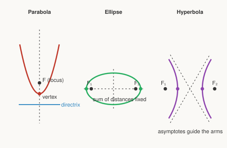

# Precalculus · Lesson 4.1: Conic sections

> ⏱ ~15 min · Module 4: Conics, vectors, and the door to calculus · Builds on: 2.1 (polynomial functions) · Unlocks: 4.2 (vectors, parametric, and polar)

## Why this matters

Point a flashlight at a wall and tilt it: the bright edge traces a circle, then an ellipse, then a parabola, then a hyperbola. These four curves are the *entire* catalog of what a plane can slice out of a cone — and nature reuses them everywhere. Planets and comets ride ellipses and hyperbolas around the Sun (Kepler, and later `analytical-mechanics`). A thrown ball and a satellite dish both trace parabolas — one in `mechanics-refresher`, one because a parabola reflects every incoming ray to a single point. Learn to read a curve's geometry straight off its equation, and a wall of second-degree equations turns into four familiar shapes.

## The idea

Take a double cone (two ice-cream cones tip to tip) and cut it with a flat plane. **The tilt of the plane decides the shape:**

- Slice level → a **circle**. Tilt a little → an **ellipse** (a squashed, closed loop).
- Tilt until the plane is parallel to the cone's side → a **parabola** (one open curve).
- Tilt past that, steep enough to hit *both* cones → a **hyperbola** (two open branches).

That's why they're called *conic sections* — literally sections of a cone. But each also has a clean "string" definition on the flat plane, phrased in terms of special points called **foci** (singular: focus):

- **Parabola:** every point is equidistant from a focus and a fixed line (the *directrix*).
- **Ellipse:** the *sum* of the distances to two foci is constant. (Pin two ends of a string, pull taut with a pencil, trace — that's an ellipse.)
- **Hyperbola:** the *difference* of the distances to two foci is constant.

Sum, difference, or "match a line" — that one word is the whole personality of each curve.

## The formal version

Center or vertex at the origin, axes aligned with the coordinate axes:

**Parabola** (opening up, vertex at origin):
$$y = a x^2, \qquad \text{equivalently } x^2 = 4p\,y \text{ with } a = \tfrac{1}{4p}.$$
In words: $p$ is the distance from vertex to focus. The focus sits at $(0,p)$ and the directrix is the line $y=-p$. Bigger $a$ (smaller $p$) = narrower parabola.

**Ellipse** (center at origin):
$$\frac{x^2}{a^2} + \frac{y^2}{b^2} = 1, \qquad a > b > 0.$$
In words: $a$ is the **semi-major axis** (half the long way), $b$ the **semi-minor axis** (half the short way). Vertices sit at $(\pm a, 0)$; foci at $(\pm c, 0)$ where $c^2 = a^2 - b^2$. The two foci pull *inward*, so $c < a$.

**Hyperbola** (center at origin, opening left–right):
$$\frac{x^2}{a^2} - \frac{y^2}{b^2} = 1.$$
In words: the **minus sign** is the whole difference between this and an ellipse. Vertices at $(\pm a, 0)$; foci at $(\pm c, 0)$ where now $c^2 = a^2 + b^2$ (foci sit *outside* the vertices, $c>a$). Far from the center the curve hugs its **asymptotes** $y = \pm \frac{b}{a}\,x$ — the straight lines the arms approach but never reach.

To move any of these off the origin, replace $x$ with $x-h$ and $y$ with $y-k$: the center (or vertex) shifts to $(h,k)$, everything else rides along. Recognizing that shift is what **completing the square** is for (below).

## Picture

Three curves, three signatures: the parabola opens away from a single focus and directrix; the ellipse closes around two inside foci; the hyperbola splits into two branches steered by crossing asymptotes, foci outside.

## Worked examples

**Example 1 (mechanical — read the geometry off the form).** Analyze $\dfrac{x^2}{25} + \dfrac{y^2}{9} = 1$.

It's a **sum** of squares equal to $1$: an ellipse, centered at the origin. Here $a^2 = 25$ and $b^2 = 9$, and since $25 > 9$ the major axis is horizontal, $a=5$, $b=3$. Then $c^2 = a^2 - b^2 = 25 - 9 = 16$, so $c = 4$.

- Vertices: $(\pm 5, 0)$. Minor-axis ends: $(0, \pm 3)$.
- Foci: $(\pm 4, 0)$.

Sanity check: $c=4 < a=5$, so both foci sit *inside* the ellipse. Good.

**Example 2 (why you'd care — completing the square).** A second-degree equation rarely arrives pre-centered. Identify and analyze
$$9x^2 + 4y^2 - 36x + 8y + 4 = 0.$$

Group by variable and factor out the leading coefficients:
$$9(x^2 - 4x) + 4(y^2 + 2y) = -4.$$
Complete each square — $x^2-4x = (x-2)^2 - 4$ and $y^2+2y = (y+1)^2 - 1$:
$$9\big[(x-2)^2 - 4\big] + 4\big[(y+1)^2 - 1\big] = -4.$$
Distribute and carry the constants over:
$$9(x-2)^2 + 4(y+1)^2 - 36 - 4 = -4 \;\Longrightarrow\; 9(x-2)^2 + 4(y+1)^2 = 36.$$
Divide by $36$ to hit standard form:
$$\frac{(x-2)^2}{4} + \frac{(y+1)^2}{9} = 1.$$
A **sum** = ellipse, center $(2,-1)$. Now $b^2=4$ under $x$ but $a^2=9$ under $y$, so the major axis is **vertical** (the bigger denominator names the long direction): $a=3$, $b=2$, $c^2 = 9-4 = 5$, $c=\sqrt5$. Vertices $(2,-1\pm 3) = (2,2)$ and $(2,-4)$; foci $(2,\,-1\pm\sqrt5)$. The whole curve is Example 1's ellipse, stood on end and slid to $(2,-1)$.

## Watch out

- You might think the bigger number always goes with $x$ — but for an ellipse **the larger denominator names the major axis's direction**, whichever variable it's under. Check which is bigger before you call the major axis horizontal.
- You might reuse $c^2 = a^2 - b^2$ for a hyperbola. It's the opposite sign: **ellipse subtracts** ($c<a$, foci inside), **hyperbola adds** ($c>a$, foci outside). The picture tells you which: foci hide inside a closed ellipse, but must sit beyond the vertices of an open hyperbola.
- You might read the sign of the *squared term* to spot a parabola. The tell for a parabola is that **only one variable is squared** ($x^2$ but not $y^2$, or vice versa). Two squared terms with the **same sign** → ellipse; **opposite signs** → hyperbola.

## One-liner

> Two squared terms added make an ellipse, subtracted make a hyperbola, and just one squared term makes a parabola — completing the square finds where each one is centered.

## Problems

**P1 (🟢)** Identify the conic $\dfrac{x^2}{4} - \dfrac{y^2}{9} = 1$ and give its vertices, foci, and the equations of its asymptotes.

**P2 (🟡)** Complete the square to put $x^2 + 4y^2 - 6x + 8y + 9 = 0$ in standard form. Name the conic and state its center, and (if it has them) its foci.

**P3 (🔴, optional)** Identify the conic $4x^2 - y^2 + 8x - 4y - 4 = 0$, find its center and vertices, and give its asymptotes. A comet that swings past the Sun once and never returns traces exactly this kind of curve — which feature of the equation tells you the path is open rather than a closed orbit?

Solutions

**P1** A **difference** of squares $=1$ → a hyperbola opening left–right, centered at the origin. Here $a^2=4,\ b^2=9$, so $a=2,\ b=3$. Vertices at $(\pm 2, 0)$. For a hyperbola $c^2 = a^2 + b^2 = 4 + 9 = 13$, so $c=\sqrt{13}$ and the foci are $(\pm\sqrt{13},\,0)$ — outside the vertices, as they must be. Asymptotes: $y = \pm\dfrac{b}{a}x = \pm\dfrac{3}{2}x$.

**P2** Group and complete the square:
$$(x^2 - 6x) + 4(y^2 + 2y) + 9 = 0.$$
With $x^2-6x=(x-3)^2-9$ and $y^2+2y=(y+1)^2-1$:
$$(x-3)^2 - 9 + 4\big[(y+1)^2 - 1\big] + 9 = 0 \;\Longrightarrow\; (x-3)^2 + 4(y+1)^2 - 4 = 0.$$
So $(x-3)^2 + 4(y+1)^2 = 4$, and dividing by $4$:
$$\frac{(x-3)^2}{4} + \frac{(y+1)^2}{1} = 1.$$
A **sum** → **ellipse**, center $(3,-1)$. Here $a^2=4$ (under $x$) beats $b^2=1$, so the major axis is horizontal: $a=2,\ b=1,\ c^2 = 4-1 = 3,\ c=\sqrt3$. Foci at $(3\pm\sqrt3,\,-1)$.

**P3** Group by variable, factoring out leading coefficients:
$$4(x^2 + 2x) - (y^2 + 4y) - 4 = 0.$$
Complete each square — $x^2+2x=(x+1)^2-1$, $\ y^2+4y=(y+2)^2-4$:
$$4\big[(x+1)^2 - 1\big] - \big[(y+2)^2 - 4\big] - 4 = 0 \;\Longrightarrow\; 4(x+1)^2 - (y+2)^2 - 4 + 4 - 4 = 0.$$
So $4(x+1)^2 - (y+2)^2 = 4$, and dividing by $4$:
$$\frac{(x+1)^2}{1} - \frac{(y+2)^2}{4} = 1.$$
A **difference** → **hyperbola**, center $(-1,-2)$, opening left–right with $a=1,\ b=2$. Vertices at $(-1\pm 1,\,-2)$, i.e. $(0,-2)$ and $(-2,-2)$. Asymptotes: $y+2 = \pm\dfrac{b}{a}(x+1) = \pm 2(x+1)$, i.e. $y = -2 \pm 2(x+1)$.

Which feature signals an *open* path? The **minus sign** between the squared terms. Two same-sign squares would close into an ellipse (a bound, repeating orbit); the opposite signs make a hyperbola, whose branches run off to infinity along the asymptotes — a one-time flyby.

## Flashback

**From Lesson 2.1 (Polynomial functions):** For $p(x) = -2(x+1)(x-3)^2$, list every real zero with its multiplicity, say whether the graph crosses or just touches the $x$-axis at each, and give the end behavior as $x \to \pm\infty$.

Solution

Zeros come straight from the factors: $x=-1$ (multiplicity $1$) and $x=3$ (multiplicity $2$). **Odd** multiplicity → the graph **crosses** at $x=-1$; **even** multiplicity → it **touches and turns around** at $x=3$.

End behavior is set by the leading term. Multiplying the highest-degree pieces: $-2 \cdot x \cdot x^2 = -2x^3$ — degree $3$ (odd), leading coefficient negative. An odd-degree polynomial sends the ends in opposite directions, and the negative sign flips the usual pattern: as $x \to -\infty,\ p(x) \to +\infty$; as $x \to +\infty,\ p(x) \to -\infty$.

## Connections

- **Backward:** completing the square is the same quadratic move from `algebra-foundations` and Lesson 2.1 — here it relocates a whole curve instead of finding a vertex. The "two squared terms" test is just polynomial-degree reading in two variables.
- **Forward:** Lesson 4.2 parametrizes these same curves — an ellipse becomes $x=a\cos t,\ y=b\sin t$ — turning a static shape into motion along it, which is exactly how `calc-refresher` and `analytical-mechanics` describe a planet tracing its Keplerian orbit.
- **Sideways (physics):** the projectile parabola in `mechanics-refresher` is Boss Problem 4 of this module; and the reflective property of the parabola (all rays to the focus) and the ellipse (focus to focus) is the geometry behind satellite dishes, headlights, and whispering galleries in optics.
