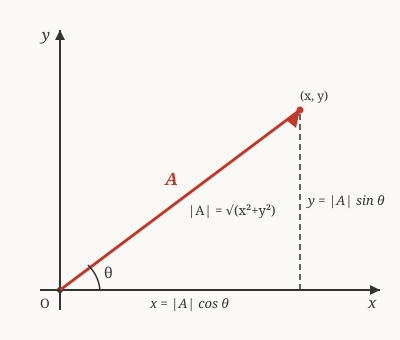

# Precalculus · Lesson 4.2: Vectors, parametric, and polar (light)

> ⏱ ~15 min · Module 4: Conics, vectors, and the door to calculus · Builds on: 3.1 (trig functions for calculus) · Unlocks: 4.3 (the door to calculus: limits and instantaneous rate)

## Why this matters

A single number can't say "3 meters per second **northeast**," and an equation like $y = f(x)$ can't describe a projectile that arcs up, stalls, and comes back down over the *same* horizontal position. This lesson hands you three ways to put motion and direction on the plane — vectors, parametric equations, and polar coordinates. Next lesson you'll differentiate a parametric path to get instantaneous velocity; in `mechanics-refresher` that path is a cannonball; in `complex-analysis` the polar form is how you multiply complex numbers.

## The idea

Three small shifts in perspective, each answering a question ordinary $y=f(x)$ can't:

- **Vectors** — instead of a lone number, carry an *arrow*: a magnitude (how much) and a direction (which way). Wind, force, velocity, displacement are all arrows.
- **Parametric** — instead of "$y$ in terms of $x$," describe *where a moving point is at each instant $t$*: give $x(t)$ and $y(t)$ separately. Time is the hidden puppeteer; the curve is what the puppet traces.
- **Polar** — instead of "go right $x$, then up $y$," give directions like a radar operator: *turn to angle $\theta$, then walk out distance $r$.* Circles and spirals that are ugly in $x,y$ become one-liners.

All three lean on the same trig you already own from Lesson 3.1 — sine and cosine are the machines that convert "distance-and-angle" into "right-and-up."

## The formal version

**Vector.** A 2-D vector is an ordered pair $\mathbf{A} = \langle x, y \rangle$ (its **components**), drawn as an arrow from the origin to the point $(x, y)$.

- **Magnitude:** $\;|\mathbf{A}| = \sqrt{x^2 + y^2}$ — the arrow's length (Pythagoras).
- **Direction angle:** $\;\theta = \tan^{-1}\!\left(\dfrac{y}{x}\right)$, adjusted to the correct quadrant — the angle from the positive $x$-axis.
- **Component form from length and angle:** $\;\mathbf{A} = \langle\, |\mathbf{A}|\cos\theta,\; |\mathbf{A}|\sin\theta \,\rangle.$
- **Addition:** $\langle a_1, a_2\rangle + \langle b_1, b_2\rangle = \langle a_1+b_1,\; a_2+b_2\rangle$ (tip-to-tail). **Scalar multiple:** $c\langle x,y\rangle = \langle cx, cy\rangle$ (rescale the length; flip if $c<0$).

*In words:* a vector is a point plus the arrow pointing at it; its length and heading are just the hypotenuse and angle of the right triangle its components form.

**Parametric equations.** A curve given by $x = x(t),\; y = y(t)$ for $t$ in some interval. As $t$ increases, the point $(x(t), y(t))$ traces a path. **Eliminating the parameter** means solving for $t$ (or otherwise combining the two equations) to recover a single Cartesian relation between $x$ and $y$.

*In words:* run the clock, watch the dot move, then — if you want the bare geometric shape — algebraically erase the clock.

**Polar coordinates.** A point is $(r, \theta)$: walk distance $r$ along the ray at angle $\theta$. Conversions:
$$x = r\cos\theta, \qquad y = r\sin\theta, \qquad r = \sqrt{x^2+y^2}, \qquad \tan\theta = \frac{y}{x}.$$

*In words:* rectangular is "how far right, how far up"; polar is "which way, how far." The first two equations are literally the component form of a vector — polar coordinates and vectors are the same idea in different clothes.

## Picture

The dashed legs are the components $x$ and $y$; the solid accent arrow is the vector itself. Its length is $|\mathbf{A}| = \sqrt{x^2+y^2}$ and its heading is $\theta$. Read off the two right-triangle relations directly: $x = |\mathbf{A}|\cos\theta$ and $y = |\mathbf{A}|\sin\theta$.

## Worked examples

**Example 1 (mechanical — length, angle, and back).** Let $\mathbf{A} = \langle -3, 3\sqrt{3}\rangle$.

Magnitude: $|\mathbf{A}| = \sqrt{(-3)^2 + (3\sqrt3)^2} = \sqrt{9 + 27} = \sqrt{36} = 6.$

Direction: $\tan^{-1}\!\big(\tfrac{3\sqrt3}{-3}\big) = \tan^{-1}(-\sqrt3)$ has reference angle $60^\circ$, but the components say *left and up* — second quadrant — so $\theta = 180^\circ - 60^\circ = 120^\circ.$

Check by rebuilding from length and angle: $\langle 6\cos120^\circ,\, 6\sin120^\circ\rangle = \langle 6(-\tfrac12),\, 6(\tfrac{\sqrt3}{2})\rangle = \langle -3, 3\sqrt3\rangle.$ ✓ The quadrant check is the whole game — a calculator's $\tan^{-1}$ can't tell $120^\circ$ from $-60^\circ$ on its own.

**Example 2 (why you'd care — a path that isn't a function of $x$).** A ball is thrown: $x(t) = 3t,\; y(t) = 4t - t^2$ (meters, seconds). Where is it, and what shape is the flight?

At $t=0$: $(0,0)$. At $t=2$: $(6, 4)$. At $t=4$: $(12, 0)$ — back on the ground.

Eliminate $t$: from $x = 3t$ we get $t = x/3$. Substitute:
$$y = 4\left(\frac{x}{3}\right) - \left(\frac{x}{3}\right)^2 = \frac{4x}{3} - \frac{x^2}{9}.$$
That's a downward parabola — a **projectile arc**. The parametric form knows *when* the ball is at each spot (that's the velocity information Lesson 4.3 differentiates); the Cartesian form knows only the *shape*. Eliminating the parameter trades the clock for the curve.

## Watch out

- You might think $\theta = \tan^{-1}(y/x)$ is the final answer — but $\tan^{-1}$ only returns angles in $(-90^\circ, 90^\circ)$. **Always check which quadrant the components put you in** and add $180^\circ$ when $x<0$. (Example 1 is exactly this trap.)
- You might think a parametric curve and its eliminated Cartesian equation are identical — but eliminating the parameter can *add* points the motion never reaches. If $t \ge 0$ only, the ball in Example 2 never has $x<0$, even though $y=\tfrac{4x}{3}-\tfrac{x^2}{9}$ is happy to. Carry the domain of $t$ along.
- You might think a polar point has one name — but $(r,\theta)$, $(r, \theta + 360^\circ)$, and $(-r, \theta+180^\circ)$ are all the *same* point. Polar coordinates are gloriously non-unique.

## One-liner

> Sine and cosine are the currency exchange between "distance-and-angle" and "right-and-up" — vectors, polar coordinates, and parametric motion are all just that exchange, applied three ways.

## Problems

**P1 (🟢)** A vector has magnitude $6$ and direction angle $150^\circ$. Write it in component form $\langle x, y\rangle$, then recompute its magnitude from the components as a check.

**P2 (🟡)** A particle moves along $x(t) = 1 + t,\; y(t) = t^2$. Give its position at $t = 0, 1, 2$, eliminate the parameter to express $y$ as a function of $x$, and name the resulting curve. (This is a projectile-style path — the same setup `mechanics-refresher` uses.)

**P3 (🔴, optional)** (a) Convert the rectangular point $(-1, \sqrt3)$ to polar form $(r, \theta)$ with $r>0$ and $0^\circ \le \theta < 360^\circ$. (b) Convert the polar equation $r = 4\cos\theta$ to rectangular coordinates and identify the curve.

Solutions

**P1** Using $\mathbf{A} = \langle |\mathbf{A}|\cos\theta,\; |\mathbf{A}|\sin\theta\rangle$ with $|\mathbf{A}|=6$, $\theta=150^\circ$:
$$x = 6\cos150^\circ = 6\left(-\tfrac{\sqrt3}{2}\right) = -3\sqrt3, \qquad y = 6\sin150^\circ = 6\left(\tfrac12\right) = 3.$$
So $\mathbf{A} = \langle -3\sqrt3,\; 3\rangle$. Check: $|\mathbf{A}| = \sqrt{(-3\sqrt3)^2 + 3^2} = \sqrt{27 + 9} = \sqrt{36} = 6.$ ✓

**P2** Positions: $t=0 \to (1, 0)$; $t=1 \to (2, 1)$; $t=2 \to (3, 4)$.
Eliminate: from $x = 1 + t$, $t = x - 1$. Substitute into $y = t^2$: $\;y = (x-1)^2.$
That's a **parabola** opening upward with vertex $(1, 0)$ — and indeed $(1,0), (2,1), (3,4)$ all satisfy it.

**P3** (a) $r = \sqrt{(-1)^2 + (\sqrt3)^2} = \sqrt{1+3} = 2.$ The reference angle from $\tan\theta = \tfrac{\sqrt3}{-1}$ is $60^\circ$; the point is *left and up* (second quadrant), so $\theta = 180^\circ - 60^\circ = 120^\circ$. Polar form: $(2,\; 120^\circ)$.
Check: $\langle 2\cos120^\circ, 2\sin120^\circ\rangle = \langle -1, \sqrt3\rangle$. ✓

(b) Multiply both sides by $r$: $\;r^2 = 4r\cos\theta$. Now use $r^2 = x^2+y^2$ and $r\cos\theta = x$:
$$x^2 + y^2 = 4x \;\Longrightarrow\; x^2 - 4x + y^2 = 0 \;\Longrightarrow\; (x-2)^2 + y^2 = 4.$$
A **circle** of radius $2$ centered at $(2, 0)$ — a curve that took one term in polar and completing-the-square in rectangular.

## Flashback

**From Lesson 3.1 (Trig functions for calculus):** Evaluate $\sin\!\left(\tfrac{7\pi}{6}\right)$ directly from the unit circle. Then, *without* re-reading the circle for cosine, use the Pythagorean identity $\sin^2\theta + \cos^2\theta = 1$ to find $\cos\!\left(\tfrac{7\pi}{6}\right)$, choosing the correct sign.

Solution

The angle $\tfrac{7\pi}{6} = \pi + \tfrac{\pi}{6}$ sits in the **third quadrant** with reference angle $\tfrac{\pi}{6}$ ($30^\circ$). There, sine is negative: $\sin\!\left(\tfrac{7\pi}{6}\right) = -\tfrac12.$

From the identity: $\cos^2 = 1 - \sin^2 = 1 - \tfrac14 = \tfrac34$, so $\cos = \pm\tfrac{\sqrt3}{2}$. In the third quadrant cosine is also negative, so $\cos\!\left(\tfrac{7\pi}{6}\right) = -\tfrac{\sqrt3}{2}.$ (The quadrant, not the identity, fixes the sign — the same lesson as Example 1's direction angle.)

## Connections

- **Backward:** the component form $\langle r\cos\theta, r\sin\theta\rangle$ is Lesson 3.1's unit circle scaled to radius $r$; conic sections (Lesson 4.1) reappear here as the *shapes* that parametric and polar equations trace.
- **Forward:** Lesson 4.3 differentiates a parametric path $\big(x(t), y(t)\big)$ to get instantaneous velocity — Example 2 and Boss Problem 4 are the exact on-ramp. Vectors return in force in `calc-refresher` and become first-class objects in `linalg-refresher`.
- **Sideways:** the projectile in `mechanics-refresher` *is* a parametric curve; and polar form $(r,\theta)$ is precisely how complex numbers are multiplied and rotated in `complex-analysis` — $r$ is the modulus, $\theta$ the argument.
