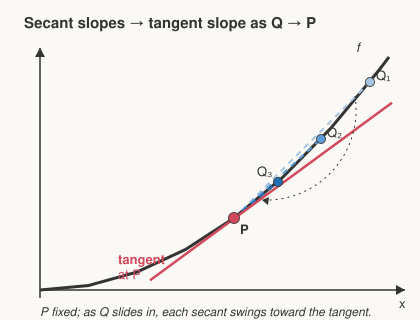

# Precalculus · Lesson 4.3: The door to calculus — limits and instantaneous rate

> ⏱ ~15 min · Module 4: Conics, vectors, and the door to calculus · Builds on: 4.2 (vectors, parametric, and polar) · Unlocks: calc-refresher (next course)

## Why this matters

Every function you've built this course — polynomials, exponentials, sines, parametric paths — was static: plug in $x$, read off $f(x)$. But the questions that matter are about *change*. How fast is the projectile rising **right now**? What does the next unit cost? These all reduce to one question so central that an entire branch of mathematics exists to answer it: *how fast is $f$ changing at a single instant?* This lesson gets you to the doorway and hands you the one tool — the **limit** — that makes "at an instant" mean something. You won't walk through the door here; that's the first thing `calc-refresher` does.

## The idea

You already know how to find an *average* rate of change. Drive 120 miles in 2 hours, your average speed is 60 mph — that's just $\frac{\text{change in output}}{\text{change in input}}$, the slope between two points. On a graph, that slope is the **secant line** through those two points.

But your speedometer doesn't show an average; it shows your speed *this instant*. How do you get a rate at a single point, when "rate" seems to need two points to even define?

The trick: sneak up on it. Pick your point $P$, then pick a second point $Q$ nearby and compute the average rate (the secant slope) between them. Now slide $Q$ toward $P$ and watch the secant slope. As $Q$ closes in, the secant pivots and settles onto the line that just grazes the curve at $P$ — the **tangent line**. The number the secant slopes *approach* is the instantaneous rate. You never actually put $Q$ on top of $P$ (that would be $\frac{0}{0}$, nonsense) — you watch where the slopes are **heading**. That "where it's heading" is a **limit**, and it's the whole game.

## The formal version

**Average rate of change** of $f$ over $[a,\,a+h]$:

$$\frac{f(a+h) - f(a)}{h}.$$

In words: the change in output divided by the change in input — exactly the slope of the secant line through $\big(a, f(a)\big)$ and $\big(a+h, f(a+h)\big)$. Here $h$ is the width of the interval (the horizontal gap between the two points).

The **instantaneous rate** at $a$ is the value this fraction approaches as $h$ shrinks to $0$. To say "approaches" precisely we need the idea of a limit.

**Limit (informal).** We write

$$\lim_{x \to a} f(x) = L$$

to mean: as $x$ gets arbitrarily close to $a$ (from either side, but $x \neq a$), the value $f(x)$ gets arbitrarily close to $L$. In words: $L$ is the number $f(x)$ **heads toward** as $x$ approaches $a$ — **whether or not $f(a)$ itself is defined**, and even if $f(a)$ happens to equal something else.

That last clause is the point. Consider $g(x) = \dfrac{x^2 - 1}{x - 1}$. At $x = 1$ the formula is $\frac{0}{0}$, undefined. But for every $x \neq 1$, $g(x) = \dfrac{(x-1)(x+1)}{x-1} = x + 1$, which sails right toward $2$ as $x \to 1$. So $\lim_{x\to 1} g(x) = 2$ even though $g(1)$ doesn't exist. The limit cares about the neighborhood, not the point itself — which is exactly why it can rescue the $\frac{0}{0}$ we hit when $h \to 0$.

**One-sided limits.** $\lim_{x \to a^-} f(x)$ is the value approached coming from the **left** ($x < a$); $\lim_{x \to a^+} f(x)$ from the **right** ($x > a$). The two-sided limit exists **only when both agree**:

$$\lim_{x \to a} f(x) = L \quad\Longleftrightarrow\quad \lim_{x \to a^-} f(x) = \lim_{x \to a^+} f(x) = L.$$

In words: if the curve heads to different heights depending on which side you come from — a jump — the limit **does not exist**.

## Picture

Point $P$ is nailed to the curve. $Q_1$, $Q_2$, $Q_3$ march in toward $P$, and the dashed secant through each is a little less steep than the last, fanning down onto the solid tangent. The tangent's slope is the instantaneous rate at $P$ — the number the secant slopes are converging to.

## Worked examples

**Example 1 (mechanical — a secant slope).** Let $f(x) = x^2$. The average rate of change over $[2,\,5]$ is

$$\frac{f(5) - f(2)}{5 - 2} = \frac{25 - 4}{3} = \frac{21}{3} = 7.$$

That $7$ is the slope of the secant line joining $(2,4)$ and $(5,25)$ — the average steepness across a wide interval. It tells you nothing yet about the rate *at* $x = 2$; the interval is far too coarse. To get the instantaneous rate we have to shrink it.

**Example 2 (why you'd care — sneaking up on an instant).** A stone dropped off a cliff has fallen $f(t) = 16t^2$ feet after $t$ seconds. How fast is it moving at exactly $t = 1$ second? We can't divide by a zero-width interval, so we compute average speeds over $[1,\,1+h]$ for shrinking $h$ and watch the trend:

| $h$ | interval | average speed $\dfrac{16(1+h)^2 - 16}{h}$ |
|---|---|---|
| $1$ | $[1,2]$ | $\dfrac{64 - 16}{1} = 48$ |
| $0.5$ | $[1,1.5]$ | $\dfrac{36 - 16}{0.5} = 40$ |
| $0.1$ | $[1,1.1]$ | $\dfrac{19.36 - 16}{0.1} = 33.6$ |
| $0.01$ | $[1,1.01]$ | $\dfrac{16.3216 - 16}{0.01} = 32.16$ |
| $0.001$ | $[1,1.001]$ | $\dfrac{16.032016 - 16}{0.001} = 32.016$ |

The averages are homing in on $32$ ft/s. We didn't compute anything *at* $h = 0$ — that's $\frac{0}{0}$ — we read off where the numbers are heading:

$$\lim_{h \to 0} \frac{16(1+h)^2 - 16}{h} = 32 \text{ ft/s}.$$

That limit **is** the instantaneous speed. Notice we estimated it purely by arithmetic, never with a formula. Making it *exact and effortless* — turning this table into a one-line rule — is precisely what the derivative does, and precisely where `calc-refresher` picks up.

## Watch out

- **Average is not instantaneous.** You might think the secant slope over $[2,5]$ tells you the rate at $x=2$, but it's the *average* across the whole span. Only shrinking the interval toward zero width recovers the instant.
- **The limit ignores the point itself.** You might think $\lim_{x\to a} f(x)$ means "plug in $a$." It doesn't — it's about the values *near* $a$. $f(a)$ can be undefined (our $\frac{0}{0}$), or defined but a totally different number; the limit doesn't care.
- **You cannot just set $h = 0$.** The average-rate fraction becomes $\frac{0}{0}$, which is meaningless. The limit is the legal way to ask "what happens as $h$ vanishes" without ever dividing by zero.
- **Two sides must agree.** If $\lim_{x\to a^-} f$ and $\lim_{x\to a^+} f$ differ — a jump or a corner in the slopes — the two-sided limit **does not exist**, and there's no single instantaneous rate there.

## One-liner

> The instantaneous rate is the number the average rates *sneak up on* as the interval shrinks to nothing — a limit, watching where the secant slopes head as the tangent takes over.

## Problems

**P1 (🟢)** For $f(x) = x^2 - 2x$, find the average rate of change over the interval $[1, 4]$. What line's slope is this?

**P2 (🟡)** Producing $q$ items costs $C(q) = 0.5q^2 + 10q$ dollars. The **marginal cost** at $q = 20$ is the instantaneous rate of change of cost there — roughly, the cost of the next item. Estimate it by computing the average cost over $[20,\,20+h]$ for $h = 1,\ 0.1,\ 0.01$, and state the value the estimates approach.

**P3 (🔴, optional)** Let

$$g(x) = \begin{cases} 2x & x < 2 \\ 1 & x = 2 \\ 7 - 2x & x > 2 \end{cases}.$$

Find $\lim_{x\to 2^-} g(x)$ and $\lim_{x\to 2^+} g(x)$. Does $\lim_{x\to 2} g(x)$ exist? What role does the value $g(2) = 1$ play in your answer?

Solutions

**P1** $f(1) = 1 - 2 = -1$ and $f(4) = 16 - 8 = 8$. Average rate of change:
$$\frac{f(4) - f(1)}{4 - 1} = \frac{8 - (-1)}{3} = \frac{9}{3} = \boxed{3}.$$
This is the slope of the **secant line** through $(1, -1)$ and $(4, 8)$.

**P2** $C(20) = 0.5(400) + 10(20) = 200 + 200 = 400$. Now the average cost of the next batch, $\dfrac{C(20+h) - C(20)}{h}$:

- $h = 1$: $C(21) = 0.5(441) + 210 = 430.5$, so $\dfrac{430.5 - 400}{1} = 30.5$.
- $h = 0.1$: $C(20.1) = 0.5(404.01) + 201 = 403.005$, so $\dfrac{403.005 - 400}{0.1} = 30.05$.
- $h = 0.01$: $C(20.01) = 0.5(400.4001) + 200.1 = 400.30005$, so $\dfrac{400.30005 - 400}{0.01} = 30.005$.

The estimates approach $\boxed{30}$ dollars per item — the marginal cost at $q = 20$. (This "rate of change of total cost" is exactly the marginal quantity of `micro-refresher`.)

**P3** From the left ($x < 2$, so $g(x) = 2x$): $\lim_{x\to 2^-} g(x) = 2(2) = 4$. From the right ($x > 2$, so $g(x) = 7 - 2x$): $\lim_{x\to 2^+} g(x) = 7 - 4 = 3$. The one-sided limits are $4$ and $3$ — they **disagree**, so $\lim_{x\to 2} g(x)$ **does not exist** (a jump). The value $g(2) = 1$ plays **no role**: the limit depends only on the behavior *near* $x = 2$, not on the height assigned *at* $x = 2$.

## Flashback

**From Lesson 3.3 (Series and the infinite geometric sum):** Evaluate $\displaystyle\sum_{k=0}^{\infty} 4\left(\tfrac{3}{5}\right)^{k}$. Then say, in one sentence, what this sum has in common with today's instantaneous rate.

Solution

First term $a = 4$, ratio $r = \tfrac{3}{5}$, and $|r| = \tfrac{3}{5} < 1$, so the series converges to
$$\frac{a}{1 - r} = \frac{4}{1 - \tfrac{3}{5}} = \frac{4}{\tfrac{2}{5}} = 10.$$
**What they share:** an infinite sum *is* a limit — it's defined as the value the partial sums $S_N = \sum_{k=0}^{N} 4(\tfrac35)^k$ **head toward** as $N \to \infty$, exactly the same "what is this approaching?" move we used to pin down the instantaneous rate as the secant slopes head toward the tangent. Both quantities are limits in disguise.

## Connections

- **Backward:** this reuses the secant slope $\frac{\Delta y}{\Delta x}$ from every rate-of-change problem so far, and the "converging to a value" idea you first met summing an infinite geometric series in 3.3 — both are limits.
- **Forward:** [`calc-refresher` Lesson 1.1](../../calc-refresher/lessons/01-01-derivative-as-sensitivity.md) walks through this door. It names the limit $\lim_{h\to 0}\frac{f(a+h)-f(a)}{h}$ the **derivative** $f'(a)$, and — with a little algebra to cancel the $h$ before taking the limit — turns Example 2's arithmetic table into an exact answer in one line. That is the next thing you do. This is the last lesson of Precalculus; go there next.
- **Sideways (physics):** the instantaneous rate of position is **velocity** — Example 2 is a falling-body problem, and `mechanics-refresher` treats velocity and acceleration as exactly these limits.
- **Sideways (econ):** the instantaneous rate of total cost is **marginal cost** — P2 is the prototype, and "marginal anything" in `micro-refresher` is this same limit applied to a total.
