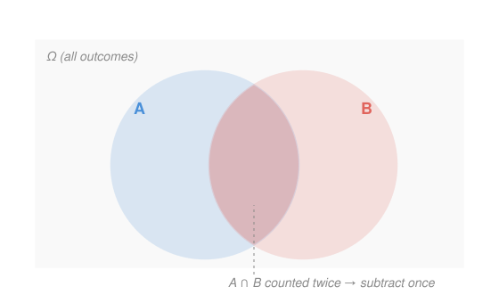

# Probability & Statistics · Lesson 1.1: Sample spaces, events, and the axioms

> ⏱ ~15 min · Module 1: Probability foundations · Builds on: (course start) · Unlocks: 1.2 (conditional probability and Bayes)

## Why this matters

Every claim about uncertainty — a diagnostic test's reliability, a portfolio's risk, a physics measurement's error bar — rests on three sentences written down by Kolmogorov in 1933. Get the setup right and probability becomes bookkeeping: name the possible outcomes, decide which ones you care about, and measure. Get it wrong — miscount the outcomes, forget an overlap — and every downstream number is quietly poisoned. This lesson builds the frame that Bayes (1.2), random variables (1.3), and all of inference hang on.

## The idea

Think of a single experiment — one roll of a die, one draw from a deck. Before it happens, list *everything that could occur*: those are your **outcomes**, and the full list is the **sample space**. An **event** is just a question you can answer yes/no once you see the result — "the die showed even" is the event $\{2,4,6\}$, a *subset* of the list. Probability, then, is a way of spreading one unit of "belief-weight" across the sample space, so every event gets a share between 0 and 1.

When the outcomes are symmetric — a fair die, a well-shuffled deck — that weight spreads *evenly*, and probability collapses into counting: an event's probability is the fraction of outcomes it contains. So the whole game becomes "how many outcomes are in my event, and how many total?" That's why combinatorics — permutations and combinations — is the engine room of elementary probability. No symmetry, no shortcut; but when it's there, careful counting *is* the answer.

## The formal version

Fix a **sample space** $\Omega$: the set of all possible outcomes of the experiment. An **event** $A$ is any subset $A \subseteq \Omega$. A **probability** $\mathbb{P}$ assigns to each event a number obeying the **Kolmogorov axioms**:

1. **Non-negativity:** $\mathbb{P}(A) \ge 0$ for every event $A$.
2. **Normalization:** $\mathbb{P}(\Omega) = 1$.
3. **Additivity:** if $A$ and $B$ are **disjoint** (mutually exclusive, $A \cap B = \varnothing$), then $\mathbb{P}(A \cup B) = \mathbb{P}(A) + \mathbb{P}(B)$.

In words: no negative belief, the certain event weighs exactly 1, and the weight of two non-overlapping events is just their weights added. ($\cup$ is "or" / union, $\cap$ is "and" / intersection, $\varnothing$ is the impossible event.)

Everything else is a consequence. Writing $A^c = \Omega \setminus A$ for the **complement** ("$A$ does not happen"):

$$\mathbb{P}(A^c) = 1 - \mathbb{P}(A).$$

In words: the chance something fails is one minus the chance it happens — because $A$ and $A^c$ are disjoint and together fill $\Omega$. This is the most-used line in the whole subject: when an event is a messy union, its complement is often a single clean thing.

For events that *do* overlap, plain additivity overcounts, and the fix is **inclusion–exclusion**:

$$\mathbb{P}(A \cup B) = \mathbb{P}(A) + \mathbb{P}(B) - \mathbb{P}(A \cap B).$$

In words: add the two pieces, then subtract the overlap you just counted twice.

**The equally-likely model.** If $\Omega$ is finite with $|\Omega|$ equally likely outcomes, then for any event $A$,

$$\mathbb{P}(A) = \frac{|A|}{|\Omega|},$$

where $|A|$ is the number of outcomes in $A$. In words: probability is the fraction of outcomes your event grabs. The two counting tools this needs: the number of ordered arrangements of $k$ items from $n$ is the **permutation** $n!/(n-k)!$, and the number of *unordered* size-$k$ subsets is the **combination**

$$\binom{n}{k} = \frac{n!}{k!\,(n-k)!}.$$

In words: use $\binom{n}{k}$ ("$n$ choose $k$") when order doesn't matter — hands of cards, committees, which slots are filled.

## Picture

## Worked examples

**Example 1 (mechanical — the axioms in action).** Roll one fair die: $\Omega = \{1,2,3,4,5,6\}$, each outcome weight $\tfrac{1}{6}$. Let $A = \{$even$\} = \{2,4,6\}$ and $B = \{$at least 5$\} = \{5,6\}$. By the equally-likely model $\mathbb{P}(A) = \tfrac{3}{6}$, $\mathbb{P}(B) = \tfrac{2}{6}$. Their overlap is $A \cap B = \{6\}$, so $\mathbb{P}(A\cap B) = \tfrac{1}{6}$. Inclusion–exclusion:

$$\mathbb{P}(A \cup B) = \tfrac{3}{6} + \tfrac{2}{6} - \tfrac{1}{6} = \tfrac{4}{6} = \tfrac{2}{3},$$

which checks against direct counting: $A \cup B = \{2,4,5,6\}$, four outcomes, $\tfrac{4}{6}$. ✓

**Example 2 (why you'd care — the complement trick).** Roll a die four times. What's the chance of getting *at least one* six? The event "at least one six" is a tangle of overlapping cases (six on roll 1, or roll 2, or …) — inclusion–exclusion would be a slog. Its complement is a single clean statement: "*no* six on any roll." Each roll avoids six with probability $\tfrac{5}{6}$, and the four rolls are independent (formalized in 1.2), so

$$\mathbb{P}(\text{no six}) = \left(\tfrac{5}{6}\right)^4 = \tfrac{625}{1296}, \qquad \mathbb{P}(\text{at least one six}) = 1 - \tfrac{625}{1296} = \tfrac{671}{1296} \approx 0.518.$$

Slightly better than even odds. The move — "at least one" is the complement of "none" — is one you'll reach for constantly, from reliability to the birthday problem.

## Watch out

- You might think $\mathbb{P}(A \cup B) = \mathbb{P}(A) + \mathbb{P}(B)$ always. That's only for **disjoint** events; when they overlap you must subtract $\mathbb{P}(A \cap B)$, or you double-count the shared outcomes.
- You might think the equally-likely formula $|A|/|\Omega|$ always applies. It needs **symmetry** — a fair die, a shuffled deck. Rolling *two* dice and summing, the sums 2 through 12 are *not* equally likely (there's one way to make 2, six ways to make 7), so count over the 36 equally likely *ordered pairs*, never over the 11 sums.
- You might think "the die is due for a six." Outcomes across independent rolls don't remember each other; the axioms carry no gambler's-fallacy clause.

## One-liner

> Probability is one unit of weight spread over the outcomes; name the sample space, and with symmetry every question becomes careful counting — minus the overlaps you'd double-count.

## Problems

**P1 (🟢)** Roll two fair dice (36 equally likely ordered outcomes). (a) Find the probability the sum is 7. (b) Find the probability of at least one 6.

**P2 (🟡)** In a certain office, $\mathbb{P}(\text{drinks coffee}) = 0.6$, $\mathbb{P}(\text{drinks tea}) = 0.4$, and $\mathbb{P}(\text{drinks both}) = 0.25$. Find (a) the probability a random person drinks at least one of the two, and (b) the probability they drink neither.

**P3 (🔴, optional)** A 5-card hand is dealt from a standard 52-card deck (all $\binom{52}{5}$ hands equally likely). Find the probability the hand is a **flush** — all five cards the same suit. (Count all same-suit hands; you can treat straight flushes as flushes here.)

Solutions

**P1** (a) Sum-7 outcomes: $(1,6),(2,5),(3,4),(4,3),(5,2),(6,1)$ — six of them. So $\mathbb{P}(\text{sum }7) = \tfrac{6}{36} = \tfrac{1}{6} \approx 0.167$.
(b) Use the complement. "No 6 on either die" has $5 \times 5 = 25$ outcomes, so $\mathbb{P}(\text{no }6) = \tfrac{25}{36}$ and

$$\mathbb{P}(\text{at least one }6) = 1 - \tfrac{25}{36} = \tfrac{11}{36} \approx 0.306.$$

Direct check: the row and column for a 6 cover $6 + 6 - 1 = 11$ cells (inclusion–exclusion, subtracting the double-counted $(6,6)$). ✓
*Sanity:* both values lie in $[0,1]$. ✓

**P2** Let $C$ = coffee, $T$ = tea, with $\mathbb{P}(C) = 0.6$, $\mathbb{P}(T) = 0.4$, $\mathbb{P}(C \cap T) = 0.25$.
(a) Inclusion–exclusion: $\mathbb{P}(C \cup T) = 0.6 + 0.4 - 0.25 = 0.75$.
(b) "Neither" is the complement of "at least one": $\mathbb{P}((C\cup T)^c) = 1 - 0.75 = 0.25$.
*Sanity:* both in $[0,1]$; and the four disjoint pieces — coffee-only $0.35$, tea-only $0.15$, both $0.25$, neither $0.25$ — sum to $1$. ✓

**P3** Choose the suit (4 ways), then choose 5 of that suit's 13 cards, order irrelevant, so $\binom{13}{5}$ ways:

$$|A| = 4 \binom{13}{5} = 4 \times 1287 = 5148, \qquad |\Omega| = \binom{52}{5} = 2{,}598{,}960.$$

$$\mathbb{P}(\text{flush}) = \frac{5148}{2{,}598{,}960} \approx 0.00198.$$

So about 1 in 505 hands. (Poker's "flush" *category* excludes the 40 straight flushes, giving $5148 - 40 = 5108$ and $\mathbb{P} \approx 0.00197$ — a rounding-level difference.)
*Sanity:* $\binom{13}{5} = \tfrac{13\cdot12\cdot11\cdot10\cdot9}{120} = 1287$; the probability is a positive number well inside $[0,1]$. ✓

## Connections

- **Backward:** the equally-likely model rests on finite counting; the exponential and Gaussian densities from [`calc-refresher` 2.3](../../calc-refresher/lessons/02-03-improper-integrals-and-models.md) are the continuous version of "weight totaling 1," where axiom 2 becomes an integral equal to 1 instead of a sum.
- **Forward:** [1.2](01-02-conditional-probability-bayes.md) adds *conditioning* — reweighting $\Omega$ once you learn an event occurred — and independence, which we borrowed informally in Example 2. [1.3](01-03-random-variables-distributions.md) attaches numbers to outcomes.
- **Sideways (econ/game theory):** a sample space with a probability on it is exactly the "state space with beliefs" that decision theory and `game-theory-refresher` build expected utility on; inclusion–exclusion is the same counting that underlies the union bound in later probability.
