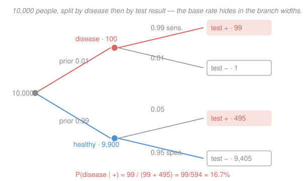

# Probability & Statistics · Lesson 1.2: Conditional probability, independence, and Bayes

> ⏱ ~15 min · Module 1: Probability foundations · Builds on: [1.1 Sample spaces, events, and the axioms](01-01-sample-spaces-events-axioms.md) · Unlocks: 1.3 (random variables)

## Why this matters

Almost nothing you care about is a bare probability — it's a probability *given* what you already know. What's the chance of rain given the sky is dark? That a patient is sick given a positive test? That a message is spam given the word "free"? Conditioning is how evidence reshapes belief, and **Bayes' theorem** is the machine that runs it in the useful direction. It's also where trained intuition fails hardest: a 99%-accurate test can still be wrong most of the time it fires. Getting that right is the whole game.

## The idea

Conditioning is **zooming in**. You had a whole sample space $\Omega$; now you learn event $B$ happened, so every outcome outside $B$ is dead. You throw them away and re-weigh what's left so the survivors again total probability 1. That re-weighting is all a conditional probability is: the fraction of the *new, smaller world* $B$ in which $A$ also holds.

Bayes' theorem answers the flip. Tests and models naturally give you $\mathbb{P}(\text{evidence} \mid \text{cause})$ — "if you're sick, the test pings 99% of the time." But you want $\mathbb{P}(\text{cause} \mid \text{evidence})$ — "the test pinged; am I sick?" Those are *not* the same number, and confusing them is the base-rate fallacy. Bayes turns one into the other, and the price of the turn is that you must supply a **prior**: how common the cause was *before* you saw any evidence. When the cause is rare, that prior drags the answer way down no matter how sharp the test.

## The formal version

**Conditional probability.** For events $A, B$ with $\mathbb{P}(B) > 0$,

$$\mathbb{P}(A \mid B) = \frac{\mathbb{P}(A \cap B)}{\mathbb{P}(B)}.$$

In words: of all the probability sitting inside $B$, what share also lands in $A$. The denominator $\mathbb{P}(B)$ renormalizes — it's the total weight of the world we zoomed into. ($A \cap B$ is the event that *both* happen; see [1.1](01-01-sample-spaces-events-axioms.md).)

**Multiplication rule.** Clear the fraction:

$$\mathbb{P}(A \cap B) = \mathbb{P}(A \mid B)\,\mathbb{P}(B) = \mathbb{P}(B \mid A)\,\mathbb{P}(A).$$

In words: to get both, take the chance of one, then the chance of the other *given* the first. This is how you walk down a probability tree — multiply along the branches.

**Independence.** $A$ and $B$ are independent when

$$\mathbb{P}(A \cap B) = \mathbb{P}(A)\,\mathbb{P}(B), \quad\text{equivalently}\quad \mathbb{P}(A \mid B) = \mathbb{P}(A).$$

In words: learning $B$ tells you nothing about $A$ — the zoom doesn't move the needle. (Independent is not the same as **disjoint**: disjoint events with positive probability are *maximally dependent*, since one happening rules the other out.)

**Law of total probability.** If $B_1, \dots, B_n$ partition $\Omega$ (exactly one occurs), then for any event $E$,

$$\mathbb{P}(E) = \sum_{i=1}^{n} \mathbb{P}(E \mid B_i)\,\mathbb{P}(B_i).$$

In words: to get the overall chance of $E$, average its conditional chance over every case, weighted by how likely each case is. This is how you assemble the denominator Bayes needs.

**Bayes' theorem.** For a hypothesis $H$ and evidence $E$ (with $\mathbb{P}(E) > 0$),

$$\mathbb{P}(H \mid E) = \frac{\mathbb{P}(E \mid H)\,\mathbb{P}(H)}{\mathbb{P}(E)}.$$

In words: **posterior $\propto$ likelihood $\times$ prior.** $\mathbb{P}(H)$ is the prior (belief before evidence), $\mathbb{P}(E \mid H)$ is the likelihood (how well $H$ predicts what you saw), and $\mathbb{P}(H \mid E)$ is the posterior (belief after). The denominator $\mathbb{P}(E)$ — expand it with the law of total probability — is just the normalizer that makes the posteriors over all hypotheses sum to 1.

## Picture

Read the base-rate trap straight off the leaves: the test fires on $99$ of the $100$ truly sick people, but *also* on $495$ of the $9{,}900$ healthy ones — because "5% of a huge group" beats "99% of a tiny group." Among everyone who tests positive, only $99/(99+495) \approx 16.7\%$ are actually sick.

## Worked examples

**Example 1 (mechanical — conditioning as re-weighting).** Roll a fair die. Let $A = \{\text{outcome is} \le 2\}$ and $B = \{\text{outcome is even}\}$. Then $\mathbb{P}(B) = \frac{3}{6}$, and $A \cap B = \{2\}$ so $\mathbb{P}(A \cap B) = \frac{1}{6}$. Thus

$$\mathbb{P}(A \mid B) = \frac{1/6}{3/6} = \frac{1}{3}.$$

Knowing "even" shrank the world to $\{2,4,6\}$; inside it, one of three outcomes is $\le 2$. Note $\mathbb{P}(A) = \frac{2}{6} = \frac13$ too — here the events happen to be independent, so the evidence didn't move the belief.

**Example 2 (why you'd care — Bayes end to end).** A disease affects $1\%$ of a population. A test has **sensitivity** $\mathbb{P}(+ \mid D) = 0.99$ (catches the sick) and **specificity** $\mathbb{P}(- \mid H) = 0.95$ (clears the healthy), so its false-positive rate is $\mathbb{P}(+ \mid H) = 0.05$. You test positive. Are you sick?

First the denominator, by total probability:

$$\mathbb{P}(+) = \mathbb{P}(+\mid D)\mathbb{P}(D) + \mathbb{P}(+\mid H)\mathbb{P}(H) = (0.99)(0.01) + (0.05)(0.99) = 0.0099 + 0.0495 = 0.0594.$$

Then Bayes:

$$\mathbb{P}(D \mid +) = \frac{\mathbb{P}(+\mid D)\,\mathbb{P}(D)}{\mathbb{P}(+)} = \frac{0.0099}{0.0594} = \frac{1}{6} \approx 16.7\%.$$

A "99% accurate" test, and a positive still means only a $1$-in-$6$ chance of disease — because the prior $\mathbb{P}(D) = 0.01$ was tiny, and the flood of false positives from the healthy majority swamps the true positives.

## Watch out

- You might think $\mathbb{P}(A \mid B) = \mathbb{P}(B \mid A)$. They're linked by Bayes, not equal: $\mathbb{P}(+\mid D) = 0.99$ but $\mathbb{P}(D \mid +) \approx 0.17$. Swapping them *is* the prosecutor's fallacy.
- You might think a high-accuracy test settles the matter. Accuracy is $\mathbb{P}(\text{correct}\mid\text{true state})$; what you want is $\mathbb{P}(\text{true state}\mid\text{result})$, and the prior controls that. Rare condition → distrust a lone positive.
- You might think independent means disjoint (can't-both-happen). Opposite: disjoint events *inform* each other completely ($B$ occurring forces $A$ not to). Independence means $\mathbb{P}(A\cap B)=\mathbb{P}(A)\mathbb{P}(B)$ — check the arithmetic, don't eyeball it.

## One-liner

> Conditioning zooms into the world where $B$ happened; Bayes flips $\mathbb{P}(E\mid H)$ into $\mathbb{P}(H\mid E)$ by paying the prior — and a rare prior can beat a sharp test.

## Problems

**P1 (🟢)** Two cards are dealt from a standard $52$-card deck, without replacement. Given that the first card is an ace, what is the probability the second card is also an ace?

**P2 (🟡)** Keep Example 2's test (sensitivity $0.99$, specificity $0.95$) but suppose it's used as a general screen where disease prevalence is only $\mathbb{P}(D) = 0.001$. Find $\mathbb{P}(D \mid +)$. Compare to the $16.7\%$ from prevalence $1\%$ and say in one sentence what changed and why.

**P3 (🔴, optional)** A plant runs three machines: $A$ makes $50\%$ of all widgets, $B$ makes $30\%$, $C$ makes $20\%$. Their defect rates are $1\%$, $2\%$, $3\%$ respectively. A widget is pulled at random and found defective. Find the probability it came from each of $A$, $B$, $C$, and identify the most likely source.

Solutions

**P1** Condition on the first card being an ace. That removes one ace and one card, leaving $51$ cards of which $3$ are aces. So

$$\mathbb{P}(\text{2nd ace} \mid \text{1st ace}) = \frac{3}{51} = \frac{1}{17} \approx 0.0588.$$

(Equivalently, via the definition: $\mathbb{P}(\text{both aces}) = \frac{4}{52}\cdot\frac{3}{51}$ and $\mathbb{P}(\text{1st ace}) = \frac{4}{52}$; the ratio cancels to $\frac{3}{51}$.) Sanity check: it's a probability in $[0,1]$, and it's *below* the unconditional $\frac{4}{52}=\frac{1}{13}\approx 0.077$ — spending an ace on the first draw should make a second ace less likely. ✓

**P2** Same likelihoods, new prior $\mathbb{P}(D) = 0.001$, so $\mathbb{P}(H) = 0.999$. Denominator:

$$\mathbb{P}(+) = (0.99)(0.001) + (0.05)(0.999) = 0.00099 + 0.04995 = 0.05094.$$

Then

$$\mathbb{P}(D \mid +) = \frac{0.00099}{0.05094} \approx 0.0194 \approx 1.9\%.$$

Dropping the prevalence tenfold (from $1\%$ to $0.1\%$) dropped the posterior roughly tenfold (from $16.7\%$ to $\approx 1.9\%$): rarer disease $\Rightarrow$ the fixed $5\%$ false-positive stream dominates even harder. Sanity check: $\mathbb{P}(D\mid+) + \mathbb{P}(H\mid+) = 0.0194 + 0.9806 = 1$, and both lie in $[0,1]$. ✓

**P3** Priors $\mathbb{P}(A)=0.5,\ \mathbb{P}(B)=0.3,\ \mathbb{P}(C)=0.2$; likelihoods $\mathbb{P}(\text{def}\mid A)=0.01,\ \mathbb{P}(\text{def}\mid B)=0.02,\ \mathbb{P}(\text{def}\mid C)=0.03$. By total probability,

$$\mathbb{P}(\text{def}) = (0.5)(0.01) + (0.3)(0.02) + (0.2)(0.03) = 0.005 + 0.006 + 0.006 = 0.017.$$

Bayes for each machine:

$$\mathbb{P}(A\mid\text{def}) = \frac{0.005}{0.017} = \frac{5}{17} \approx 0.294,\quad \mathbb{P}(B\mid\text{def}) = \frac{0.006}{0.017} = \frac{6}{17} \approx 0.353,\quad \mathbb{P}(C\mid\text{def}) = \frac{0.006}{0.017} = \frac{6}{17} \approx 0.353.$$

Machines $B$ and $C$ tie as the most likely source. Note the twist: $A$ makes half of all widgets yet is the *least* likely culprit (it's the reliable workhorse), while $C$ makes the fewest yet ties for the top — high defect rate offsets low volume. Sanity check: $\frac{5}{17}+\frac{6}{17}+\frac{6}{17} = \frac{17}{17} = 1$, and each is in $[0,1]$. ✓

## Connections

- **Backward:** conditioning is just [1.1](01-01-sample-spaces-events-axioms.md)'s axioms applied inside a smaller sample space — $\mathbb{P}(\cdot \mid B)$ is itself a legitimate probability measure on $B$, obeying all the same rules.
- **Forward:** [1.3](01-03-random-variables-distributions.md) attaches numbers to outcomes; conditioning then becomes *conditional distributions*, and independence of events grows into independence of random variables — the backbone of the Law of Large Numbers and the CLT in Module 3.
- **Sideways (inference):** Bayes is the seed of all of Module 4 — updating a prior on a parameter with data's likelihood is exactly maximum-likelihood's Bayesian cousin, and "posterior $\propto$ likelihood $\times$ prior" is the sentence the rest of statistics keeps rediscovering.
