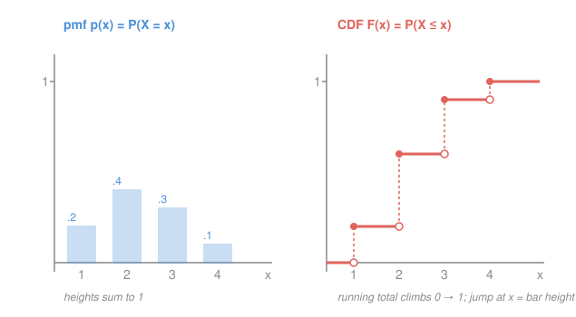

# Probability & Statistics · Lesson 1.3: Random variables and their distributions

> ⏱ ~15 min · Module 1: Probability foundations · Builds on: [1.1 Sample spaces, events, and the axioms](01-01-sample-spaces-events-axioms.md), [1.2 Conditional probability, independence, and Bayes](01-02-conditional-probability-bayes.md) · Unlocks: Module 2 (expectation and distributions)

## Why this matters

So far probability has lived on *events* — "the coin landed heads," "at least one six." But almost everything you'll ever compute is a **number**: a profit, a waiting time, a count of arrivals, a measurement error. A random variable is the bridge that turns messy outcomes into numbers you can average, add, and plot — and its distribution is the complete answer to "how is that number likely to come out?" Every expectation, every named distribution in Module 2, every estimator in Module 4 is built on this one move.

## The idea

Roll two dice. The outcome is a *pair* like $(3,5)$ — but usually you only care about the **total**, $8$. That "total" is a rule that reads an outcome and hands you a number. That rule is a random variable: not random and not a variable, just a **function from outcomes to numbers**.

Once outcomes become numbers, two natural kinds appear. Some variables land on **separated values** you can list — a die total is one of $2,3,\dots,12$, a count is $0,1,2,\dots$. Others sweep a **continuum** — a waiting time can be $3.7$ seconds or $3.71$ or anything in between. The first kind is *discrete*, the second *continuous*, and each needs its own bookkeeping for where the probability sits.

For the discrete kind you just tag each value with its probability — a little table of weights that must total $1$. For the continuous kind no single value can carry weight (there are too many; each gets probability $0$), so instead you spread probability as a **density** — height per unit length — and read off any chunk of probability as the **area** underneath. Both kinds share one universal summary: the **CDF**, the running total of probability accumulated from the far left. Height tells you *how much sits here*; the CDF tells you *how much so far*.

## The formal version

**Random variable.** A random variable $X$ is a function $X:\Omega \to \mathbb{R}$, where $\Omega$ is the sample space of outcomes (from [1.1](01-01-sample-spaces-events-axioms.md)). *In words:* it assigns a number $X(\omega)$ to each outcome $\omega$. The event "$X = x$" is shorthand for the set of outcomes $\{\omega : X(\omega) = x\}$, and $\mathbb{P}(X=x)$ is that set's probability.

**Discrete — the pmf.** If $X$ takes values in a finite or countable set, its **probability mass function** is
$$p(x) = \mathbb{P}(X = x), \qquad p(x) \ge 0, \qquad \sum_x p(x) = 1.$$
*In words:* $p(x)$ is the weight sitting exactly on the value $x$; the weights are nonnegative and total $1$. To get the probability of a range, add the masses in it: $\mathbb{P}(a \le X \le b) = \sum_{a \le x \le b} p(x)$.

**Continuous — the pdf.** If $X$ is spread over a continuum, its **probability density function** $f(x)$ satisfies
$$f(x) \ge 0, \qquad \int_{-\infty}^{\infty} f(x)\,dx = 1, \qquad \mathbb{P}(a \le X \le b) = \int_a^b f(x)\,dx.$$
*In words:* probability is the **area** under $f$, not the height. Consequently $\mathbb{P}(X = x) = \int_x^x f = 0$ — a single point has zero width, hence zero probability. (So for continuous $X$ the endpoints don't matter: $\mathbb{P}(a \le X \le b) = \mathbb{P}(a < X < b)$.) Here $f(x)$ is not a probability — it's probability *per unit $x$*, and can exceed $1$.

**The CDF (both kinds).** The **cumulative distribution function** is
$$F(x) = \mathbb{P}(X \le x).$$
*In words:* the total probability lying at or to the left of $x$ — the running total. It is always **nondecreasing**, runs from $F(-\infty) = 0$ up to $F(+\infty) = 1$, and any interval reads off by subtraction: $\mathbb{P}(a < X \le b) = F(b) - F(a)$. The pmf/pdf and the CDF are two views of the same object:

- Discrete: $F$ is a **staircase** — flat, then a **jump of size $p(x)$** at each value $x$ (jump height = mass).
- Continuous: $F$ is **smooth**, and density is its slope, $f(x) = F'(x)$, so $F(x) = \int_{-\infty}^{x} f(t)\,dt$.

## Picture

The four bars on the left are the masses $p(1),\dots,p(4) = 0.2, 0.4, 0.3, 0.1$; they sum to $1$. On the right, $F$ starts at $0$, and at each value $x$ it **jumps by exactly that bar's height** — the tall $0.4$ bar makes the tall jump — landing at $1$ once every bit of probability has accumulated. Height on the left, running total on the right.

## Worked examples

**Example 1 (discrete — read everything off a table).** Let $X$ be the number of heads in two fair coin flips. Outcomes $\{HH, HT, TH, TT\}$ are equally likely, so
$$p(0) = \tfrac14,\quad p(1) = \tfrac24 = \tfrac12,\quad p(2) = \tfrac14.$$
These sum to $1$. ✓ The CDF is the running total: $F(x) = 0$ for $x<0$; $F(x)=\tfrac14$ on $[0,1)$; $F(x)=\tfrac34$ on $[1,2)$; $F(x)=1$ for $x \ge 2$ — a three-step staircase with jumps $\tfrac14,\tfrac12,\tfrac14$. Then $\mathbb{P}(X \ge 1) = 1 - p(0) = \tfrac34$, or equally $1 - F(0^-)$... just $1-\tfrac14$.

**Example 2 (continuous — area, not height).** Suppose a random fraction $X$ (say, the position of a break point on a $[0,1]$ stick) has density $f(x) = 2x$ on $[0,1]$ and $0$ elsewhere. First check it's legal: $\int_0^1 2x\,dx = [x^2]_0^1 = 1$. ✓ Note $f(1) = 2 > 1$ — fine, a density may exceed $1$; only its *area* is capped. The CDF is the accumulated area:
$$F(x) = \int_0^x 2t\,dt = x^2 \quad (0 \le x \le 1),$$
with $F(x)=0$ below $0$ and $1$ above. So the break lands in the right half with probability $\mathbb{P}(X > \tfrac12) = 1 - F(\tfrac12) = 1 - \tfrac14 = \tfrac34$ — most of the density piles up near $1$, exactly as the rising line $f(x)=2x$ says. (This is the improper-integral normalization from [`calc-refresher` 2.3](../../calc-refresher/lessons/02-03-improper-integrals-and-models.md), now doing probability work.)

## Watch out

- You might think $f(x)$ *is* a probability, so it can't exceed $1$. It can — $f$ is probability *per unit length*. Only areas $\int_a^b f$ are probabilities, and only those are bounded by $1$.
- You might think $\mathbb{P}(X = 3) $ is meaningful for a continuous $X$. It's exactly $0$. Probability lives in intervals, not points; a continuous pmf doesn't exist. (This is why $\le$ vs $<$ is free in the continuous case but *not* in the discrete case, where the endpoint carries real mass.)
- You might read a probability off the **height** of the CDF's jump *and* the bar and double-count. They're the same number seen twice: the jump in $F$ at $x$ **equals** $p(x)$. Use one view per question.

## One-liner

> A random variable turns outcomes into numbers; the pmf/pdf says how much probability sits at each, and the CDF $F(x)=\mathbb{P}(X\le x)$ is the running total — mass summing to 1, or density integrating to 1.

## Problems

**P1 (🟢)** A discrete random variable $X$ has this table, with one entry missing:

| $x$ | 0 | 1 | 2 | 3 |
|---|---|---|---|---|
| $p(x)$ | 0.1 | 0.3 | ? | 0.2 |

(a) Find the missing $p(2)$. (b) Write $F(2) = \mathbb{P}(X \le 2)$.

**P2 (🟡)** A continuous random variable has density $f(x) = cx$ on $[0,2]$ and $0$ elsewhere. (a) Find $c$. (b) Find the CDF $F(x)$ for $0 \le x \le 2$. (c) Compute $\mathbb{P}(X > 1)$.

**P3 (🔴, optional)** A "tent" density: $f(x) = x$ for $0 \le x < 1$ and $f(x) = 2 - x$ for $1 \le x \le 2$ (zero elsewhere). (a) Verify it's a valid density. (b) Find $F(x)$ on all of $[0,2]$. (c) Using the conditional-probability definition from [1.2](01-02-conditional-probability-bayes.md), compute $\mathbb{P}(X > 1.5 \mid X > 1)$.

Solutions

**P1** (a) The masses must sum to $1$: $0.1 + 0.3 + p(2) + 0.2 = 1 \Rightarrow p(2) = 0.4$.
(b) $F(2) = p(0)+p(1)+p(2) = 0.1 + 0.3 + 0.4 = 0.8$.
Check: $0.1+0.3+0.4+0.2 = 1.0$ — the pmf sums to $1$. ✓

**P2** (a) Normalize: $\int_0^2 cx\,dx = c\big[\tfrac{x^2}{2}\big]_0^2 = c\cdot 2 = 1 \Rightarrow c = \tfrac12$.
(b) Accumulate the area from $0$: $F(x) = \int_0^x \tfrac12 t\,dt = \tfrac12\cdot\tfrac{x^2}{2} = \tfrac{x^2}{4}$ for $0 \le x \le 2$ (and $0$ below, $1$ above).
(c) $\mathbb{P}(X > 1) = 1 - F(1) = 1 - \tfrac14 = \tfrac34$.
Check: $F(2) = \tfrac{4}{4} = 1$ — the density integrates to $1$. ✓

**P3** (a) Split the integral at the peak:
$$\int_0^1 x\,dx + \int_1^2 (2-x)\,dx = \tfrac12 + \Big[2x - \tfrac{x^2}{2}\Big]_1^2 = \tfrac12 + \big(2 - \tfrac32\big) = \tfrac12 + \tfrac12 = 1. ✓$$
(b) For $0 \le x \le 1$: $F(x) = \int_0^x t\,dt = \tfrac{x^2}{2}$.
For $1 \le x \le 2$: $F(x) = \tfrac12 + \int_1^x (2-t)\,dt = \tfrac12 + \Big[2t - \tfrac{t^2}{2}\Big]_1^x = 2x - \tfrac{x^2}{2} - 1.$
(Sanity: $F(1) = \tfrac12$ from both pieces; $F(2) = 4 - 2 - 1 = 1$. ✓)
(c) By the definition $\mathbb{P}(A \mid B) = \tfrac{\mathbb{P}(A \cap B)}{\mathbb{P}(B)}$, and since $\{X > 1.5\} \subset \{X > 1\}$, the intersection is just $\{X > 1.5\}$:
$$\mathbb{P}(X > 1) = 1 - F(1) = \tfrac12, \qquad \mathbb{P}(X > 1.5) = 1 - F(1.5) = 1 - \big(3 - 1.125 - 1\big) = 1 - 0.875 = 0.125.$$
$$\mathbb{P}(X > 1.5 \mid X > 1) = \frac{0.125}{0.5} = 0.25.$$
Check: the full density integrates to $1$ (part a). ✓

## Flashback

**From Lesson 1.2 (Conditional probability and Bayes):** A chip factory ships parts of which $2\%$ are defective. An automated tester flags a defective chip $95\%$ of the time, but also **falsely** flags a good chip $3\%$ of the time. A chip gets flagged. What is the probability it is actually defective?

Solution

Let $D$ = "defective," $+$ = "flagged." Given: $\mathbb{P}(D) = 0.02$, $\mathbb{P}(+\mid D) = 0.95$, $\mathbb{P}(+\mid D^c) = 0.03$. By the law of total probability,
$$\mathbb{P}(+) = \mathbb{P}(+\mid D)\mathbb{P}(D) + \mathbb{P}(+\mid D^c)\mathbb{P}(D^c) = (0.95)(0.02) + (0.03)(0.98) = 0.019 + 0.0294 = 0.0484.$$
Then by Bayes,
$$\mathbb{P}(D \mid +) = \frac{\mathbb{P}(+\mid D)\mathbb{P}(D)}{\mathbb{P}(+)} = \frac{0.019}{0.0484} \approx 0.393.$$
A flagged chip is defective only about $39\%$ of the time — because the tiny $2\%$ base rate means the false positives from the huge good-chip population ($0.0294$) rival the true positives ($0.019$). The base rate dominates, exactly the [1.2](01-02-conditional-probability-bayes.md) lesson. ✓

## Connections

- **Backward:** "$X = x$" and "$a \le X \le b$" are just events from [1.1](01-01-sample-spaces-events-axioms.md), so the axioms still run the show — the pmf/pdf is only a convenient repackaging of $\mathbb{P}$ as a function of the value. The continuous CDF is [`calc-refresher` 2.3](../../calc-refresher/lessons/02-03-improper-integrals-and-models.md)'s accumulation-to-$\infty$, now required to total exactly $1$.
- **Forward:** Module 2 summarizes these distributions by a single number, the expectation $\mathbb{E}[X] = \sum_x x\,p(x)$ or $\int x f(x)\,dx$ ([2.1](02-01-expectation-variance-moments.md)), then names the recurring shapes — Bernoulli, binomial, Poisson ([2.2](02-02-discrete-distributions.md)); uniform, exponential, normal ([2.3](02-03-continuous-distributions.md)). Every one is just a specific pmf or pdf.
- **Sideways (physics/econ):** a density is a *distribution of stuff over a line* — mass per unit length, charge per unit volume, wealth per capita. The CDF is its running total (cumulative mass, the Lorenz-curve idea in econ). The pmf/pdf ↔ CDF pair is the same derivative/integral relationship as position ↔ velocity, just applied to probability.
