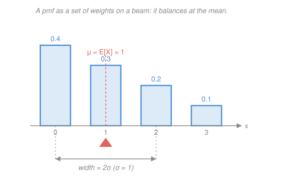

# Probability & Statistics · Lesson 2.1: Expectation, variance, and moments

> ⏱ ~15 min · Module 2: Expectation and the standard distributions · Builds on: [1.3 Random variables and their distributions](01-03-random-variables-distributions.md) · Unlocks: 2.2 (discrete distributions)

## Why this matters

A distribution is a whole cloud of possibilities; to decide, compare, or predict, you compress it to a couple of numbers — where it sits and how much it wobbles. **Expectation** is the long-run average payoff that tells you whether a bet, an insurance premium, or a policy is worth it; **variance** is the risk around that average that tells you whether you can survive the swings. Nearly every result later in this course — the Law of Large Numbers, the Central Limit Theorem, every estimator and confidence interval — is a statement about these two summaries, so getting fluent with them now pays off for the rest of the subject.

## The idea

Picture the probability mass function as little weights sitting on a weightless beam, one weight per possible value, each as heavy as its probability. The **expectation** is the single point where the beam balances — the center of mass. Heavy weights far out on one side drag the balance point toward them; that's all a mean is.

Now ask a second question: if you had to bet where the next draw lands, how far off would you typically be? Average the *squared* distance from the balance point, weighting again by probability, and you get the **variance** — the beam's "spread." Take its square root and you're back in the original units: the **standard deviation** $\sigma$, a plain "give or take" number. Center and spread; balance point and wobble. Everything in this lesson is those two pictures made precise.

## The formal version

**Expectation.** For a discrete random variable $X$ with pmf $p(x)=P(X=x)$,

$$\mathbb{E}[X]=\sum_x x\,p(x),$$

and for a continuous $X$ with density $f$, replace the sum by an integral:

$$\mathbb{E}[X]=\int_{-\infty}^{\infty} x\,f(x)\,dx.$$

In words: sweep over every value $x$, weight it by how likely (or how dense) it is, and add up — the probability-weighted average. We write $\mu=\mathbb{E}[X]$ for this center.

**LOTUS (the law of the unconscious statistician).** To get the expectation of a *function* of $X$, you do **not** need the distribution of $g(X)$ — just reweight $g$ by $X$'s own pmf/pdf:

$$\mathbb{E}[g(X)]=\sum_x g(x)\,p(x)\qquad\text{or}\qquad \int_{-\infty}^{\infty} g(x)\,f(x)\,dx.$$

In words: to average a transformed payoff, feed each value through $g$ and weight by the *original* probabilities. (The nickname pokes fun at how you'd "unconsciously" hope this just works — it does.)

**Linearity — the workhorse.** For any constants $a,b$ and any random variables $X,Y$,

$$\mathbb{E}[aX+bY]=a\,\mathbb{E}[X]+b\,\mathbb{E}[Y].$$

In words: the expectation of a sum is the sum of expectations, always — **even when $X$ and $Y$ are dependent**. This is the single most-used fact in probability. Two fair dice sum to $\mathbb{E}[X_1+X_2]=3.5+3.5=7$ without touching the sum's distribution; and it would still be $7$ even if the dice were glued together, because linearity never asks how the variables relate.

**Variance and standard deviation.**

$$\mathrm{Var}(X)=\mathbb{E}\big[(X-\mu)^2\big]=\mathbb{E}[X^2]-\mu^2,\qquad \sigma=\sqrt{\mathrm{Var}(X)}.$$

In words: the average squared distance from the center — and the right-hand form ($\mathbb{E}[X^2]-\mu^2$) is the one you actually compute, "mean of the square minus square of the mean." Because it's an average of squares, $\mathrm{Var}(X)\ge 0$ always. Under an affine rescaling,

$$\mathrm{Var}(aX+b)=a^2\,\mathrm{Var}(X).$$

In words: adding a constant $b$ just slides the whole distribution and changes no spread; multiplying by $a$ stretches distances by $|a|$, so *squared* distances by $a^2$. Note the sharp contrast with expectation: linearity of the mean is free for sums, but **variance of a sum is not** $\mathrm{Var}(X)+\mathrm{Var}(Y)$ in general — the cross-term depends on how $X$ and $Y$ move together, which waits for [3.1](03-01-joint-distributions-covariance.md).

**Moments.** The $k$-th moment is $\mathbb{E}[X^k]$. The mean is the 1st moment; the variance is built from the 1st and 2nd. Higher moments describe finer shape — the 3rd feeds *skewness* (lopsidedness), the 4th *kurtosis* (how heavy the tails are) — but mean and variance carry the load in this course.

## Picture

The four bars are a pmf on $\{0,1,2,3\}$ with probabilities $0.4,0.3,0.2,0.1$. The heavier low bars pull the balance point to $\mu=1$ — not the middle of the range — and the marked band is $\mu\pm\sigma=[0,2]$ with $\sigma=1$. (Worked Example 1 computes exactly these numbers.)

## Worked examples

**Example 1 (mechanical — center and spread of a pmf).** Take the pmf in the picture: $X$ takes values $0,1,2,3$ with probabilities $0.4,0.3,0.2,0.1$.

$$\mathbb{E}[X]=0(0.4)+1(0.3)+2(0.2)+3(0.1)=0.3+0.4+0.3=1.$$

By LOTUS with $g(x)=x^2$,

$$\mathbb{E}[X^2]=0^2(0.4)+1^2(0.3)+2^2(0.2)+3^2(0.1)=0+0.3+0.8+0.9=2.$$

$$\mathrm{Var}(X)=\mathbb{E}[X^2]-\mu^2=2-1^2=1,\qquad \sigma=\sqrt{1}=1.$$

Center $1$, give or take $1$ — exactly the beam and the band in the figure.

**Example 2 (why you'd care — is the bet fair?).** American roulette has $38$ equally likely slots. You stake $1$ dollar on a single number: with probability $\tfrac{1}{38}$ you win $35$ dollars of profit, and with probability $\tfrac{37}{38}$ you lose your $1$. Let $X$ be your net gain. By LOTUS (here just summing payoff × probability),

$$\mathbb{E}[X]=35\cdot\frac{1}{38}+(-1)\cdot\frac{37}{38}=\frac{35-37}{38}=-\frac{2}{38}=-\frac{1}{19}\approx-0.0526.$$

Every dollar staked bleeds about $5.3$ cents *on average*, no matter how any single spin feels — that negative expectation is the house edge, and expectation is precisely the number that makes "fair price" a calculation instead of a hunch. (This is the same "expected value = long-run price" logic behind the perpetuity in [`calc-refresher` 2.3](../../calc-refresher/lessons/02-03-improper-integrals-and-models.md), now wearing a probability uniform.)

## Watch out

- You might think $\mathbb{E}[g(X)]=g(\mathbb{E}[X])$ — plug the mean into the function. Almost never true: $\mathbb{E}[X^2]=2\ne 1=(\mathbb{E}[X])^2$ in Example 1. That gap *is* the variance. (LOTUS reweights $g$ by the probabilities; it does not shortcut through the mean.)
- You might think variance is in the same units as $X$. It's in **squared** units (dollars², say) — which is why $\sigma=\sqrt{\mathrm{Var}}$ exists: it drags the spread back into the units you can talk about.
- You might think $\mathrm{Var}(X+Y)=\mathrm{Var}(X)+\mathrm{Var}(Y)$ by analogy with linearity of the mean. **No** — that only holds when $X,Y$ don't co-move; in general there's a covariance cross-term ([3.1](03-01-joint-distributions-covariance.md)). Linearity is free for expectation, *not* for variance.

## One-liner

> Expectation is the balance point $\sum x\,p(x)$ and is linear for sums even under dependence; variance $\mathbb{E}[X^2]-\mu^2$ is the average squared wobble around it — and it is *not*.

## Problems

**P1 (🟢)** A fair six-sided die shows $X\in\{1,2,3,4,5,6\}$, each with probability $\tfrac16$. Compute $\mathbb{E}[X]$ and $\mathrm{Var}(X)$ using $\mathrm{Var}(X)=\mathbb{E}[X^2]-\mu^2$.

**P2 (🟡)** Five people check identical-looking coats; at closing the coats are handed back in a completely random order. Let $X$ be the number of people who get their *own* coat back. Find $\mathbb{E}[X]$. (Hint: write $X=I_1+\cdots+I_5$ where $I_k=1$ if person $k$ gets their own coat, else $0$, and use linearity — the $I_k$ are dependent, but that doesn't matter.)

**P3 (🔴)** A continuous random variable has density $f(x)=2x$ for $0\le x\le1$ (and $0$ elsewhere). Compute $\mathbb{E}[X]$, $\mathbb{E}[X^2]$, and $\mathrm{Var}(X)$ by integration.

Solutions

**P1** Symmetric weights, so the balance point is the midpoint:

$$\mathbb{E}[X]=\frac{1+2+3+4+5+6}{6}=\frac{21}{6}=\frac{7}{2}=3.5.$$

For the second moment, $\sum x^2 = 1+4+9+16+25+36 = 91$, so

$$\mathbb{E}[X^2]=\frac{91}{6},\qquad \mathrm{Var}(X)=\frac{91}{6}-\left(\frac{7}{2}\right)^2=\frac{182-147}{12}=\frac{35}{12}\approx 2.917,$$

giving $\sigma=\sqrt{35/12}\approx 1.708$. Check: $\mathrm{Var}=35/12>0$ ✓, and $\sigma\approx1.7$ is comfortably smaller than the range $1$–$6$, as a standard deviation should be.

**P2** The indicator trick. Person $k$ is equally likely to receive any of the $5$ coats, so $P(I_k=1)=\tfrac15$ and $\mathbb{E}[I_k]=1\cdot\tfrac15+0\cdot\tfrac45=\tfrac15$. By linearity of expectation — which needs **no** independence, even though whether one person gets their coat clearly affects the others —

$$\mathbb{E}[X]=\sum_{k=1}^{5}\mathbb{E}[I_k]=5\cdot\frac15=1.$$

Check: on average exactly **one** person gets their own coat, and the answer would be $1$ for *any* number of people $n$ (it's $n\cdot\tfrac1n$). Computing this from the distribution of $X$ directly would be a nightmare of derangement counting — linearity dissolves it. ✓

**P3** First confirm it's a density: $\int_0^1 2x\,dx=[x^2]_0^1=1$ ✓. Then

$$\mathbb{E}[X]=\int_0^1 x\cdot 2x\,dx=\int_0^1 2x^2\,dx=\left[\frac{2x^3}{3}\right]_0^1=\frac{2}{3},$$

$$\mathbb{E}[X^2]=\int_0^1 x^2\cdot 2x\,dx=\int_0^1 2x^3\,dx=\left[\frac{x^4}{2}\right]_0^1=\frac{1}{2}.$$

$$\mathrm{Var}(X)=\mathbb{E}[X^2]-\big(\mathbb{E}[X]\big)^2=\frac12-\left(\frac23\right)^2=\frac{1}{2}-\frac{4}{9}=\frac{9-8}{18}=\frac{1}{18}\approx 0.0556.$$

Check: $\mathrm{Var}=1/18>0$ ✓, and $\sigma=1/\sqrt{18}\approx0.236$ is a sensible give-or-take for a variable pinned inside $[0,1]$ and tilted toward the high end (density rises with $x$, so the mean $2/3$ sits right of center — matching the picture-language of this lesson). ✓

## Flashback

**From Lesson 1.3 (Random variables and their distributions):** A density has the form $f(x)=c\,x^2$ for $0\le x\le 2$ (and $0$ elsewhere). (a) Find the constant $c$ that makes $f$ a valid pdf. (b) Using that $c$, compute $P(X\le 1)$.

Solution

(a) A pdf must integrate to $1$:

$$\int_0^2 c\,x^2\,dx = c\left[\frac{x^3}{3}\right]_0^2 = c\cdot\frac{8}{3}=1 \;\Longrightarrow\; c=\frac{3}{8}.$$

(b) Integrate the density up to $1$:

$$P(X\le 1)=\int_0^1 \frac{3}{8}x^2\,dx=\frac{3}{8}\left[\frac{x^3}{3}\right]_0^1=\frac{3}{8}\cdot\frac13=\frac{1}{8}.$$

Check: $c=\tfrac38>0$ so $f\ge0$ on $[0,2]$ ✓, and $\int_0^2 f = 1$ ✓; the probability $\tfrac18$ is small because $f$ is tiny near $0$ (it grows like $x^2$), so little mass sits below $1$ — consistent with the shape. ✓

## Connections

- **Backward:** this lesson summarizes the pmf/pdf and CDF objects built in [1.3](01-03-random-variables-distributions.md) — expectation is just those probabilities used as weights. The continuous integrals lean directly on [`calc-refresher` 2.3](../../calc-refresher/lessons/02-03-improper-integrals-and-models.md), where a density on an infinite range still had to total $1$.
- **Forward:** every named family in [2.2](02-02-discrete-distributions.md) and 2.3 comes with a mean and variance you'll compute exactly these ways; the indicator trick from P2 is precisely how the binomial's mean $np$ is derived. The "variance of a sum" cliffhanger is resolved by covariance in [3.1](03-01-joint-distributions-covariance.md), which then powers the Law of Large Numbers (3.2) and the CLT (3.3).
- **Sideways (econ/finance):** expected value as a fair price (Example 2's roulette edge, and the perpetuity in `calc-refresher`) is the backbone of decision-making under uncertainty and expected-utility theory in the micro and game-theory tracks; variance is the standard first measure of risk.
