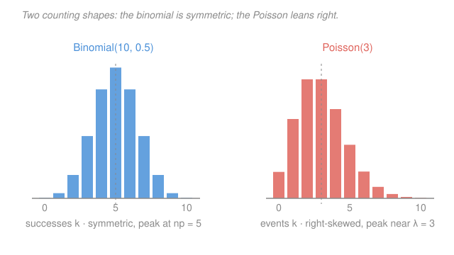

# Probability & Statistics · Lesson 2.2: The discrete family

> ⏱ ~15 min · Module 2: Expectation and the standard distributions · Builds on: [2.1 Expectation, variance, and moments](02-01-expectation-variance-moments.md) · Unlocks: 2.3 (continuous distributions)

## Why this matters

Most counting problems in the wild are not new — they are one of four shapes wearing a costume. How many defective chips in a batch? How many customers before the first one buys? How many emails arrive in the next minute? Once you can name the shape, you get its mean, its variance, and its whole probability table for free, no re-derivation. This lesson is pattern recognition: read a situation, name the distribution, done.

## The idea

Every distribution here is built from the same atom — a single yes/no trial — and they differ only in **what you count**.

- Count the outcome of *one* trial → **Bernoulli**.
- Fix the number of trials and count the successes → **binomial**.
- Keep trying and count *how long until* the first success → **geometric**.
- Count how many rare events land in a fixed window of time or space → **Poisson**.

That's the entire decision. The math below just makes each precise, but if you internalize the four cues — *one trial / fixed trials / wait-for-success / rare-events-per-interval* — you can classify almost any counting question on sight.

## The formal version

Throughout, a **trial** is a yes/no experiment with success probability $p$ (so failure probability $1-p$), and trials are **independent**. $X$ is the count we're after; $\mathbb{P}(X=k)$ is its **pmf** (probability mass function — the probability it equals exactly $k$).

**Bernoulli($p$).** One trial: $X=1$ on success, $X=0$ on failure.
$$\mathbb{E}[X]=p, \qquad \mathrm{Var}(X)=p(1-p).$$
In words: the mean is just the success rate, and the spread is largest at $p=\tfrac12$ (a fair coin is the most unpredictable trial).

**Binomial($n,p$).** The number of successes in $n$ independent trials.
$$\mathbb{P}(X=k)=\binom{n}{k}p^k(1-p)^{n-k}, \quad k=0,1,\dots,n; \qquad \mathbb{E}[X]=np, \qquad \mathrm{Var}(X)=np(1-p).$$
In words: choose which $k$ of the $n$ trials succeed ($\binom{n}{k}$ ways), each such pattern has probability $p^k(1-p)^{n-k}$. A binomial is literally a sum of $n$ Bernoullis, which is why the mean and variance are just $n$ times Bernoulli's — linearity from [2.1](02-01-expectation-variance-moments.md) doing the work.

**Geometric($p$).** The number of trials up to *and including* the first success.
$$\mathbb{P}(X=k)=(1-p)^{k-1}p, \quad k=1,2,3,\dots; \qquad \mathbb{E}[X]=\frac{1}{p}, \qquad \mathrm{Var}(X)=\frac{1-p}{p^2}.$$
In words: fail $k-1$ times, then succeed. The mean $1/p$ is the honest intuition — if success has a 1-in-6 chance, expect about 6 tries. Geometric is **memoryless**: given you've already failed $m$ times, the count of *additional* trials still needed is geometric($p$) all over again — the coin has no memory of your bad luck.

**Poisson($\lambda$).** The number of rare events in a fixed interval, where $\lambda$ (Greek "lambda") is the average count per interval.
$$\mathbb{P}(X=k)=\frac{e^{-\lambda}\lambda^k}{k!}, \quad k=0,1,2,\dots; \qquad \mathbb{E}[X]=\lambda, \qquad \mathrm{Var}(X)=\lambda.$$
In words: mean equals variance equals $\lambda$ — a signature no other family here shares. Use it for counts with no natural upper bound: calls, decays, typos, arrivals.

**The Poisson limit of the binomial.** Take a binomial with huge $n$, tiny $p$, holding the mean $np=\lambda$ fixed. Then
$$\binom{n}{k}p^k(1-p)^{n-k} \;\longrightarrow\; \frac{e^{-\lambda}\lambda^k}{k!}.$$
In words: many trials, each almost never succeeding, but a steady expected count — that's a Poisson. This is *why* Poisson models rare events: it's the binomial's limit when "rare" ($p\to0$) meets "many chances" ($n\to\infty$).

## Picture

The binomial has a hard ceiling ($k\le n$) and sits symmetric about $np$; the Poisson runs over all $k\ge 0$ and leans right, its mean pulled up by a thin tail of rare large counts.

## Worked examples

**Example 1 (mechanical — a binomial by hand).** A basketball player hits 40% of free throws. In $n=8$ attempts, what's the chance of exactly $k=3$ makes?
$$\mathbb{P}(X=3)=\binom{8}{3}(0.4)^3(0.6)^5 = 56 \cdot 0.064 \cdot 0.07776 \approx 0.279.$$
Expected makes: $np = 8(0.4)=3.2$, variance $np(1-p)=8(0.4)(0.6)=1.92$. The most likely single outcome (3) sits just below the mean (3.2), as it should for a mild right pull.

**Example 2 (why you'd care — Poisson for arrivals).** A webpage averages $\lambda = 2$ crashes per day. Probability of a crash-free day?
$$\mathbb{P}(X=0)=\frac{e^{-2}2^0}{0!}=e^{-2}\approx 0.135.$$
Probability of *at least one* crash: $1-e^{-2}\approx 0.865$. This is the queueing setup behind **Boss problem 2** — Poisson counts events, and lesson [2.3](02-03-continuous-distributions.md)'s exponential distribution will time the gaps *between* them. Same process, two views.

## Watch out

- You might think binomial and Poisson are interchangeable because both count. But binomial has a fixed cap $n$ (you can't get 9 heads in 8 flips); Poisson has no ceiling. Reach for Poisson only when there's no natural maximum, or as the large-$n$/small-$p$ approximation.
- You might write geometric as $\mathbb{P}(X=k)=(1-p)^k p$. That's the *other* convention (number of failures *before* the first success, starting at $k=0$). Ours counts the trials including the success, starting at $k=1$, with mean $1/p$. Pick one and check which the mean tells you.
- You might expect the mean to be the most probable value. For a right-skewed Poisson the peak (mode) usually sits just *below* $\lambda$ — the long right tail drags the mean above the hump.

## One-liner

> Fixed trials → binomial; wait for the first success → geometric; rare events per interval → Poisson — name the shape and its mean, variance, and pmf come free.

## Problems

**P1 (🟢)** A fair coin is flipped 5 times. Find the probability of exactly 3 heads, and state the mean and variance of the number of heads.

**P2 (🟡)** A call center receives on average 4 calls per hour. Modeling calls as Poisson, find (a) the probability of exactly 6 calls in an hour, and (b) the probability of no calls in an hour.

**P3 (🔴, optional)** You roll a fair die until a 6 appears. (a) What is the expected number of rolls, and its variance? (b) Separately, a factory ships $n=1000$ items each with defect probability $p=0.002$ independently. Use the Poisson limit to approximate the probability that a shipment has exactly 2 defects.

Solutions

**P1** Binomial($n=5$, $p=\tfrac12$).
$$\mathbb{P}(X=3)=\binom{5}{3}\left(\tfrac12\right)^3\left(\tfrac12\right)^2 = 10\cdot\frac{1}{32}=\frac{10}{32}=\frac{5}{16}=0.3125.$$
Mean $np = 5(0.5)=2.5$; variance $np(1-p)=5(0.5)(0.5)=1.25$.
Check: the whole pmf is $\binom{5}{k}/32$ for $k=0,\dots,5$, i.e. $\tfrac{1}{32}(1,5,10,10,5,1)$, summing to $32/32=1$. ✓

**P2** Poisson($\lambda=4$).
(a) $\displaystyle \mathbb{P}(X=6)=\frac{e^{-4}4^6}{6!}=\frac{e^{-4}\cdot 4096}{720}=e^{-4}(5.6889)\approx 0.01832\cdot 5.6889 \approx 0.1042.$
(b) $\displaystyle \mathbb{P}(X=0)=\frac{e^{-4}4^0}{0!}=e^{-4}\approx 0.0183.$
Check: mean $=$ variance $=\lambda=4$, and $\mathbb{P}(X=6)$ landing near the value $6$ (just above the mean 4) is plausibly sized at $\approx 10\%$ — consistent with a right-skewed hump centered at 4. ✓

**P3** (a) Geometric($p=\tfrac16$), counting rolls including the winning 6.
$$\mathbb{E}[X]=\frac{1}{p}=6, \qquad \mathrm{Var}(X)=\frac{1-p}{p^2}=\frac{5/6}{1/36}=\frac{5}{6}\cdot 36 = 30.$$
Check: standard deviation $\sqrt{30}\approx 5.48$ — a wide spread, matching the fat tail of "unlucky" long waits a geometric allows. ✓
(b) Poisson limit with $\lambda=np=1000(0.002)=2$.
$$\mathbb{P}(X=2)\approx\frac{e^{-2}2^2}{2!}=\frac{e^{-2}\cdot 4}{2}=2e^{-2}\approx 2(0.13534)=0.2707.$$
Check against the exact binomial: $\binom{1000}{2}(0.002)^2(0.998)^{998}=499500\cdot 4\times10^{-6}\cdot 0.13560 \approx 0.2709$ — the Poisson approximation matches to three decimals, exactly the large-$n$, small-$p$ regime it's built for. ✓

## Flashback

**From Lesson 2.1 (Expectation, variance, and moments):** A game pays you 10 dollars with probability 0.2, and otherwise costs you 3 dollars. Let $X$ be your payoff. Find $\mathbb{E}[X]$ and $\mathrm{Var}(X)$.

Solution

$X=+10$ with probability $0.2$, $X=-3$ with probability $0.8$.
$$\mathbb{E}[X]=10(0.2)+(-3)(0.8)=2-2.4=-0.4.$$
Use $\mathrm{Var}(X)=\mathbb{E}[X^2]-(\mathbb{E}[X])^2$:
$$\mathbb{E}[X^2]=100(0.2)+9(0.8)=20+7.2=27.2, \qquad \mathrm{Var}(X)=27.2-(-0.4)^2=27.2-0.16=27.04.$$
Check: standard deviation $\sqrt{27.04}=5.2$, comfortably larger than the two payoffs' distance from the mean would suggest a tiny spread — the rare big win makes the game volatile relative to its slightly-negative average. ✓ (A negative mean means: don't play.)

## Connections

- **Backward:** the binomial's mean $np$ and variance $np(1-p)$ are just $n$ copies of a Bernoulli summed — [2.1](02-01-expectation-variance-moments.md)'s linearity of expectation (and variance-adds-for-independence) applied, not memorized.
- **Forward:** [2.3](02-03-continuous-distributions.md) is the continuous mirror of this lesson — the exponential distribution times the gaps between Poisson events (memorylessness carries straight over), and the normal will approximate a large-$n$ binomial once the CLT (3.3) arrives.
- **Sideways (physics/reliability):** Poisson governs radioactive decay counts and photon arrivals; geometric-style waiting underlies mean-time-to-failure. The same $e^{-\lambda}$ that normalizes the Poisson is the $e^{-x^2}$-style decaying tail you met in [calc-refresher 2.3](../../calc-refresher/lessons/02-03-improper-integrals-and-models.md).
