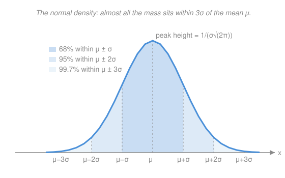

# Probability & Statistics · Lesson 2.3: The continuous family

> ⏱ ~15 min · Module 2: Expectation and the standard distributions · Builds on: [2.2 The discrete family](02-02-discrete-distributions.md), [1.3 Random variables and their distributions](01-03-random-variables-distributions.md) · Unlocks: Module 3 (dependence and the limit theorems)

## Why this matters

When outcomes are counts — heads, arrivals, defects — you sum a pmf. When outcomes are *measurements* — a waiting time, a height, a voltage — there's no next value to jump to, and the probability of any single exact value is zero. Probability becomes **area under a density**, and the questions become integrals. Three families cover almost everything you'll meet: the uniform (no information beyond a range), the exponential (memoryless waiting), and the normal (the universal bell that Module 3 will explain is *inevitable*). Knowing the normal cold — reading tails off a z-table — is the single most-used skill in all of statistics.

## The idea

A continuous random variable is described by a **density** $f(x)$: not a probability itself, but a probability *per unit length*, like mass per unit length along a wire. To get an actual probability you weigh a stretch of it — you integrate:

$$\mathbb{P}(a \le X \le b) = \int_a^b f(x)\,dx.$$

Total mass is $1$: $\int_{-\infty}^{\infty} f = 1$, the same normalization requirement that made the improper integrals of [calc 2.3](../../calc-refresher/lessons/02-03-improper-integrals-and-models.md) matter. Because area at a single point is zero, $\mathbb{P}(X = c) = 0$ and the endpoints don't matter: $\mathbb{P}(X > 7)$ and $\mathbb{P}(X \ge 7)$ are the same number. That's the one reflex to build — **stop counting values, start measuring area.**

The three families differ only in the *shape* of that area:
- **Uniform** — a flat slab. All you know is "somewhere in $[a,b]$, no spot favored."
- **Exponential** — a decaying tail. The waiting time until the next Poisson event; it *forgets how long you've already waited*.
- **Normal** — the symmetric bell. What sums and averages of almost anything pile up into.

## The formal version

Write $X$ for the random variable, $f$ for its density, and $F(x) = \mathbb{P}(X \le x) = \int_{-\infty}^{x} f$ for its **CDF** (from [1.3](01-03-random-variables-distributions.md)).

**Uniform, $X \sim \text{Uniform}(a,b)$.** Constant density on the interval:

$$f(x) = \frac{1}{b-a} \ \text{ for } a \le x \le b, \quad 0 \text{ otherwise}, \qquad \mathbb{E}[X] = \frac{a+b}{2}, \quad \text{Var}(X) = \frac{(b-a)^2}{12}.$$

In words: height $1/(b-a)$ makes the slab's area exactly $1$; the mean is the midpoint, by symmetry.

**Exponential, $X \sim \text{Exponential}(\lambda)$.** Rate $\lambda > 0$; lives on $x \ge 0$:

$$f(x) = \lambda e^{-\lambda x}, \qquad F(x) = 1 - e^{-\lambda x}, \qquad \mathbb{E}[X] = \frac{1}{\lambda}, \quad \text{Var}(X) = \frac{1}{\lambda^2}.$$

In words: the tail probability is clean — $\mathbb{P}(X > t) = e^{-\lambda t}$ — and the mean waiting time is one-over-the-rate. If events arrive as a Poisson process at rate $\lambda$ (the count distribution from [2.2](02-02-discrete-distributions.md)), the **gap between consecutive events is Exponential($\lambda$)**: the two are the same process seen as "how many?" versus "how long until?".

**Memorylessness** is the exponential's signature:

$$\mathbb{P}(X > s + t \mid X > s) = \mathbb{P}(X > t).$$

In words: given you've already waited $s$ with no event, the *remaining* wait has the same distribution as a fresh one — the process has no memory of your patience. (It is the *only* continuous distribution with this property.)

**Normal, $X \sim \mathcal{N}(\mu, \sigma^2)$.** Mean $\mu$, standard deviation $\sigma > 0$:

$$f(x) = \frac{1}{\sigma\sqrt{2\pi}}\, e^{-(x-\mu)^2 / 2\sigma^2}.$$

In words: a bell centered at $\mu$, its width set by $\sigma$. The $\sqrt{2\pi}$ out front is exactly what makes the infinite tails integrate to $1$ — it *is* the Gaussian integral $\int_{-\infty}^\infty e^{-x^2/2}\,dx = \sqrt{2\pi}$, evaluated in [calc 4.3](../../calc-refresher/lessons/04-03-multiple-integrals.md) by the polar-coordinates trick.

**Standardizing.** Subtract the mean, divide by the SD:

$$Z = \frac{X - \mu}{\sigma} \sim \mathcal{N}(0, 1), \qquad \Phi(z) = \mathbb{P}(Z \le z).$$

In words: every normal is the *one* standard normal $Z$ in disguise, shifted and stretched. So one table of $\Phi$ (the standard-normal CDF) answers every normal question: $\mathbb{P}(X \le x) = \Phi\!\big(\tfrac{x-\mu}{\sigma}\big)$. The bell has no elementary antiderivative — that's *why* $\Phi$ is tabulated rather than computed by hand.

**The 68–95–99.7 rule.** For any normal, about $68\%$ of the mass lies within $\pm 1\sigma$ of $\mu$, $95\%$ within $\pm 2\sigma$, and $99.7\%$ within $\pm 3\sigma$.

## Picture

## Worked examples

**Example 1 (mechanical — area under a slab).** $X \sim \text{Uniform}(0, 4)$, so $f(x) = 1/4$ on $[0,4]$. Then

$$\mathbb{P}(1 \le X \le 3) = \int_1^3 \tfrac14\,dx = \tfrac14(3-1) = \tfrac12,$$

which you could read off without the integral: half the interval, so half the probability. The mean is the midpoint $\mathbb{E}[X] = (0+4)/2 = 2$. Uniform integrals are just "fraction of the interval."

**Example 2 (why you'd care — the Poisson/exponential bridge).** A server receives requests as a Poisson process at rate $\lambda = 2$ per second. Two questions, two distributions, one process:

- *How many* requests in the next second? Poisson: $\mathbb{P}(N = 0) = e^{-2} \approx 0.135$ (from [2.2](02-02-discrete-distributions.md)).
- *How long* until the next request? Exponential: $\mathbb{P}(X > 1) = e^{-\lambda \cdot 1} = e^{-2} \approx 0.135$.

Same number — and no accident. "Zero arrivals in the first second" and "the first arrival comes after one second" are *the identical event*, told once by the count and once by the wait. This is Boss Problem 2's core: model counts with Poisson, waits with exponential, and know they're two faces of one coin.

## Watch out

- You might think $f(x)$ *is* a probability, so it can't exceed $1$. It's a probability *density* — $\text{Uniform}(0, 0.5)$ has height $1/(0.5) = 2$. Only *areas* are probabilities, and areas never exceed $1$.
- You might think "I've already waited 10 minutes, so a bus is surely due soon." Not for a memoryless (exponential) wait: the expected *remaining* wait is still the full $1/\lambda$. Past waiting buys you nothing.
- You might think $\mathbb{P}(X > 73) = \Phi(1)$. It's $1 - \Phi(1)$: $\Phi$ is the *left* tail (area to the left of $z$). Always ask which side you want, and use symmetry $\Phi(-z) = 1 - \Phi(z)$ for negative $z$.

## One-liner

> Continuous probability is area under a density: the exponential is memoryless waiting, and every normal is the standard bell $Z$ in disguise — standardize, then read $\Phi$.

## Problems

Standard z-table values you may quote: $\Phi(1) \approx 0.841$, $\Phi(1.96) \approx 0.975$, $\Phi(2) \approx 0.977$.

**P1 (🟢)** $X \sim \text{Uniform}(0, 10)$. Find $\mathbb{P}(X > 7)$ and $\mathbb{E}[X]$.

**P2 (🟡)** A support line's wait time is exponential with mean $5$ minutes. (a) Find $\mathbb{P}(\text{wait} > 10\text{ min})$. (b) You've already waited $4$ minutes; find $\mathbb{P}(\text{wait} > 14 \mid \text{wait} > 4)$, and say what property makes it come out that way.

**P3 (🔴)** Adult heights are $X \sim \mathcal{N}(70, 3^2)$ inches (so $\mu = 70$, $\sigma = 3$). Find $\mathbb{P}(X > 73)$ and $\mathbb{P}(67 < X < 73)$ by standardizing, stating each $z$-value used.

Solutions

**P1** Density $f(x) = 1/10$ on $[0,10]$.

$$\mathbb{P}(X > 7) = \int_7^{10} \tfrac{1}{10}\,dx = \tfrac{1}{10}(10 - 7) = \tfrac{3}{10} = 0.3.$$

Mean: $\mathbb{E}[X] = (0 + 10)/2 = 5$.
Check: $7$ is $70\%$ of the way along $[0,10]$, so the fraction above it is the remaining $30\%$. ✓

**P2** Mean $1/\lambda = 5$, so $\lambda = 1/5$ per minute.
(a) $\mathbb{P}(X > 10) = e^{-\lambda \cdot 10} = e^{-10/5} = e^{-2} \approx 0.135$.
(b) By memorylessness $\mathbb{P}(X > s+t \mid X > s) = \mathbb{P}(X > t)$ with $s = 4$, $t = 10$:

$$\mathbb{P}(X > 14 \mid X > 4) = \frac{\mathbb{P}(X > 14)}{\mathbb{P}(X > 4)} = \frac{e^{-14/5}}{e^{-4/5}} = e^{-10/5} = e^{-2} \approx 0.135.$$

Identical to (a): the exponential forgets the $4$ minutes already spent — the remaining wait is distributed like a brand-new one.
Check: the extra factor $e^{-4/5}$ in the numerator cancels the denominator exactly, leaving $e^{-10/5}$. ✓

**P3** Standardize with $Z = (X - 70)/3$.
$\mathbb{P}(X > 73)$: at $x = 73$, $z = (73 - 70)/3 = 1$. So $\mathbb{P}(X > 73) = 1 - \Phi(1) = 1 - 0.841 = 0.159$.
$\mathbb{P}(67 < X < 73)$: at $x = 67$, $z = (67-70)/3 = -1$; at $x = 73$, $z = 1$. So

$$\mathbb{P}(67 < X < 73) = \Phi(1) - \Phi(-1) = \Phi(1) - \big(1 - \Phi(1)\big) = 2(0.841) - 1 = 0.682.$$

Check: $67$ and $73$ are exactly $\mu \pm \sigma$, so this is the "$68\%$ within one SD" band from the figure — $0.682$ matches. ✓

## Flashback

**From Lesson 2.2 (The discrete family):** Calls reach a help desk as a Poisson process at rate $3$ per hour. Find $\mathbb{P}(\text{exactly } 2 \text{ calls in an hour})$, then name the distribution of the *time between* consecutive calls and give its mean.

Solution

Counts in a fixed hour are $N \sim \text{Poisson}(\lambda = 3)$, with pmf $\mathbb{P}(N = k) = e^{-\lambda}\lambda^k / k!$:

$$\mathbb{P}(N = 2) = \frac{e^{-3}\,3^2}{2!} = \frac{9}{2}e^{-3} = 4.5 \times 0.0498 \approx 0.224.$$

The gap between consecutive calls is $\text{Exponential}(\lambda = 3)$ — the waiting-time partner of this lesson — with mean $1/\lambda = 1/3$ hour $= 20$ minutes.
Check: $e^{-3} \approx 0.0498$, and $4.5 \times 0.0498 = 0.2241$, a sensible probability in $[0,1]$; the rate $3$/hour indeed gives one call every $20$ minutes on average. ✓

## Connections

- **Backward:** these are the continuous random variables of [1.3](01-03-random-variables-distributions.md) made concrete, and the mean/variance formulas are the expectation machinery of [2.1](02-01-expectation-variance-moments.md) applied to densities instead of pmfs. Every "total mass $= 1$" here is an improper integral from [calc 2.3](../../calc-refresher/lessons/02-03-improper-integrals-and-models.md).
- **Forward:** the normal is the destination of the **Central Limit Theorem** in [3.3](03-03-central-limit-theorem.md) — *why* it's universal is the payoff of Module 3, and the $\Phi$-lookups you drilled here become the everyday tool of confidence intervals ([4.2](04-02-confidence-intervals.md)) and hypothesis tests ([4.3](04-03-hypothesis-testing.md)).
- **Sideways (probability):** the exponential ↔ Poisson bridge (waiting time ↔ count) links this lesson to [2.2](02-02-discrete-distributions.md) and is the engine of Boss Problem 2's queueing scenario.
- **Sideways (calculus):** the bell's normalizing $\sqrt{2\pi}$ is the Gaussian integral computed in polar coordinates in [calc 4.3](../../calc-refresher/lessons/04-03-multiple-integrals.md) — probability and multivariable calculus meeting on the same integral.
