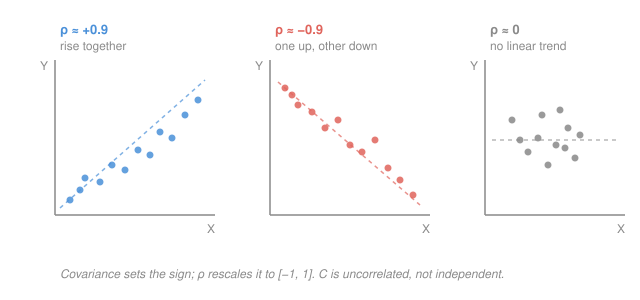

# Probability & Statistics · Lesson 3.1: Joint distributions, covariance, and correlation

> ⏱ ~15 min · Module 3: Dependence and the limit theorems · Builds on: [2.1 Expectation, variance, and moments](02-01-expectation-variance-moments.md) · Unlocks: 3.2 (sums and the Law of Large Numbers)

## Why this matters

One random variable at a time is a warm-up; the world runs on pairs. A stock's return and the market's, a patient's dose and their recovery, height and weight — the interesting question is never "how does each behave alone" but "how do they *move together*?" That co-movement is the entire content of portfolio risk (diversification is just covariance arithmetic), of regression, and of every "controls for" clause in empirical economics. And it is the hinge for the rest of this module: once you can add two random variables and track how their spreads combine, the Law of Large Numbers (3.2) and the Central Limit Theorem (3.3) fall out.

## The idea

Picture a cloud of dots, one dot per joint observation of a pair $(X, Y)$. If the cloud tilts up to the right — big $X$ tends to come with big $Y$ — they **co-vary positively**. Tilt down to the right and it's negative. A round, tiltless blob means neither predicts the other's *direction*: zero covariance.

**Covariance** just makes that tilt a number: for each dot, multiply how far $X$ sits from its own average by how far $Y$ sits from its average, and average those products. When both tend to be above (or both below) their means at once, the products are positive and pile up; when one is high while the other is low, the products go negative. The sign is the tilt.

The catch: covariance carries units (dollars times centimeters) and scale, so its raw size is uninterpretable — rescale $X$ from meters to millimeters and the covariance jumps by 1000 with no change in the relationship. **Correlation** fixes this by dividing out both standard deviations, squeezing the answer into $[-1, 1]$: now $+1$ is a perfect up-line, $-1$ a perfect down-line, $0$ no linear tilt — a pure, unitless measure of *how tightly* the cloud hugs a line.

## The formal version

**Joint distribution.** For a pair $(X, Y)$, the **joint pmf** (discrete case) is $p(x, y) = \mathbb{P}(X = x,\ Y = y)$ — the probability of that specific combination — and it sums to 1 over all pairs. (Continuous case: a **joint pdf** $f(x,y)$ with $\iint f = 1$; probabilities are volumes under it.) In words: one table (or surface) giving the weight of every possible $(x,y)$ jointly.

**Marginals.** Recover one variable's own distribution by summing the other out:
$$p_X(x) = \sum_y p(x, y), \qquad p_Y(y) = \sum_x p(x, y).$$
In words: to get $X$ alone, collapse each row (or column) by adding across the variable you don't care about — like reading the row totals in the margin of the table (hence "marginal").

**Independence.** $X$ and $Y$ are **independent** iff the joint factors into the product of marginals for *every* pair:
$$p(x, y) = p_X(x)\, p_Y(y) \quad \text{for all } x, y.$$
In words: knowing $Y$ tells you nothing about $X$ — the joint table is just the outer product of its own margins.

**Covariance.** With $\mu_X = \mathbb{E}[X]$, $\mu_Y = \mathbb{E}[Y]$,
$$\mathrm{Cov}(X, Y) = \mathbb{E}\big[(X - \mu_X)(Y - \mu_Y)\big] = \mathbb{E}[XY] - \mathbb{E}[X]\,\mathbb{E}[Y].$$
In words: the average co-deviation from the means; the right-hand form (multiply out, use linearity) is the one you actually compute with. Note $\mathrm{Cov}(X, X) = \mathrm{Var}(X)$ — variance is just self-covariance.

**Correlation.** With $\sigma_X = \sqrt{\mathrm{Var}(X)}$, $\sigma_Y = \sqrt{\mathrm{Var}(Y)}$,
$$\rho = \mathrm{Corr}(X, Y) = \frac{\mathrm{Cov}(X, Y)}{\sigma_X\, \sigma_Y} \in [-1, 1].$$
In words: covariance normalized by the two spreads — a scale-free tilt strength, always between $-1$ and $+1$ (that bound is the Cauchy–Schwarz inequality).

**The variance-of-a-sum rule** — the payoff of this whole lesson:
$$\mathrm{Var}(X + Y) = \mathrm{Var}(X) + \mathrm{Var}(Y) + 2\,\mathrm{Cov}(X, Y).$$
In words: spreads do **not** simply add — there's a cross term. Variances add *only when the covariance is zero*. Positive co-movement amplifies the combined swing; negative co-movement (hedging) damps it.

**Independent $\Rightarrow$ uncorrelated, but not conversely.** If $X, Y$ are independent then $\mathbb{E}[XY] = \mathbb{E}[X]\mathbb{E}[Y]$, so $\mathrm{Cov} = 0$. The reverse fails: $\rho = 0$ only kills the *linear* tilt, and variables can be tightly dependent through a curved relationship while their linear tilt cancels (Problem 3).

## Picture

## Worked examples

**Example 1 (mechanical — read a joint table).** Let $(X, Y)$ have the joint pmf

| $p(x,y)$ | $Y=0$ | $Y=1$ | row total $p_X$ |
|---|---|---|---|
| $X=0$ | 0.3 | 0.3 | 0.6 |
| $X=1$ | 0.2 | 0.2 | 0.4 |
| col total $p_Y$ | 0.5 | 0.5 | 1.0 |

Every cell equals its row total times its column total ($0.3 = 0.6 \times 0.5$, $0.2 = 0.4 \times 0.5$, etc.), so **$X$ and $Y$ are independent** — and therefore $\mathrm{Cov}(X, Y) = 0$. Confirm directly: $\mathbb{E}[XY] = 1\cdot1\cdot0.2 = 0.2$ (only the $(1,1)$ cell contributes), while $\mathbb{E}[X]\mathbb{E}[Y] = 0.4 \times 0.5 = 0.2$, so $\mathrm{Cov} = 0.2 - 0.2 = 0$. ✓

**Example 2 (why you'd care — diversification).** Two assets each have return variance $\sigma^2$. Hold them half-and-half: the portfolio return is $P = \tfrac12 X + \tfrac12 Y$. Pulling constants out ($\mathrm{Var}(aX) = a^2\mathrm{Var}(X)$, $\mathrm{Cov}(aX, bY) = ab\,\mathrm{Cov}(X,Y)$),
$$\mathrm{Var}(P) = \tfrac14\sigma^2 + \tfrac14\sigma^2 + 2\cdot\tfrac14\,\mathrm{Cov}(X,Y) = \tfrac{\sigma^2}{2}\big(1 + \rho\big).$$
If the assets are uncorrelated ($\rho = 0$), the portfolio variance is $\sigma^2/2$ — **half** the risk of either alone, for free. If they move in lockstep ($\rho = 1$), it's back to $\sigma^2$ — no diversification. And a hedge ($\rho = -1$) drives variance to $0$. This one line is why "don't put all your eggs in one basket" is a theorem, not a proverb.

## Watch out

- You might think $\mathrm{Var}(X + Y) = \mathrm{Var}(X) + \mathrm{Var}(Y)$ always. It only holds when $\mathrm{Cov}(X, Y) = 0$; otherwise you're missing the $2\,\mathrm{Cov}$ term. (Standard deviations *never* add — not even then; the variances do.)
- You might think $\rho = 0$ means "no relationship." It means no *linear* relationship. $Y = X^2$ with a symmetric $X$ is perfectly determined by $X$ yet has $\rho = 0$ (Problem 3). Zero correlation is much weaker than independence.
- You might think a big covariance means a strong relationship. Covariance carries units and scale; only correlation is comparable across problems. Always normalize before you judge strength.

## One-liner

> Covariance is the tilt of the cloud (sign = co-movement direction); correlation rescales it to $[-1,1]$; and variances add only when that tilt is zero.

## Problems

**P1 (🟢)** The pair $(X, Y)$ has joint pmf $p(0,0) = 0.4$, $p(0,1) = 0.2$, $p(1,0) = 0.1$, $p(1,1) = 0.3$. (a) Find both marginals and confirm they each sum to 1. (b) Are $X$ and $Y$ independent? (c) Compute $\mathrm{Cov}(X, Y)$.

**P2 (🟡)** Using the same $(X, Y)$ as P1: compute $\mathrm{Var}(X)$, $\mathrm{Var}(Y)$, and then $\mathrm{Var}(X + Y)$ two ways — once via the covariance rule, and once directly from the distribution of $S = X + Y$. Then find the correlation $\rho$ and check $|\rho| \le 1$.

**P3 (🔴, optional)** Let $X$ take values $-1, 0, 1$ each with probability $\tfrac13$, and set $Y = X^2$. Show $\mathrm{Cov}(X, Y) = 0$ (so $\rho = 0$), yet $X$ and $Y$ are **not** independent — exhibit one pair $(x, y)$ where $p(x,y) \ne p_X(x)\,p_Y(y)$.

Solutions

**P1** (a) Marginals sum the other variable out:
$$p_X(0) = 0.4 + 0.2 = 0.6,\quad p_X(1) = 0.1 + 0.3 = 0.4 \ \ (\text{sum } 1.0\ ✓)$$
$$p_Y(0) = 0.4 + 0.1 = 0.5,\quad p_Y(1) = 0.2 + 0.3 = 0.5 \ \ (\text{sum } 1.0\ ✓)$$
(b) Independence needs $p(x,y) = p_X(x)p_Y(y)$ everywhere. Test the $(0,0)$ cell: $p_X(0)p_Y(0) = 0.6 \times 0.5 = 0.30$, but $p(0,0) = 0.4 \ne 0.30$. **Not independent.**
(c) $X$ and $Y$ are $0/1$-valued, so $XY = 1$ only at $(1,1)$: $\mathbb{E}[XY] = 1\cdot1\cdot0.3 = 0.3$. With $\mathbb{E}[X] = 0.4$, $\mathbb{E}[Y] = 0.5$:
$$\mathrm{Cov}(X,Y) = 0.3 - (0.4)(0.5) = 0.3 - 0.2 = 0.1.$$
Positive — the pair co-moves upward, as the non-independence hinted.
*Numeric check:* all four probabilities are $\ge 0$ and sum to $0.4+0.2+0.1+0.3 = 1.0$. ✓

**P2** Each variable is a Bernoulli indicator, so $\mathrm{Var} = p(1-p)$:
$$\mathrm{Var}(X) = 0.4 \times 0.6 = 0.24, \qquad \mathrm{Var}(Y) = 0.5 \times 0.5 = 0.25.$$
Covariance rule (using $\mathrm{Cov} = 0.1$ from P1):
$$\mathrm{Var}(X + Y) = 0.24 + 0.25 + 2(0.1) = 0.69.$$
Direct check via $S = X + Y$: the distribution is $\mathbb{P}(S=0) = p(0,0) = 0.4$, $\mathbb{P}(S=1) = p(0,1)+p(1,0) = 0.3$, $\mathbb{P}(S=2) = p(1,1) = 0.3$. Then
$$\mathbb{E}[S] = 0(0.4) + 1(0.3) + 2(0.3) = 0.9,\quad \mathbb{E}[S^2] = 0 + 1(0.3) + 4(0.3) = 1.5,$$
$$\mathrm{Var}(S) = 1.5 - 0.9^2 = 1.5 - 0.81 = 0.69. \ ✓ \ \text{(matches)}$$
Correlation:
$$\rho = \frac{0.1}{\sqrt{0.24}\,\sqrt{0.25}} = \frac{0.1}{(0.48990)(0.5)} = \frac{0.1}{0.24495} \approx 0.408.$$
*Numeric check:* $|\rho| = 0.408 \le 1$ ✓, and $\mathbb{E}[S] = 0.9 = \mathbb{E}[X] + \mathbb{E}[Y] = 0.4 + 0.5$ ✓.

**P3** Marginals: $p_X(-1) = p_X(0) = p_X(1) = \tfrac13$. Since $Y = X^2$, $Y = 1$ when $X = \pm1$ and $Y = 0$ when $X = 0$, so $p_Y(1) = \tfrac23$, $p_Y(0) = \tfrac13$.
By symmetry $\mathbb{E}[X] = \tfrac13(-1 + 0 + 1) = 0$. For the cross term,
$$\mathbb{E}[XY] = \mathbb{E}[X \cdot X^2] = \mathbb{E}[X^3] = \tfrac13\big((-1)^3 + 0^3 + 1^3\big) = \tfrac13(-1 + 0 + 1) = 0.$$
So $\mathrm{Cov}(X, Y) = \mathbb{E}[XY] - \mathbb{E}[X]\mathbb{E}[Y] = 0 - 0\cdot\mathbb{E}[Y] = 0$, hence $\rho = 0$: **uncorrelated.**
But not independent. Take $(x, y) = (0, 0)$: jointly, $X = 0$ forces $Y = 0$, so $p(0, 0) = \mathbb{P}(X = 0) = \tfrac13$. The product of marginals is $p_X(0)\,p_Y(0) = \tfrac13 \cdot \tfrac13 = \tfrac19 \ne \tfrac13$. Dependence confirmed — knowing $X = 0$ makes $Y = 0$ certain, far from its unconditional $\tfrac13$.
*Numeric check:* $\mathbb{E}[X^3] = 0$ by the odd symmetry of $X$; and $\tfrac13 \ne \tfrac19$, so the factorization genuinely breaks. ✓

## Flashback

**From Lesson 2.1 (Expectation, variance, and moments):** A random variable $X$ has pmf $\mathbb{P}(X = -1) = 0.2$, $\mathbb{P}(X = 0) = 0.5$, $\mathbb{P}(X = 2) = 0.3$. Compute $\mathbb{E}[X]$ and $\mathrm{Var}(X)$ using $\mathrm{Var}(X) = \mathbb{E}[X^2] - \mathbb{E}[X]^2$.

Solution

$$\mathbb{E}[X] = (-1)(0.2) + (0)(0.5) + (2)(0.3) = -0.2 + 0 + 0.6 = 0.4.$$
$$\mathbb{E}[X^2] = (1)(0.2) + (0)(0.5) + (4)(0.3) = 0.2 + 0 + 1.2 = 1.4.$$
$$\mathrm{Var}(X) = 1.4 - (0.4)^2 = 1.4 - 0.16 = 1.24.$$
*Numeric check:* probabilities sum to $0.2 + 0.5 + 0.3 = 1.0$ ✓, and $\mathrm{Var} = 1.24 > 0$ with $\sigma = \sqrt{1.24} \approx 1.11$. ✓

## Connections

- **Backward:** covariance is [2.1](02-01-expectation-variance-moments.md)'s variance with a second variable let in — $\mathrm{Cov}(X,X) = \mathrm{Var}(X)$ — and both the $\mathbb{E}[XY] - \mathbb{E}[X]\mathbb{E}[Y]$ shortcut and the Bernoulli variance $p(1-p)$ (Problem 2) are pure 2.1 machinery reused.
- **Forward:** [3.2](03-02-sums-and-law-of-large-numbers.md) specializes the variance-of-a-sum rule to **i.i.d.** variables, where every covariance is zero, so $\mathrm{Var}(\sum X_i) = n\sigma^2$ — the fact that makes the sample mean's variance shrink like $1/n$ and the Law of Large Numbers bite.
- **Sideways (finance/econ):** Example 2 *is* Markowitz portfolio theory in one line; the covariance matrix is the object every risk model estimates. The same $\rho$ reappears as the population target that regression's slope and $R^2$ estimate from data in Module 4.
