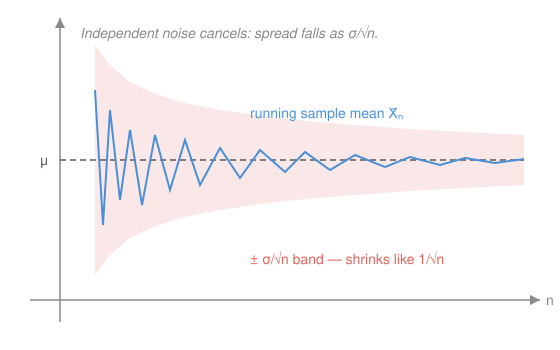

# Probability & Statistics · Lesson 3.2: Sums of random variables and the Law of Large Numbers

> ⏱ ~15 min · Module 3: Dependence and the limit theorems · Builds on: [3.1 Joint distributions, covariance, and correlation](03-01-joint-distributions-covariance.md) · Unlocks: 3.3 (the Central Limit Theorem)

## Why this matters

Every average you've ever trusted — a poll of 1,000 voters, the mean of ten lab measurements, a casino's nightly take — rests on one fact: **averaging independent things makes their noise cancel.** Roll one die and you can't predict it; average a hundred and the result is pinned near $3.5$ with almost no wiggle. This lesson makes that precise: the sample mean's spread shrinks like $1/n$, so its uncertainty falls like $1/\sqrt{n}$, and in the limit the average *converges* to the true mean. That's the Law of Large Numbers — the theorem that lets a sample speak for a population, and the foundation everything in Module 4 (estimation, confidence intervals, testing) is built on.

## The idea

Take independent copies $X_1, X_2, \dots, X_n$ of the same experiment — one die roll each, say — and look at two things you can build from them: their **sum** $S_n = X_1 + \cdots + X_n$, and their **average** $\bar X_n = S_n / n$.

These two behave in *opposite* ways as $n$ grows, and holding both pictures at once is the whole lesson. The sum gets *more* uncertain: each new roll adds its own randomness, and the typical distance of $S_n$ from its center grows like $\sqrt{n}$. But the average gets *less* uncertain: you're adding up $n$ pieces of noise that point in random directions, so they partly cancel, and then you divide by $n$ — the division wins. The high rolls and low rolls in a big batch nearly offset, and what's left is squeezed toward the true mean $\mu$.

So a single measurement is noisy, but the *mean of many* is sharp — and you can make it as sharp as you like by taking $n$ larger. That predictability of averages, emerging from unpredictable parts, is why statistics is possible at all.

## The formal version

Let $X_1, \dots, X_n$ be **i.i.d.** — *independent and identically distributed*: each has the same distribution, with mean $\mathbb{E}[X_i] = \mu$ and variance $\mathrm{Var}(X_i) = \sigma^2$, and they don't influence each other. Write $S_n = \sum_{i=1}^n X_i$ for the sum and $\bar X_n = S_n/n$ for the **sample mean**.

**The sum.** By linearity of expectation and the variance-of-a-sum rule from [3.1](03-01-joint-distributions-covariance.md) — where independence kills every covariance term, so variances simply add:

$$\mathbb{E}[S_n] = n\mu, \qquad \mathrm{Var}(S_n) = n\sigma^2, \qquad \text{sd}(S_n) = \sqrt{n}\,\sigma.$$

In words: the sum's center and its variance both grow proportionally to $n$, so its *spread* (the standard deviation) grows like $\sqrt{n}$ — slower than $n$, but still without bound.

**The sample mean.** Dividing a random variable by the constant $n$ divides its mean by $n$ and its variance by $n^2$ (a constant $c$ pulls out of variance as $c^2$):

$$\mathbb{E}[\bar X_n] = \mu, \qquad \mathrm{Var}(\bar X_n) = \frac{\sigma^2}{n}, \qquad \text{sd}(\bar X_n) = \frac{\sigma}{\sqrt{n}}.$$

In words: the average is **unbiased** — centered exactly on $\mu$ for every $n$ — and its spread *shrinks* like $1/\sqrt{n}$. That quantity $\sigma/\sqrt{n}$ is the **standard error** of the mean, the single most important number in applied statistics: quadruple your sample and you halve your uncertainty.

**The (Weak) Law of Large Numbers.** For i.i.d. $X_i$ with finite mean $\mu$ and variance $\sigma^2$, for any tolerance $\varepsilon > 0$,

$$\mathbb{P}\big(|\bar X_n - \mu| > \varepsilon\big) \to 0 \quad \text{as } n \to \infty.$$

In words: pick any error window you like, however tight; the probability that the sample mean lands *outside* it goes to zero as the sample grows. We say $\bar X_n \to \mu$ **in probability**. The average doesn't just have small spread — it piles up on the true mean.

**One-line proof (via Chebyshev).** [Chebyshev's inequality](03-01-joint-distributions-covariance.md) says any random variable $Y$ stays within a few standard deviations of its mean: $\mathbb{P}(|Y - \mathbb{E}[Y]| \ge \varepsilon) \le \mathrm{Var}(Y)/\varepsilon^2$. Apply it to $Y = \bar X_n$, whose mean is $\mu$ and whose variance is $\sigma^2/n$:

$$\mathbb{P}\big(|\bar X_n - \mu| \ge \varepsilon\big) \le \frac{\mathrm{Var}(\bar X_n)}{\varepsilon^2} = \frac{\sigma^2}{n\,\varepsilon^2} \xrightarrow[n\to\infty]{} 0.$$

In words: the bound on the miss-probability is itself a $1/n$ quantity, so it vanishes. The whole theorem is "the variance goes to zero, and a random variable with vanishing variance around $\mu$ must concentrate at $\mu$." That's it.

## Picture

## Worked examples

**Example 1 (mechanical — sum vs. mean of many dice).** One fair die has $\mu = 3.5$ and $\sigma^2 = \tfrac{35}{12} \approx 2.917$ (from $\mathbb{E}[X^2] = \tfrac{91}{6}$ minus $3.5^2$). Roll $n = 100$ independent dice.

- **Sum** $S_{100}$: $\ \mathbb{E}[S_{100}] = 100(3.5) = 350$, $\ \mathrm{Var}(S_{100}) = 100 \cdot \tfrac{35}{12} \approx 291.7$, so $\text{sd} \approx 17.1$.
- **Mean** $\bar X_{100}$: $\ \mathbb{E}[\bar X_{100}] = 3.5$, $\ \mathrm{Var}(\bar X_{100}) = \tfrac{35/12}{100} \approx 0.0292$, so $\text{sd} \approx 0.171$.

The sum scatters over a range of tens; the average is pinned to within about $\pm 0.17$ of $3.5$. Same 100 rolls, opposite verdicts — exactly the two-sided story of the lesson.

**Example 2 (why you'd care — how many measurements?).** A scale's readings are i.i.d. with unknown mean $\mu$ (the true weight) and standard deviation $\sigma = 2$ grams. You want the sample mean $\bar X_n$ to sit within $\varepsilon = 0.1$ g of $\mu$ with probability at least $95\%$. Chebyshev gives a *guarantee* with no distributional assumptions:

$$\mathbb{P}\big(|\bar X_n - \mu| \ge 0.1\big) \le \frac{\sigma^2}{n\,\varepsilon^2} = \frac{4}{n(0.01)} = \frac{400}{n}.$$

Force this $\le 0.05$: $\ 400/n \le 0.05 \iff n \ge 8000$. So $8{,}000$ readings *guarantee* the target. That's a lot — because Chebyshev is deliberately assumption-free and therefore loose. Lesson 3.3's Central Limit Theorem, by assuming the shape of the fluctuations is normal, will cut this to a few hundred. LLN tells you convergence *happens*; the CLT tells you how *fast*.

## Watch out

- **The gambler's fallacy.** You might think that after a run of heads, tails is "due" so the counts rebalance. They don't. What the LLN promises is that the *proportion* $\bar X_n$ of heads $\to \tfrac12$; the *surplus* $S_n - n\mu$ of heads over the expected count actually tends to *grow* (its spread is $\sqrt{n}\,\sigma$). The ratio converges only because you're dividing a $\sqrt{n}$-sized wobble by $n$. Averages self-correct; sums do not.
- **"Weak" isn't a defect.** The *Weak* LLN is convergence *in probability* (each large $n$ is very likely close). There's also a *Strong* LLN — the whole sequence converges with probability 1 — but the weak version is all you need here, and Chebyshev delivers it in one line.
- **Independence is doing real work.** "Variances add" needs the covariance terms to vanish; that's where i.i.d. enters. If the $X_i$ are *positively* correlated (3.1), $\mathrm{Var}(S_n)$ exceeds $n\sigma^2$ and averaging cancels noise more slowly — the reason correlated polls or correlated bets are riskier than their count suggests.

## One-liner

> The sum's spread grows like $\sqrt{n}$ and the mean's shrinks like $1/\sqrt{n}$ — so averaging drowns independent noise, and $\bar X_n$ concentrates on $\mu$.

## Problems

**P1 (🟢)** A fair die has $\mu = 3.5$ and $\sigma^2 = \tfrac{35}{12}$. For $n = 100$ i.i.d. rolls, state the mean and standard deviation of (a) the sum $S_{100}$, and (b) the sample mean $\bar X_{100}$. In one sentence, say which of the two spreads shrinks with more rolls.

**P2 (🟡)** Readings from a sensor are i.i.d. with mean $\mu$ and standard deviation $\sigma = 3$. Using **Chebyshev's inequality only**, find the smallest $n$ that guarantees $\mathbb{P}\big(|\bar X_n - \mu| \ge 0.2\big) \le 0.05$ — i.e. the mean is within $0.2$ of $\mu$ with at least $95\%$ probability.

**P3 (🔴, optional)** Flip a fair coin $n$ times; code each flip $X_i = +1$ (heads) or $-1$ (tails), so $\mu = 0$, $\sigma^2 = 1$. Let $S_n = \sum X_i$ be the running *surplus* of heads over tails and $\bar X_n = S_n/n$.
(a) Give $\text{sd}(S_n)$ and $\text{sd}(\bar X_n)$ as functions of $n$, and evaluate both at $n = 100$ and $n = 10{,}000$.
(b) Use the two trends to explain, precisely, why "after many tails, heads are due" is false yet "the fraction of heads $\to \tfrac12$" is true.

Solutions

**P1** With $\mu = 3.5$, $\sigma^2 = \tfrac{35}{12} \approx 2.9167$, $\sigma \approx 1.7078$.

(a) Sum: $\mathbb{E}[S_{100}] = 100\mu = 350$; $\mathrm{Var}(S_{100}) = 100\sigma^2 = \tfrac{3500}{12} \approx 291.67$; $\text{sd}(S_{100}) = \sqrt{100}\,\sigma = 10\sigma \approx 17.08$.

(b) Mean: $\mathbb{E}[\bar X_{100}] = \mu = 3.5$; $\mathrm{Var}(\bar X_{100}) = \sigma^2/100 \approx 0.02917$; $\text{sd}(\bar X_{100}) = \sigma/10 \approx 0.1708$.

The **sample mean's** spread shrinks as $n$ grows (it scales as $\sigma/\sqrt{n}$); the sum's spread $\sqrt{n}\,\sigma$ grows.

*Check:* $\text{sd}(S_{100}) = 100 \cdot \text{sd}(\bar X_{100})$, since $S_{100} = 100\,\bar X_{100}$: $\ 10\sigma = 100 \cdot (\sigma/10)$. ✓

**P2** Chebyshev on $\bar X_n$ (mean $\mu$, variance $\sigma^2/n$), with $\sigma^2 = 9$, $\varepsilon = 0.2$:

$$\mathbb{P}\big(|\bar X_n - \mu| \ge 0.2\big) \le \frac{\sigma^2}{n\,\varepsilon^2} = \frac{9}{n(0.04)} = \frac{225}{n}.$$

Require $\dfrac{225}{n} \le 0.05 \iff n \ge \dfrac{225}{0.05} = 4500$. Smallest $n = \boxed{4500}$.

*Check:* at $n = 4500$, the bound is $225/4500 = 0.05$ exactly, so the miss-probability is $\le 5\%$ and the within-tolerance probability is $\ge 95\%$. ✓ (As in Example 2, this is a conservative count; the CLT will need far fewer.)

**P3** Here $\mu = 0$, $\sigma = 1$.

(a) $\text{sd}(S_n) = \sqrt{n}\,\sigma = \sqrt{n}$ and $\text{sd}(\bar X_n) = \sigma/\sqrt{n} = 1/\sqrt{n}$.

| $n$ | $\text{sd}(S_n) = \sqrt{n}$ | $\text{sd}(\bar X_n) = 1/\sqrt{n}$ |
|---|---|---|
| $100$ | $10$ | $0.10$ |
| $10{,}000$ | $100$ | $0.01$ |

(b) The **surplus** $S_n$ has spread $\sqrt{n}$, which *grows* — from a typical $\pm 10$ at $n=100$ to $\pm 100$ at $n = 10{,}000$. So there is no force pulling the count of heads back level with tails; the raw gap typically widens. The coin has no memory, so "heads are due" is false. But the **fraction** of heads is $\tfrac{1}{2}(1 + \bar X_n)$, and $\text{sd}(\bar X_n) = 1/\sqrt{n}$ *shrinks* — from $\pm 0.10$ to $\pm 0.01$ — driving the fraction to $\tfrac12$. Both statements coexist because $S_n$ and $\bar X_n = S_n/n$ differ by a factor of $n$: a wobble growing like $\sqrt{n}$, divided by $n$, still dies like $1/\sqrt{n}$.

*Check:* $\text{sd}(S_n)\cdot\text{sd}(\bar X_n) = \sqrt{n}\cdot(1/\sqrt{n}) = 1$ for every $n$ (both equal $10\times0.1 = 1$ and $100\times0.01 = 1$), the clean signature that one grows exactly as fast as the other shrinks. ✓

## Flashback

**From Lesson 3.1 (Joint distributions, covariance, and correlation):** Two random variables have $\mathrm{Var}(X) = 4$, $\mathrm{Var}(Y) = 9$, and $\mathrm{Cov}(X, Y) = 3$. Find (a) $\mathrm{Var}(2X - Y)$ and (b) the correlation $\rho(X, Y)$. Are $X$ and $Y$ independent?

Solution

(a) Use the linear-combination rule $\mathrm{Var}(aX + bY) = a^2\mathrm{Var}(X) + b^2\mathrm{Var}(Y) + 2ab\,\mathrm{Cov}(X,Y)$, with $a = 2$, $b = -1$:

$$\mathrm{Var}(2X - Y) = 4(4) + 1(9) + 2(2)(-1)(3) = 16 + 9 - 12 = 13.$$

(b) $\rho = \dfrac{\mathrm{Cov}(X,Y)}{\sqrt{\mathrm{Var}(X)\,\mathrm{Var}(Y)}} = \dfrac{3}{\sqrt{4\cdot 9}} = \dfrac{3}{6} = 0.5.$

Not independent: $\mathrm{Cov}(X,Y) = 3 \ne 0$, and independence forces zero covariance. (This is exactly the "variances add *only* when covariances vanish" caveat that makes the i.i.d. sum rule in this lesson clean.)

*Check:* $\rho = 0.5 \in [-1, 1]$ as any correlation must be, and $\mathrm{Var}(2X - Y) = 13 > 0$. ✓

## Connections

- **Backward:** the sum's variance $n\sigma^2$ is the [3.1](03-01-joint-distributions-covariance.md) linear-combination rule with all covariances zeroed by independence; the mean/variance machinery is straight from [2.1](02-01-expectation-variance-moments.md). Chebyshev, the engine of the proof, is also from 3.1.
- **Forward:** [3.3](03-03-central-limit-theorem.md) upgrades this dramatically — the LLN says $\bar X_n \to \mu$, and the CLT describes the *shape* of the leftover $\sqrt{n}(\bar X_n - \mu)$, which is normal. The standard error $\sigma/\sqrt{n}$ introduced here is the width of every confidence interval in Module 4.
- **Sideways (physics/econ):** "average many noisy measurements to sharpen an estimate" is signal averaging in the lab and diversification in finance — a portfolio of $n$ independent bets has return-spread $\sigma/\sqrt{n}$, the same $1/\sqrt{n}$ law, which is precisely why correlation (positive covariance) is what destroys the benefit.
