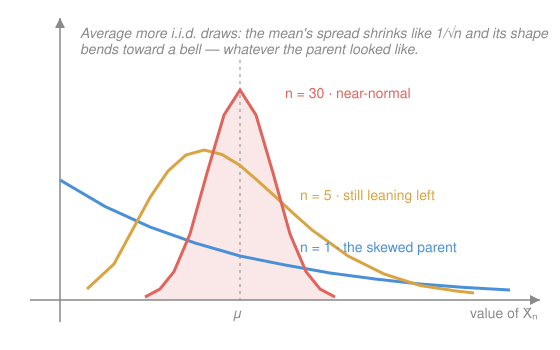

# Probability & Statistics · Lesson 3.3: The Central Limit Theorem

> ⏱ ~15 min · Module 3: Dependence and the limit theorems · Builds on: [3.2 Sums of random variables and the Law of Large Numbers](03-02-sums-and-law-of-large-numbers.md), [2.3 The continuous family](02-03-continuous-distributions.md) · Unlocks: Module 4 (statistical inference)

## Why this matters

Why is the bell curve *everywhere*? Heights, measurement errors, poll margins, the total of a night's dice, the noise on a sensor — none of these are "born" normal, yet they all end up normal-shaped. The **Central Limit Theorem** is the reason: whenever an outcome is a sum of many independent small contributions, the sum forgets what its pieces looked like and settles into a single universal shape. That fact is what turns Module 4's entire enterprise — estimation, confidence intervals, hypothesis tests — from wishful thinking into arithmetic, because it tells you *exactly* how a sample mean scatters around the truth.

## The idea

[3.2](03-02-sums-and-law-of-large-numbers.md) gave you half the story: the **Law of Large Numbers** says the sample mean $\bar X_n$ homes in on the true mean $\mu$ as you collect more data — the wobble dies. But it never said *how* the leftover wobble is shaped, only that it shrinks. The CLT is the other half: it looks at that shrinking wobble under a microscope and finds it is always the same picture — a **bell**.

Here's the intuition. A sum of many independent pieces can miss high or miss low in countless ways, but to land far from center *every* piece has to conspire in the same direction, and that's rare; to land near center the misses just have to roughly cancel, which happens in overwhelmingly many ways. Count the ways and the middle wins by a landslide that has a precise curved profile. It doesn't matter whether each piece was a coin flip, a die, a skewed income, or a lopsided wait time — pile up enough independent copies and the lopsidedness averages out into symmetry. The parent's shape is forgotten; only its mean and variance survive.

Two different statements, working together:

- **LLN:** the center of $\bar X_n$ locks onto $\mu$ (the wobble *vanishes*).
- **CLT:** magnify that vanishing wobble by $\sqrt n$ and it is *normal*, with spread $\sigma/\sqrt n$.

## The formal version

Let $X_1, X_2, \dots, X_n$ be **i.i.d.** (independent, identically distributed — see [3.2](03-02-sums-and-law-of-large-numbers.md)) with mean $\mu = \mathbb{E}[X_i]$ and **finite** variance $\sigma^2 = \operatorname{Var}(X_i)$. Write the sample mean $\bar X_n = \frac1n\sum_{i=1}^n X_i$ and the sum $S_n = \sum_{i=1}^n X_i$.

**Central Limit Theorem.** As $n \to \infty$,

$$Z_n = \frac{\bar X_n - \mu}{\sigma/\sqrt n} \;\longrightarrow\; N(0,1).$$

In words: subtract the mean and divide by the **standard error** $\sigma/\sqrt n$ (the standard deviation of $\bar X_n$, from [3.2](03-02-sums-and-law-of-large-numbers.md)) and, no matter what the $X_i$ looked like, the result becomes a standard normal — the bell with mean $0$ and variance $1$. Here $\Phi$ denotes its CDF, $\Phi(z) = \mathbb{P}(N(0,1) \le z)$.

**Two equivalent working forms** (just un-standardize):

$$\bar X_n \approx N\!\Big(\mu,\ \tfrac{\sigma^2}{n}\Big), \qquad S_n \approx N\big(n\mu,\ n\sigma^2\big).$$

In words: the sample mean is approximately normal, centered at the truth $\mu$, with spread $\sigma/\sqrt n$ that tightens as data pours in; the sum is normal centered at $n\mu$ with spread $\sigma\sqrt n$ that *grows* — but slower than $n$, which is why the *average* still tightens.

**How you use it.** To get a probability, standardize and read $\Phi$:

$$\mathbb{P}(\bar X_n \le x) \approx \Phi\!\left(\frac{x - \mu}{\sigma/\sqrt n}\right).$$

Standard values worth memorizing: $\Phi(1) \approx 0.841$, $\Phi(1.96) \approx 0.975$, $\Phi(2) \approx 0.977$ (and by symmetry $\Phi(-z) = 1 - \Phi(z)$).

**Continuity correction.** When you approximate a *discrete* integer-valued sum (a binomial count, a dice total) by a *continuous* normal, shift the boundary by $\pm\tfrac12$ to capture the whole integer's "block":

$$\mathbb{P}(S_n \ge k) \approx \mathbb{P}\big(N > k - \tfrac12\big), \qquad \mathbb{P}(S_n \le k) \approx \mathbb{P}\big(N < k + \tfrac12\big).$$

In words: an integer $k$ owns the strip from $k-\tfrac12$ to $k+\tfrac12$; include the half-unit that belongs to it or you'll systematically under-count the boundary.

## Picture

## Worked examples

**Example 1 (mechanical — standardize and read $\Phi$).** A process has mean $\mu = 100$ and standard deviation $\sigma = 20$. You average $n = 100$ independent measurements. What is $\mathbb{P}(\bar X_{100} > 102)$?

Standard error: $\sigma/\sqrt n = 20/\sqrt{100} = 20/10 = 2$. Standardize the boundary:

$$z = \frac{102 - 100}{2} = 1, \qquad \mathbb{P}(\bar X_{100} > 102) \approx 1 - \Phi(1) = 1 - 0.841 = 0.159.$$

So about a **16%** chance the average of 100 draws clears 102 — even though a single draw (spread 20) clears it far more easily. Averaging shrinks the spread from 20 to 2.

**Example 2 (why you'd care — the continuity correction earns its keep).** Flip a fair coin 100 times; let $X$ be the number of heads, so $X \sim \text{Binomial}(100, 0.5)$, a sum of 100 i.i.d. Bernoulli's. Its mean is $np = 50$ and variance $np(1-p) = 25$, so $\sigma = 5$. Estimate $\mathbb{P}(X \le 45)$.

*Naïve (no correction):* $z = \frac{45 - 50}{5} = -1$, giving $\Phi(-1) = 1 - 0.841 = 0.159$.

*With continuity correction:* the integer $45$ owns up to $45.5$, so

$$\mathbb{P}(X \le 45) \approx \Phi\!\left(\frac{45.5 - 50}{5}\right) = \Phi(-0.9) = 1 - 0.816 = 0.184.$$

The exact binomial answer is $0.184$ — the correction (0.184) nails it while the naïve version (0.159) is off by 14%. On a discrete count, always add the half. (Here $\Phi(0.9) \approx 0.816$.)

## Watch out

- You might think LLN and CLT say the same thing — they don't, and both hold at once. LLN says $\bar X_n \to \mu$ (the spread $\sigma/\sqrt n \to 0$). CLT says that vanishing spread, *rescaled by $\sqrt n$*, is normal. One kills the wobble; the other names its shape on the way out.
- You might think the CLT needs the data to be normal. The whole miracle is that it **doesn't** — any i.i.d. parent with finite variance works. The catch is *finite variance*: heavy-tailed parents (infinite $\sigma^2$) break it, and a very skewed parent just needs a larger $n$ before the bell is a good fit.
- You might think individual data points become normal. No — it's the **sum or the average** that goes normal. A histogram of your raw $X_i$ stays as skewed as ever; only $\bar X_n$ bells out.

## One-liner

> Pile up many independent finite-variance pieces and their sum forgets its origins and turns into a bell — the LLN shrinks the average's wobble like $1/\sqrt n$, the CLT reveals that wobble was normal all along.

## Problems

**P1 (🟢)** A quantity has mean $\mu = 50$ and standard deviation $\sigma = 12$. You take $n = 36$ i.i.d. observations. Using the CLT, find $\mathbb{P}(\bar X_{36} > 52)$.

**P2 (🟡)** Roll 100 fair six-sided dice and sum them. A single die has mean $3.5$ and variance $\tfrac{35}{12} \approx 2.917$. Approximate $\mathbb{P}(\text{sum} > 370)$ using the CLT. *(Hint: the sum has mean $350$; find its standard deviation, then standardize.)*

**P3 (🔴, optional)** Let $X \sim \text{Binomial}(100, 0.5)$ (so $\mu = 50$, $\sigma = 5$). Use the normal approximation *with the continuity correction* to estimate $\mathbb{P}(X \ge 60)$. Then explain what the **Law of Large Numbers** alone would have told you about the proportion $X/100$, and why the CLT says strictly more here.

Solutions

**P1** Standard error: $\sigma/\sqrt n = 12/\sqrt{36} = 12/6 = 2$. Standardize:

$$z = \frac{52 - 50}{2} = 1 \;\Rightarrow\; \mathbb{P}(\bar X_{36} > 52) \approx 1 - \Phi(1) = 1 - 0.841 = 0.159.$$

About a **15.9%** chance. Check: the boundary is exactly one standard error above the mean, and one-sided-above-$1\sigma$ is the classic $1 - 0.841 = 0.159$. ✓

**P2** The sum $S_{100}$ has mean $100 \times 3.5 = 350$ and variance $100 \times \tfrac{35}{12} = \tfrac{3500}{12} \approx 291.7$, so its standard deviation is $\sqrt{291.7} \approx 17.08$. Standardize:

$$z = \frac{370 - 350}{17.08} = \frac{20}{17.08} \approx 1.17, \qquad \mathbb{P}(S_{100} > 370) \approx 1 - \Phi(1.17) \approx 1 - 0.879 = 0.121.$$

So roughly a **12%** chance the total tops 370. Check: $370$ is a little over one standard deviation above $350$ (one sd would be $\approx 367$), so the tail probability should sit a bit below $\Phi(-1)$'s $0.159$ — and $0.121$ does. ✓ (Here $\Phi(1.17) \approx 0.879$. A continuity correction — using $370.5$ — would sharpen this slightly, but with $\sigma \approx 17$ the half-unit barely moves $z$.)

**P3** Continuity correction: the event $X \ge 60$ starts at the integer $60$, which owns down to $59.5$, so

$$\mathbb{P}(X \ge 60) \approx \mathbb{P}\big(N > 59.5\big) = 1 - \Phi\!\left(\frac{59.5 - 50}{5}\right) = 1 - \Phi(1.9) \approx 1 - 0.971 = 0.029.$$

So about **2.9%**. (Without the correction you'd use $z = \frac{60-50}{5} = 2$, giving $1 - \Phi(2) = 1 - 0.977 = 0.023$ — the exact binomial value is $\approx 0.028$, so the correction lands closer.)

*LLN vs. CLT here.* The LLN says only that the sample proportion $X/100 \to 0.5$ as $n$ grows, so a proportion as high as $0.60$ becomes increasingly unlikely — but LLN gives **no number**, just "rare in the limit." The CLT supplies the actual magnitude: *this* rare, about 2.9%, by pinning down the exact shape of the fluctuation around $0.5$. LLN says *whether*; CLT says *how much*. Check: $\Phi(1.9) \approx 0.971$, and $60$ is $2\sigma$ above the mean, so a tail probability just under $\Phi(-2) = 0.023$ is right. ✓

## Flashback

**From Lesson 3.2 (Sums and the Law of Large Numbers):** A fair coin is flipped $n$ times; $\bar X_n$ is the fraction of heads (each flip has mean $0.5$ and variance $0.25$). Using **Chebyshev's inequality** — the tool behind the weak LLN — find how large $n$ must be to guarantee $\mathbb{P}\big(|\bar X_n - 0.5| \ge 0.1\big) \le 0.05$.

Solution

The sample mean has variance $\operatorname{Var}(\bar X_n) = \sigma^2/n = 0.25/n$. Chebyshev's inequality bounds the tail by variance over the squared distance:

$$\mathbb{P}\big(|\bar X_n - 0.5| \ge 0.1\big) \le \frac{\operatorname{Var}(\bar X_n)}{(0.1)^2} = \frac{0.25/n}{0.01} = \frac{25}{n}.$$

Force this $\le 0.05$: $\ \frac{25}{n} \le 0.05 \iff n \ge \frac{25}{0.05} = 500.$ So $n = 500$ flips suffice.

Check: at $n = 500$, the bound is $25/500 = 0.05$ exactly. ✓ (This is the LLN in action — the guarantee tightens as $n$ grows. Chebyshev is deliberately loose; the CLT of *this* lesson would show $n$ far smaller than $500$ actually achieves the same tail, because it uses the bell's true thinness rather than a worst-case bound.)

## Connections

- **Backward:** this completes [3.2](03-02-sums-and-law-of-large-numbers.md) — the variance of a sum ($n\sigma^2$) and of a sample mean ($\sigma^2/n$) computed there are exactly the parameters the CLT plugs into $N(n\mu, n\sigma^2)$ and $N(\mu, \sigma^2/n)$. The normal itself, and standardizing to $z$-scores, is [2.3](02-03-continuous-distributions.md).
- **Forward:** all of Module 4 rides on this. [4.1](04-01-estimation-and-mle.md) calls $N(\mu, \sigma^2/n)$ the *sampling distribution* of the estimator; [4.2](04-02-confidence-intervals.md)'s margin of error is $1.96 \times \sigma/\sqrt n$ straight off the $\Phi(1.96) \approx 0.975$ line above; [4.3](04-03-hypothesis-testing.md)'s test statistic *is* $Z_n$.
- **Sideways (physics/econ):** the CLT is why measurement noise, thermal fluctuations, and diffusion are Gaussian — each is a sum of many tiny independent kicks — and why a diversified portfolio's return concentrates: independent small bets aggregate into a predictable bell whose spread falls like $1/\sqrt n$.
