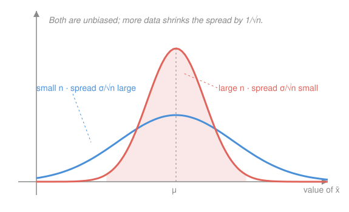

# Probability & Statistics · Lesson 4.1: Estimation, MLE, and sampling distributions

> ⏱ ~15 min · Module 4: Statistical inference · Builds on: [3.3 The Central Limit Theorem](03-03-central-limit-theorem.md), [2.1 Expectation, variance, and moments](02-01-expectation-variance-moments.md) · Unlocks: 4.2 (confidence intervals)

## Why this matters

Everything so far assumed you *knew* the distribution — a coin's $p$, an exponential's $\lambda$. Reality hands you the opposite: a fistful of data and a parameter you must guess. This lesson is the pivot from probability to statistics. Its one deep idea — that your estimate is itself a random quantity with a distribution — is what every confidence interval (4.2) and p-value (4.3) is secretly reasoning about. Get this and inference stops being ritual.

## The idea

You want a number $\theta$ — say the true mean weight of a widget. You can't measure all widgets, so you weigh $n$ of them and compute the average. That average is your **estimate**. But here's the thing: weigh a *different* $n$ widgets and you get a *different* average. The recipe is fixed; the input is random; so the output is random too.

So an estimator isn't a number — it's a **random variable with its own distribution**. Ask two questions of it. First, is it *aimed right* — does it center on the true $\theta$, or is it biased high or low? Second, how *tight* is it — a lot of scatter means one sample could land far from the truth. A good estimator is centered on $\theta$ and narrow, and gets narrower as you collect more data.

That leaves one question: given the data, which $\theta$ should you actually pick? **Maximum likelihood** answers with a slogan — pick the $\theta$ under which the data you *actually saw* were most probable. If you flipped 7 heads in 10 tosses, the coin that makes "7 heads" likeliest is $p = 0.7$. MLE just makes that instinct into calculus.

## The formal version

**Estimator.** A **statistic** is any function of the sample $X_1,\dots,X_n$ (the $n$ data values). An **estimator** $\hat\theta$ is a statistic used to guess a parameter $\theta$. *In words: a recipe you run on data.* Because the $X_i$ are random, $\hat\theta$ is a random variable.

**Sample mean and sample variance.** For an i.i.d. sample with true mean $\mu$ and variance $\sigma^2$,

$$\bar X = \frac{1}{n}\sum_{i=1}^n X_i, \qquad s^2 = \frac{1}{n-1}\sum_{i=1}^n (X_i - \bar X)^2.$$

*In words: $\bar X$ is the average; $s^2$ is the average-ish squared spread around it.* The divisor is $n-1$, not $n$: you already spent one "degree of freedom" estimating the center with $\bar X$, so the deviations from $\bar X$ are slightly too small on average, and dividing by $n-1$ corrects exactly for it.

**Bias.** The bias of $\hat\theta$ is $\mathbb{E}[\hat\theta] - \theta$. An estimator is **unbiased** if this is $0$. *In words: on average across all possible samples, does it hit the target?* Both $\bar X$ (since $\mathbb{E}[\bar X] = \mu$) and the $n-1$ version of $s^2$ are unbiased. An estimator is **consistent** if $\hat\theta \to \theta$ as $n \to \infty$ — with enough data it homes in.

**Sampling distribution and standard error.** The distribution of $\hat\theta$ over all possible samples is its **sampling distribution**; its standard deviation is the **standard error** (SE). For the sample mean, $\mathbb{E}[\bar X] = \mu$ and $\operatorname{Var}(\bar X) = \sigma^2/n$, so

$$\text{SE}(\bar X) = \frac{\sigma}{\sqrt n}, \qquad \text{and by the CLT} \quad \bar X \;\approx\; N\!\left(\mu,\ \frac{\sigma^2}{n}\right).$$

*In words: the mean of a sample is itself bell-shaped, centered at the truth, with spread shrinking like $1/\sqrt n$.* This is the engine of [3.3](03-03-central-limit-theorem.md), now doing statistical work. In practice $\sigma$ is unknown, so you plug in $s$ to get the estimated SE $= s/\sqrt n$.

**Maximum likelihood.** Given data $x_1,\dots,x_n$ i.i.d. from a density (or pmf) $f(x;\theta)$, the **likelihood** treats the data as fixed and $\theta$ as the variable:

$$L(\theta) = \prod_{i=1}^n f(x_i;\theta).$$

The **maximum likelihood estimator** is $\hat\theta = \arg\max_\theta L(\theta)$. Products are painful to differentiate, so maximize the **log-likelihood** $\ell(\theta) = \log L(\theta) = \sum_{i=1}^n \log f(x_i;\theta)$ instead — $\log$ is increasing, so it peaks at the same $\theta$, and it turns the product into a sum. Then it's pure [calculus optimization](../../calc-refresher/lessons/01-04-optimization.md): solve $\ell'(\theta) = 0$ and confirm it's a max ($\ell''(\theta) < 0$, or an endpoint check).

## Picture

## Worked examples

**Example 1 (the sampling distribution is real — watch it move).** Suppose widget weights have $\mu = 100$ g and $\sigma = 12$ g. With $n = 9$, $\bar X$ scatters around $100$ with SE $= 12/\sqrt 9 = 4$ g. Bump to $n = 144$ and SE $= 12/\sqrt{144} = 1$ g — a quarter the spread, because $\sqrt{144}/\sqrt 9 = 4$. Nothing about a *single* widget changed; the **average** just became a far more reliable pointer at $\mu$. That $1/\sqrt n$ shrink is the whole reason more data helps — and why halving the SE costs *four times* the data.

**Example 2 (MLE for a coin, the archetype).** You see $k$ successes in $n$ independent Bernoulli($p$) trials. Each trial has pmf $f(x;p) = p^x(1-p)^{1-x}$, so

$$\ell(p) = \sum_i \big[x_i \log p + (1-x_i)\log(1-p)\big] = k\log p + (n-k)\log(1-p).$$

Differentiate and set to zero:

$$\ell'(p) = \frac{k}{p} - \frac{n-k}{1-p} = 0 \;\Longrightarrow\; k(1-p) = (n-k)p \;\Longrightarrow\; k = np \;\Longrightarrow\; \hat p = \frac{k}{n}.$$

The MLE is the sample proportion — exactly the naive guess, now *derived*. And $\ell''(p) = -k/p^2 - (n-k)/(1-p)^2 < 0$, so it's genuinely a maximum, not a min or saddle.

## Watch out

- You might think an unbiased estimator is guaranteed close to $\theta$. Unbiased is only about the *center* of the sampling distribution; a wildly scattered estimator can be unbiased and still useless. Low bias **and** small SE together make it good.
- You might think the SE is the standard deviation of the data. No — it's the standard deviation of the *estimator*. Data spread is $\sigma$; the mean's spread is $\sigma/\sqrt n$, smaller by $\sqrt n$. Confusing them is the most common inference error.
- You might think dividing $s^2$ by $n$ is fine. It systematically **underestimates** $\sigma^2$, because deviations are measured from $\bar X$ (which sits inside the data) rather than the true $\mu$. The $n-1$ is the exact fix.

## One-liner

> An estimator is a recipe run on random data, so it has its own distribution — MLE picks the parameter that makes your data likeliest, and the CLT tells you how far the estimate can stray.

## Problems

**P1 (🟢)** A sample of widget weights (in grams) is $\{4, 8, 6, 10, 12\}$. Compute the sample mean $\bar X$, the sample variance $s^2$, and the estimated standard error of the mean.

**P2 (🟡)** A basketball player makes $k = 18$ of $n = 25$ free throws. Treating makes as i.i.d. Bernoulli($p$), derive the MLE $\hat p$ from the log-likelihood (don't just quote $k/n$ — show the maximization), and confirm it's a maximum.

**P3 (🔴)** Interarrival times at a help desk are i.i.d. Exponential($\lambda$), density $f(x;\lambda) = \lambda e^{-\lambda x}$ for $x \ge 0$, where $\lambda$ is the arrival *rate*. From a sample $x_1,\dots,x_n$, derive the MLE $\hat\lambda$. Interpret the result in one sentence.

Solutions

**P1** Mean: $\bar X = \frac{4+8+6+10+12}{5} = \frac{40}{5} = 8$ g.

Deviations from $8$: $-4, 0, -2, 2, 4$; squared: $16, 0, 4, 4, 16$, summing to $40$. With $n-1 = 4$:

$$s^2 = \frac{40}{4} = 10 \ \text{g}^2, \qquad s = \sqrt{10} \approx 3.16 \ \text{g}.$$

Estimated standard error of the mean:

$$\text{SE} = \frac{s}{\sqrt n} = \frac{\sqrt{10}}{\sqrt 5} = \sqrt{2} \approx 1.41 \ \text{g}.$$

Check: the SE ($\approx 1.41$) is smaller than the data spread $s$ ($\approx 3.16$) by exactly $\sqrt 5$ — the mean is tighter than the raw data, as it must be. ✓

**P2** Each free throw has pmf $p^{x}(1-p)^{1-x}$, so with $k$ makes in $n$ attempts the log-likelihood is

$$\ell(p) = k\log p + (n-k)\log(1-p).$$

Set the derivative to zero:

$$\ell'(p) = \frac{k}{p} - \frac{n-k}{1-p} = 0 \;\Longrightarrow\; k(1-p) = (n-k)p \;\Longrightarrow\; k = np \;\Longrightarrow\; \hat p = \frac{k}{n} = \frac{18}{25} = 0.72.$$

It's a maximum because $\ell''(p) = -\dfrac{k}{p^2} - \dfrac{n-k}{(1-p)^2} < 0$ everywhere in $(0,1)$ (the log-likelihood is concave).

Check: plug $p = 0.72$ into $\ell'$: $\frac{18}{0.72} - \frac{7}{0.28} = 25 - 25 = 0$. ✓

**P3** With $f(x;\lambda) = \lambda e^{-\lambda x}$, the likelihood and log-likelihood are

$$L(\lambda) = \prod_{i=1}^n \lambda e^{-\lambda x_i} = \lambda^n e^{-\lambda \sum_i x_i}, \qquad \ell(\lambda) = n\log\lambda - \lambda \sum_{i=1}^n x_i.$$

Differentiate in $\lambda$ and set to zero:

$$\ell'(\lambda) = \frac{n}{\lambda} - \sum_{i=1}^n x_i = 0 \;\Longrightarrow\; \lambda = \frac{n}{\sum_i x_i} = \frac{1}{\bar X}.$$

So $\hat\lambda = 1/\bar X$. It's a maximum since $\ell''(\lambda) = -n/\lambda^2 < 0$. Interpretation: the estimated rate is one-over-the-average-wait — if help-desk contacts arrive every $\bar X = 5$ minutes on average, the MLE rate is $\hat\lambda = 0.2$ per minute, matching the exponential's mean $\mathbb{E}[X] = 1/\lambda$.

Check: at $\lambda = n/\sum x_i$, $\ell'(\lambda) = \frac{n}{n/\sum x_i} - \sum x_i = \sum x_i - \sum x_i = 0$. ✓

## Flashback

**From Lesson 3.3 (The Central Limit Theorem):** A bagging machine dispenses coffee with mean $\mu = 50$ g and standard deviation $\sigma = 4$ g per bag. A quality inspector averages a sample of $n = 64$ bags. Using the sampling distribution of $\bar X$, approximate $P(\bar X > 50.5)$. (Take $P(Z > 1) \approx 0.159$.)

Solution

By the CLT, $\bar X \approx N(\mu,\ \sigma^2/n)$ with SE $= \sigma/\sqrt n = 4/\sqrt{64} = 4/8 = 0.5$ g. Standardize:

$$z = \frac{50.5 - 50}{0.5} = 1 \;\Longrightarrow\; P(\bar X > 50.5) \approx P(Z > 1) \approx 0.159.$$

So about a 16% chance the sample average exceeds $50.5$ g — even though individual bags scatter with $\sigma = 4$, the *average* of $64$ scatters with only $0.5$.

Check: the threshold sits exactly one SE above $\mu$, and the one-sided tail beyond $+1\sigma$ of a normal is $\approx 0.159$. ✓

## Connections

- **Backward:** the SE $= \sigma/\sqrt n$ and the normal shape of $\bar X$ are [3.3](03-03-central-limit-theorem.md)'s CLT and [2.1](02-01-expectation-variance-moments.md)'s $\operatorname{Var}(\bar X) = \sigma^2/n$, repackaged as tools for guessing parameters.
- **Forward:** [4.2](04-02-confidence-intervals.md) turns the sampling distribution into an interval — "$\hat\theta \pm$ a few SEs" — and 4.3 turns it into a hypothesis test.
- **Sideways (calculus):** MLE is nothing but [optimization](../../calc-refresher/lessons/01-04-optimization.md) — set the (log-likelihood's) derivative to zero and check the second-order condition. The same machinery that maximizes profit or minimizes energy maximizes likelihood.
