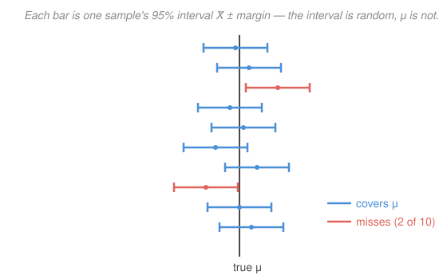

# Probability & Statistics · Lesson 4.2: Confidence intervals

> ⏱ ~15 min · Module 4: Statistical inference · Builds on: [4.1 Estimation, MLE, and sampling distributions](04-01-estimation-and-mle.md), [3.3 The Central Limit Theorem](03-03-central-limit-theorem.md) · Unlocks: 4.3 (hypothesis testing)

## Why this matters

A point estimate like $\bar X = 50$ is a single number with no honesty attached — it hides how much the estimate would jump around if you drew a fresh sample. Every empirical claim you'll ever read ("the mean is $50 \pm 1.6$," a poll's "margin of error $\pm 3$ points," a physics measurement's error bar) is really a **confidence interval**: an estimate *plus a width* that reports its own uncertainty. This lesson turns [4.1](04-01-estimation-and-mle.md)'s sampling distribution into that width — and drills the one interpretation almost everyone gets wrong.

## The idea

From [4.1](04-01-estimation-and-mle.md) you know the sample mean $\bar X$ is a random variable, and from [3.3](03-03-central-limit-theorem.md) you know its distribution: for large $n$, $\bar X$ is approximately normal, centered on the true mean $\mu$, with standard deviation $\sigma/\sqrt n$ (the **standard error**). Normality hands you a fact for free: $\bar X$ lands within about $1.96$ standard errors of $\mu$ **95% of the time**.

Now flip it around. "$\bar X$ is within $1.96$ standard errors of $\mu$" and "$\mu$ is within $1.96$ standard errors of $\bar X$" are the *same statement* — distance is symmetric. So if you draw a bracket of half-width $1.96\,\sigma/\sqrt n$ around wherever $\bar X$ happened to land, that bracket **catches $\mu$ 95% of the time**. That bracket is the confidence interval. It's not magic and it's not new probability — it's the CLT read backwards.

The subtlety lives entirely in *what's random*. The true $\mu$ is a fixed, unknown constant — it does not wiggle. The bracket wiggles, because it's built from the random $\bar X$. So "95%" describes the **procedure** across many hypothetical samples, not a probability about *this one* interval, which either caught $\mu$ or didn't. That distinction is the whole lesson.

## The formal version

**Confidence interval for a mean, $\sigma$ known.** Draw an i.i.d. sample of size $n$ with sample mean $\bar X$, from a population with known standard deviation $\sigma$ (and either a normal population or $n$ large enough for the CLT). A **$(1-\alpha)$ confidence interval** for the mean $\mu$ is

$$\bar X \pm z_{\alpha/2}\,\frac{\sigma}{\sqrt n}.$$

*In words:* take the estimate $\bar X$ and reach out a fixed number of standard errors on each side. The symbols: $\alpha$ is the **error rate** you allow (e.g. $0.05$), so $1-\alpha$ is the **confidence level** (e.g. $95\%$); $z_{\alpha/2}$ is the **critical value** — the point on the standard normal with area $\alpha/2$ in the upper tail, so that the middle $1-\alpha$ of the normal sits between $-z_{\alpha/2}$ and $+z_{\alpha/2}$; and $\sigma/\sqrt n$ is the standard error of $\bar X$ from [3.3](03-03-central-limit-theorem.md). The half-width

$$\text{margin of error} = z_{\alpha/2}\,\frac{\sigma}{\sqrt n}$$

is what people quote as "$\pm$ something."

**The critical values worth memorizing.** For the standard normal:

| Confidence $1-\alpha$ | $\alpha/2$ | $z_{\alpha/2}$ |
|---|---|---|
| 90% | 0.05 | 1.645 |
| 95% | 0.025 | 1.96 |
| 99% | 0.005 | 2.576 |

*In words:* more confidence ⟹ a bigger multiplier ⟹ a wider interval. Certainty is not free; you buy it with width.

**When $\sigma$ is unknown — the $t$-distribution.** Usually you don't know $\sigma$; you estimate it from the sample by the sample standard deviation $s$ (from [4.1](04-01-estimation-and-mle.md)). Plugging in $s$ adds a *second* source of randomness — the width is now estimated too — so the standardized quantity is no longer normal but **Student's $t$ with $n-1$ degrees of freedom**:

$$\bar X \pm t_{n-1,\,\alpha/2}\,\frac{s}{\sqrt n}.$$

*In words:* same recipe, but with $s$ in place of $\sigma$ and a $t$ critical value in place of $z$. The $t$-distribution is bell-shaped but **heavier-tailed** than the normal, so $t_{n-1,\alpha/2} > z_{\alpha/2}$ — a wider interval, paying for not knowing $\sigma$. As $n$ grows the extra uncertainty vanishes and $t_{n-1} \to$ normal (by $n\approx 30$ they nearly coincide). For small $n$ the gap is real: at $n=16$, the 95% multiplier is $t_{15,\,0.025} = 2.131$, not $1.96$.

**The interpretation — read this twice.** The confidence level is a statement about the **procedure**:

> Over many independent samples, about $(1-\alpha)$ of the intervals constructed this way contain the true $\mu$.

It is **not** "there is a 95% probability that $\mu$ lies in *this* interval." Once the sample is drawn, $\mu$ (fixed) either is or isn't inside the (now fixed) interval — the probability is $0$ or $1$, we just don't know which. The randomness was in *which interval you got*, and that's already spent.

## Picture

The vertical line is the true $\mu$ — fixed, it never moves. Each horizontal bar is one sample's 95% interval, centered on that sample's $\bar X$. The bars slide left and right from sample to sample because $\bar X$ is random; $\mu$ does not. Across many samples about 95% of the bars cross the line (blue) and about 5% miss entirely (red). "95% confidence" *is* that hit rate of the procedure — not a claim about any single bar.

## Worked examples

**Example 1 (mechanical — build one interval).** A sample of $n=100$ has $\bar X = 50$, and the population standard deviation is known to be $\sigma = 8$. For a 95% interval, the standard error is $\sigma/\sqrt n = 8/\sqrt{100} = 8/10 = 0.8$, and $z_{0.025} = 1.96$, so

$$\text{margin} = 1.96 \times 0.8 = 1.568, \qquad 50 \pm 1.568 = (48.43,\ 51.57).$$

*Reading it correctly:* the procedure that produced $(48.43, 51.57)$ catches the true $\mu$ 95% of the time. We do **not** say "$\mu$ is in here with probability 0.95."

**Example 2 (why you'd care — how confidence and sample size trade against width).** Same data, but demand 99% confidence. Only the multiplier changes, to $z_{0.005} = 2.576$:

$$\text{margin} = 2.576 \times 0.8 = 2.061, \qquad 50 \pm 2.061 = (47.94,\ 52.06).$$

Wider than the 95% interval — exactly the price of more confidence. Now run it the other way: *how large must $n$ be* to pin the 95% margin down to $\le 1$? Set the margin below the target and solve for $n$:

$$1.96\,\frac{8}{\sqrt n} \le 1 \;\Longrightarrow\; \sqrt n \ge 1.96 \times 8 = 15.68 \;\Longrightarrow\; n \ge 245.9,$$

so $n = 246$ (always round **up** — rounding down would break the guarantee). Because the margin scales like $1/\sqrt n$, buying half the width costs four times the data. This is the same $1/\sqrt n$ shrinkage that made the sample mean converge in [3.3](03-03-central-limit-theorem.md), now sizing a study.

## Watch out

- You might think "95% probability $\mu$ is in this interval." No — $\mu$ is a fixed constant and this interval is now fixed too, so it's already in or out. The 95% belongs to the *method* over repeated sampling, not to the one interval in front of you.
- You might reach for $z = 1.96$ whenever you want 95%. Only when $\sigma$ is **known**. If you estimated the spread with $s$, use $t_{n-1,\,\alpha/2}$ — larger, so a wider (honest) interval. Ignoring this makes small-sample intervals too narrow.
- You might think a wider interval is "worse." A 99% interval is wider *because* it's more cautious; width and confidence move together. Reporting "$\pm$" without its confidence level, or its $n$, is meaningless — the same number can be a 90% or a 99% margin.

## One-liner

> A confidence interval is the CLT read backwards — $\bar X \pm z_{\alpha/2}\,\sigma/\sqrt n$ — and its "95%" describes how often the *procedure* catches the fixed $\mu$, never the probability for the one interval you hold.

## Problems

**P1 (🟢)** A sample of $n = 100$ observations gives $\bar X = 50$ with known population standard deviation $\sigma = 8$. Construct the 95% confidence interval for $\mu$.

**P2 (🟡)** Using the same data as P1 ($n=100$, $\bar X = 50$, $\sigma = 8$): (a) build the **99%** interval and confirm it is wider than the 95% one. (b) What sample size $n$ would be needed so that the **95%** margin of error is at most $1$?

**P3 (🔴)** A materials lab measures the tensile strength of $n = 16$ specimens and finds $\bar X = 112$ MPa with sample standard deviation $s = 10$ MPa; $\sigma$ is **unknown**. (a) Build a 95% confidence interval, stating the critical value you use. (b) State in one sentence the correct interpretation, and one sentence saying what it does **not** mean.

Solutions

**P1** Standard error $= \sigma/\sqrt n = 8/\sqrt{100} = 0.8$. With $z_{0.025} = 1.96$, the margin is $1.96 \times 0.8 = 1.568$, so the interval is
$$50 \pm 1.568 = (48.43,\ 51.57).$$
Check: half-width $1.568 > 0$ and the interval is symmetric about $\bar X = 50$. ✓

**P2** (a) Only the multiplier changes to $z_{0.005} = 2.576$: margin $= 2.576 \times 0.8 = 2.061$, giving
$$50 \pm 2.061 = (47.94,\ 52.06).$$
Its half-width $2.061 > 1.568$, so the 99% interval is indeed wider than the 95% one — more confidence, more width. ✓
(b) Require $1.96 \times \dfrac{8}{\sqrt n} \le 1$. Then $\sqrt n \ge 1.96 \times 8 = 15.68$, so $n \ge 15.68^2 = 245.86$; round **up** to $n = 246$.
Check: at $n = 246$, margin $= 1.96 \times 8/\sqrt{246} = 15.68/15.684 \approx 0.9997 \le 1$; at $n = 245$ it would be $\approx 1.0018 > 1$, so $246$ is the smallest that works. ✓

**P3** (a) With $\sigma$ unknown we use the $t$-distribution with $n - 1 = 15$ degrees of freedom. The critical value is $t_{15,\,0.025} = 2.131$. Standard error $= s/\sqrt n = 10/\sqrt{16} = 10/4 = 2.5$, so the margin is
$$2.131 \times 2.5 = 5.328, \qquad 112 \pm 5.328 = (106.67,\ 117.33).$$
(Note $t_{15,0.025} = 2.131 > 1.96$: the interval is wider than a $z$-interval would be, paying for not knowing $\sigma$.)
(b) **Correct:** if we repeated this sampling-and-interval procedure many times, about 95% of the intervals produced would contain the true mean tensile strength $\mu$. **Not:** it does *not* mean there is a 95% probability that $\mu$ lies in the specific interval $(106.67, 117.33)$ — $\mu$ is a fixed constant, so it is either in this interval or not.
Check: symmetric about $\bar X = 112$, and using $t_{15} > z$ correctly widens the interval for the unknown-$\sigma$ case. ✓

## Flashback

**From Lesson 4.1 (Estimation, MLE, and sampling distributions):** A lab takes $n = 25$ independent voltage readings; the population standard deviation is known to be $\sigma = 2$ volts, and the sample mean is $\bar X = 12.4$ volts. (a) Give the point estimate of the mean voltage $\mu$, and say whether $\bar X$ is an unbiased estimator. (b) Compute the standard error of $\bar X$. (c) By what factor must $n$ increase to halve that standard error?

Solution

(a) The point estimate is $\bar X = 12.4$ volts. The sample mean is **unbiased**: $\mathbb{E}[\bar X] = \mu$ for any $n$, so on average it hits the target (from [4.1](04-01-estimation-and-mle.md)).
(b) Standard error $= \sigma/\sqrt n = 2/\sqrt{25} = 2/5 = 0.4$ volts.
(c) The standard error scales like $\sigma/\sqrt n \propto 1/\sqrt n$. To halve it, $\sqrt n$ must double, so $n$ must increase by a factor of $\mathbf{4}$ (e.g. $25 \to 100$).
Check: at $n = 100$, SE $= 2/\sqrt{100} = 0.2 = 0.4/2$. ✓

## Connections

- **Backward:** the interval is [3.3](03-03-central-limit-theorem.md)'s sampling distribution of $\bar X$ read backwards, using the standard error $\sigma/\sqrt n$ and the estimator $\bar X$ from [4.1](04-01-estimation-and-mle.md). The $1/\sqrt n$ width-shrinkage is the same law that made the sample mean converge in [3.2](03-02-sums-and-law-of-large-numbers.md).
- **Forward:** [4.3](04-03-hypothesis-testing.md) is this same machinery in test form — a value falls *outside* the confidence interval exactly when a two-sided test rejects it at level $\alpha$, and the $t$-statistic here becomes the test statistic there.
- **Sideways (physics/econ):** the margin of error is the **error bar** on every measured constant in physics and the **"$\pm$ margin"** on every poll and regression coefficient in econometrics — same object, same $1/\sqrt n$ shrinkage, same repeated-sampling meaning that is so often misquoted.
