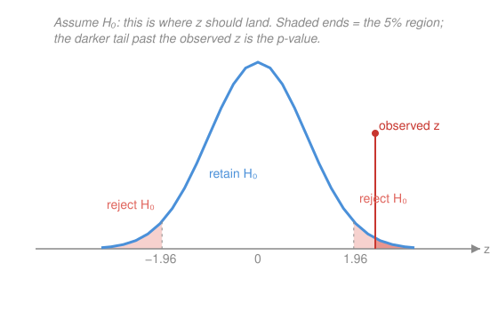

# Probability & Statistics · Lesson 4.3: Hypothesis testing

> ⏱ ~15 min · Module 4: Statistical inference · Builds on: [4.2 Confidence intervals](04-02-confidence-intervals.md), [3.3 The Central Limit Theorem](03-03-central-limit-theorem.md) · Unlocks: [4.4 Sampling distributions](04-04-sampling-distributions-t-and-chi-square.md), game-theory, econometrics, the sciences

## Why this matters

Almost every empirical claim you'll ever read — a drug works, a coin is loaded, a policy moved the needle, a new algorithm is faster — is settled by a hypothesis test. It's the machinery that converts "the data *look* different" into a defensible "the data *are* different, and here's how surprised I'd be if they weren't." It is also the single most abused idea in all of statistics: the p-value is misquoted in press releases, misread by scientists, and mis-taught constantly. This lesson gives you the test *and* the honest reading — the second matters more than the first.

## The idea

You want to know whether a coin is fair. You can't prove fairness directly, so you do something slyer: you **assume** it's fair, flip it a lot, and ask — *if it really were fair, how weird would this many heads be?* If 60 heads in 100 flips would happen all the time under fairness, you shrug. If 90 heads would almost never happen under fairness, you stop believing the coin is fair. That's the whole move: **assume the boring explanation, then measure how badly the data embarrass it.**

The boring explanation is the **null hypothesis** $H_0$ — "no effect," "nothing's going on," the coin is fair, the drug does nothing. The rival is the **alternative** $H_1$. You never *prove* $H_0$; you only ever fail to embarrass it. To measure embarrassment you compute a **test statistic** — a single number saying how many standard errors the data sit from what $H_0$ predicts — and then a **p-value**: the probability, *if $H_0$ were true*, of a statistic at least this extreme. Small p means "data this surprising almost never happen under $H_0$" — so you disbelieve $H_0$. Large p means "this is exactly the kind of wiggle $H_0$ predicts" — so you keep it.

The subtle part, and the part people get wrong: a small p-value is evidence *against* $H_0$, but it is **not** the probability that $H_0$ is true, and a large p-value does **not** prove $H_0$. "Fail to reject" means "not enough evidence to convict," never "proven innocent."

## The formal version

**The hypotheses.** We test a claim about a parameter — here a population mean $\mu$. The **null** fixes it at a specific value $\mu_0$; the **alternative** is what you'd believe instead:
$$H_0:\ \mu = \mu_0 \qquad\text{vs.}\qquad H_1:\ \mu \neq \mu_0 \ \ (\text{two-sided}) \quad\text{or}\quad H_1:\ \mu > \mu_0 \ \ (\text{one-sided}).$$
*In words:* $H_0$ is the pin-it-down claim you'll try to knock over; $H_1$ says which directions of surprise count.

**The test statistic.** With a sample of size $n$, sample mean $\bar{X}$, and known population standard deviation $\sigma$, the **z-statistic** is
$$z = \frac{\bar{X} - \mu_0}{\sigma/\sqrt{n}}.$$
*In words:* how many standard errors the observed mean lands from the null's claim. The denominator $\sigma/\sqrt{n}$ is the standard error of $\bar{X}$; by the [CLT (3.3)](03-03-central-limit-theorem.md), *if $H_0$ holds*, $z$ is approximately standard normal, $N(0,1)$. (With $\sigma$ unknown and $n$ small, swap in the sample SD and use $t$ instead of $z$, exactly as in [4.2](04-02-confidence-intervals.md) — same logic, fatter tails.)

**The p-value.** Let $\Phi$ be the standard-normal CDF, $\Phi(z)=\mathbb{P}(Z\le z)$. For an observed value $z$,
$$\text{two-sided: } p = 2\big(1-\Phi(|z|)\big), \qquad \text{one-sided } (H_1:\mu>\mu_0): \ p = 1-\Phi(z).$$
*In words:* the total tail probability at least as extreme as what you saw — both tails when either direction would surprise you, one tail when only one does.

**Significance and the rejection region.** Fix a threshold $\alpha$ (conventionally $0.05$) *before* looking. **Reject $H_0$ when $p < \alpha$.** Equivalently, reject when $z$ lands past a critical value:
$$\text{two-sided, }\alpha=0.05:\ |z| > 1.96, \qquad \text{one-sided, }\alpha=0.05:\ z > 1.645.$$
*In words:* $\alpha$ is the false-alarm rate you're willing to tolerate; the rejection region is the set of statistics too weird to keep believing $H_0$.

**Duality with the confidence interval ([4.2](04-02-confidence-intervals.md)).** A test and a CI are two readings of the *same* sampling distribution:
$$\text{reject } H_0:\mu=\mu_0 \text{ at level } \alpha \iff \mu_0 \text{ lies outside the } (1-\alpha)\ \text{CI for } \mu.$$
*In words:* the two-sided 95% CI is exactly the set of null values you would *not* reject at 5%. Build the interval, and you've run every test at once.

**Two ways to be wrong.** The truth is binary and so is your verdict, giving two errors:

| | $H_0$ true | $H_0$ false |
|---|---|---|
| **reject $H_0$** | Type I error (rate $\alpha$) | correct |
| **retain $H_0$** | correct | Type II error (rate $\beta$) |

The **power** of the test is $1-\beta$: the probability of correctly rejecting a *false* $H_0$. Lowering $\alpha$ guards against false alarms but raises $\beta$ (misses); the honest fix for both is a bigger $n$, which shrinks $\sigma/\sqrt{n}$ and sharpens the whole picture.

## Picture

Under $H_0$, the z-statistic should land somewhere under the blue bell, almost always in the fat middle. The pale red ends past $\pm 1.96$ are the two-sided 5% rejection region. The observed $z$ falls out in the right tail, and the darker area beyond it is the p-value — the chance of a statistic this extreme *if $H_0$ were true*. Small tail, surprising data, reject.

## Worked examples

**Example 1 (mechanical — a two-sided z-test).** A machine should fill bottles to $\mu_0 = 500$ ml. A sample of $n=40$ gives $\bar{X} = 496$ ml; the process SD is known, $\sigma = 12$ ml. Test $H_0:\mu=500$ vs. $H_1:\mu\neq500$ at $\alpha=0.05$.

Standard error: $\sigma/\sqrt{n} = 12/\sqrt{40} = 1.897$. Statistic:
$$z = \frac{496 - 500}{1.897} = \frac{-4}{1.897} = -2.11.$$
Since $|z| = 2.11 > 1.96$, reject. The p-value: $p = 2(1-\Phi(2.11)) = 2(1-0.9826) = 0.035 < 0.05$. ✓ same verdict. The fill is significantly off target — a discrepancy this big would arise under a correctly-calibrated machine only about 3.5% of the time.

**Example 2 (why you'd care — reading it against a CI).** Same data, but a colleague hands you the 95% confidence interval instead: $\bar{X} \pm 1.96\,(\sigma/\sqrt{n}) = 496 \pm 1.96(1.897) = 496 \pm 3.72 = (492.3,\ 499.7)$. Notice $500$ is **not** inside. That single fact *is* the test: because the null value $500$ falls outside the 95% CI, you reject $H_0:\mu=500$ at 5% — no z-computation required. The interval and the test are the same sampling distribution read two ways, exactly the duality above. This is why a paper can report a CI and let you run any test yourself.

## Watch out

- You might think a p-value is $\mathbb{P}(H_0\text{ true})$. It is not — it's $\mathbb{P}(\text{data this extreme}\mid H_0\text{ true})$, a probability computed *assuming* $H_0$. It can't tell you the probability of a hypothesis; it only tells you how compatible the data are with one.
- You might think "$p > 0.05$, so $H_0$ is true." Failing to reject is not proof — it's "insufficient evidence," which also happens when $n$ is just too small to see a real effect. Absence of evidence isn't evidence of absence.
- You might think "$p = 0.049$ is a discovery and $p = 0.051$ is nothing." The threshold is a convention, not a law of nature; treat borderline p-values as borderline. And if you run 20 tests, expect one false "significance" by chance alone ($20 \times 0.05 = 1$) — significance found by fishing isn't significance.

## One-liner

> Assume $H_0$, compute how many standard errors the data sit away, and reject only if a result that extreme would be too rare to be a fluke — but never mistake a small p for "$H_0$ is false" or a large p for "$H_0$ is true."

## Problems

**P1 (🟢)** Test $H_0:\mu = 100$ vs. $H_1:\mu \neq 100$ with $\bar{X} = 103$, $\sigma = 10$, $n = 25$. (a) Compute $z$. (b) Give the two-sided p-value (state the $\Phi$ value you use). (c) Decide at $\alpha = 0.05$. Use $\Phi(1.5) = 0.9332$.

**P2 (🟡)** A tutoring program claims to raise mean test scores above the baseline $\mu_0 = 50$. A sample of $n = 64$ students scores $\bar{X} = 52.4$ with known $\sigma = 8$. (a) Run the one-sided test $H_0:\mu=50$ vs. $H_1:\mu>50$ at $\alpha=0.05$ and interpret. (b) Build the two-sided 95% CI for $\mu$ and check it agrees with a two-sided test at 5%. Use $\Phi(2.4) = 0.9918$.

**P3 (🔴, optional — power)** For the P1 setup ($\mu_0 = 100$, $\sigma = 10$, $n = 25$), consider the *one-sided* test $H_0:\mu=100$ vs. $H_1:\mu>100$ at $\alpha=0.05$. (a) Find the rejection rule in terms of $\bar{X}$. (b) If the truth is actually $\mu = 105$, compute the power $1-\beta$ (the chance you correctly reject). Use $\Phi(0.855) = 0.8037$.

Solutions

**P1** (a) Standard error $\sigma/\sqrt{n} = 10/\sqrt{25} = 10/5 = 2$, so
$$z = \frac{103 - 100}{2} = \frac{3}{2} = 1.5.$$
(b) Two-sided: $p = 2(1-\Phi(1.5)) = 2(1 - 0.9332) = 2(0.0668) = 0.1336$.
(c) Since $p = 0.1336 > 0.05$ (equivalently $|z| = 1.5 < 1.96$), **fail to reject** $H_0$. A gap of 3 is well within the noise for this sample size.
Check (CI duality): the 95% CI is $103 \pm 1.96(2) = 103 \pm 3.92 = (99.08, 106.92)$, which **contains** $100$ — so a two-sided 5% test retains $H_0$, matching part (c). ✓

**P2** (a) Standard error $\sigma/\sqrt{n} = 8/\sqrt{64} = 8/8 = 1$, so
$$z = \frac{52.4 - 50}{1} = 2.4.$$
One-sided p-value: $p = 1-\Phi(2.4) = 1 - 0.9918 = 0.0082$. Since $0.0082 < 0.05$ (equivalently $z = 2.4 > 1.645$), **reject** $H_0$: there is significant evidence the program raises the mean above 50. (Honest reading: this says the lift is unlikely to be pure chance — it does *not* say the lift is large or practically meaningful.)
(b) Two-sided 95% CI: $52.4 \pm 1.96(1) = (50.44, 54.36)$. The null value $50$ lies **outside** the interval, so a two-sided 5% test also rejects — consistent. (The two-sided p would be $2(1-\Phi(2.4)) = 0.0164$, still $< 0.05$.)
Check: one-sided $z=2.4 > 1.645$ ⟺ two-sided CI excludes 50 ⟺ reject. All three agree. ✓

**P3** (a) Standard error is $2$ (as in P1). The one-sided 5% rule rejects when $z > 1.645$, i.e. when
$$\bar{X} > 100 + 1.645(2) = 100 + 3.29 = 103.29.$$
(b) Power is the probability of that rejection *when the truth is* $\mu = 105$. Then $\bar{X} \sim N(105,\ 2^2)$, so
$$1-\beta = \mathbb{P}(\bar{X} > 103.29 \mid \mu = 105) = \mathbb{P}\!\left(Z > \frac{103.29 - 105}{2}\right) = \mathbb{P}(Z > -0.855).$$
By symmetry $\mathbb{P}(Z > -0.855) = \Phi(0.855) = 0.8037$. So the power is about **$0.80$**, and the Type II error rate is $\beta \approx 0.20$.
Check: the true mean $105$ sits above the cutoff $103.29$, so we should reject *more often than not* — a power above $\tfrac12$ is the right side of 1, and $0.80$ is sensible for an effect $2.5$ standard errors from $H_0$. ✓

## Flashback

**From Lesson 3.3 (The Central Limit Theorem):** A population has mean $\mu = 50$ and standard deviation $\sigma = 12$. You draw an i.i.d. sample of size $n = 36$. Approximate $\mathbb{P}(\bar{X} > 53)$. Use $\Phi(1.5) = 0.9332$.

Solution

By the CLT, $\bar{X}$ is approximately normal with mean $\mu = 50$ and standard error $\sigma/\sqrt{n} = 12/\sqrt{36} = 12/6 = 2$. Standardize:
$$\mathbb{P}(\bar{X} > 53) = \mathbb{P}\!\left(Z > \frac{53 - 50}{2}\right) = \mathbb{P}(Z > 1.5) = 1 - \Phi(1.5) = 1 - 0.9332 = 0.0668.$$
Notice this is *precisely* a p-value computation: the test statistic $z = (\bar{X}-\mu_0)/(\sigma/\sqrt{n})$ is nothing but a CLT z-score, and the tail probability is the one-sided p-value for $H_0:\mu=50$ against $H_1:\mu>50$ at this data. The whole of inference rides on 3.3. ✓

## Connections

- **Backward:** the z-statistic is a [CLT (3.3)](03-03-central-limit-theorem.md) z-score in disguise, and the standard error $\sigma/\sqrt{n}$ is the same one that set the width of the [confidence interval (4.2)](04-02-confidence-intervals.md); the whole test is just the [sampling distribution of $\bar{X}$ (4.1)](04-01-estimation-and-mle.md) read for a decision instead of an estimate. The normal-tail areas are the improper integrals of [`calc-refresher` 2.3](../../calc-refresher/lessons/02-03-improper-integrals-and-models.md) doing inference work.
- **Forward:** every regression coefficient in **econometrics** comes with a t-statistic and a p-value that are this exact test; A/B tests, clinical trials, and the reproducibility crisis are all this lesson, scaled up. The "reject / retain under a threshold" decision is also the skeleton of statistical decision theory.
- **Sideways (game theory / decision-making):** choosing $\alpha$ trades off Type I against Type II errors — a payoff matrix over "which mistake hurts more," the same expected-loss reasoning that runs decisions under uncertainty. A hypothesis test is a decision rule, and its power curve is its performance guarantee.

*You can now estimate a parameter, wrap it in an interval, and test a claim about it, and say honestly what each does and does not promise. That's the working core of statistical inference — and [4.4](04-04-sampling-distributions-t-and-chi-square.md) closes the course by proving the two things Module 4 borrowed on trust: the $n-1$ divisor and the $t$ multiplier.*
