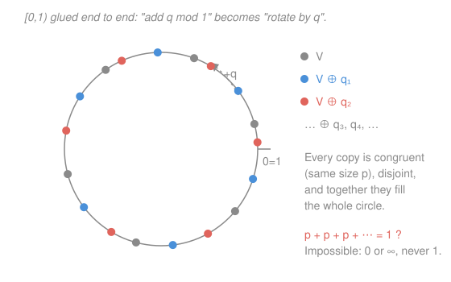

# Probability Theory · Lesson 1.1: Why probability needs measure theory

> ⏱ ~15 min · Module 1: Measure-theoretic foundations · Builds on: `prob-stat-refresher` (distributions, uniform density), `real-analysis` (countability, the Axiom of Choice) · Unlocks: [1.2](01-02-sigma-algebras.md)

## Why this matters

The refresher computed probabilities without a second thought: pick a point uniformly from $[0,1]$, and the chance it lands in $[a,b]$ is just the length $b-a$. It felt airtight. But push on one innocent-looking assumption — that *every* subset of $[0,1]$ has a probability — and the whole edifice collapses in a single clean proof. There is a set you can build to which **no** probability can be assigned without contradiction. That is not a technicality to wave away; it forces us to redefine what "an event" even is. Measure theory is the repair, and this lesson is the crack it fixes.

## The idea

Here is the naive picture. "Choosing a uniform point in $[0,1)$" should hand us a function $\mathbb{P}$ that eats a subset $A\subseteq[0,1)$ and returns a number $\mathbb{P}(A)\in[0,1]$ — its probability. What should this $\mathbb{P}$ obey? Three demands, each one you'd insist on without hesitation:

1. **Total mass one.** $\mathbb{P}([0,1))=1$. The point lands *somewhere*.
2. **Translation invariance.** Sliding a set over (wrapping around the ends, like a clock) can't change its probability. "Uniform" means no spot is special.
3. **Additivity over disjoint pieces.** If you chop a set into non-overlapping parts, the probabilities add.

The subtlety hides in demand 3. Finite additivity — the probabilities of *two* disjoint sets add — is obviously right. But to do any real analysis (take limits, sum series, let $n\to\infty$) we need the stronger version: **countable** additivity, where you may add up *infinitely many* disjoint pieces. That single strengthening is what makes limits behave, and it is exactly the axiom the coming disaster exploits. Hold onto it: countable additivity is the load-bearing beam.

Now the trap. Glue the ends of $[0,1)$ together into a circle, so "add $q$ and wrap around" is literally "rotate by $q$." We will build one subset $V$ of the circle, take countably many rotated copies of it, and discover the copies are disjoint and *tile the entire circle*. Translation invariance says every copy has the same probability $p$. Countable additivity says all those equal $p$'s sum to $1$. But a countable sum of a single constant $p$ is either $0$ (if $p=0$) or $\infty$ (if $p>0$) — it can **never** equal $1$. Contradiction. The set $V$ has no probability at all.

## The formal version

Work on $[0,1)$ with addition **mod 1**: $x\oplus y$ means $x+y$ if that stays below $1$, else $x+y-1$. For a set $A$ and a number $q$, write $A\oplus q=\{a\oplus q : a\in A\}$ — the set $A$ slid over by $q$, wrapping around.

We assume a probability $\mathbb{P}$ defined on **all** subsets of $[0,1)$ satisfying:

- **(N) Normalization:** $\mathbb{P}([0,1))=1$.
- **(T) Translation invariance:** $\mathbb{P}(A\oplus q)=\mathbb{P}(A)$ for every $A$ and every $q\in[0,1)$.
- **(CA) Countable additivity:** if $A_1,A_2,\dots$ are pairwise disjoint, then $\displaystyle\mathbb{P}\Big(\bigsqcup_{n=1}^{\infty}A_n\Big)=\sum_{n=1}^{\infty}\mathbb{P}(A_n)$.

> In words: mass one, no favored location, and the probability of a countable disjoint union is the sum of the probabilities. Each is something you would demand of "uniform chance" before ever hearing the word *measure*.

**The Vitali construction.** Define a relation on $[0,1)$ by
$$x\sim y \iff x-y\in\mathbb{Q}.$$
> In words: two points are related exactly when they differ by a rational number.

This is an equivalence relation (reflexive, symmetric, transitive — check: $0\in\mathbb{Q}$; $\mathbb{Q}$ is closed under negation and addition), so it shatters $[0,1)$ into disjoint **equivalence classes**. Each class is a point plus all the rational amounts you can shift it by — a countable, dense scatter of points, and there are uncountably many such classes (the reals are uncountable; each class holds only countably many points — that "uncountably many countable classes" tension is the same one `real-analysis` drew between dense and thin).

Now invoke the **Axiom of Choice**: from each class pick exactly one representative, and collect them into a single set
$$V\subseteq[0,1).$$
> In words: $V$ is a set containing precisely one point from every $\sim$-class — one delegate per class, chosen all at once.

**Theorem (Vitali).** No $\mathbb{P}$ on all subsets of $[0,1)$ can satisfy (N), (T), and (CA) simultaneously. In particular $V$ can be assigned no probability.

**Proof.** Enumerate the rationals in $[0,1)$ as $q_1,q_2,q_3,\dots$ (they are countable — `real-analysis` listed $\mathbb{Q}$). Consider the countable family of translates
$$V\oplus q_1,\quad V\oplus q_2,\quad V\oplus q_3,\quad\dots$$

*Claim 1 — they are pairwise disjoint.* Suppose a point lies in both $V\oplus q_i$ and $V\oplus q_j$. Then it equals $v\oplus q_i=v'\oplus q_j$ for some $v,v'\in V$. Rearranging, $v-v'=q_j-q_i\in\mathbb{Q}$, so $v\sim v'$ — they are in the same class. But $V$ holds only *one* point per class, forcing $v=v'$, hence $q_i=q_j$, i.e. $i=j$. Distinct translates never overlap.

*Claim 2 — they cover everything.* Take any $x\in[0,1)$. It lies in some class; let $v\in V$ be that class's representative. Then $x\sim v$, so $x-v\in\mathbb{Q}$, and (working mod 1) $x=v\oplus q$ for some rational $q\in[0,1)$. Thus $x\in V\oplus q$. Every point is caught. So
$$[0,1)=\bigsqcup_{n=1}^{\infty}\big(V\oplus q_n\big),$$
a *disjoint* union (Claim 1) that is *exhaustive* (Claim 2).

Now apply the axioms. Let $p=\mathbb{P}(V)$. By translation invariance (T), $\mathbb{P}(V\oplus q_n)=p$ for **every** $n$. By countable additivity (CA) and normalization (N),
$$1=\mathbb{P}\big([0,1)\big)=\sum_{n=1}^{\infty}\mathbb{P}(V\oplus q_n)=\sum_{n=1}^{\infty}p.$$
But $\sum_{n=1}^{\infty}p$ is a sum of infinitely many copies of one fixed number $p\ge 0$:
$$\sum_{n=1}^{\infty}p=\begin{cases}0,& p=0,\\[2pt]\infty,& p>0.\end{cases}$$
Neither is $1$. Contradiction. So no such $\mathbb{P}$ exists — and $V$ has no probability. $\blacksquare$

## Picture

The whole proof lives in this picture: countably many congruent, disjoint copies fill the circle, so their equal masses must total exactly $1$ — which a repeated constant can never do.

## Worked examples

**Example 1 (mechanical — why the sum can't be rescued).** Students often hope some clever value of $p$ threads the needle. Test it. If $p=0$: then $\sum_{n=1}^\infty 0 = 0 \ne 1$ — the circle would have total probability $0$, contradicting (N). If $p=\tfrac{1}{1000}$ (tiny but positive): then $\sum_{n=1}^\infty \tfrac{1}{1000}=\infty\ne 1$. There is no in-between. The gap between "sums to $0$" and "sums to $\infty$" has no landing strip at $1$, because the terms never shrink — they're all the same $p$. Contrast this with a *convergent* series like $\sum 2^{-n}=1$: that works only because the pieces get smaller. Translation invariance forbids shrinking pieces here, and that is precisely what kills it.

**Example 2 (why you'd care — measure zero is not the disease).** It's tempting to file $V$ under "weird set of measure zero, ignore it." That misreads the theorem. A measure-zero set (like $\mathbb{Q}\cap[0,1)$, or a single point) *does* have a probability — namely $0$ — and it behaves perfectly: countably many disjoint copies of a $\mathbb{P}=0$ set sum to $0$, no contradiction, because $\mathbb{Q}$'s translates do **not** tile the circle into congruent uncountable blocks. The Vitali set is a different animal: it is **non-measurable**, meaning *no* value of $p$ — not $0$, not anything — can be consistently assigned. The trouble isn't that $V$ is small; it's that $V$ is *incompatible with the axioms themselves*. This distinction (measure zero vs. no measure at all) is one you'll use constantly once Lesson [1.3](01-03-measures-probability-spaces.md) sets up measures for real.

## Watch out

- You might think you could just *write down* the offending set $V$ and inspect it — but you can't. Building $V$ required the **Axiom of Choice** to pick one representative from each of uncountably many classes with no rule for choosing. There is no formula, no algorithm, no explicit description. Non-measurable sets exist but can never be exhibited; that intangibility is a feature of the proof, not a gap in it.
- You might think *finite* additivity already forces the contradiction — it doesn't. With only finite additivity you can't sum infinitely many translates, and in fact a finitely-additive translation-invariant $\mathbb{P}$ on all subsets *can* exist (a Banach–Tarski-adjacent fact). It is **countable** additivity that clashes with $V$. That's the whole reason we identify countable additivity as the axiom to protect — and the reason the fix restricts *which sets* we measure rather than weakening this axiom.
- You might think "$V$ has no probability" means "$\mathbb{P}(V)=0$." No: measure zero is a *value*, and it's harmless. Non-measurable means **no consistent value exists at all**. $V$ isn't small — it's outside the domain where probability can be defined.

## One-liner

> Demand a probability for *every* subset of $[0,1)$ and the Vitali set breaks you — countably many congruent copies can't sum to $1$ — so the fix is to measure only the well-behaved sets, not all of them.

## Problems

**P1 (🟢)** Someone proposes escaping the contradiction by using only **finite** additivity, splitting $[0,1)$ into $V\oplus q_1,\dots,V\oplus q_N$ for a large finite $N$. Explain in two or three sentences why this doesn't even get the argument off the ground — what breaks in *Claim 2* (coverage)?

**P2 (🟡)** In the proof, translation invariance gave every translate the same probability $p$. Suppose instead we kept (N) and (CA) but *dropped* (T), allowing the translates to have different probabilities $p_1,p_2,p_3,\dots$. Show that a probability could then exist for each $V\oplus q_n$ — i.e. exhibit a valid assignment of nonnegative $p_n$ with $\sum_n p_n=1$ — and state in one line which single axiom's removal defused the contradiction. (This pinpoints exactly what translation invariance was doing.)

**P3 (🔴, optional)** Redo the core arithmetic in the language of the coming theory. Let $\lambda$ be a countably-additive, translation-invariant set function on $[0,1)$ with $\lambda([0,1))=1$, and suppose $\lambda(V)$ is *defined* and equals some $p\ge 0$. Using **only** monotonicity ($A\subseteq B\Rightarrow \lambda(A)\le\lambda(B)$, which you may assume follows from the axioms) and countable additivity, derive both $p\le 0$ *and* $p>0$-leads-to-$\infty$, and conclude $\lambda(V)$ cannot be defined. Where exactly did you use that the $q_n$ are *countably* many and not finitely many?

Solutions

**P1** Finitely many translates $V\oplus q_1,\dots,V\oplus q_N$ use only $N$ of the rationals, so they cover only those points $x$ whose representative shift $q$ happens to be one of $q_1,\dots,q_N$. Every point $x$ needs the *specific* rational $q$ with $x=v\oplus q$, and there are infinitely many distinct such shifts across all of $[0,1)$; any finite list misses points. So Claim 2 (coverage, $\bigsqcup = [0,1)$) fails — the finite union is a proper subset of the circle, there's no equation "$=1$" to contradict, and the argument never starts. You genuinely need *all* countably many rationals to tile the circle, and that is what pulls in countable (not finite) additivity.

**P2** Drop translation invariance and you're free to let the masses shrink. Pick any convergent series of nonnegative terms summing to $1$, e.g.
$$p_n=2^{-n},\qquad \sum_{n=1}^{\infty}p_n=\sum_{n=1}^{\infty}2^{-n}=1.$$
Assign $\mathbb{P}(V\oplus q_n)=2^{-n}$. Then (N) and (CA) are both satisfied: the disjoint translates tile $[0,1)$ and their probabilities sum to exactly $1$. No contradiction. The single axiom whose removal defused everything is **translation invariance (T)** — it was (T) that forced all $p_n$ to be *equal*, and equal nonzero terms cannot converge. (Of course this assignment is no longer "uniform," which is the whole point: a genuinely uniform law is exactly what can't exist on all subsets.)

**P3** By countable additivity applied to the disjoint exhaustive union, and translation invariance giving $\lambda(V\oplus q_n)=\lambda(V)=p$,
$$1=\lambda([0,1))=\sum_{n=1}^{\infty}\lambda(V\oplus q_n)=\sum_{n=1}^{\infty}p.$$
*Case $p>0$:* the partial sums are $Np\to\infty$, so $\sum_n p=\infty>1$ — impossible. (Monotonicity gives the same smell directly: the finite union $\bigsqcup_{n=1}^{N}(V\oplus q_n)\subseteq[0,1)$ forces $Np=\lambda\big(\bigsqcup_{n=1}^N V\oplus q_n\big)\le\lambda([0,1))=1$ for *every* $N$, i.e. $p\le 1/N$ for all $N$, so $p\le 0$.) *Case $p=0$:* then $\sum_n p=0\ne 1$. Combining, $p\le 0$ and $p=0$ both fail to give $1$, so no $p\ge 0$ works and $\lambda(V)$ cannot be defined. The countability entered decisively in two places: in enumerating the $q_n$ as a sequence at all (so that "$\sum_{n=1}^\infty$" even makes sense), and in the monotonicity step, where "$p\le 1/N$ for *all* $N$" needs infinitely many disjoint translates packed inside the circle — a finite family would only give $p\le 1/N$ for one fixed $N$, no contradiction.

## Connections

- **Backward:** the machinery here is borrowed wholesale from `real-analysis` — the countability of $\mathbb{Q}$ (to list the $q_n$), the uncountability of $[0,1)$ (to know there are uncountably many classes), and the Axiom of Choice (to build $V$). The "dense yet thin" tension between $\mathbb{Q}$ and $\mathbb{R}$ is what makes the classes behave as they do.
- **Forward:** the resolution is to stop insisting on measuring *every* subset. We keep countable additivity — it's non-negotiable for limits — and instead restrict to a well-behaved collection of "events," a **$\sigma$-algebra**, which [1.2](01-02-sigma-algebras.md) constructs. Probability then becomes a **measure** of total mass $1$ on that collection, the subject of [1.3](01-03-measures-probability-spaces.md), and Lebesgue measure — the honest version of "length" that dodges $V$ — gets built in [1.4](01-04-constructing-lebesgue-measure.md).
- **Sideways:** every distribution you computed in `prob-stat-refresher` secretly lived on a $\sigma$-algebra, not on all subsets — you just never met a set nasty enough to notice. This lesson is the receipt for that omission, and it is why the entire course is built on measure theory rather than on naive "probability of any subset."
