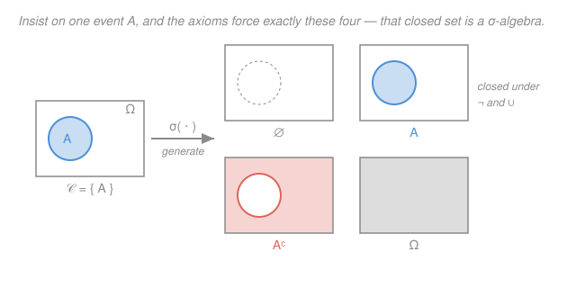

# Probability Theory · Lesson 1.2: σ-algebras and measurable spaces

> ⏱ ~15 min · Module 1: Measure-theoretic foundations · Builds on: [1.1 Why probability needs measure theory](01-01-why-measure-theory.md) · Unlocks: [1.3 Measures and probability spaces](01-03-measures-probability-spaces.md)

## Why this matters

Lesson [1.1](01-01-why-measure-theory.md) delivered bad news: you *cannot* assign a probability to every subset of $[0,1]$ — the Vitali set breaks countable additivity. So probability has to make a choice about which sets it will even try to measure. A **σ-algebra** is that choice, made with discipline: it is the collection of subsets — the **events** — that we are allowed to talk about, engineered to be closed under exactly the operations probability needs and no others. Every later object in this course (random variables, distributions, conditional expectation) is defined *relative to* one of these collections. Get this right and the rest of measure-theoretic probability is bookkeeping.

## The idea

Think of the events as the questions you are allowed to ask about a random outcome. Two closure demands are non-negotiable:

- If you can ask "did $A$ happen?", you must be able to ask "did $A$ **not** happen?" — that's the complement $A^c$.
- If you can ask about each of countably many events $A_1, A_2, \dots$, you must be able to ask "did **at least one** of them happen?" — that's the union $\bigcup_n A_n$.

A σ-algebra is just a collection of subsets that is honest about these two demands (plus the trivial requirement that "did *anything* happen?" — the whole space — is an admissible question). Everything else you'd want — "did *all* of them happen?", "did $A$ but not $B$?" — comes free, forced by "not" and "or" via logic.

Why *countably* many and not just finitely many? Because the whole reason we're here is limits. "The average settles down," "the event happens infinitely often," "the tail vanishes" — each is a statement about infinitely many events at once. Countable is the sweet spot: rich enough to take limits, disciplined enough that the Vitali pathology of [1.1](01-01-why-measure-theory.md) — which needed *uncountably* many translates glued together — can't sneak in.

## The formal version

Fix a **sample space** $\Omega$ — the set of all possible outcomes. Its subsets are candidate events. Write $A^c = \Omega \setminus A$ for the complement of $A$ in $\Omega$, and $2^{\Omega}$ for the **power set** (the collection of *all* subsets of $\Omega$).

**Definition (σ-algebra).** A collection $\mathcal F$ of subsets of $\Omega$ is a **σ-algebra** on $\Omega$ if:

1. $\Omega \in \mathcal F$;
2. **(complement)** $A \in \mathcal F \implies A^c \in \mathcal F$;
3. **(countable union)** $A_1, A_2, A_3, \dots \in \mathcal F \implies \bigcup_{n=1}^{\infty} A_n \in \mathcal F$.

> In words: a σ-algebra is a system of events containing the sure event, closed under "not" and under "at least one of countably many ors." The pair $(\Omega, \mathcal F)$ is called a **measurable space**, and the sets in $\mathcal F$ are the **measurable sets**, or **events**.

Everything else you need is *derived* from these three — no extra axioms:

- **$\varnothing \in \mathcal F$.** By (1), $\Omega \in \mathcal F$; by (2), $\Omega^c = \varnothing \in \mathcal F$.
- **Closed under countable intersections.** Given $A_1, A_2, \dots \in \mathcal F$, De Morgan's law gives $\bigcap_n A_n = \big( \bigcup_n A_n^c \big)^c$. Each $A_n^c \in \mathcal F$ by (2), their union is in $\mathcal F$ by (3), and the outer complement is in $\mathcal F$ by (2) again. So $\bigcap_n A_n \in \mathcal F$. (Finite intersections too: pad the list with $\Omega$'s.)
- **Closed under set differences.** $A \setminus B = A \cap B^c$, an intersection of two members, hence in $\mathcal F$.

> In words: force in "not" and "countable or," and you get "and," "and-not," and the empty event for free — because logic ties them together.

**Examples.**

- **The trivial σ-algebra** $\{\varnothing, \Omega\}$ — the smallest possible. You may only ask "did anything happen?" Useless, but legal.
- **The power set** $2^{\Omega}$ — the largest. Every subset is an event. When $\Omega$ is **finite or countable**, this is the natural and universal choice: no Vitali obstruction exists there, so we lose nothing by measuring everything.
- **Generated by one event:** $\{\varnothing, A, A^c, \Omega\}$ is the smallest σ-algebra containing a single set $A$ (with $\varnothing \neq A \neq \Omega$). Check it: it has $\Omega$, it's closed under complement (the four sets pair up $A \leftrightarrow A^c$, $\varnothing \leftrightarrow \Omega$), and every union of members lands back inside. This is the picture below.

## Picture

## Worked examples

**Example 1 (mechanical — the generated σ-algebra is the *smallest* one).**

Usually you don't hand-pick $\mathcal F$; you name a few sets you insist on measuring and let the axioms do the rest. Given any collection $\mathcal C$ of subsets of $\Omega$, the **σ-algebra generated by $\mathcal C$**, written $\sigma(\mathcal C)$, is the smallest σ-algebra containing $\mathcal C$. "Smallest" has to *mean* something, and here's the construction that makes it well-defined:

$$\sigma(\mathcal C) \;=\; \bigcap \big\{\, \mathcal G : \mathcal G \text{ is a }\sigma\text{-algebra on } \Omega \text{ with } \mathcal C \subseteq \mathcal G \,\big\}.$$

Intersect *every* σ-algebra that contains $\mathcal C$. (The family is nonempty — $2^{\Omega}$ is always one such $\mathcal G$ — so the intersection makes sense.) For this to be legitimate we must check the intersection is itself a σ-algebra:

> **Claim.** An intersection $\mathcal F = \bigcap_{i \in I} \mathcal G_i$ of σ-algebras on $\Omega$ (any index set $I$) is a σ-algebra.
>
> **Proof.** *(1)* Each $\mathcal G_i$ contains $\Omega$, so $\Omega \in \mathcal F$. *(2)* If $A \in \mathcal F$, then $A \in \mathcal G_i$ for every $i$; each $\mathcal G_i$ is closed under complement, so $A^c \in \mathcal G_i$ for every $i$, hence $A^c \in \mathcal F$. *(3)* If $A_1, A_2, \dots \in \mathcal F$, then for each fixed $i$ all the $A_n$ lie in $\mathcal G_i$, so $\bigcup_n A_n \in \mathcal G_i$; true for every $i$, so $\bigcup_n A_n \in \mathcal F$. $\blacksquare$

So $\sigma(\mathcal C)$ is a σ-algebra, it contains $\mathcal C$ (every $\mathcal G_i$ does), and it sits inside every σ-algebra that contains $\mathcal C$ — that's exactly "smallest."

> In words: $\sigma(\mathcal C)$ is the complete set of events you are *forced* to admit once you commit to measuring the ones in $\mathcal C$. Concretely, $\sigma(\{A\}) = \{\varnothing, A, A^c, \Omega\}$ — the four-element algebra from the picture.

**Example 2 (why you'd care — the Borel σ-algebra, where the real line lives).**

On $\Omega = \mathbb R$ the power set is off-limits (that's the whole content of [1.1](01-01-why-measure-theory.md)). But we still need every interval, every point, every set we'd ever name, to be an event. So generate:

$$\mathcal B(\mathbb R) \;=\; \sigma\big( \{ \text{open subsets of } \mathbb R \} \big),$$

the **Borel σ-algebra**. Its members are the **Borel sets**. It is enormous but not *everything*: it contains every open set, hence (by complement) every closed set, hence every half-line, interval, and — as a countable union of points — every countable set like $\mathbb Q$. Yet the Vitali set of [1.1](01-01-why-measure-theory.md) is **not** Borel, so $\mathcal B(\mathbb R) \subsetneq 2^{\mathbb R}$. It threads the needle exactly: big enough to hold everything you'll write down, small enough to dodge the pathology.

A useful fact we'll lean on: the same σ-algebra is generated by a much thinner starter set,

$$\mathcal B(\mathbb R) \;=\; \sigma\big( \{ (-\infty, a] : a \in \mathbb R \} \big).$$

> In words: you don't need *all* open sets to pin down the Borel events — the half-lines alone force them. This is what lets a cumulative distribution function, which only records $\mathbb P(X \le a)$, determine an entire distribution (Lesson 2.2).

**Why generators are enough — the π–λ theorem (stated).** That last claim needs a tool. Call $\mathcal P$ a **π-system** if it is closed under *finite* intersection ($A, B \in \mathcal P \Rightarrow A \cap B \in \mathcal P$); the half-lines $(-\infty, a]$ are one, since $(-\infty,a]\cap(-\infty,b] = (-\infty, \min(a,b)]$.

> **Dynkin's π–λ theorem (uniqueness form).** If two probability measures agree on a π-system $\mathcal P$, they agree on all of $\sigma(\mathcal P)$.

We won't prove it (the machinery is the λ-system / monotone-class argument; Williams does it cleanly). But absorb what it *buys*: to prove two measures are equal on a huge σ-algebra, you only check them on a small, intersection-closed generating family. This is *the* standard uniqueness weapon in the course — it's why "the CDF determines the distribution" (Lesson 2.2) is a theorem and not a hope.

## Watch out

- **You might think** closure under arbitrary unions is fine, **but** the "σ" means **countable** — deliberately. Uncountable unions can escape $\mathcal F$, and that is the whole point: the Vitali set is an *uncountable* union of translates, exactly the move a σ-algebra refuses. (This is also what separates σ-algebras from topologies, where arbitrary unions of open sets *are* required.)
- **You might think** $\sigma(\mathcal C)$ is built by "throwing in the complements and unions of $\mathcal C$ once and stopping," **but** you'd have to keep closing up the new sets you created, then *their* complements and countable unions, transfinitely — there is no finite recipe. That's precisely why the definition is the *abstract* "intersection of all containing σ-algebras": it sidesteps the impossible construction. And the result is typically vastly larger than $\mathcal C$ — a single interval generates all of $\mathcal B(\mathbb R)$.
- **You might think** an event is a point of $\Omega$, **but** a σ-algebra is a set of *subsets* — its elements are events (whole sets of outcomes), not individual outcomes. Keep the levels straight: $\omega \in \Omega$ is an outcome; $A \in \mathcal F$ is an event; $\mathcal F \subseteq 2^{\Omega}$ is the event system.

## One-liner

> A σ-algebra is the disciplined collection of measurable events — closed under "not" and "countably many ors" — and you specify one not by listing it but by naming a few sets and taking $\sigma(\cdot)$.

## Problems

**P1 (🟢)** Let $\Omega = \{a, b, c\}$.
(a) Write out $\sigma(\{a\})$ — the smallest σ-algebra containing the singleton $\{a\}$ — explicitly.
(b) Is $\mathcal H = \{\varnothing,\, \{a\},\, \{b\},\, \Omega\}$ a σ-algebra? If not, name every axiom it violates.

**P2 (🟡)** Let $\mathcal F_1$ and $\mathcal F_2$ be σ-algebras on the same $\Omega$.
(a) Prove $\mathcal F_1 \cap \mathcal F_2$ is a σ-algebra.
(b) Show by a small explicit counterexample that $\mathcal F_1 \cup \mathcal F_2$ need **not** be a σ-algebra. (This is why building a σ-algebra from a union of collections requires wrapping it in $\sigma(\cdot)$.)

**P3 (🔴, optional)** Let $\Omega$ be an uncountable set (e.g. $\mathbb R$) and define
$$\mathcal F = \{\, A \subseteq \Omega : A \text{ is countable, or } A^c \text{ is countable} \,\}$$
(the **countable–cocountable** σ-algebra).
(a) Prove $\mathcal F$ is a σ-algebra. (You'll need the `real-analysis` fact that a countable union of countable sets is countable.)
(b) Prove $\mathcal F = \sigma\big(\{\{\omega\} : \omega \in \Omega\}\big)$ — the σ-algebra generated by all singletons. Conclude that $\sigma(\text{singletons})$ is *strictly smaller* than $2^{\Omega}$.

Solutions

**P1** (a) Start with $\{a\}$ and close up. Complement: $\{a\}^c = \{b,c\}$. Throw in $\Omega$ (axiom 1) and $\varnothing$ (its complement). Every union of these four lands back among them (e.g. $\{a\}\cup\{b,c\}=\Omega$), and complements pair up $\{a\}\leftrightarrow\{b,c\}$, $\varnothing\leftrightarrow\Omega$. So
$$\sigma(\{a\}) = \{\varnothing,\ \{a\},\ \{b,c\},\ \Omega\}.$$
Four elements — the generic "one nontrivial event" σ-algebra.

(b) **Not** a σ-algebra. It fails **(2) complement**: $\{a\}^c = \{b,c\} \notin \mathcal H$ (and likewise $\{b\}^c=\{a,c\}\notin\mathcal H$). It also fails **(3) countable — here finite — union**: $\{a\}\cup\{b\} = \{a,b\} \notin \mathcal H$. It *does* satisfy (1), since $\Omega \in \mathcal H$. Any one of these failures already disqualifies it. (Fixing it — adding all forced complements and unions — regenerates the full power set $2^{\Omega}$, since the singletons generate everything on a finite space.)

**P2** (a) This is the two-set case of the Claim proved in Example 1; the argument is worth re-running. *(1)* $\Omega \in \mathcal F_1$ and $\Omega \in \mathcal F_2$, so $\Omega \in \mathcal F_1 \cap \mathcal F_2$. *(2)* If $A \in \mathcal F_1 \cap \mathcal F_2$ then $A$ is in each, so $A^c$ is in each (both closed under complement), so $A^c \in \mathcal F_1 \cap \mathcal F_2$. *(3)* If $A_1, A_2, \dots \in \mathcal F_1 \cap \mathcal F_2$, then the whole sequence lies in $\mathcal F_1$, whose closure gives $\bigcup_n A_n \in \mathcal F_1$; identically $\bigcup_n A_n \in \mathcal F_2$; hence $\bigcup_n A_n \in \mathcal F_1 \cap \mathcal F_2$. So the intersection is a σ-algebra. $\blacksquare$

(b) Take $\Omega = \{a,b,c\}$ with
$$\mathcal F_1 = \{\varnothing, \{a\}, \{b,c\}, \Omega\}, \qquad \mathcal F_2 = \{\varnothing, \{b\}, \{a,c\}, \Omega\}.$$
Both are σ-algebras (each is $\sigma$ of a single singleton, by P1). Their union contains $\{a\}$ and $\{b\}$ but **not** $\{a\}\cup\{b\}=\{a,b\}$, so it violates axiom (3). Hence $\mathcal F_1 \cup \mathcal F_2$ is not a σ-algebra. The smallest σ-algebra containing both is $\sigma(\mathcal F_1 \cup \mathcal F_2) = 2^{\Omega}$, strictly bigger than the union — exactly why you cannot merge event systems by naive union.

**P3** (a) Check the three axioms.
*(1)* $\Omega^c = \varnothing$ is countable, so $\Omega \in \mathcal F$.
*(2)* If $A \in \mathcal F$, then $A$ is countable or $A^c$ is countable — a condition symmetric in $A$ and $A^c$ — so $A^c \in \mathcal F$ too.
*(3)* Let $A_1, A_2, \dots \in \mathcal F$ and $U = \bigcup_n A_n$. Two cases. If **every** $A_n$ is countable, then $U$ is a countable union of countable sets, hence countable (the `real-analysis` fact), so $U \in \mathcal F$. Otherwise **some** $A_{m}$ has $A_{m}^c$ countable; then by De Morgan $U^c = \bigcap_n A_n^c \subseteq A_{m}^c$, a subset of a countable set, hence countable, so $U \in \mathcal F$. Either way $U \in \mathcal F$. $\blacksquare$

(b) Two inclusions.
*($\supseteq$)* Every singleton $\{\omega\}$ is countable, so $\{\omega\} \in \mathcal F$. Thus $\mathcal F$ is a σ-algebra containing all singletons, and $\sigma(\text{singletons})$ is the *smallest* such — so $\sigma(\text{singletons}) \subseteq \mathcal F$.
*($\subseteq$)* Take any $A \in \mathcal F$. If $A$ is countable, then $A = \bigcup_{\omega \in A} \{\omega\}$ is a countable union of singletons, hence in $\sigma(\text{singletons})$. If instead $A^c$ is countable, the same argument puts $A^c \in \sigma(\text{singletons})$, and then $A = (A^c)^c \in \sigma(\text{singletons})$ by closure under complement. So $\mathcal F \subseteq \sigma(\text{singletons})$.
Therefore $\mathcal F = \sigma(\text{singletons})$. Finally, since $\Omega$ is uncountable it has a subset $B$ that is uncountable with uncountable complement (split $\Omega$ into two uncountable halves); $B \notin \mathcal F$, yet $B \in 2^{\Omega}$. So $\sigma(\text{singletons}) = \mathcal F \subsetneq 2^{\Omega}$ — knowing every point-event does **not** force you to measure every set. $\blacksquare$

## Connections

- **Backward:** [1.1](01-01-why-measure-theory.md) proved we must abandon $2^{[0,1]}$; this lesson names the replacement and pins down its closure rules. The countable-vs-uncountable line that killed the Vitali set is the same line drawn in `real-analysis` (countable unions behave, uncountable ones need not) — and P3 runs directly on that fact.
- **Forward:** [1.3](01-03-measures-probability-spaces.md) puts a probability measure $\mathbb P$ on $(\Omega, \mathcal F)$ to complete the triple $(\Omega, \mathcal F, \mathbb P)$; a random variable ([2.1](02-01-random-variables-measurability.md)) is then a function measurable with respect to $\mathcal F$, and its distribution (Lesson 2.2) lives on the Borel σ-algebra $\mathcal B(\mathbb R)$ built here. The π–λ theorem returns there to prove the CDF determines the law.
- **Sideways:** the "generated by a small family" idea — $\sigma(\mathcal C)$ as the smallest structure containing your generators — is the same universal-property move as the span of a set of vectors in linear algebra or the group generated by elements: name a few objects, take the smallest closed thing around them.
