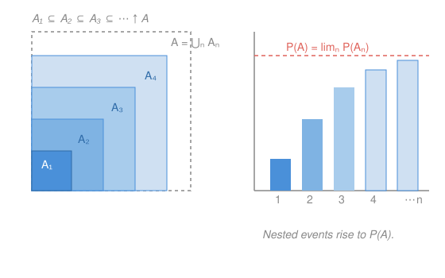

# Probability Theory · Lesson 1.3: Measures and probability spaces

> ⏱ ~15 min · Module 1: Measure-theoretic foundations · Builds on: [1.2 σ-algebras and measurable spaces](01-02-sigma-algebras.md) · Unlocks: [1.4 Constructing Lebesgue measure](01-04-constructing-lebesgue-measure.md)

## Why this matters

In [1.2](01-02-sigma-algebras.md) you fixed *which* subsets of $\Omega$ count as events — the σ-algebra $\mathcal F$. That's the floor plan. It says nothing yet about how *likely* anything is. This lesson installs the plumbing: a **measure** that assigns each event a size, pinned down by a single structural axiom, countable additivity. Every identity you already trust — complements, inclusion–exclusion, the union bound — is a two-line consequence of that one axiom, and so is the theorem that lets probability commute with limits (continuity of measure), which is what makes the strong law and Borel–Cantelli ([3.3](03-03-borel-cantelli-zero-one.md)) possible at all. Get this axiom and its corollaries, and the rest of the course is bookkeeping on top of it.

## The idea

Think of $\Omega$ as a region and a measure as a way of assigning **area** to its pieces. Two demands make area behave:

- The empty piece has zero area.
- If you cut a region into non-overlapping pieces, the areas add up.

That's it. A measure is exactly this "area" rule, generalized so that you may cut into **countably** many disjoint pieces and still add. A **probability** measure is the special case where the whole region has area exactly $1$ — so "size of an event" becomes "fraction of the total," i.e. a probability.

The one subtle word is *countably*. Finite additivity — chop into finitely many disjoint pieces, add — feels obviously right. The real axiom is stronger: even an **infinite** disjoint chopping adds up. That extra strength is not decoration. It is precisely what will let probability slide through limits ("if the events grow up to $A$, their probabilities grow up to $\mathbb P(A)$"), and finite additivity alone cannot deliver that. Hold onto the distinction; the whole lesson turns on it.

## The formal version

Fix a measurable space $(\Omega,\mathcal F)$ from [1.2](01-02-sigma-algebras.md): $\Omega$ a set, $\mathcal F$ a σ-algebra of subsets of $\Omega$.

**Measure.** A **measure** is a function $\mu:\mathcal F\to[0,\infty]$ such that

1. $\mu(\varnothing)=0$, and
2. **(countable additivity)** for any *pairwise disjoint* $A_1,A_2,\dots\in\mathcal F$ (meaning $A_i\cap A_j=\varnothing$ for $i\neq j$),
$$\mu\!\Big(\bigsqcup_{n=1}^{\infty} A_n\Big)=\sum_{n=1}^{\infty}\mu(A_n).$$

Here $\bigsqcup$ denotes a union of sets already known to be disjoint. The values live in $[0,\infty]$: a general measure is allowed to return $+\infty$ (the whole real line has infinite length).

> In words: the empty event has size zero, and the size of a disjoint pile of events — even a countably infinite pile — is the sum of the sizes.

**Probability measure and probability space.** A measure $\mathbb P$ is a **probability measure** if additionally
$$\mathbb P(\Omega)=1.$$
The triple $(\Omega,\mathcal F,\mathbb P)$ is then a **probability space**. Because $\varnothing\subseteq A\subseteq\Omega$ forces $0\le \mathbb P(A)\le 1$ (proved below), a probability never returns $\infty$.

> In words: the whole sample space has probability $1$, and disjoint events' probabilities add — so every event gets a number in $[0,1]$.

Two remarks before we mine the axioms. **Finite additivity** is the special case $\mathbb P(A\sqcup B)=\mathbb P(A)+\mathbb P(B)$: take $A_1=A$, $A_2=B$, and $A_3=A_4=\dots=\varnothing$ (legal since the $A_n$ are disjoint and $\mathbb P(\varnothing)=0$). And everything below uses only these two axioms — no picture, no "obviously."

### The everyday properties, proved

**(P1) Complement.** $\mathbb P(A^c)=1-\mathbb P(A)$.

*Proof.* $A$ and $A^c$ are disjoint with $A\sqcup A^c=\Omega$. Finite additivity gives $\mathbb P(A)+\mathbb P(A^c)=\mathbb P(\Omega)=1$. Rearrange. $\blacksquare$ (Taking $A=\Omega$ recovers $\mathbb P(\varnothing)=0$ from the probability side.)

**(P2) Monotonicity.** If $A\subseteq B$ then $\mathbb P(A)\le\mathbb P(B)$, and $\mathbb P(B\setminus A)=\mathbb P(B)-\mathbb P(A)$.

*Proof.* Split $B$ into disjoint pieces $B=A\sqcup(B\setminus A)$ (both in $\mathcal F$, since σ-algebras are closed under complements and intersections). Finite additivity: $\mathbb P(B)=\mathbb P(A)+\mathbb P(B\setminus A)$. The last term is $\ge 0$, so $\mathbb P(B)\ge\mathbb P(A)$; rearranging gives the difference formula. $\blacksquare$ (Setting $B=\Omega$ re-proves P1, and $0\le\mathbb P(A)\le 1$ follows from $\varnothing\subseteq A\subseteq\Omega$.)

**(P3) Inclusion–exclusion for two events.** $\mathbb P(A\cup B)=\mathbb P(A)+\mathbb P(B)-\mathbb P(A\cap B)$.

*Proof.* Cut $A\cup B$ into three disjoint slabs: $A\cup B=(A\setminus B)\sqcup(A\cap B)\sqcup(B\setminus A)$. Finite additivity across three pieces gives
$$\mathbb P(A\cup B)=\mathbb P(A\setminus B)+\mathbb P(A\cap B)+\mathbb P(B\setminus A).$$
Now $\mathbb P(A\setminus B)=\mathbb P(A)-\mathbb P(A\cap B)$ and $\mathbb P(B\setminus A)=\mathbb P(B)-\mathbb P(A\cap B)$ by P2 (note $A\cap B\subseteq A$ and $A\cap B\subseteq B$). Substitute:
$$\mathbb P(A\cup B)=\mathbb P(A)+\mathbb P(B)-\mathbb P(A\cap B).\qquad\blacksquare$$
The $n$-event version, **inclusion–exclusion**, follows by induction:
$$\mathbb P\!\Big(\bigcup_{i=1}^n A_i\Big)=\sum_i\mathbb P(A_i)-\sum_{i<j}\mathbb P(A_i\cap A_j)+\sum_{i<j<k}\mathbb P(A_i\cap A_j\cap A_k)-\cdots+(-1)^{n+1}\mathbb P\!\Big(\bigcap_{i=1}^n A_i\Big).$$

**(P4) Union bound / countable subadditivity.** For *any* events $A_1,A_2,\dots\in\mathcal F$ (disjoint or not),
$$\mathbb P\!\Big(\bigcup_{n=1}^\infty A_n\Big)\le\sum_{n=1}^\infty\mathbb P(A_n).$$

*Proof (the disjointification trick — remember it, it returns everywhere).* Manufacture disjoint events with the same running union: set $B_1=A_1$ and
$$B_n=A_n\setminus(A_1\cup\cdots\cup A_{n-1}).$$
Then the $B_n$ are pairwise disjoint, $B_n\subseteq A_n$, and $\bigsqcup_n B_n=\bigcup_n A_n$ (every point's *first* appearance among the $A$'s lands it in exactly one $B$). Countable additivity on the $B_n$, then monotonicity $\mathbb P(B_n)\le\mathbb P(A_n)$:
$$\mathbb P\!\Big(\bigcup_n A_n\Big)=\mathbb P\!\Big(\bigsqcup_n B_n\Big)=\sum_n\mathbb P(B_n)\le\sum_n\mathbb P(A_n).\qquad\blacksquare$$

In words: the chance that *at least one* of many things happens is no more than the sum of their individual chances — the single most-used inequality in probability.

### Continuity of measure

Here is where countable additivity earns its keep — the theorem that lets probability pass through limits. Write $A_n\uparrow A$ to mean $A_1\subseteq A_2\subseteq\cdots$ with $A=\bigcup_n A_n$ (an **increasing** sequence filling up to $A$), and $A_n\downarrow A$ to mean $A_1\supseteq A_2\supseteq\cdots$ with $A=\bigcap_n A_n$ (a **decreasing** sequence shrinking to $A$).

**Theorem (Continuity of measure).**
$$A_n\uparrow A\ \Longrightarrow\ \mathbb P(A_n)\uparrow\mathbb P(A),\qquad\qquad A_n\downarrow A\ \Longrightarrow\ \mathbb P(A_n)\downarrow\mathbb P(A).$$

> In words: if the events grow up to $A$, their probabilities grow up to $\mathbb P(A)$; if they shrink down to $A$, their probabilities shrink down to $\mathbb P(A)$. Limits of events go where you'd hope.

*Proof (increasing case, by disjointifying).* Given $A_n\uparrow A$, split the growth into the fresh part added at each step:
$$B_1=A_1,\qquad B_n=A_n\setminus A_{n-1}\ (n\ge 2).$$
Because the $A_n$ are nested, the $B_n$ are pairwise disjoint, and the first $n$ of them reassemble $A_n$, i.e. $\bigsqcup_{k=1}^n B_k=A_n$, while $\bigsqcup_{k=1}^\infty B_k=\bigcup_n A_n=A$. Now apply countable additivity to $A$, and recognize the partial sums as $\mathbb P(A_n)$ (finite additivity):
$$\mathbb P(A)=\sum_{k=1}^\infty\mathbb P(B_k)=\lim_{n\to\infty}\sum_{k=1}^n\mathbb P(B_k)=\lim_{n\to\infty}\mathbb P(A_n).$$
The middle equality is just the definition of an infinite sum as the limit of partial sums — *this* is the step countable additivity buys us and finite additivity cannot. Monotonicity (P2) makes the sequence $\mathbb P(A_n)$ increasing, so the limit is a genuine "$\uparrow$." $\blacksquare$

*Proof (decreasing case, by complements).* Let $A_n\downarrow A$. Then $A_n^c\uparrow A^c$: complements reverse inclusions, and by De Morgan $\bigcup_n A_n^c=\big(\bigcap_n A_n\big)^c=A^c$. Apply the increasing case to $A_n^c$, then P1 twice:
$$1-\mathbb P(A_n)=\mathbb P(A_n^c)\ \uparrow\ \mathbb P(A^c)=1-\mathbb P(A),$$
so $\mathbb P(A_n)\downarrow\mathbb P(A)$. $\blacksquare$

The complement step quietly used $\mathbb P(A_n)<\infty$ to write $\mathbb P(A_n^c)=1-\mathbb P(A_n)$. For a *general* measure that can equal $+\infty$, continuity **from above** needs some $A_n$ to have finite measure — otherwise it fails (e.g. Lebesgue measure of $[n,\infty)$ is $\infty$ for every $n$, yet the intersection is empty with measure $0$). For a probability everything is $\le 1$, so the hypothesis is automatic and we never think about it again.

**Why this is the engine of Borel–Cantelli.** In [3.3](03-03-borel-cantelli-zero-one.md), "$A_n$ happens infinitely often" is the event $\limsup_n A_n=\bigcap_{n}\bigcup_{k\ge n}A_k$. The tails $T_n=\bigcup_{k\ge n}A_k$ decrease, $T_n\downarrow\limsup A_n$, so continuity from above gives $\mathbb P(\limsup A_n)=\lim_n\mathbb P(T_n)\le\lim_n\sum_{k\ge n}\mathbb P(A_k)$ (union bound). When $\sum_k\mathbb P(A_k)<\infty$ that tail sum $\to 0$, forcing $\mathbb P(\limsup A_n)=0$ — the first Borel–Cantelli lemma, which is Boss problem 1. You now hold every tool it needs.

### Concrete instances

**Discrete probability (a pmf).** Let $\Omega$ be countable and $\mathcal F=2^\Omega$ (all subsets). Pick numbers $p(\omega)\ge 0$ with $\sum_{\omega\in\Omega}p(\omega)=1$ — a **probability mass function**. Define
$$\mathbb P(A)=\sum_{\omega\in A}p(\omega).$$
Countable additivity is just the fact that a sum of nonnegative terms can be regrouped over a countable disjoint partition, and $\mathbb P(\Omega)=1$ by construction. A fair die is $\Omega=\{1,\dots,6\}$, $p(\omega)=\tfrac16$; a Poisson variable is $\Omega=\{0,1,2,\dots\}$, $p(k)=e^{-\lambda}\lambda^k/k!$ — here $\Omega$ is infinite, so *countable* additivity is not optional.

**Uniform measure on $[0,1]$.** Take $\Omega=[0,1]$ and $\mathcal F=\mathcal B([0,1])$, the Borel σ-algebra from [1.2](01-02-sigma-algebras.md). The **uniform** (Lebesgue) probability assigns each interval its length, $\mathbb P\big([a,b]\big)=b-a$, and extends to all Borel sets. That "extends" hides real work — you cannot just declare it and hope additivity holds — which is exactly what [1.4](01-04-constructing-lebesgue-measure.md) builds via Carathéodory's theorem. Note a consequence you can already see: every singleton has $\mathbb P(\{x\})=0$ (it sits inside $[x,x+\varepsilon]$ of probability $\varepsilon$ for all $\varepsilon$), so by countable additivity every countable set — all of $\mathbb Q\cap[0,1]$ included — has probability $0$. This is the measure-theoretic cash value of "$\mathbb Q$ is countable" from `real-analysis` (1.4).

## Picture

## Worked examples

**Example 1 (mechanical — reading probabilities off the axioms).** A card is drawn from a standard 52-card deck, uniform: $\mathbb P(A)=|A|/52$. Let $H=\{\text{heart}\}$ (13 cards) and $F=\{\text{face card: J, Q, K}\}$ (12 cards). Then $H\cap F$ is the 3 heart-face-cards, so
$$\mathbb P(H\cup F)=\mathbb P(H)+\mathbb P(F)-\mathbb P(H\cap F)=\tfrac{13}{52}+\tfrac{12}{52}-\tfrac{3}{52}=\tfrac{22}{52}=\tfrac{11}{26}.$$
And the chance of *neither* is $\mathbb P\big((H\cup F)^c\big)=1-\tfrac{11}{26}=\tfrac{15}{26}$ by P1. Every step is a named axiom-consequence, not a memorized formula.

**Example 2 (why you'd care — a limit computed by continuity).** Throw a dart at $[0,1]$ under the uniform measure. Let $A_n=[0,\,1-\tfrac1n)$, the event "the dart lands at position $<1-\tfrac1n$." These increase: $A_1\subseteq A_2\subseteq\cdots$ and $\bigcup_n A_n=[0,1)$. Continuity of measure lets us pass the probability through the limit:
$$\mathbb P\big([0,1)\big)=\lim_{n\to\infty}\mathbb P(A_n)=\lim_{n\to\infty}\Big(1-\tfrac1n\Big)=1.$$
So $\mathbb P([0,1))=1$, and by P1 the single point $\mathbb P(\{1\})=0$ — the endpoint carries no probability, recovered as a *limit of growing events* rather than asserted. This is the move behind every "with probability one" statement in the course: build the event you want as an increasing (or decreasing) limit of ones you can compute, then slide $\mathbb P$ through.

## Watch out

- You might think additivity applies to any union, but the axiom is for **disjoint** events only. $\mathbb P(A\cup B)=\mathbb P(A)+\mathbb P(B)$ is *false* when $A\cap B\neq\varnothing$ — you double-count the overlap. For overlapping events you owe an inclusion–exclusion correction (P3); the raw sum survives only as the union-bound *inequality* (P4).
- You might think finite additivity is "basically" the axiom, but countable additivity is strictly stronger — and the gap is not academic. Continuity of measure, and hence Borel–Cantelli, the strong law, and every limit theorem, needs the countable version. A merely finitely-additive "probability" can assign each singleton of $\mathbb N$ probability $0$ yet the whole of $\mathbb N$ probability $1$, breaking $\mathbb P(\bigsqcup\{n\})=\sum\mathbb P(\{n\})$; countable additivity outlaws exactly this pathology.
- You might think continuity works identically in both directions, but continuity **from above** ($A_n\downarrow A$) secretly needs some $A_n$ of *finite* measure. It's automatic for probabilities (everything is $\le 1$), but for a general measure $\mu$ that can be $+\infty$ it can fail. Continuity **from below** ($A_n\uparrow A$) never needs it.
- You might think a measure returns an ordinary number, but a *general* measure may return $+\infty$ (length, area, mass). A **probability** is the bounded case, capped at $\mathbb P(\Omega)=1$ — which is why finiteness questions never bite us here even though they matter for Lebesgue measure in [1.4](01-04-constructing-lebesgue-measure.md).

## One-liner

> A probability is an area rule with total area one, and its single real axiom — *disjoint countable unions add* — is exactly strong enough to let probability pass through limits.

## Problems

**P1 (🟢)** In a probability space, events $A,B$ satisfy $\mathbb P(A)=0.6$, $\mathbb P(B)=0.5$, $\mathbb P(A\cap B)=0.3$. Find (a) $\mathbb P(A\cup B)$, (b) $\mathbb P(A^c\cap B^c)$, (c) $\mathbb P$ that *exactly one* of $A,B$ occurs.

**P2 (🟡)** Let $A_n=\big(\tfrac1n,\,1\big]\subseteq[0,1]$ under the uniform measure. Identify $\bigcup_{n=1}^\infty A_n$, decide whether the sequence is increasing or decreasing, and use continuity of measure to compute $\lim_n\mathbb P(A_n)$. Then explain what the value says about $\mathbb P(\{0\})$.

**P3 (🔴, optional)** Prove **Boole's inequality in its "everything happens" form**: for events $A_1,A_2,\dots$ with $\sum_{n}\mathbb P(A_n^c)<\infty$, one has $\mathbb P\big(\bigcap_{n=1}^\infty A_n\big)\ge 1-\sum_n\mathbb P(A_n^c)$, and in particular if every $\mathbb P(A_n)=1$ then $\mathbb P\big(\bigcap_n A_n\big)=1$. (Hint: complement, then union bound. This is why a *countable* list of almost-sure events is *simultaneously* almost sure — used constantly later.)

Solutions

**P1** (a) Inclusion–exclusion (P3): $\mathbb P(A\cup B)=0.6+0.5-0.3=0.8$. (b) By De Morgan, $A^c\cap B^c=(A\cup B)^c$, so P1 gives $\mathbb P(A^c\cap B^c)=1-0.8=0.2$. (c) "Exactly one" is $(A\setminus B)\sqcup(B\setminus A)$, disjoint, so add: $\mathbb P(A\setminus B)+\mathbb P(B\setminus A)=(0.6-0.3)+(0.5-0.3)=0.3+0.2=0.5$. (Equivalently $\mathbb P(A\cup B)-\mathbb P(A\cap B)=0.8-0.3=0.5$.)

**P2** The intervals *grow*: $\tfrac1n$ decreases, so $\big(\tfrac1n,1\big]\subseteq\big(\tfrac1{n+1},1\big]$ — an **increasing** sequence. Their union is $\bigcup_n\big(\tfrac1n,1\big]=(0,1]$, since every $x\in(0,1]$ satisfies $x>\tfrac1n$ for some $n$ (Archimedean), while $0$ is in no $A_n$. Continuity from below:
$$\lim_{n\to\infty}\mathbb P(A_n)=\lim_{n\to\infty}\Big(1-\tfrac1n\Big)=1=\mathbb P\big((0,1]\big).$$
Since $\mathbb P([0,1])=1$ and $[0,1]=\{0\}\sqcup(0,1]$, finite additivity forces $\mathbb P(\{0\})=1-1=0$: the endpoint has probability zero, exhibited as the gap between the closed and half-open interval.

**P3** Set $A=\bigcap_n A_n$. Complement with De Morgan: $A^c=\bigcup_n A_n^c$. Apply the union bound (P4) to the $A_n^c$:
$$\mathbb P(A^c)=\mathbb P\!\Big(\bigcup_n A_n^c\Big)\le\sum_n\mathbb P(A_n^c).$$
Now P1: $\mathbb P(A)=1-\mathbb P(A^c)\ge 1-\sum_n\mathbb P(A_n^c)$, which is the claim. If every $\mathbb P(A_n)=1$ then every $\mathbb P(A_n^c)=0$, the sum is $0$, and $\mathbb P(A)\ge 1$; combined with $\mathbb P(A)\le 1$ we get $\mathbb P\big(\bigcap_n A_n\big)=1$. So a countable intersection of almost-sure events is almost sure — the reason one may impose countably many "probability-one" conditions at once without losing any probability.

## Flashback

**From Lesson 1.2 (σ-algebras and measurable spaces):** Let $\Omega=\{1,2,3,4\}$ and let $\mathcal C=\big\{\{1,2\}\big\}$ be a single-set generating class. Describe $\sigma(\mathcal C)$, the smallest σ-algebra containing $\mathcal C$, by listing all its members. Then say how many sets it has, and whether $\{1\}\in\sigma(\mathcal C)$.

Solution

A σ-algebra must contain $\varnothing$ and $\Omega$, and be closed under complements and (countable, here finite) unions. Starting from $\{1,2\}$, its complement $\{3,4\}$ is forced in. Unions and intersections of $\{1,2\},\{3,4\},\varnothing,\Omega$ produce nothing new. So
$$\sigma(\mathcal C)=\big\{\varnothing,\ \{1,2\},\ \{3,4\},\ \{1,2,3,4\}\big\},$$
a σ-algebra with **4** members. It does **not** contain $\{1\}$: the generator never distinguishes $1$ from $2$, so no combination of complements and unions can isolate a single element of the block $\{1,2\}$. (This is the recurring lesson of [1.2](01-02-sigma-algebras.md): $\sigma(\mathcal C)$ can resolve events only as finely as the generators do — the "information content" of a σ-algebra. A measure on this space would only need to assign values to $\{1,2\}$ and $\{3,4\}$.) $\blacksquare$

## Connections

- **Backward:** [1.2](01-02-sigma-algebras.md) gave the measurable space $(\Omega,\mathcal F)$ — the events; this lesson puts the *number* on each event. The Flashback's "$\sigma(\mathcal C)$ resolves only as finely as its generators" tells you exactly which sets a measure must be defined on.
- **Forward:** [1.4](01-04-constructing-lebesgue-measure.md) delivers the hardest instance — the uniform measure on $[0,1]$ actually *constructed* via outer measure and Carathéodory, honoring the "extends to all Borel sets" promise made here. Continuity of measure is then the workhorse behind Borel–Cantelli ([3.3](03-03-borel-cantelli-zero-one.md)) and every limit theorem in Module 4.
- **Sideways (real analysis):** "$\mathbb Q\cap[0,1]$ has probability $0$" is the probabilistic reading of `real-analysis` (1.4)'s "$\mathbb Q$ is countable" — countable sets are Lebesgue-null, the seed of "almost everywhere." And the disjointification trick ($B_n=A_n\setminus A_{n-1}$) is the same partial-sums-of-a-telescoping-series move you use to tame infinite unions throughout analysis.
