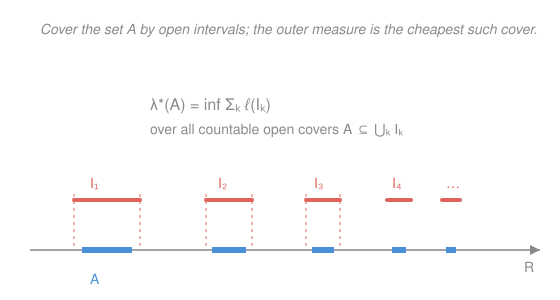

# Probability Theory · Lesson 1.4: Constructing Lebesgue measure

> ⏱ ~15 min · Module 1: Measure-theoretic foundations · Builds on: [1.3](01-03-measures-probability-spaces.md) · Unlocks: Module 2 — [2.1](02-01-random-variables-measurability.md)

## Why this matters

Lesson [1.3](01-03-measures-probability-spaces.md) laid down the axioms a measure must obey — but axioms describe; they don't deliver. Nothing so far guarantees that *any* function actually assigns to each Borel subset of the line the "length" it obviously deserves, countably additively, without contradiction. That guarantee is the one genuinely hard theorem in measure theory, and it is what makes the uniform distribution on $[0,1]$ — the humblest object in probability — rigorous rather than wishful. Build it once here and every distribution in this course stands on solid ground. This lesson also installs the phrase you'll use in every proof from now on: **almost surely**.

## The idea

You already know what length *ought* to be for an interval: $\ell([a,b]) = b-a$. The problem is extending that to complicated sets — a scattered dust, the irrationals in $[0,1]$, a Cantor set — where "length" isn't obvious.

Here's the honest move. To measure a messy set $A$, **cover it from outside** by a countable pile of open intervals, add up their lengths, and then shop for the *cheapest* such cover. That cheapest total is your first guess at the size of $A$; call it the **outer measure** $\lambda^*(A)$. It's defined for *every* set — no set is too ugly to be covered.

That generosity is also the catch. Outer measure is *too* accommodating: on genuinely pathological sets (the Vitali set from [1.1](01-01-why-measure-theory.md)) it fails countable additivity — two disjoint pieces can have outer measures that don't add up. So $\lambda^*$ is a good *estimate* but not yet a *measure*. The fix, due to Carathéodory, is a sieve: keep only the sets $A$ that "cut every other set cleanly." On exactly those sets, $\lambda^*$ becomes an honest, countably additive measure — **Lebesgue measure** $\lambda$. Restrict $\lambda$ to $[0,1]$ and you have the uniform distribution, at last on rigorous footing.

## The formal version

**Outer measure.** For any $A\subseteq\mathbb R$,

$$\lambda^*(A) \;=\; \inf\Big\{\textstyle\sum_{k=1}^\infty \ell(I_k)\;:\; A\subseteq\bigcup_{k=1}^\infty I_k,\ \ I_k\text{ open intervals}\Big\},$$

where $\ell\big((a,b)\big)=b-a$ and the infimum is over all countable covers of $A$ by open intervals.

> In words: $\lambda^*(A)$ is the cheapest total length of open intervals whose union still contains $A$.

Its core properties (all provable directly from the definition):

- $\lambda^*(\varnothing)=0$.
- **Monotone:** $A\subseteq B \Rightarrow \lambda^*(A)\le\lambda^*(B)$ (any cover of $B$ covers $A$).
- **Countably subadditive:** $\lambda^*\big(\bigcup_k A_k\big)\le\sum_k \lambda^*(A_k)$.
- **Translation invariant:** $\lambda^*(A+x)=\lambda^*(A)$ (sliding a cover slides its lengths not at all).
- **Extends length:** $\lambda^*(I)=\ell(I)$ for any interval $I$.

> In words: outer measure behaves like length in every respect *except* the one that matters most — it is only sub-additive, not additive. For disjoint $A,B$ we are guaranteed $\lambda^*(A\cup B)\le\lambda^*(A)+\lambda^*(B)$, but the Vitali set of [1.1](01-01-why-measure-theory.md) shows the inequality can be strict, so $\lambda^*$ is **not** a measure on all of $2^{\mathbb R}$.

**Carathéodory's criterion.** A set $A\subseteq\mathbb R$ is **(Lebesgue-)measurable** if it splits *every* test set additively:

$$\lambda^*(E) \;=\; \lambda^*(E\cap A) + \lambda^*(E\cap A^c) \qquad\text{for all } E\subseteq\mathbb R.$$

> In words: $A$ is measurable if, no matter what set $E$ you probe it with, cutting $E$ along the boundary of $A$ loses no length. (One direction, $\le$, is free from subadditivity; measurability is the demand that $\ge$ also hold.)

**Carathéodory's extension theorem (stated, not proved).** Let $\mathcal L$ be the collection of all measurable sets. Then:

1. $\mathcal L$ is a $\sigma$-algebra, and
2. $\lambda^*$ restricted to $\mathcal L$ is a genuine **measure** (countably additive).

> In words: the "cuts cleanly" sieve automatically produces a $\sigma$-algebra, and on it the merely-sub-additive $\lambda^*$ upgrades to fully additive. This is a general machine — feed it *any* outer measure and out comes a measure. We take the proof on faith; it is the one deferred theorem the syllabus promised.

**Lebesgue measure.** Define $\lambda = \lambda^*\big|_{\mathcal L}$. It extends length, is translation invariant, and — the fact that connects it to Lesson 1.2's Borel sets — satisfies

$$\mathcal B(\mathbb R)\subseteq\mathcal L,$$

so **every Borel set is Lebesgue measurable**. (Sketch: every open interval is measurable by a short direct check, and $\mathcal L$ is a $\sigma$-algebra containing them, so it contains the $\sigma$-algebra they generate — which is $\mathcal B(\mathbb R)$.)

**The uniform distribution, rigorously.** Restrict $\lambda$ to subsets of $[0,1]$: the triple $\big([0,1],\ \mathcal L\cap[0,1],\ \lambda\big)$ is a **probability space** — total mass $\lambda([0,1])=1$ — and it *is* the uniform distribution. The object you've computed with since intro stats is now a theorem.

## Picture

## Worked examples

**Example 1 (mechanical — every countable set is null).** Let $A=\{a_1,a_2,a_3,\dots\}$ be countable. Fix $\varepsilon>0$ and cover the $n$th point by a tiny open interval of length $\varepsilon/2^n$:

$$I_n=\Big(a_n-\tfrac{\varepsilon}{2^{n+1}},\ a_n+\tfrac{\varepsilon}{2^{n+1}}\Big),\qquad \ell(I_n)=\frac{\varepsilon}{2^n}.$$

Then $A\subseteq\bigcup_n I_n$, so by definition of the infimum,

$$\lambda^*(A)\le\sum_{n=1}^\infty \frac{\varepsilon}{2^n}=\varepsilon.$$

Since $\varepsilon>0$ was arbitrary, $\lambda^*(A)=0$; and $\lambda(A)=0$ because $A$, being Borel (a countable union of points), lies in $\mathcal L$. In particular $\lambda(\mathbb Q\cap[0,1])=0$: **the rationals, dense as they are, have measure zero.** This is the countability of $\mathbb Q$ from `real-analysis` cashed out as a *quantitative* smallness — the same fact underwrites its measure-zero criterion for Riemann integrability.

**Example 2 (why you'd care — uncountable need not mean positive).** Measure zero is *not* the same as countable. The **Cantor set** $C\subseteq[0,1]$ — remove the open middle third, then the middle thirds of what remains, forever — is uncountable (it has the cardinality of $\mathbb R$, as `real-analysis` shows in its countability lesson). Yet at stage $n$ it is covered by $2^n$ intervals each of length $3^{-n}$, so

$$\lambda(C)\le \left(\tfrac{2}{3}\right)^{n}\xrightarrow[n\to\infty]{}0,\qquad\text{hence } \lambda(C)=0.$$

An uncountable set of total length zero. Measure and cardinality are genuinely different rulers — a lesson you'll lean on whenever an "exceptional set" needs to be dismissed as negligible even though it's enormous.

## Watch out

- **Outer measure is defined everywhere; a measure lives only on $\mathcal L$.** You might think "$\lambda^*$ assigns a number to every set, so it's a measure on every set." It assigns numbers, yes — but only *sub*-additively off $\mathcal L$. The Vitali set has an outer measure, yet no consistent additive value; that's precisely why Carathéodory's sieve is not optional. Non-measurable sets exist, so $\mathcal L\subsetneq 2^{\mathbb R}$.
- **Measure zero is not "empty."** A null set can be infinite, dense, even uncountable ($\mathbb Q$; the Cantor set). "Null" means *coverable by intervals of arbitrarily small total length*, not *has no points*.
- **Three nested worlds:** $\mathcal B(\mathbb R)\subsetneq\mathcal L\subsetneq 2^{\mathbb R}$. Borel sets sit inside Lebesgue-measurable sets (the extra ones are subsets of Borel null sets), which sit strictly inside all subsets (Vitali). Don't collapse the layers.
- **"Almost surely" ignores null sets — on purpose.** A property holds **almost everywhere (a.e.)** / **almost surely (a.s.)** if the set where it fails is null. Redefining a function on all of $\mathbb Q$ changes no integral; two random variables equal a.s. are, for this course, the same. This convention is the bedrock of everything that follows — internalize it now.

## One-liner

> Cover from outside to get outer measure on *every* set, then keep only the sets that cut cleanly (Carathéodory) to get a real measure — that's Lebesgue measure, and "almost surely" means "except on a set it assigns zero."

## Problems

**P1 (🟢)** Show directly from the definition of outer measure that a single point $\{a\}$ has $\lambda^*(\{a\})=0$. Then explain in one line why this, plus countable subadditivity, immediately re-proves that $\mathbb Q$ is null.

**P2 (🟡)** Let $N$ be a null set ($\lambda^*(N)=0$) and let $B$ be any set. Prove $\lambda^*(B\cup N)=\lambda^*(B)$. (This is the formal reason "almost everywhere" statements can ignore $N$.)

**P3 (🔴, optional)** A "fat Cantor set" is built like the usual Cantor set but at stage $n$ you remove from each surviving interval an open middle piece of length $\tfrac{1}{4^{n}}$ times... — concretely, remove total length $\tfrac14,\tfrac18,\tfrac1{16},\dots$ so that $\sum$ removed $=\tfrac12$. Assuming the construction leaves a set $F\subseteq[0,1]$ that is closed and contains no interval, compute $\lambda(F)$, and explain why $F$ shows "measure zero" and "contains no interval" are unrelated.

Solutions

**P1** For any $\varepsilon>0$, the single open interval $I=(a-\tfrac{\varepsilon}{2},\,a+\tfrac{\varepsilon}{2})$ covers $\{a\}$ and has $\ell(I)=\varepsilon$. So $\lambda^*(\{a\})\le\varepsilon$ for every $\varepsilon>0$, forcing $\lambda^*(\{a\})=0$. (It can't be negative — lengths are nonnegative — so it's exactly $0$.)
Then $\mathbb Q=\{q_1,q_2,\dots\}$ is a countable union of singletons, and countable subadditivity gives $\lambda^*(\mathbb Q)\le\sum_n\lambda^*(\{q_n\})=\sum_n 0=0$.

**P2** By monotonicity, $\lambda^*(B)\le\lambda^*(B\cup N)$ (since $B\subseteq B\cup N$). For the reverse, countable (here finite) subadditivity gives

$$\lambda^*(B\cup N)\le\lambda^*(B)+\lambda^*(N)=\lambda^*(B)+0=\lambda^*(B).$$

The two inequalities together give $\lambda^*(B\cup N)=\lambda^*(B)$. So tossing a null set into (or out of) any set leaves its outer measure — hence its measure, when measurable — untouched: exactly why a.e.-modifications are invisible to $\lambda$.

**P3** The starting interval $[0,1]$ has length $1$; the construction removes disjoint open pieces of total length $\tfrac14+\tfrac18+\tfrac1{16}+\cdots=\tfrac12$. Removed sets are disjoint and measurable, so by countable additivity the removed part has measure $\tfrac12$, and

$$\lambda(F)=\lambda([0,1])-\tfrac12=\tfrac12.$$

Yet $F$ contains no interval (each surviving interval eventually has a middle chunk removed, so no open interval survives all stages). Thus $F$ has *positive* measure $\tfrac12$ while being "full of holes" — nowhere dense. The ordinary Cantor set had measure $0$ and no interval; $F$ has measure $\tfrac12$ and no interval. Conclusion: "contains no interval" says nothing about the measure — the two notions of smallness (topological vs. measure-theoretic) are independent.

## Flashback

**From Lesson 1.3 (Measures and probability spaces — continuity of measure):** Let $(\Omega,\mathcal F,\mathbb P)$ be a probability space and let $A_1\supseteq A_2\supseteq A_3\supseteq\cdots$ be a *decreasing* sequence of events with $\bigcap_{n=1}^\infty A_n=\varnothing$. Prove that $\mathbb P(A_n)\to 0$.

Solution

Continuity of measure from above (proved in [1.3](01-03-measures-probability-spaces.md)) says: for a decreasing sequence $A_1\supseteq A_2\supseteq\cdots$ with $\mathbb P(A_1)<\infty$ — automatic here since $\mathbb P(A_1)\le 1$ — we have

$$\mathbb P\Big(\bigcap_{n=1}^\infty A_n\Big)=\lim_{n\to\infty}\mathbb P(A_n).$$

Given $\bigcap_n A_n=\varnothing$, the left side is $\mathbb P(\varnothing)=0$, so $\lim_n \mathbb P(A_n)=0$. $\blacksquare$

*(Quick re-derivation of the tool, in case it's rusty: apply continuity from below to the increasing complements $A_n^c\uparrow\big(\bigcap_n A_n\big)^c=\Omega$, giving $\mathbb P(A_n^c)\to 1$, then take complements. The finiteness of $\mathbb P(A_1)$ is what lets you subtract.)*

## Connections

- **Backward:** this lesson supplies the *example* the [1.3](01-03-measures-probability-spaces.md) axioms were waiting for, and it decides which sets from Lesson 1.2 are actually measurable ($\mathcal B(\mathbb R)\subseteq\mathcal L$). The Vitali obstruction of [1.1](01-01-why-measure-theory.md) is now precisely located: it's the reason $\lambda^*$ can't be additive on all of $2^{\mathbb R}$.
- **Forward:** with $\lambda$ in hand and "almost surely" defined, [2.1](02-01-random-variables-measurability.md) can ask which *functions* respect this structure (measurable functions / random variables), and the Lebesgue integral of Module 2 is built by the same outer-approximation spirit.
- **Sideways (`real-analysis`):** "countable $\Rightarrow$ measure zero" is the bridge from that course's cardinality lesson to the Riemann–Lebesgue criterion (a bounded function is Riemann integrable iff its discontinuities form a null set) — same null sets, same reason $\mathbb Q$ can be ignored inside an integral.
