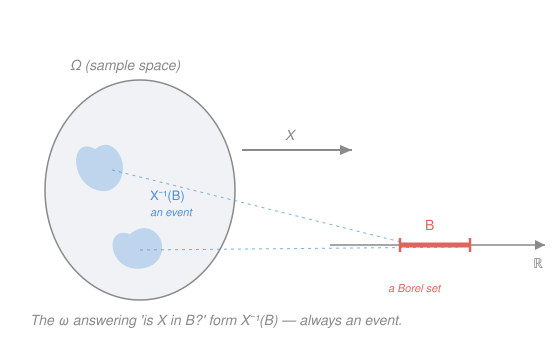

# Probability Theory · Lesson 2.1: Random variables and measurability

> ⏱ ~15 min · Module 2: Random variables and expectation · Builds on: [1.2](01-02-sigma-algebras.md), [1.4](01-04-constructing-lebesgue-measure.md) · Unlocks: [2.2](02-02-distributions-and-cdfs.md)

## Why this matters

Every computation you'll ever do in probability — an expectation, a variance, a limit theorem — is secretly a statement about a *function*. "Let $X$ be the number of heads" is not a mysterious random quantity; it is a rule that assigns a number to each possible outcome. But not every function deserves the name **random variable**. The whole point of Module 1 was that we can only assign probabilities to *events* — the members of a σ-algebra $\mathcal F$, never to arbitrary subsets. So a function is only useful if the questions we want to ask about it — "is $X$ at most $3$?" — are themselves events we can measure. That compatibility is **measurability**, and it is the single hypothesis under which the rest of the course runs.

## The idea

A random variable is neither random nor a variable. It is a **function** $X:\Omega\to\mathbb R$ that turns each outcome $\omega$ into a number $X(\omega)$. The randomness lives in *which* $\omega$ nature draws; $X$ just reads off a number once it has.

The one demand we place on $X$ is a matter of bookkeeping. To do probability you must be able to ask "what's the chance that $X$ lands in this set of values?" — say, $\mathbb P(X\le 3)$, or $\mathbb P(X\in[1,2])$. Answering means first collecting all the outcomes for which the answer is yes:

$$\{\omega : X(\omega)\le 3\} = X^{-1}\big((-\infty,3]\big).$$

If that collection is an *event* — a member of $\mathcal F$ — then $\mathbb P$ can weigh it and the question has an answer. If it isn't, the question is meaningless. **Measurability is exactly the requirement that every such collection is an event.**

> In words: pushing a set of values *backward* through $X$ must always land you on an event, never on some un-measurable heap of outcomes.

Two things worth internalizing before the symbols. First, it's the **preimage** that must behave, not the image — we push value-sets backward, never outcome-sets forward. Second, this is a property of $X$ *together with* $\mathcal F$: the very same function can be a random variable under one σ-algebra and not under another. Measurability is a relationship, not a solo trait.

## The formal version

We fix a measurable space $(\Omega,\mathcal F)$ of outcomes and the real line with its **Borel σ-algebra** $\mathcal B$ — the σ-algebra generated by the open intervals, built in [1.2](01-02-sigma-algebras.md). $\mathcal B$ contains every interval, every open and closed set, and everything you can make from them by countably many unions, intersections, and complements.

**Definition (random variable).** A function $X:\Omega\to\mathbb R$ is **measurable** — a **random variable** — if
$$X^{-1}(B)=\{\omega\in\Omega : X(\omega)\in B\}\ \in\ \mathcal F \qquad\text{for every } B\in\mathcal B.$$

> In words: preimages of Borel sets are events. Ask any Borel question about $X$, and the set of outcomes that answer "yes" is something $\mathbb P$ can measure.

Checking *all* Borel $B$ sounds hopeless — there are uncountably many. It isn't, because $\mathcal B$ is *generated* by a small family, and preimages respect generation.

**Reduction criterion.** $X$ is a random variable **iff** $\{X\le a\}:=X^{-1}\big((-\infty,a]\big)\in\mathcal F$ for every $a\in\mathbb R$.

> In words: you only ever check the half-line sets $\{X\le a\}$. If those are events, *automatically* every Borel preimage is an event — you never touch a general $B$.

**Proof.** The condition is clearly necessary (each $(-\infty,a]$ is Borel). For sufficiency, collect the "good" value-sets:
$$\mathcal G=\{\,B\subseteq\mathbb R : X^{-1}(B)\in\mathcal F\,\}.$$
We show $\mathcal G$ is a σ-algebra, using that preimages commute with all set operations:

- $X^{-1}(\mathbb R)=\Omega\in\mathcal F$, so $\mathbb R\in\mathcal G$.
- If $B\in\mathcal G$ then $X^{-1}(B^c)=\big(X^{-1}(B)\big)^c\in\mathcal F$ (since $\mathcal F$ is closed under complements), so $B^c\in\mathcal G$.
- If $B_1,B_2,\dots\in\mathcal G$ then $X^{-1}\big(\bigcup_n B_n\big)=\bigcup_n X^{-1}(B_n)\in\mathcal F$, so $\bigcup_n B_n\in\mathcal G$.

Thus $\mathcal G$ is a σ-algebra. By hypothesis every half-line $(-\infty,a]$ lies in $\mathcal G$. But those half-lines **generate** $\mathcal B$, and $\mathcal B$ is by definition the *smallest* σ-algebra containing them. A σ-algebra ($\mathcal G$) that contains a generating set must contain everything it generates, so $\mathcal B\subseteq\mathcal G$. Hence $X^{-1}(B)\in\mathcal F$ for every Borel $B$. $\blacksquare$

This is precisely the payoff of "generated σ-algebra" from [1.2](01-02-sigma-algebras.md): to prove a statement for *all* Borel sets, prove it for the generators and check the statement's truth-set is a σ-algebra.

**The information carried by $X$.** Running the machine the other direction, gather the events that $X$ *can* resolve:
$$\sigma(X)=\{\,X^{-1}(B) : B\in\mathcal B\,\}.$$
By the same commuting-with-operations argument, $\sigma(X)$ is itself a σ-algebra, and it is the **smallest** σ-algebra on $\Omega$ making $X$ measurable — the **σ-algebra generated by $X$**.

> In words: $\sigma(X)$ is exactly the collection of yes/no questions you could answer if all you were told was the value of $X$. It is "the information in $X$." When we condition on $\sigma(X)$ in Module 5, this is the object we condition on.

**Building random variables.** You almost never verify measurability from scratch; you assemble it.

- **Indicators.** For $A\subseteq\Omega$, the indicator $\mathbf 1_A(\omega)=1$ if $\omega\in A$, else $0$. It is a random variable **iff** $A\in\mathcal F$ (Example 1).
- **Simple functions.** Finite combinations $\sum_{i=1}^n a_i\,\mathbf 1_{A_i}$ with $a_i\in\mathbb R$, $A_i\in\mathcal F$. These are the atoms from which the Lebesgue integral is built in [2.3](02-03-lebesgue-integral-expectation.md).
- **Algebra and composition.** If $X,Y$ are random variables and $c\in\mathbb R$, then $cX$, $X+Y$, $XY$ are random variables; and if $g:\mathbb R\to\mathbb R$ is continuous (or merely Borel), then $g(X)$ is a random variable. So $X^2$, $e^X$, $|X|$ are all automatic.
- **Limits.** If $X_1,X_2,\dots$ are random variables, then so are $\sup_n X_n$, $\inf_n X_n$, $\limsup_n X_n$, $\liminf_n X_n$, and — whenever it exists pointwise — $\lim_n X_n$.

The last bullet is the one that separates the measurable world from the continuous world, so we prove its cornerstone.

**Proposition ($\sup$ of measurables is measurable).** If each $X_n$ is a random variable, then $X=\sup_n X_n$ is a random variable.

**Proof.** Use the reduction criterion. The key identity is
$$\{\,\sup_n X_n\le a\,\}=\bigcap_{n=1}^\infty\{\,X_n\le a\,\}.$$
Why: $\sup_n X_n(\omega)\le a$ means $a$ is an upper bound for *all* the values $X_n(\omega)$, i.e. $X_n(\omega)\le a$ for every $n$ — membership in every set on the right. Each $\{X_n\le a\}\in\mathcal F$ because $X_n$ is measurable, and $\mathcal F$ is closed under countable intersections, so the intersection is in $\mathcal F$. Hence $\{X\le a\}\in\mathcal F$ for all $a$, and $X$ is a random variable. $\blacksquare$

The same identity with a union handles $\inf$ (note $\{\inf_n X_n < a\}=\bigcup_n\{X_n<a\}$), and $\limsup_n X_n=\inf_m\sup_{n\ge m}X_n$, $\liminf$ symmetrically, are built by iterating. When $\lim_n X_n$ exists it equals $\limsup_n X_n$, so pointwise limits are measurable too. **This closure under limits is why the convergence theorems of Lesson 2.4 are even allowed to speak** — the limits they manipulate are guaranteed to be random variables.

## Picture

## Worked examples

**Example 1 (mechanical — the indicator).** Fix $A\subseteq\Omega$ and let $X=\mathbf 1_A$. Test measurability with the half-line criterion. The value-set $\{X\le a\}$ depends only on where $a$ sits relative to $X$'s two values $0$ and $1$:

$$\{\mathbf 1_A\le a\}=\begin{cases}\varnothing, & a<0,\\[2pt] A^c, & 0\le a<1,\\[2pt] \Omega, & a\ge 1.\end{cases}$$

(If $a<0$, no outcome has $\mathbf 1_A(\omega)\le a$; if $0\le a<1$, exactly the outcomes with value $0$, namely $A^c$; if $a\ge1$, everyone.) So every $\{X\le a\}$ is one of $\varnothing,\,A^c,\,\Omega$. Now $\varnothing,\Omega\in\mathcal F$ always, and $A^c\in\mathcal F\iff A\in\mathcal F$. Therefore

$$\mathbf 1_A \text{ is a random variable} \iff A\in\mathcal F.$$

The cleanest possible illustration of the slogan "measurability depends on $\mathcal F$": the function is fixed, but whether it's a random variable is decided entirely by whether its one nontrivial preimage is an event.

**Example 2 (why you'd care — $\sigma(X)$ is information).** Roll a die: $\Omega=\{1,2,3,4,5,6\}$, $\mathcal F=2^\Omega$ (all subsets). Let $X(\omega)=\mathbf 1_{\{\omega\text{ even}\}}$ — it reports only parity, $1$ for even, $0$ for odd. What can you learn from $X$ alone?

Every preimage $X^{-1}(B)$ is some union of "the evens" $E=\{2,4,6\}$ and "the odds" $O=\{1,3,5\}$, so

$$\sigma(X)=\{\varnothing,\ E,\ O,\ \Omega\}.$$

This is a *strict* sub-σ-algebra of $\mathcal F$. Knowing $X$, you can answer "was the roll even?" ($E\in\sigma(X)$) but **not** "was it a $6$?" — the event $\{6\}$ is in $\mathcal F$ but not in $\sigma(X)$, because $X$ never distinguishes $6$ from $2$ or $4$. That gap *is* the information $X$ throws away. When Module 5 forms $\mathbb E[Y\mid\sigma(X)]$, it is averaging $Y$ over exactly these indistinguishable blocks — conditioning is "best guess given only what $\sigma(X)$ can resolve." Hold onto this picture.

## Watch out

- **You might think measurability is a property of the function alone, but it lives with the σ-algebra.** The same $X$ can be a random variable under $\mathcal F=2^\Omega$ and fail under a coarse $\mathcal F$ that can't resolve $\{X\le a\}$. Always ask "measurable *with respect to which* $\mathcal F$?"
- **You might think you must check every Borel set $B$, but you never do.** The reduction criterion says the half-lines $\{X\le a\}$ suffice, because they generate $\mathcal B$ and preimages respect a σ-algebra. Checking generators is the whole technique — reach for it every time.
- **You might think preimages and images play symmetric roles, but only preimages must be measurable.** It is $X^{-1}(B)$ that has to be an event. The forward image $X(A)$ of an event need not be Borel at all, and the definition never asks it to.
- **You might think limits can destroy measurability the way they destroy continuity, but they can't.** A pointwise limit of continuous functions can be wildly discontinuous — yet a pointwise limit of *measurable* functions is always measurable ($\sup$ proof above). This robustness is the reason the measurable category, not the continuous one, is the right home for probability's limit theorems.

## One-liner

> A random variable is a function whose value-questions are all events — measurability means every preimage $X^{-1}(B)$ lands in $\mathcal F$, and it's enough to check the half-lines $\{X\le a\}$.

## Problems

**P1 (🟢)** Let $X$ be a random variable on $(\Omega,\mathcal F)$. Using only that the closed half-lines $\{X\le a\}$ are events and that $\mathcal F$ is a σ-algebra, prove that the open half-line $\{X<a\}$ is also an event, for every $a\in\mathbb R$.

**P2 (🟡)** Let $X$ and $Y$ be random variables on the same $(\Omega,\mathcal F)$. Prove that $\max(X,Y)$ is a random variable. (Mirror the $\sup$ proof, but with two functions.)

**P3 (🔴, optional)** Let $X,Y$ be random variables. Prove that $\{X<Y\}=\{\omega:X(\omega)<Y(\omega)\}$ is an event. (Hint: insert a *rational* between $X(\omega)$ and $Y(\omega)$, and remember from `real-analysis` that $\mathbb Q$ is countable.)

Solutions

**P1** A real number is strictly less than $a$ exactly when it is $\le a-\tfrac1n$ for some $n$, so
$$\{X<a\}=\bigcup_{n=1}^{\infty}\Big\{X\le a-\tfrac1n\Big\}.$$
*Check both directions:* if $X(\omega)<a$ then $a-X(\omega)>0$, and by the Archimedean property some $\tfrac1n<a-X(\omega)$, i.e. $X(\omega)\le a-\tfrac1n$ — so $\omega$ is in the union. Conversely if $X(\omega)\le a-\tfrac1n$ for some $n$, then $X(\omega)\le a-\tfrac1n<a$. Each set $\{X\le a-\tfrac1n\}\in\mathcal F$ by hypothesis, and $\mathcal F$ is closed under countable unions, so $\{X<a\}\in\mathcal F$. $\blacksquare$

**P2** Use the reduction criterion on $M=\max(X,Y)$. The maximum of two numbers is $\le a$ iff *both* are $\le a$:
$$\{M\le a\}=\{X\le a\}\cap\{Y\le a\}.$$
Both sets on the right are events ($X,Y$ measurable), and $\mathcal F$ is closed under (finite) intersection, so $\{M\le a\}\in\mathcal F$ for every $a$. Hence $M$ is a random variable. (This is the two-function shadow of $\{\sup_n X_n\le a\}=\bigcap_n\{X_n\le a\}$.) $\blacksquare$

**P3** If $X(\omega)<Y(\omega)$, the density of the rationals gives a rational $q$ strictly between them: $X(\omega)<q<Y(\omega)$. So $\omega\in\{X<q\}\cap\{Y>q\}$. Conversely, any such $q$ forces $X(\omega)<q<Y(\omega)$. Ranging over all rationals,
$$\{X<Y\}=\bigcup_{q\in\mathbb Q}\Big(\{X<q\}\cap\{Y>q\}\Big).$$
By P1 each $\{X<q\}\in\mathcal F$; symmetrically $\{Y>q\}=\{Y\le q\}^c\in\mathcal F$; so each bracket is an event. The union is over $\mathbb Q$, which is **countable** (`real-analysis`, Cantor's listing), so it is a *countable* union of events — and $\mathcal F$ is closed under those. Hence $\{X<Y\}\in\mathcal F$. $\blacksquare$

The countability of $\mathbb Q$ is doing essential work: a σ-algebra tolerates countable unions but *not* arbitrary ones, so slipping a rational in between is precisely what makes the argument legal.

## Flashback

**From Lesson 1.2 (σ-algebras and generated σ-algebras):** Let $\Omega=\{1,2,3,4\}$ and let $\mathcal C=\big\{\{1,2\}\big\}$ be the collection containing the single set $\{1,2\}$. Find $\sigma(\mathcal C)$, the smallest σ-algebra on $\Omega$ containing $\mathcal C$, and list all its members.

Solution

Any σ-algebra containing $A=\{1,2\}$ must also contain $\Omega$ and $\varnothing$, and (by closure under complement) $A^c=\{3,4\}$. So it must contain at least
$$\big\{\varnothing,\ \{1,2\},\ \{3,4\},\ \Omega\big\}.$$
Check that this four-set collection is *already* a σ-algebra: it contains $\Omega$; it is closed under complements ($\{1,2\}\leftrightarrow\{3,4\}$, $\varnothing\leftrightarrow\Omega$); and any union of its members is again one of the four (e.g. $\{1,2\}\cup\{3,4\}=\Omega$). Nothing more is forced, so
$$\sigma(\mathcal C)=\big\{\varnothing,\ \{1,2\},\ \{3,4\},\ \Omega\big\}.$$
This is exactly $\sigma(X)$ for $X=\mathbf 1_{\{1,2\}}$: generating a σ-algebra from one set is the same act as recording the information in that set's indicator — the bridge straight into today's $\sigma(X)$. $\blacksquare$

## Connections

- **Backward:** the reduction criterion *is* the generated-σ-algebra machinery from [1.2](01-02-sigma-algebras.md) — prove a claim for generators, show the good-set collection is a σ-algebra, conclude it for everything. The Borel σ-algebra and "almost everywhere" reasoning trace back to [1.4](01-04-constructing-lebesgue-measure.md).
- **Forward:** measurability is the standing hypothesis for the entire course. Next, [2.2](02-02-distributions-and-cdfs.md) pushes $\mathbb P$ *forward* through $X$ to get its distribution on $\mathbb R$; [2.3](02-03-lebesgue-integral-expectation.md) integrates simple functions upward to define $\mathbb E[X]$; and the sup/limit closure proved here is what lets Lesson 2.4 (the convergence theorems) swap limits with expectations at all.
- **Sideways:** $\sigma(X)$ as "the information in $X$" is the seed of conditional expectation (Module 5), where $\mathbb E[Y\mid\sigma(X)]$ averages over the blocks $X$ cannot tell apart — the same intuition an economist uses for an agent's *information set*, and a physicist for coarse-graining microstates into observable macrostates.
