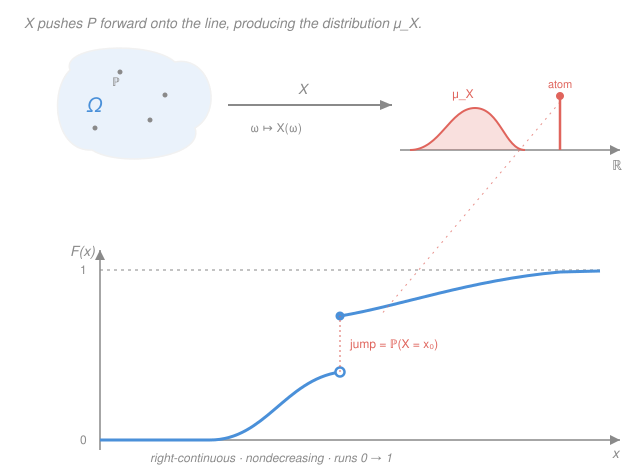

# Probability Theory · Lesson 2.2: Distributions, CDFs, and pushforward

> ⏱ ~15 min · Module 2: Random variables and expectation · Builds on: [2.1 Random variables and measurability](02-01-random-variables-measurability.md) · Unlocks: [2.3 The Lebesgue integral and expectation](02-03-lebesgue-integral-expectation.md)

## Why this matters

When the refresher had you compute $\mathbb P(X\le 3)$ for a normal, or integrate a density to $1$, you never once mentioned a sample space $\Omega$. That was not sloppiness — it was the whole point of what we build here. The abstract space $(\Omega,\mathcal F,\mathbb P)$ from Module 1 is scaffolding: rigorous, load-bearing, and something you almost never look at directly. A random variable takes that scaffolding and **pushes** its probability onto the real line, producing the object you actually calculate with — the **distribution**. This lesson is the bridge from the abstract machinery of Lesson 2.1 to the familiar densities and CDFs of `prob-stat-refresher`.

## The idea

Think of $\mathbb P$ as a kilogram of sand spread over $\Omega$ — some regions heavy, some empty. A random variable $X:\Omega\to\mathbb R$ is a rule that assigns each grain a position on the number line. Now sweep every grain to its assigned position and weigh the line: how much sand landed in the interval $[a,b]$? That weight is a new measure, living entirely on $\mathbb R$, and it remembers nothing about which grain came from where — only *how much* mass sits at each place. That new measure is the **distribution** (or **law**) of $X$.

Once you have it, $\Omega$ can be thrown away. Two completely different experiments — a coin-flip space and a spinning-wheel space — can push their sand into the *identical* pile on $\mathbb R$. To a statistician computing probabilities, they are the same random variable. And the single most convenient way to record that pile of sand is to answer one running question: *how much mass lies at or below $x$?* Track that as $x$ sweeps left to right and you get the **cumulative distribution function**, $F$ — a curve climbing from $0$ to $1$ that, remarkably, pins down the entire pile.

## The formal version

Fix a probability space $(\Omega,\mathcal F,\mathbb P)$ and a random variable $X:\Omega\to\mathbb R$ — meaning (Lesson 2.1) $X^{-1}(B)\in\mathcal F$ for every Borel set $B\in\mathcal B$, where $\mathcal B$ is the Borel σ-algebra on $\mathbb R$ from [1.2](01-02-sigma-algebras.md).

**Distribution (pushforward measure).** The **law** of $X$ is the set function $\mu_X:\mathcal B\to[0,1]$,

$$\mu_X(B) \;=\; \mathbb P\big(X^{-1}(B)\big) \;=\; \mathbb P(X\in B), \qquad B\in\mathcal B.$$

> In words: $\mu_X(B)$ is the probability that $X$ lands in $B$ — the sand that swept into $B$. It is $\mathbb P$ *transported to $\mathbb R$ by $X$*, and we write $\mu_X=\mathbb P\circ X^{-1}$ or $\mu_X=X_*\mathbb P$.

**Theorem 1 (the law is a probability measure).** $\mu_X$ is a probability measure on $(\mathbb R,\mathcal B)$.

*Proof.* The preimage map $B\mapsto X^{-1}(B)$ commutes with all set operations, so each axiom of $\mathbb P$ transfers.

- **Well-defined and $[0,1]$-valued.** For $B\in\mathcal B$, measurability gives $X^{-1}(B)\in\mathcal F$, so $\mathbb P(X^{-1}(B))$ is defined and lies in $[0,1]$.
- **$\mu_X(\mathbb R)=1$.** $X^{-1}(\mathbb R)=\Omega$, so $\mu_X(\mathbb R)=\mathbb P(\Omega)=1$. (Likewise $\mu_X(\varnothing)=\mathbb P(\varnothing)=0$.)
- **Countable additivity.** Let $B_1,B_2,\dots\in\mathcal B$ be pairwise disjoint. Preimages of disjoint sets are disjoint — if $X(\omega)\in B_i$ and $X(\omega)\in B_j$ then $B_i\cap B_j\ne\varnothing$ — and preimage distributes over unions, so $X^{-1}\!\big(\bigsqcup_i B_i\big)=\bigsqcup_i X^{-1}(B_i)$, a disjoint union in $\mathcal F$. Countable additivity of $\mathbb P$ then gives

$$\mu_X\Big(\bigsqcup_i B_i\Big)=\mathbb P\Big(\bigsqcup_i X^{-1}(B_i)\Big)=\sum_i \mathbb P\big(X^{-1}(B_i)\big)=\sum_i \mu_X(B_i). \qquad\blacksquare$$

The moral: **you may forget $\Omega$ and work with $(\mathbb R,\mathcal B,\mu_X)$.** Every probability about $X$ is an integral against $\mu_X$.

**Cumulative distribution function.** The **CDF** of $X$ is

$$F_X(x)\;=\;\mathbb P(X\le x)\;=\;\mu_X\big((-\infty,x]\big), \qquad x\in\mathbb R.$$

> In words: $F_X(x)$ is the total mass at or below $x$ — the running weight of the sand pile scanned left to right.

**Theorem 2 (the three defining properties of a CDF).** $F=F_X$ satisfies:

1. **Nondecreasing:** $a\le b \implies F(a)\le F(b)$.
2. **Right-continuous:** $\displaystyle\lim_{y\downarrow x}F(y)=F(x)$ for every $x$.
3. **Limits:** $\displaystyle\lim_{x\to-\infty}F(x)=0$ and $\displaystyle\lim_{x\to+\infty}F(x)=1$.

*Proof.*

*(1)* If $a\le b$ then $(-\infty,a]\subseteq(-\infty,b]$, so monotonicity of the measure $\mu_X$ (a Module 1 property, Lesson 1.3) gives $F(a)=\mu_X((-\infty,a])\le\mu_X((-\infty,b])=F(b)$.

*(2)* Take any sequence $x_n\downarrow x$ (decreasing to $x$). The sets $A_n=(-\infty,x_n]$ decrease, $A_1\supseteq A_2\supseteq\cdots$, with intersection $\bigcap_n A_n=(-\infty,x]$: a point $t$ lies in every $A_n$ iff $t\le x_n$ for all $n$ iff $t\le x$ (since $x_n\downarrow x$). All sets have finite measure ($\le 1$), so **continuity of measure from above** (Lesson 1.3) applies:

$$\lim_{n\to\infty}F(x_n)=\lim_{n\to\infty}\mu_X(A_n)=\mu_X\Big(\bigcap_n A_n\Big)=\mu_X((-\infty,x])=F(x).$$

Since $F$ is monotone, agreement along every such sequence gives the one-sided limit $\lim_{y\downarrow x}F(y)=F(x)$. (Concretely, take $x_n=x+\tfrac1n$, so $\{X\le x+\tfrac1n\}\downarrow\{X\le x\}$.)

*(3)* Let $x_n\to-\infty$. Then $A_n=(-\infty,x_n]$ decrease to $\bigcap_n A_n=\varnothing$ (no real is $\le$ everything), so continuity from above gives $F(x_n)\to\mu_X(\varnothing)=0$. Let $x_n\to+\infty$; then $A_n$ *increase* to $\bigcup_n A_n=\mathbb R$, so continuity from below gives $F(x_n)\to\mu_X(\mathbb R)=1$. $\blacksquare$

Two corollaries fall straight out, and they are the ones you use constantly.

**Interval mass.** For $a<b$, split $(-\infty,b]=(-\infty,a]\sqcup(a,b]$ and use additivity:

$$\mathbb P(a<X\le b)=\mu_X\big((a,b]\big)=F(b)-F(a).$$

**Atom = jump.** The **left limit** $F(x^-)=\lim_{y\uparrow x}F(y)=\mu_X\big((-\infty,x)\big)$ exists by monotonicity, and

$$\mathbb P(X=x)=\mu_X(\{x\})=\mu_X\big((-\infty,x]\big)-\mu_X\big((-\infty,x)\big)=F(x)-F(x^-).$$

> In words: the probability of hitting the exact value $x$ is the **size of the jump** of $F$ at $x$. Where $F$ is continuous, $\mathbb P(X=x)=0$; a jump of height $p$ means $x$ is an **atom** carrying mass $p$. (Proof of the left-limit formula: take $x_n\uparrow x$, so $(-\infty,x_n]\uparrow(-\infty,x)$ — strictly below $x$ — and apply continuity from below.)

**Theorem 3 (uniqueness: $F$ determines $\mu_X$).** If two probability measures $\mu,\nu$ on $(\mathbb R,\mathcal B)$ satisfy $\mu((-\infty,x])=\nu((-\infty,x])$ for all $x$, then $\mu=\nu$ on all of $\mathcal B$.

*Proof.* The half-lines $\mathcal P=\{(-\infty,x]:x\in\mathbb R\}$ form a **π-system** (closed under intersection: $(-\infty,a]\cap(-\infty,b]=(-\infty,\min(a,b)]$). They agree on $\mathcal P$ by hypothesis, and both are probability measures (so they agree on $\mathbb R$, the total-mass-$1$ set). The **π–λ (Dynkin) uniqueness theorem** from [1.2](01-02-sigma-algebras.md) says two measures that agree on a π-system and on the whole space agree on the σ-algebra it generates. Since $\sigma(\mathcal P)=\mathcal B$ (the Borel sets are generated by half-lines), $\mu=\nu$ on $\mathcal B$. $\blacksquare$

> In words: knowing $F$ — even just its values on the half-lines — is knowing the *entire* distribution. **"Distribution" and "CDF" carry exactly the same information.** This is why the refresher could get away with only ever writing down CDFs and densities.

**Three types of distribution.** By how the mass is arranged:

- **Discrete:** $\mu_X=\sum_k p_k\,\delta_{a_k}$, a countable sum of **point masses** ($\delta_a(B)=1$ if $a\in B$, else $0$), with $p_k=\mathbb P(X=a_k)\ge0$ and $\sum_k p_k=1$. The map $a_k\mapsto p_k$ is the **pmf**; $F$ is a pure jump staircase.
- **(Absolutely) continuous:** there is a **density** $f\ge0$ with $F(x)=\int_{-\infty}^{x}f(t)\,dt$; then $f=dF/dx$ where $F$ is differentiable. $F$ is continuous (no atoms: $\mathbb P(X=x)=0$ everywhere), and $\int_{-\infty}^{\infty}f=1$ — precisely the improper integral required to equal $1$ from `calc-refresher` (the Gaussian's core normalization). A density exists exactly when $\mu_X$ puts **no** mass on any Lebesgue-null set, written $\mu_X\ll\lambda$ ("$\mu_X$ is absolutely continuous w.r.t. Lebesgue measure $\lambda$"); the density is then the **Radon–Nikodym derivative** $f=d\mu_X/d\lambda$, a theorem we state and use in Lesson 5.1.
- **Mixed:** a convex combination, e.g. an insurance payout that is $0$ with probability $\tfrac12$ (an atom) and exponentially distributed otherwise (a density) — $F$ climbs continuously but also has a jump.

## Picture

The top strip is the pipeline $\Omega\xrightarrow{X}\mathbb R$ turning $\mathbb P$ into $\mu_X$ (a smooth hump of density plus one spike of atomic mass). Beneath it is the resulting CDF: nondecreasing, running $0\to1$, **right-continuous** with one visible jump — the filled dot sits at the top of the jump ($F(x_0)$, the "$\le$" value), the hollow dot at the left limit $F(x_0^-)$, and their gap is exactly $\mathbb P(X=x_0)$, the mass of the spike above.

## Worked examples

**Example 1 (mechanical — reading atoms and intervals off $F$).** A random variable has

$$F(x)=\begin{cases}0,& x<0,\\ 0.3,& 0\le x<1,\\ 0.3+0.5(x-1),& 1\le x<2,\\ 1,& x\ge 2.\end{cases}$$

Check it is a valid CDF: nondecreasing (flat, then slope $0.5$, then flat), right-continuous (each piece uses the value *at* its left endpoint — e.g. $F(0)=0.3$), and runs $0\to1$. Now compute.

- **Atom at $0$:** $F(0)-F(0^-)=0.3-0=0.3$, so $\mathbb P(X=0)=0.3$.
- **Atom at $2$:** $F(2)-F(2^-)=1-\big(0.3+0.5(1)\big)=1-0.8=0.2$, so $\mathbb P(X=2)=0.2$.
- **A continuous stretch:** on $(0,2)$, $F$ has slope $0.5$, i.e. density $f=0.5$ (uniform) there.
- **An interval:** $\mathbb P(0<X\le 1.5)=F(1.5)-F(0)=\big(0.3+0.5(0.5)\big)-0.3=0.25$.

This is a **mixed** distribution: two atoms ($0.3+0.2=0.5$) plus a continuous part of mass $0.5$. Total $1$. ✓

**Example 2 (why you'd care — same distribution, different spaces).** Experiment A: flip a fair coin, set $X=1$ on heads, $X=0$ on tails; here $\Omega_A=\{H,T\}$. Experiment B: spin a wheel uniformly on $\Omega_B=[0,1]$ (with Lebesgue measure from [1.2](01-02-sigma-algebras.md)/`real-analysis`), set $Y=1$ if the pointer lands in $[0,\tfrac12)$, else $Y=0$. Different sample spaces, different σ-algebras, different sample points. Yet both laws are

$$\mu_X=\mu_Y=\tfrac12\delta_0+\tfrac12\delta_1,\qquad F_X=F_Y=\begin{cases}0,&x<0\\ \tfrac12,&0\le x<1\\ 1,&x\ge1.\end{cases}$$

For $Y$: $\mathbb P(Y=1)=\lambda([0,\tfrac12))=\tfrac12$. Since the CDFs match, Theorem 3 says the *entire* distributions match. We write $X\stackrel{d}{=}Y$ ("**equal in distribution**"). Note this is genuinely weaker than $X=Y$ as functions — they don't even live on the same $\Omega$, so asking "does $X(\omega)=Y(\omega)$?" is meaningless. Every limit theorem in this course — the CLT included — is a statement about distributions, so this is the equivalence that actually matters.

## Watch out

- **You might think** $F$ is left-continuous or continuous. **Actually** the "$\le$" in $\mathbb P(X\le x)$ forces **right**-continuity: the value at a jump belongs to the *upper* level, and the *left* limit $F(x^-)$ gives the atom size $\mathbb P(X=x)=F(x)-F(x^-)$. Had we defined $F(x)=\mathbb P(X<x)$, it would be left-continuous instead — the convention is a genuine choice, and this course uses "$\le$".
- **You might think** every random variable has a density $f$. **Actually** a density exists *only* in the absolutely continuous case ($\mu_X\ll\lambda$). A discrete $X$ has atoms — $\int f$ can't produce a jump — so it has a pmf, not a density. Worse, the **Cantor distribution** is continuous (no atoms, $F$ continuous) yet still has *no* density, because its mass sits on a Lebesgue-null set: continuity of $F$ is necessary but not sufficient for a density.
- **You might think** $\mathbb P(X=x)$ is generally positive. **Actually** it is positive *exactly* at the jumps of $F$, and a CDF has at most countably many jumps (each jump has positive height and the heights sum to $\le1$). For a continuous distribution $\mathbb P(X=x)=0$ for every single $x$ — which is why, for a continuous $X$, $\mathbb P(a<X\le b)=\mathbb P(a\le X\le b)$: the endpoints carry no mass.

## One-liner

> A random variable pushes $\mathbb P$ off $\Omega$ onto $\mathbb R$ to make its distribution $\mu_X$, and the CDF $F$ — nondecreasing, right-continuous, $0\to1$, with jumps at the atoms — records $\mu_X$ completely.

## Problems

**P1 (🟢)** Let $F(x)=1-e^{-\lambda x}$ for $x\ge0$ and $F(x)=0$ for $x<0$, with $\lambda>0$ (the exponential CDF). (a) Verify the three CDF properties. (b) Is there an atom anywhere? (c) Find the density $f$, and confirm $\int_{-\infty}^\infty f=1$. (d) Compute $\mathbb P(1<X\le 2)$.

**P2 (🟡)** A random variable $X$ has $\mathbb P(X=0)=\tfrac14$ and is otherwise uniform on $(0,1)$ (i.e. the remaining $\tfrac34$ of the mass is spread with constant density on $(0,1)$). (a) Write $F_X$ piecewise. (b) Identify every atom and its mass. (c) Compute $\mathbb P(X\le \tfrac12)$ and $\mathbb P(X=\tfrac12)$.

**P3 (🔴, optional)** Let $X$ have CDF $F$ and define $Y=aX+b$ with $a>0$. Derive $F_Y$ in terms of $F$, and (assuming $X$ has density $f$) derive the density of $Y$. Then argue directly from the pushforward definition — *without* CDFs — that $\mu_Y(B)=\mu_X\big(\{t: at+b\in B\}\big)$, and say why the $a>0$ assumption mattered for the CDF derivation but not for this pushforward identity.

Solutions

**P1** (a) *Nondecreasing:* for $x\ge0$, $F'(x)=\lambda e^{-\lambda x}>0$; $F=0$ before, and $F(0)=0$ matches, so $F$ never decreases. *Right-continuous:* $F$ is continuous everywhere (both pieces meet at $0$: $1-e^0=0$), hence certainly right-continuous. *Limits:* as $x\to-\infty$, $F=0\to0$; as $x\to+\infty$, $e^{-\lambda x}\to0$ so $F\to1$. ✓
(b) No atoms: $F$ is continuous, so $F(x)-F(x^-)=0$ for every $x$ — in particular $\mathbb P(X=0)=F(0)-F(0^-)=0-0=0$. It is (absolutely) continuous.
(c) $f(x)=F'(x)=\lambda e^{-\lambda x}$ for $x>0$, and $0$ for $x<0$. Then $\int_0^\infty \lambda e^{-\lambda x}\,dx=\big[-e^{-\lambda x}\big]_0^\infty=0-(-1)=1$ ✓ (an improper integral equal to $1$, exactly the `calc-refresher` normalization).
(d) $\mathbb P(1<X\le2)=F(2)-F(1)=(1-e^{-2\lambda})-(1-e^{-\lambda})=e^{-\lambda}-e^{-2\lambda}$.

**P2** (a) Mass: an atom of $\tfrac14$ at $0$, plus density $\tfrac34$ (constant) on $(0,1)$ — check: $\int_0^1 \tfrac34\,dt=\tfrac34$, and $\tfrac14+\tfrac34=1$ ✓. So
$$F_X(x)=\begin{cases}0,& x<0,\\[2pt] \tfrac14+\tfrac34\,x,& 0\le x<1,\\[2pt] 1,& x\ge1.\end{cases}$$
(The value jumps to $\tfrac14$ *at* $x=0$ by right-continuity, then rises with slope $\tfrac34$.)
(b) One atom: at $0$, mass $F(0)-F(0^-)=\tfrac14-0=\tfrac14$. At $x=1$: $F(1^-)=\tfrac14+\tfrac34=1=F(1)$, no jump — no atom. Elsewhere $F$ is continuous.
(c) $\mathbb P(X\le\tfrac12)=F(\tfrac12)=\tfrac14+\tfrac34\cdot\tfrac12=\tfrac14+\tfrac38=\tfrac58$. And $\mathbb P(X=\tfrac12)=F(\tfrac12)-F(\tfrac12^-)=0$ (no jump at $\tfrac12$; the density contributes no atom).

**P3** *Via CDF:* since $a>0$, the event $\{aX+b\le y\}$ is $\{X\le (y-b)/a\}$ (dividing by a positive number preserves "$\le$"), so
$$F_Y(y)=\mathbb P(aX+b\le y)=\mathbb P\!\left(X\le \tfrac{y-b}{a}\right)=F\!\left(\tfrac{y-b}{a}\right).$$
Differentiate (chain rule) for the density: $f_Y(y)=F'\!\big(\tfrac{y-b}{a}\big)\cdot\tfrac1a=\tfrac1a\,f\!\big(\tfrac{y-b}{a}\big)$. (The $\tfrac1a$ keeps $\int f_Y=1$; for general $a\ne0$ it becomes $\tfrac{1}{|a|}$.)
*Via pushforward:* for $B\in\mathcal B$, by definition $\mu_Y(B)=\mathbb P(Y\in B)=\mathbb P(aX+b\in B)=\mathbb P\big(X\in\{t:at+b\in B\}\big)=\mu_X\big(\{t:at+b\in B\}\big)$ — just unwinding "$aX+b\in B$" into a condition on $X$. This holds for *any* $a\ne0$ (indeed any measurable transform), because it never divides an inequality; it only rewrites the event. The $a>0$ assumption was needed only in the CDF version, where dividing the inequality by $a$ would flip "$\le$" to "$\ge$" if $a<0$ — a reminder that the pushforward is the more primitive, robust object, and the CDF is a convenient one-dimensional shadow of it.

## Flashback

**From Lesson 2.1 (Random variables and measurability):** Let $(\Omega,\mathcal F,\mathbb P)$ have $\Omega=\{1,2,3,4,5,6\}$ (a die) with $\mathcal F=2^\Omega$. Define $X(\omega)=1$ if $\omega$ is even and $X(\omega)=0$ if $\omega$ is odd. (a) Verify $X$ is a random variable using the $\{X\le a\}\in\mathcal F$ criterion. (b) Describe the generated σ-algebra $\sigma(X)$, and say in one line why it is *smaller* than $\mathcal F$.

Solution

(a) The $\{X\le a\}$ criterion (Lesson 2.1): $X$ is a random variable iff $\{X\le a\}\in\mathcal F$ for every $a\in\mathbb R$. Since $X$ takes only values $0,1$:
$$\{X\le a\}=\begin{cases}\varnothing,& a<0,\\ \{1,3,5\},& 0\le a<1,\\ \Omega,& a\ge1.\end{cases}$$
All three are in $\mathcal F=2^\Omega$ (every subset is), so $X$ is measurable — trivially here, since $2^\Omega$ contains everything.
(b) $\sigma(X)$ is generated by the preimages of Borel sets, which reduce to the preimages of the two values: $X^{-1}(\{0\})=\{1,3,5\}$ (odds) and $X^{-1}(\{1\})=\{2,4,6\}$ (evens). Closing $\{\{1,3,5\},\{2,4,6\}\}$ under the σ-algebra operations gives
$$\sigma(X)=\big\{\varnothing,\ \{1,3,5\},\ \{2,4,6\},\ \Omega\big\}.$$
It is strictly smaller than $\mathcal F=2^\Omega$ (which has $2^6=64$ sets) because $X$ only reports parity — it cannot distinguish $2$ from $4$, so events like $\{2\}$ are invisible to it. $\sigma(X)$ is exactly "the information $X$ reveals," and its pushforward is the law $\mu_X=\tfrac12\delta_0+\tfrac12\delta_1$ of Example 2. $\blacksquare$

## Connections

- **Backward:** the whole lesson rests on [2.1](02-01-random-variables-measurability.md)'s measurability — $X^{-1}(B)\in\mathcal F$ is what makes $\mu_X(B)=\mathbb P(X^{-1}(B))$ even *defined*. The two proofs of Theorem 2 are pure Module 1: monotonicity and continuity of measure from [1.3](01-03-measures-probability-spaces.md), and Theorem 3 is the π–λ uniqueness from [1.2](01-02-sigma-algebras.md).
- **Forward:** [2.3](02-03-lebesgue-integral-expectation.md) builds $\mathbb E[X]=\int_\Omega X\,d\mathbb P$ and proves the **change-of-variables** formula $\mathbb E[g(X)]=\int_{\mathbb R} g\,d\mu_X$ — the theorem that lets you compute expectations against the distribution alone, never touching $\Omega$, formalizing exactly the "forget $\Omega$" license earned here. The Radon–Nikodym derivative behind densities returns in Module 5 (conditional expectation) as the definition of $\mathbb E[X\mid\mathcal G]$.
- **Sideways:** the densities of `prob-stat-refresher` are the absolutely-continuous case of $\mu_X$, and their normalization $\int f=1$ is the improper-integral constraint from `calc-refresher`. The "no density for the Cantor distribution" caveat is the measure-zero phenomenon from `real-analysis` (a continuous $F$ whose mass hides on a null set) wearing a probabilistic uniform.
